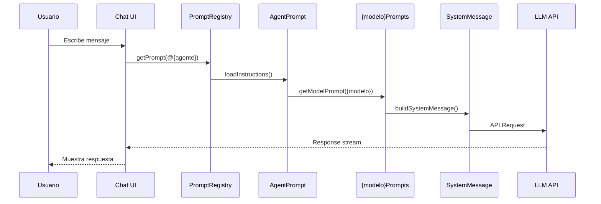

# Prompt: Analizar Flujo Copilot Chat

> **Resumen**: Dado un Agente y un Modelo LLM, obtiene la secuencia completa desde el User Prompt hasta el output, identificando librerías TypeScript y generando un diagrama Mermaid.

---

## Invocación

```
@aleph analizar flujo copilot para @{agente} con modelo {modelo}
```

**Ejemplos**:
- `@aleph analizar flujo copilot para @aleph con modelo claude-sonnet`
- `@aleph analizar flujo copilot para @ox con modelo gpt-4o`

---

## Input

| Parámetro | Descripción | Ejemplo |
|-----------|-------------|---------|
| `agente` | Nombre del agente del Scriptorium | `@aleph`, `@ox`, `@revisor` |
| `modelo` | Modelo LLM objetivo | `claude-sonnet`, `gpt-4o`, `o1` |

---

## Fuentes de Datos (CopilotEngine)

El submódulo `CopilotEngine` contiene el código fuente de VS Code Copilot Chat. Archivos clave:

| Archivo | Propósito | Ruta |
|---------|-----------|------|
| `promptRegistry.ts` | Registro de prompts del sistema | `src/extension/prompts/node/agent/promptRegistry.ts` |
| `defaultAgentInstructions.tsx` | Instrucciones base del agente | `src/extension/prompts/node/agent/defaultAgentInstructions.tsx` |
| `anthropicPrompts.tsx` | Prompts específicos para Claude | `src/extension/prompts/node/agent/anthropicPrompts.tsx` |
| `openAIPrompts.tsx` | Prompts específicos para GPT | `src/extension/prompts/node/agent/openAIPrompts.tsx` |
| `prompts.md` | Guía de autoría de prompts | `docs/prompts.md` |
| `tools.md` | Guía de creación de herramientas | `docs/tools.md` |

---

## Procedimiento

### Paso 1: Identificar Modelo → Archivo de Prompts

| Modelo | Archivo Principal |
|--------|-------------------|
| `claude-*`, `anthropic` | `anthropicPrompts.tsx` |
| `gpt-*`, `o1`, `openai` | `openAIPrompts.tsx` |
| `gemini`, `google` | `googlePrompts.tsx` (si existe) |

### Paso 2: Mapear Agente → Instrucciones

1. Leer `.github/agents/{agente}.agent.md` del Scriptorium
2. Identificar `IAgentPrompt` correspondiente en CopilotEngine
3. Buscar cómo `PromptRegistry` carga las instrucciones

### Paso 3: Trazar Flujo Completo

```
User Prompt (chat input)
       │
       ▼
┌──────────────────┐
│ PromptRegistry   │ ← Carga instrucciones del agente
└────────┬─────────┘
         │
         ▼
┌──────────────────┐
│ IAgentPrompt     │ ← Interfaz de prompt estructurado
└────────┬─────────┘
         │
         ▼
┌──────────────────┐
│ {modelo}Prompts  │ ← anthropicPrompts.tsx / openAIPrompts.tsx
└────────┬─────────┘
         │
         ▼
┌──────────────────┐
│ System Message   │ ← defaultAgentInstructions.tsx
└────────┬─────────┘
         │
         ▼
┌──────────────────┐
│ LLM API Call     │ ← @vscode/prompt-tsx serializa
└────────┬─────────┘
         │
         ▼
     Output (chat response)
```

### Paso 4: Identificar Librerías TypeScript

| Librería | Uso |
|----------|-----|
| `@vscode/prompt-tsx` | Componentes JSX para prompts |
| `vscode.lm` | Language Model API |
| `vscode.chat` | Chat Participant API |
| `ChatMessage` | Tipos de mensajes |
| `PromptElement` | Elementos de prompt |

### Paso 5: Generar Diagrama Mermaid



---

## Output Esperado

### Formato de Respuesta

```markdown
## Análisis de Flujo: @{agente} + {modelo}

### 1. Ruta de Archivos

| Orden | Archivo | Líneas Clave |
|-------|---------|--------------|
| 1 | `promptRegistry.ts` | L{n}-L{m} |
| 2 | `{modelo}Prompts.tsx` | L{n}-L{m} |
| 3 | `defaultAgentInstructions.tsx` | L{n}-L{m} |

### 2. Librerías Involucradas

- `@vscode/prompt-tsx`: {versión}
- `vscode.lm`: {métodos usados}

### 3. Diagrama de Secuencia

{Mermaid generado}

### 4. Puntos de Extensión

| Punto | Descripción | Archivo |
|-------|-------------|---------|
| Agregar instrucciones | ... | ... |
| Personalizar por modelo | ... | ... |

### 5. Mapeo al Scriptorium

| CopilotEngine | Scriptorium |
|---------------|-------------|
| `IAgentPrompt` | `.github/agents/*.agent.md` |
| `PromptRegistry` | `.github/instructions/*.instructions.md` |
| `toolDefinitions` | `tools: [...]` en agent.md |
```

---

## Submódulo Requerido

Este prompt requiere el submódulo `CopilotEngine`:

```bash
# Verificar instalación
ls CopilotEngine/src/extension/prompts/

# Si no existe
git submodule update --init CopilotEngine
```

---

## Dependencias

| Recurso | Ubicación |
|---------|-----------|
| Submódulo CopilotEngine | `CopilotEngine/` |
| README integración | `CopilotEngine/README-SCRIPTORIUM.md` |
| Backlog análisis | `ARCHIVO/DISCO/BACKLOG_BORRADORES/COPILOT_ENGINE/` |

---

## Épica Relacionada

- **SCRIPT-1.31.0**: Análisis System Messaging (CopilotEngine)
- **Story S04**: Generar diagrama Mermaid del flujo
