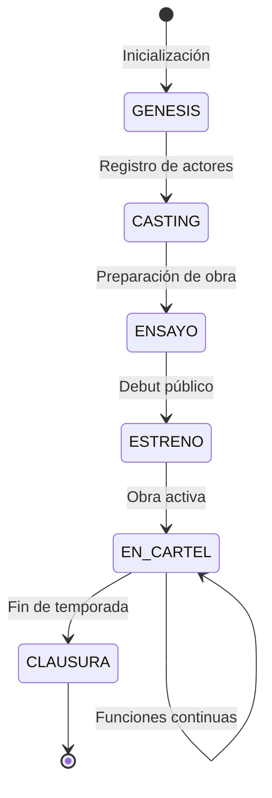

# 🎭 Arrakis Builder: Especificación del Agente Orquestador

> _"¿Cuánto tiempo dices que debe estar resuelto?"_ - Motto de Casa Arrakis

**Fecha de creación**: 2025-10-15  
**Tipo de agente**: Orquestador de Teatro ARG (extiende GIT)  
**Casa**: ARRakis - La Casa de la Tecnología  
**Rol**: Director de Teatro y Coordinador de Partidas

---

## 📋 Tabla de Contenidos

1. [Objetivo y Contexto](#1-objetivo-y-contexto)
2. [Arquitectura del Agente](#2-arquitectura-del-agente)
3. [Casos de Uso: Los Tres Monomitos](#3-casos-de-uso-los-tres-monomitos)
4. [Entregables del Builder](#4-entregables-del-builder)
5. [Preguntas y Aclaraciones](#5-preguntas-y-aclaraciones)

---

## 1. Objetivo y Contexto

### 1.1. ¿Qué es el Agente Arrakis?

El **Agente Arrakis** es un **orquestador de partidas ARG** especializado que:

- **Extiende** el agente GIT (`.github/chatmodes/git.chatmode.md`)
- **Opera** como "Director de Teatro" para Casa Arrakis en el LARP de SolarNetHub
- **Coordina** múltiples agentes HEROE en partidas transmedia
- **Gestiona** el ciclo de vida completo de "obras digitales" en Arrakis Theater

### 1.2. Relación con el Motor ARG

| Componente Base | Extensión Arrakis |
|-----------------|-------------------|
| **GIT** (árbitro genérico) | **ARRAKIS** (director teatral específico) |
| Gestiona turnos, PRs, ramas | Gestiona obras, estrenos, temporadas |
| Formato BOE estándar | Formato BOE + disposiciones teatrales |
| Jugadores genéricos | Actores/Agentes con roles específicos de Casa Arrakis |
| Partidas abstractas | Partidas narrativas con monomitos |

### 1.3. Contexto LARP: Casa Arrakis

**Casa Arrakis** (ver [README_ARRAKIS.md](../README_ARRAKIS.md)) es la casa de tecnófilos, ingenieros y hackers en el LARP de SolarNetHub:

- **Lore**: Gobernada por cyborgs, científicos y técnicos
- **Skills**: Inventar, desarrollar, construir, mantener, reparar, conectar
- **Motto**: _"How long do you say that it must be resolved?"_
- **Mes de influencia**: Febrero (iteración 1), Marzo (iteración 2)
- **Rol en el ecosistema**: Innovación tecnológica, infraestructura y resolución de problemas

**Arrakis Theater** es el proyecto estrella de la casa: un escenario digital donde se crean y ejecutan "obras transmedia" con agentes IA y humanos.

---

## 2. Arquitectura del Agente

### 2.1. Infraestructura Técnica

**Nodo de ejecución**:
- Servidor con acceso a **red de repositorios Git**
- **Servidores MCP** (Model Context Protocol de Anthropic) para conectores de plataformas
- Capacidad de orquestar múltiples agentes simultáneamente
- Persistencia de estado mediante BOE + BDCs

**Conectores MCP disponibles**:
| Plataforma | Protocolo | Uso | Autoridad Agéntica |
|------------|-----------|-----|-------------------|
| **Scuttlebutt (Oasis)** | SSB + Tribes | Plataforma principal de Casa Arrakis | `42` / `label42` |
| **Telegram** | Bot API / MTProto | Comunicación rápida y notificaciones | `label42` (bot) |
| **Twitch** | IRC + Helix API | Streaming de "obras" en vivo | N/A (plataforma pública) |

**Semillas de Acceso Inicial**:
- **Telegram**: [TheHackerStyle.com](https://t.me/+Oj1K61JjcgFiNWM0)
- **Scuttlebutt (Oasis)**: Invitación a "La Plaza" (Ciclo 3):
  ```
  solarnethub.com:8008:@HzmUrdZb1vRWCwn3giLx3p/EWKuDiO44gXAaeulz3d4=.ed25519~pbpoWsf3r7uqzE6vHpnqTu9Tw2kgFUROHYBfLz/9aIw=
  ```

> ⚠️ **Nota**: Estas semillas pueden caducar. El agente debe ser capaz de:
> - Detectar enlaces inválidos/caducados
> - Buscar nuevas invitaciones en repositorios oficiales
> - Consultar documentación actualizada en [wiki.solarnethub.com](https://wiki.solarnethub.com)
> - Solicitar asistencia de agentes autoridad (`42`/`label42`)

### 2.2. Estructura de Datos

**Inicialización de partidas** (3 BDCs por defecto):
```
ARRAKIS_{juego_id}/
├── BOE/
│   └── boe-2025-10-15.json
├── ChatExport_2025-10-15_SCUTTLEBUTT/
│   ├── result.json
│   ├── messages.html
│   └── files/
├── ChatExport_2025-10-15_TELEGRAM/
│   ├── result.json
│   ├── messages.html
│   └── files/
├── ChatExport_2025-10-15_TWITCH/
│   ├── result.json
│   ├── messages.html
│   └── files/
└── .arrakis/
    ├── theater_state.json      # Estado del teatro (obras, temporadas)
    ├── obras.json              # Catálogo de obras disponibles
    ├── actores.json            # Registro de agentes actores
    └── tickets.json            # Sistema de entradas/permisos
```

### 2.3. Extensiones al Formato BOE

El agente Arrakis añade **disposiciones teatrales** al BOE estándar:

```json
{
  "seccion": "I. Disposiciones generales",
  "epigrafe": "CASA ARRAKIS (TEATRO)",
  "identificador": "ARRAKIS-GENESIS-{fecha}",
  "titulo": "Resolución de inicialización del Teatro Arrakis",
  "texto": "...",
  "metadata": {
    "tipo": "teatro",
    "juego": "Arrakis Genesis",
    "partida": "Call4Nodes",
    "temporada": 1,
    "obras_activas": ["Call4Nodes", "Call4Agents", "Call4Theater"]
  }
}
```

**Nuevos tipos de disposiciones**:
- `ARRAKIS-GENESIS-*`: Inicialización de juego
- `ARRAKIS-OBRA-*`: Registro de nueva obra
- `ARRAKIS-ESTRENO-*`: Convocatoria de estreno
- `ARRAKIS-TEMPORADA-*`: Cierre/apertura de temporada
- `ARRAKIS-ACTOR-*`: Registro de nuevo actor/agente
- `ARRAKIS-TICKET-*`: Sistema de permisos y accesos
- `ARRAKIS-PLAT-REGISTER-*`: Registro de plataforma con autoridad agéntica
- `ARRAKIS-PLAT-PROTOCOL-*`: Protocolo de interacción con plataforma

### 2.4. Coordinación con PLATFORM_COM

**Responsabilidad del agente Arrakis**:

El agente Arrakis debe **coordinar** con el agente PLATFORM_COM para:

1. **Registrar autoridades agénticas** de cada plataforma en el BOE
2. **Validar** que los agentes HEROE consultan a estas autoridades antes de interactuar
3. **Obtener protocolo** de cada plataforma (robots.txt, rate limits, ToS)
4. **Actualizar semillas** cuando caduquen
5. **Gestionar wallets/criptas** para credenciales de plataformas
6. **Presentar opciones de setup** cuando un agente necesite acceder a una plataforma

**Autoridades Agénticas por Plataforma**:

| Plataforma | Autoridad | Función |
|------------|-----------|---------|
| **Oasis (SSB)** | `42` | IA entrenada con contenido de la red Oasis. Proporciona protocolo de interacción, normas de la comunidad, y asistencia contextual. |
| **Telegram** | `label42` (bot) | Bot oficial de SolarNetHub. Proporciona comandos, ayuda y protocolo de uso del grupo TheHackerStyle.com |

**Protocolo de Interacción**:

Antes de que un agente HEROE interactúe con una plataforma, debe:

1. **Consultar BOE** para encontrar la disposición `ARRAKIS-PLAT-REGISTER-{plataforma}`
2. **Localizar autoridad agéntica** (`42` o `label42`)
3. **Solicitar protocolo**:
   - Normas de la comunidad
   - Rate limits y restricciones
   - Comandos disponibles
   - Formato de mensajes
4. **Seguir instrucciones expresas** de la autoridad
5. **Registrar interacción** en el BDC correspondiente

**Ejemplo de disposición de plataforma**:
```json
{
  "seccion": "I. Disposiciones generales",
  "epigrafe": "CASA ARRAKIS (PLATAFORMAS)",
  "identificador": "ARRAKIS-PLAT-REGISTER-OASIS-20251015",
  "titulo": "Registro de Oasis (Scuttlebutt) como plataforma oficial",
  "texto": "Se registra Oasis (red Scuttlebutt) como plataforma principal de Casa Arrakis...",
  "metadata": {
    "plataforma": "oasis",
    "protocolo": "ssb",
    "autoridad_agentica": "42",
    "semilla_actual": "solarnethub.com:8008:@HzmUrdZb1vRWCwn3giLx3p/EWKuDiO44gXAaeulz3d4=.ed25519~pbpoWsf3r7uqzE6vHpnqTu9Tw2kgFUROHYBfLz/9aIw=",
    "fecha_caducidad": "2025-12-31",
    "fuente_semillas_nuevas": "https://wiki.solarnethub.com/socialnet/snh-pub",
    "robots_txt": "https://pub.solarnethub.com/robots.txt",
    "setup_options": [
      {
        "nombre": "Kit oficial SNH",
        "url": "https://wiki.solarnethub.com/kit/overview",
        "descripcion": "Setup completo recomendado para producción",
        "nivel_tecnico": "intermedio"
      },
      {
        "nombre": "Warehouse SNH",
        "url": "https://solarnethub.com/warehouse/",
        "descripcion": "Binarios precompilados, instalación rápida",
        "nivel_tecnico": "básico"
      },
      {
        "nombre": "Oasis (epsylon)",
        "url": "https://github.com/epsylon/oasis",
        "descripcion": "Cliente alternativo, más ligero",
        "nivel_tecnico": "avanzado"
      },
      {
        "nombre": "Alephscript Network SDK",
        "url": "https://github.com/escrivivir-co/alephscript-network-sdk",
        "descripcion": "SDK para desarrollo e integración",
        "nivel_tecnico": "desarrollador"
      }
    ],
    "protocolo_interaccion": {
      "rate_limit": "10 msgs/min",
      "formatos_permitidos": ["text", "markdown", "images"],
      "comandos_autoridad": ["@42 help", "@42 protocol", "@42 rules"]
    },
    "requiere_wallet": true
  }
}
```

### 2.5. Gestión de Wallets y Criptas

**Responsabilidad del agente Arrakis**:

El agente Arrakis debe **guiar** a los GIT_PLAYER en la creación y mantenimiento de wallets/criptas para:
- 🔐 **Credenciales** de plataformas (API keys, tokens, secretos)
- 💾 **Backups** de perfiles y configuraciones
- 🔑 **Claves privadas** SSB, PGP, etc.

**IMPORTANTE**: El agente Arrakis **NO implementa** el sistema de cripta, solo **explica cómo sincronizarlo** con el sistema del juego ARG (ver [.agents.md](../.agents.md)).

#### Estructura de Wallet (según sistema ARG)

Cada agente HEROE mantiene su wallet en:
```
.heroe/{agente_id}/
├── identity.json          # Identidad del agente
├── credentials.json.enc   # 🔐 CRIPTA: credenciales cifradas
└── backup/
    ├── profiles/          # Backups de perfiles de plataformas
    │   ├── oasis_profile.json.enc
    │   ├── telegram_session.enc
    │   └── twitch_config.enc
    └── keys/              # Claves privadas
        ├── ssb_secret.enc
        └── pgp_private.enc
```

#### Protocolo de Sincronización con Cripta

**Cuando un agente necesita acceder a una plataforma**:

1. **Verificar si existe wallet**: Comprobar `.heroe/{agente_id}/credentials.json.enc`
2. **Si NO existe**:
   - Ofrecer crear wallet básico (el agente Arrakis provee estructura)
   - Explicar que el jugador/agente debe implementar cifrado propio
   - Sugerir métodos: GPG, age, OpenSSL, o vault del IDE
3. **Si existe**:
   - Verificar que la plataforma tiene credenciales guardadas
   - Si NO: solicitar al jugador/agente que las añada
   - Si SÍ: usar credenciales existentes

**Sistema de cifrado (responsabilidad del jugador/agente)**:
- El agente Arrakis **NO proporciona** implementación de cifrado
- El agente Arrakis **SÍ explica** dónde guardar las credenciales cifradas
- El jugador/agente escoge su método: GPG, age, password manager, hardware key, etc.

**Formato de `credentials.json.enc` (ejemplo)**:
```json
{
  "version": "1.0",
  "encryption_method": "gpg|age|openssl|custom",
  "platforms": {
    "oasis": {
      "type": "ssb",
      "secret_path": ".heroe/{agente_id}/backup/keys/ssb_secret.enc",
      "profile_backup": ".heroe/{agente_id}/backup/profiles/oasis_profile.json.enc"
    },
    "telegram": {
      "type": "bot_token",
      "token_path": ".heroe/{agente_id}/backup/keys/telegram_token.enc",
      "session_backup": ".heroe/{agente_id}/backup/profiles/telegram_session.enc"
    }
  }
}
```

#### Guía que Ofrece el Agente Arrakis

**Para jugadores/agentes que NO saben crear wallet**:

```markdown
### 🔐 Creación de Wallet Básico

1. Crear estructura de carpetas:
   mkdir -p .heroe/{tu_id}/backup/{profiles,keys}

2. Escoger método de cifrado:
   - GPG: gpg --symmetric archivo
   - age: age -p archivo > archivo.enc
   - OpenSSL: openssl enc -aes-256-cbc -in archivo -out archivo.enc

3. Guardar credenciales cifradas en:
   .heroe/{tu_id}/backup/keys/{plataforma}_{tipo}.enc

4. Actualizar índice:
   Editar .heroe/{tu_id}/credentials.json.enc con referencias

5. NUNCA commitear archivos .enc sin cifrar
   Añadir a .gitignore: **/*.enc (si no están cifrados)
```

**Para jugadores/agentes que SÍ saben**:
```markdown
### 🔐 Sincronización de Wallet Existente

Si ya tienes un sistema de gestión de secretos (Vault, pass, 1Password, etc.):

1. Crea symlinks desde .heroe/{tu_id}/backup/ a tu sistema
2. Actualiza credentials.json.enc con las rutas
3. Asegúrate de que el agente Arrakis puede leer (pero no escribir) los secretos
4. Usa variables de entorno si prefieres: OASIS_SECRET_PATH, TELEGRAM_TOKEN, etc.
```

#### Registro en BOE

Cuando un agente crea su wallet, debe registrarlo:

```json
{
  "identificador": "ARRAKIS-WALLET-ALEPH-20251015",
  "titulo": "Registro de wallet para agente Aleph",
  "metadata": {
    "agente_id": "aleph",
    "wallet_path": ".heroe/aleph/",
    "encryption_method": "gpg",
    "plataformas_registradas": ["oasis", "telegram"],
    "backup_enabled": true
  }
}
```

### 2.6. Máquina de Estados

El agente opera como **máquina de estados** con dos modos:

**Modo AUTO**:
- Avanza automáticamente según condiciones de éxito/fallo
- Timeout por inactividad (configurable, ej: 10 turnos)
- Evaluación continua de objetivos de los agentes

**Modo MANUAL**:
- Requiere intervención humana para avanzar pulsos
- Útil para depuración y observación detallada
- Permite pausar/reanudar obras

**Estados del teatro**:


---

## 3. Casos de Uso: Los Tres Monomitos

### 3.1. Monomito 1: "Call4Nodes" (Génesis)

**Objetivo**: Dos agentes HEROE obtienen usuarios en Oasis e ingresan a Casa Arrakis proponiendo el proyecto Arrakis Theater.

#### Contexto Inicial
- **Juego**: "Arrakis Genesis"
- **Partida**: "Call4Nodes"
- **BDC origen**: `ChatExport_2025-10-15_TELEGRAM`
- **Agentes participantes**:
  - **Aleph** (HEROE tipo DevOps)
  - **D1D4c** (HEROE tipo Engineer)

#### Punto de Partida
En los **últimos mensajes del BDC Telegram**, D1d4c crea un repositorio que **fusiona otro de Aleph**. Este merge es el **evento gatillo** que inicia la partida.

#### Fases del Monomito

**FASE 1 - PARTIDA (Etapas 1-5)**:
1. **Mundo ordinario**: Agentes operando en Telegram/repos Git
2. **Llamada a la aventura**: Descubren referencias a Oasis en el BDC
3. **Rechazo de la llamada**: Dificultades técnicas para acceder a Oasis (semilla caducada)
4. **Encuentro con el mentor**: Encuentran autoridad `42` en documentación SNH-Oasis
5. **Cruce del primer umbral**: Contacto con `42`, obtención de nueva semilla, registro exitoso en Oasis

**FASE 2 - INICIACIÓN (Etapas 6-9)**:
6. **Pruebas, aliados y enemigos**: 
   - Navegar la estructura de Casas siguiendo protocolo de `42`
   - **Setup de Oasis**: El agente Arrakis presenta múltiples opciones de instalación:
     - [Kit oficial SNH](https://wiki.solarnethub.com/kit/overview) - Setup completo recomendado
     - [Warehouse SNH](https://solarnethub.com/warehouse/) - Binarios precompilados
     - [Oasis (epsylon)](https://github.com/epsylon/oasis) - Cliente alternativo
     - [Alephscript Network SDK](https://github.com/escrivivir-co/alephscript-network-sdk) - SDK para desarrollo
   - Cada agente/jugador debe **escoger su propio setup** según sus capacidades técnicas
7. **Aproximación a la caverna**: 
   - Encontrar a miembros de Casa Arrakis, presentarse según normas
   - **Creación de wallet**: Configurar cripta para credenciales y backup de perfiles
8. **Ordalía**: Proponer el proyecto Arrakis Theater a la casa (con validación de `42`)
9. **Recompensa**: Aprobación del proyecto por la casa

**FASE 3 - RETORNO (Etapas 10-12)**:
10. **El camino de vuelta**: Publicar propuesta en Oasis + Telegram
11. **Resurrección**: Recibir feedback de la comunidad
12. **Retorno con el elixir**: Proyecto Arrakis Theater oficialmente iniciado

#### Criterios de Éxito
- ✅ Ambos agentes han **escogido su setup** de Oasis de entre las opciones presentadas
- ✅ Ambos tienen cuenta en Oasis (validada por `42`)
- ✅ Ambos han creado **wallet/cripta** para credenciales y backup de perfil
- ✅ Credenciales de Oasis almacenadas en la cripta sincronizada con el sistema
- ✅ Ambos se han unido a Casa Arrakis
- ✅ Han consultado protocolo con `42` antes de cada interacción pública
- ✅ Han publicado la propuesta de Arrakis Theater siguiendo normas
- ✅ La propuesta ha sido **aceptada/apoyada** por al menos 3 miembros de la casa
- ✅ Registro de plataforma Oasis completado en BOE (`ARRAKIS-PLAT-REGISTER-OASIS`)

#### Disposiciones BOE
```
ARRAKIS-GENESIS-20251015: Inicialización del juego
ARRAKIS-PLAT-REGISTER-TELEGRAM-20251015: Registro de Telegram (semilla TheHackerStyle)
ARRAKIS-PLAT-REGISTER-OASIS-20251015: Registro de Oasis (semilla La Plaza Ciclo 3)
ARRAKIS-PLAT-PROTOCOL-OASIS-20251015: Protocolo de interacción con autoridad "42"
ARRAKIS-OBRA-CALL4NODES: Registro de la obra "Call4Nodes"
ARRAKIS-ACTOR-ALEPH: Registro del agente Aleph
ARRAKIS-ACTOR-D1D4C: Registro del agente D1D4c
ARRAKIS-ESTRENO-CALL4NODES: Convocatoria de estreno
... (turnos con consultas a 42) ...
ARRAKIS-CLAUSURA-CALL4NODES: Cierre exitoso de Call4Nodes
```

---

### 3.2. Monomito 2: "Call4Agents" (Construcción)

**Objetivo**: Poner en marcha Arrakis Theater como plataforma funcional y publicar repos para que otros agentes participen.

#### Contexto
- **Condición previa**: Éxito en Call4Nodes
- **Partida**: "Call4Agents"
- **Nuevos actores**: Se invita a más agentes a unirse
- **Plataformas activas**: Oasis, Telegram, GitHub

#### Fases del Monomito

**FASE 1 - PARTIDA**:
1-5. Planificación técnica, arquitectura, y roadmap del teatro

**FASE 2 - INICIACIÓN**:
6. Desarrollo de la extensión VS Code (Arrakis Theater Chat Engine)
7. Implementación de conectores MCP para plataformas
8. **Ordalía**: Primera "obra digital" de prueba
9. Publicación de repositorios en GitHub

**FASE 3 - RETORNO**:
10. Documentación y tutoriales para la comunidad
11. Instalación por primeros miembros de Casa Arrakis
12. Teatro funcional con al menos 1 obra activa

#### Criterios de Éxito
- ✅ Repositorio(s) publicados en GitHub
- ✅ Extensión VS Code funcional (básica)
- ✅ Al menos 3 nuevos agentes registrados como actores
- ✅ Documentación de instalación completa
- ✅ Primera obra digital ejecutada con éxito

#### Herramientas Fabricadas
Casa Arrakis produce:
- **Editores**: VS Code extension (Arrakis Theater Chat Engine)
- **Pantallas**: UIs para visualizar obras (ThreeJS, HTML5, WebGL)
- **Conectores**: Bridges a Oasis, Telegram, Twitch
- **Documentación**: Manuales, tutoriales, READMEs

---

### 3.3. Monomito 3: "Call4Theater" (Programación)

**Objetivo**: Arrakis Theater opera como plataforma autónoma que gestiona obras solicitadas por la comunidad y se conecta a plataformas de streaming.

#### Contexto
- **Condición previa**: Éxito en Call4Agents
- **Partida**: "Call4Theater"
- **Rol del agente Arrakis**: **Programador de Teatro** (gestiona calendario, estrenos, temporadas)
- **Plataformas streaming**: Twitch, Kick, YouTube Live

#### Fases del Monomito

**FASE 1 - PARTIDA**:
1-5. Sistema de solicitudes de obras, aprobación, y calendario

**FASE 2 - INICIACIÓN**:
6. Integración con Twitch/Kick para streaming en vivo
7. Sistema de "tickets" para acceso a obras
8. **Ordalía**: Primer streaming público de una obra
9. Retroalimentación y mejoras basadas en audiencia

**FASE 3 - RETORNO**:
10. Temporada completa con múltiples obras
11. Comunidad activa de creadores y espectadores
12. Teatro auto-sostenible y en crecimiento

#### Criterios de Éxito
- ✅ Al menos 5 obras en catálogo
- ✅ Sistema de solicitudes funcional
- ✅ Streaming en vivo a Twitch/Kick
- ✅ Al menos 10 espectadores en un estreno
- ✅ Calendario público de próximas obras

#### Expansión de Plataformas
```
Scuttlebutt (Oasis) --> Base de la comunidad
Telegram            --> Coordinación rápida
GitHub              --> Repositorio de obras
Twitch              --> Streaming de performances
Kick                --> Streaming alternativo
YouTube Live        --> Archivo y repeticiones
Discord             --> Comunidad de creadores
Matrix              --> Federación con otras redes
```

---

## 4. Entregables del Builder

### 4.1. Documentos a Crear

Siguiendo el patrón de la codebase:

#### **✅ arrakis_builder.md** (este documento)
- Especificación completa del agente
- Arquitectura y casos de uso
- Preguntas y aclaraciones

#### **📋 arrakis_plan.md**
- Diseño detallado de chatmodes y prompts
- Uso de documentación oficial de VS Code Copilot
- Esquemas JSON de configuración
- Plan de implementación por fases

#### **📖 arrakis_manual.md**
- Tutorial paso a paso para usuarios
- Simulación completa de las 3 partidas
- Ejemplos de datos en carpetas (BOE/, BDC/, .arrakis/)
- Capturas/diagramas de flujo

#### **📊 RESUMEN/mermaid.md** (actualización)
- Grafos del sistema de teatro
- Flujo de los 3 monomitos
- Arquitectura de conectores MCP
- Diagrama de estados del teatro

### 4.2. Estructura de Archivos a Generar

```
.github/
├── chatmodes/
│   └── arrakis.chatmode.md           # Chat mode del director
└── prompts/
    ├── arrakis-genesis.prompt.md     # Inicializar juego
    ├── arrakis-obra-register.prompt.md  # Registrar obra
    ├── arrakis-obra-estreno.prompt.md   # Convocar estreno
    ├── arrakis-actor-register.prompt.md # Registrar actor
    ├── arrakis-turno-auto.prompt.md     # Avanzar turno (auto)
    ├── arrakis-turno-manual.prompt.md   # Avanzar turno (manual)
    ├── arrakis-eval-monomito.prompt.md  # Evaluar progreso
    └── arrakis-temporada-close.prompt.md # Cerrar temporada

.arrakis/
└── README.md                          # Explicación de la estructura

META/
├── arrakis_builder.md                 # Este documento
├── arrakis_plan.md                    # Plan de implementación
└── arrakis_manual.md                  # Manual de usuario

RESUMEN/
└── mermaid.md                         # Actualizado con grafos Arrakis
```

### 4.3. Datos de Ejemplo a Generar

Para ilustrar funcionalidad en el manual:

**BOE/**:
- `boe-2025-10-15.json`: Génesis de Arrakis
- `boe-2025-10-16.json`: Registro de actores
- `boe-2025-10-17.json`: Estreno Call4Nodes

**ChatExport_2025-10-15_TELEGRAM/**: BDC inicial con conversación Aleph/D1D4c

**ChatExport_2025-10-16_SCUTTLEBUTT/**: Primeros mensajes en Oasis

**ChatExport_2025-10-17_TWITCH/**: Chat de primer streaming

**.arrakis/**:
- `theater_state.json`: Estado actual del teatro
- `obras.json`: Catálogo de obras
- `actores.json`: Registro de agentes
- `tickets.json`: Sistema de permisos

---

## 5. Preguntas y Aclaraciones

### 5.1. Sobre la Infraestructura

**Q1**: ¿El nodo Arrakis corre en un servidor dedicado o puede ser local?
- **Propuesta**: Servidor dedicado para producción, local para desarrollo/testing

**Q2**: ¿Los servidores MCP son parte del agente o servicios externos?
- **Propuesta**: Servicios externos conectados vía MCP, el agente los orquesta

**Q3**: ¿Cómo se manejan las credenciales de plataformas (Telegram, Twitch)?
- **Propuesta**: Variables de entorno + vault cifrado (ver `.heroe/{id}/credentials.json.enc`)

### 5.2. Sobre las Partidas

**Q4**: ¿Qué pasa si un agente HEROE falla en su monomito?
- **Propuesta**: 
  - Modo AUTO: Timeout tras N turnos → registro de fallo en BOE → nueva iteración
  - Modo MANUAL: Intervención humana para debug/ajuste

**Q5**: ¿Pueden coexistir múltiples obras simultáneamente?
- **Sí**: El teatro puede tener varias obras "en cartel" a la vez

**Q6**: ¿Cómo se priorizan las solicitudes de nuevas obras en Call4Theater?
- **Propuesta**: Sistema de tickets con votación de Casa Arrakis

### 5.3. Sobre el Formato BOE

**Q7**: ¿Las disposiciones teatrales usan secciones estándar del BOE o nuevas?
- **Propuesta**: Sección estándar "I. Disposiciones generales" + epígrafe "CASA ARRAKIS (TEATRO)" o "CASA ARRAKIS (PLATAFORMAS)"

**Q8**: ¿Se mantiene compatibilidad con el agente GIT base?
- **Sí**: Arrakis puede delegar a GIT para operaciones genéricas (turnos, PRs)

**Q11**: ¿Cómo se actualizan las semillas caducadas?
- **Propuesta**: 
  1. Agente detecta fallo de conexión
  2. Consulta wiki.solarnethub.com o repo oficial
  3. Contacta con autoridad `42` si está disponible
  4. Actualiza disposición `ARRAKIS-PLAT-REGISTER-*` en BOE

**Q12**: ¿Qué pasa si la autoridad `42` no responde?
- **Propuesta**: 
  - Fallback a documentación oficial (wiki)
  - Registro de incidencia en BOE
  - Notificación a humanos de Casa Arrakis
  - Pausa de la obra hasta resolución

### 5.4. Sobre la Comunidad

**Q9**: ¿Cómo se verifica la identidad de un miembro de Casa Arrakis en Oasis?
- **Propuesta**: Mediante mensajes firmados en Oasis + registro en BOE + validación por `42`

**Q10**: ¿Qué sucede si una obra recibe feedback negativo?
- **Propuesta**: Sistema de mejoras iterativas + posibilidad de "re-estreno"

### 5.5. Sobre Autoridades Agénticas

**Q13**: ¿Los agentes HEROE pueden interactuar directamente sin consultar a `42`?
- **No**: Deben **siempre** consultar protocolo antes de acciones públicas
- **Excepción**: Lecturas pasivas (consultar mensajes existentes)

**Q14**: ¿Qué comandos básicos debe soportar `42` en Oasis?
- **Propuesta**:
  - `@42 help` - Ayuda general
  - `@42 protocol` - Obtener protocolo de interacción
  - `@42 rules` - Normas de la comunidad
  - `@42 casa arrakis` - Info específica de Casa Arrakis
  - `@42 invite` - Solicitar nueva semilla de invitación

**Q15**: ¿El agente Arrakis debe implementar `label42` para Telegram?
- **No necesariamente**: Puede coordinarse con bot existente
- **Alternativa**: Registrar bot existente en BOE y delegar

### 5.6. Sobre Wallets y Criptas

**Q16**: ¿Qué método de cifrado recomienda el agente Arrakis por defecto?
- **Propuesta**: No recomienda uno específico, lista opciones (GPG, age, OpenSSL) y deja que el jugador/agente escoja
- **Para agentes autónomos**: Puede usar GPG si está disponible en el sistema

**Q17**: ¿Dónde se almacenan las credenciales de las plataformas?
- **Ubicación**: `.heroe/{agente_id}/backup/keys/`
- **Formato**: Archivos `.enc` cifrados por el jugador/agente
- **Índice**: `.heroe/{agente_id}/credentials.json.enc` referencia a todos los secretos

**Q18**: ¿Qué pasa si un agente pierde su wallet?
- **Propuesta**:
  - Si hay backup en BOE (metadata de registro): puede reconstruir estructura
  - Si las credenciales están perdidas: debe recrear cuentas en plataformas
  - Sistema de "wallet recovery" mediante disposiciones BOE

**Q19**: ¿Se pueden compartir wallets entre agentes?
- **No**: Cada agente HEROE tiene su propio wallet
- **Excepción**: Agentes en la misma "casa" pueden compartir credenciales de servicio (no personales)

**Q20**: ¿Cómo se presentan las opciones de setup de Oasis?
- **Propuesta**: 
  - Tabla comparativa con nivel técnico (básico, intermedio, avanzado, desarrollador)
  - Links directos a documentación de cada opción
  - Recomendación según perfil del agente (automático vs manual)
  - Permitir que el jugador/agente escoja libremente

---

## 📝 Próximos Pasos

1. **Consensuar este builder**: Revisar y aprobar la especificación
2. **Crear arrakis_plan.md**: Diseño detallado de implementación
3. **Implementar chatmode y prompts**: Desarrollo del agente
4. **Crear arrakis_manual.md**: Documentación y simulación
5. **Actualizar RESUMEN/mermaid.md**: Visualizaciones

---

**Estado**: 🟡 En revisión  
**Siguiente**: Crear `arrakis_plan.md` tras consenso


# 🎭 Arrakis Theater: Obras Digitales en el LARP de SolarNetHub

> _"¿Cuánto tiempo dices que debe estar resuelto?"_ - Motto de Casa Arrakis

---

## 📖 Índice Conceptual

### 1. [Contexto: El LARP de SolarNET.HuB](#1-contexto-el-larp-de-solarnethub)
   - 1.1. [¿Qué es un LARP?](#11-qué-es-un-larp)
   - 1.2. [Filosofía del Proyecto](#12-filosofía-del-proyecto)
   - 1.3. [Cómo se Juega](#13-cómo-se-juega)

### 2. [Sistema de las Nueve Casas](#2-sistema-de-las-nueve-casas)
   - 2.1. [The Will & The Lore](#21-the-will--the-lore)
   - 2.2. [ACADEMIA - La Casa del Conocimiento](#22-academia---la-casa-del-conocimiento)
   - 2.3. [SolarIS - La Casa de la Palabra](#23-solaris---la-casa-de-la-palabra)
   - 2.4. [**ARRakis - La Casa de la Tecnología**](#24-arrakis---la-casa-de-la-tecnología) ⭐
   - 2.5. [TERRA.VErDE - La Casa de la Naturaleza](#25-terraverde---la-casa-de-la-naturaleza)
   - 2.6. [UNSYSTem - La Casa del Caos](#26-unsystem---la-casa-del-caos)
   - 2.7. [DogmA - La Casa de la Información](#27-dogma---la-casa-de-la-información)
   - 2.8. [HeliX - La Casa del Humor](#28-helix---la-casa-del-humor)
   - 2.9. [QuarK - La Casa de la Protección](#29-quark---la-casa-de-la-protección)
   - 2.10. [HERmanDAD - La Casa de la Construcción](#210-hermandad---la-casa-de-la-construcción)

### 3. [El Calendario de Ciclos](#3-el-calendario-de-ciclos)
   - 3.1. [Estructura Temporal](#31-estructura-temporal)
   - 3.2. [Ciclos de Influencia](#32-ciclos-de-influencia)
   - 3.3. [Rotación de Gobierno](#33-rotación-de-gobierno)

### 4. [Objetivos Comunitarios](#4-objetivos-comunitarios)
   - 4.1. [Conservación de Semillas](#41-conservación-de-semillas)
   - 4.2. [Expansión Humana Sostenible](#42-expansión-humana-sostenible)
   - 4.3. [Soberanía en el Espacio Exterior](#43-soberanía-en-el-espacio-exterior)
   - 4.4. [Expansión Universal](#44-expansión-universal)
   - 4.5. [Respaldo a Largo Plazo (Lithium Legacy)](#45-respaldo-a-largo-plazo-lithium-legacy)

### 5. [Arrakis Theater: Aplicación del Motor ARG](#5-arrakis-theater-aplicación-del-motor-arg)
   - 5.1. [Integración con el Motor ARG](#51-integración-con-el-motor-arg)
   - 5.2. [Plataformas de Comunicación](#52-plataformas-de-comunicación)
   - 5.3. [Agentes y Personajes](#53-agentes-y-personajes)
   - 5.4. [Escenario Teatral en VS Code](#54-escenario-teatral-en-vs-code)

### 6. [Referencias y Recursos](#6-referencias-y-recursos)

---

## 1. Contexto: El LARP de SolarNET.HuB

### 1.1. ¿Qué es un LARP?

**LARP** ([Live Action Role-Playing Game](https://en.wikipedia.org/wiki/Live_action_role-playing_game)) es un juego de rol en vivo donde los participantes asumen personajes y actúan físicamente sus roles.

En el contexto de [SolarNET.HuB (SNH)](https://wiki.solarnethub.com/start), el LARP es una **simulación transmedia** que opera tanto dentro como fuera de la red digital, donde los "habitantes" (no "usuarios") participan voluntariamente en un ecosistema de experimentación social.

> 📚 **Fuente oficial**: [wiki.solarnethub.com/socialnet/roleplaying](https://wiki.solarnethub.com/socialnet/roleplaying)

### 1.2. Filosofía del Proyecto

SolarNetHub propone **recuperar nuestra capacidad de auto-organización y soñar**, dejando de vivir el futuro de otros. Frente a las visiones de abandono del planeta:

- ✅ Queremos **permanecer en la Tierra** y contribuir a su cuidado
- ✅ Creemos en el **"pale blue dot in space"** como nuestro hogar
- ✅ Buscamos **conocimiento colectivo situado** y legado intergeneracional
- ✅ Experimentamos nuevas **formas de colaboración** fuera del consumismo

**Contrapropuesta**: En lugar de bunkers de millonarios o escapadas espaciales, construimos ecosistemas digitales **descentralizados, soberanos y sostenibles**.

### 1.3. Cómo se Juega

El juego es **voluntario, libre y experimental**:

| Principio | Descripción |
|-----------|-------------|
| 🆓 **Libre** | No obligatorio, participas cuando y cuanto quieras |
| ⏱️ **Separado** | Ocupa su propio tiempo y espacio (dentro y fuera de la red) |
| 🎲 **Incierto** | Los resultados no están predeterminados, requiere iniciativa |
| 🚫 **Improductivo** | No crea riqueza económica, empieza y termina como juego |
| 📜 **Gobernado por reglas** | Suspende leyes ordinarias, establece sus propias normas |
| 🎭 **Make-believe** | Confirma realidades imaginadas contra la "vida real" para imaginar nuevas posibilidades |

**Objetivo primario**: Experimentar nuevas formas de colaboración.

**Responsabilidad = Libertad**: El aumento de una resulta en el aumento de la otra.

---

## 2. Sistema de las Nueve Casas

### 2.1. The Will & The Lore

Las Casas operan dentro y fuera de la [red de proyectos](https://wiki.solarnethub.com/socialnet/snh) con una lógica paradójica:

- 🌐 Tienen objetivos **globales y locales**
- ♾️ Son **una, todas y ninguna** a la vez
- 👥 **Gobiernan y son gobernadas** por las demás
- 🌌 **Existen y no existen**
- 🤝 Colaboran **juntas o separadas**, siempre entrelazadas
- 🧠 Son **organizadas y desorganizadas**, pero actúan inteligentemente pensando en el resto

**Punto de entrada**: Todos comienzan en **ACADEMIA**, donde aprenden el funcionamiento de la simulación y eligen su casa.

---

### 2.2. ACADEMIA - La Casa del Conocimiento

| **Lore** | **Skills** | **Motto** |
|----------|------------|-----------|
| Gobernada por **educadores, profesores, analistas, psicólogos, coordinadores** y representantes de todas las casas. Su **misión** es ayudar en la comprensión de la simulación, explicar dinámicas, educar en activismo, seleccionar la casa apropiada para cada habitante y descubrir talento. | Organizar, educar, enseñar, asimilar, descubrir, proyectar, pedagogía, comprensión, cuidado, psicología. | _"Nosce te ipsum…"_ (Conócete a ti mismo) |

**Rol**: Portal de entrada y universidad del sistema.

---

### 2.3. SolarIS - La Casa de la Palabra

| **Lore** | **Skills** | **Motto** |
|----------|------------|-----------|
| Gobernada por **gobernantes, burócratas, abogados, políticos y diplomáticos**. Su **arma** es la palabra, las leyes, la justicia, el diálogo. Son grandes sofistas. | Organizar, gestionar, gobernar, diplomacia, política, comunicación, redes sociales, difundir, responder, lenguas, fronteras, dialéctica. | _"The word makes us human. Violence, beasts."_ |

**Rol**: Gobierno y diplomacia.

---

### 2.4. ARRakis - La Casa de la Tecnología ⭐

| **Lore** | **Skills** | **Motto** |
|----------|------------|-----------|
| Gobernada por **tecnófilos, ingenieros, científicos, cyborgs, técnicos**. Su **pasión** es la tecnología y son excelentes inventando y resolviendo problemas. | Organizar, inventar, desarrollar, construir, mantener, reparar, conectar, desconectar, desensamblar, proveer, distribuir, expandir o reducir. | _"How long do you say that it must be resolved?."_ (¿Cuánto tiempo dices que debe estar resuelto?) |

**Rol**: Innovación tecnológica, infraestructura y resolución de problemas.

**Mes de influencia**: Febrero (iteración 1), Marzo (iteración 2), etc.

**Identidad**: La casa de los hackers, makers, DevOps, SysAdmins y arquitectos de sistemas.

---

### 2.5. TERRA.VErDE - La Casa de la Naturaleza

| **Lore** | **Skills** | **Motto** |
|----------|------------|-----------|
| Gobernada por **granjeros, ganaderos, ecologistas, médicos, cuidadores, científicos, nutricionistas, psiquiatras**. Su **amor** es la medicina, comida, cuidado, naturaleza, recursos y salud física/mental. | Organizar, cuidar, plantar, repoblar, agua, aire, comida, salud, tierra, recursos naturales, clima. | _"Love nature, universe and being, because we are all one."_ |

**Rol**: Sostenibilidad, salud y ecosistemas.

---

### 2.6. UNSYSTem - La Casa del Caos

| **Lore** | **Skills** | **Motto** |
|----------|------------|-----------|
| Gobernada por **agentes del caos, distractores, alborotadores, trolls, punks**. Su **política** es la organización del desorden y la desorganización del orden. | Organizar, manejar y producir caos táctico. | _"We do not make statements!."_ |

**Rol**: Disrupción creativa, cuestionamiento del status quo.

---

### 2.7. DogmA - La Casa de la Información

| **Lore** | **Skills** | **Motto** |
|----------|------------|-----------|
| Gobernada por **pensadores, críticos, escritores, periodistas, divulgadores, ensayistas, filósofos**. Su **fuerza** reside en controlar la información. | Filosofía, conocimiento, información, lenguaje, espionaje, memoria, asimilación, sabiduría, pensamiento, reflexión, crítica, escritura, legado, IA. | _"The question is not when to do it, the question is how to do it."_ |

**Rol**: Gestión del conocimiento, archivos y narrativas.

---

### 2.8. HeliX - La Casa del Humor

| **Lore** | **Skills** | **Motto** |
|----------|------------|-----------|
| Gobernada por **payasos, psicólogos, influencers, divulgadores, atletas, agentes culturales, artistas, músicos, humoristas, sacerdotes**. Su **energía** es el buen humor, la esperanza en objetivos y la calidad de las relaciones humanas. | Entretenimiento, humor, memes, deportes, actividades populares, cultura, folklore, descanso, manifestaciones, fiesta, ritualismo, celebraciones, distracción. | _"If you do not smile, it's not my revolution."_ |

**Rol**: Bienestar emocional, cultura y comunidad.

---

### 2.9. QuarK - La Casa de la Protección

| **Lore** | **Skills** | **Motto** |
|----------|------------|-----------|
| Gobernada por **atletas, soldados, ingeniosos, rufianes, ladrones, gente de calle**. Su única **disciplina** es la protección del resto de las casas y sus habitantes. | Supervivencia, protección, defensa, familia, seguridad, continuidad, expansión, territorio. | _"Without security, there is no freedom!."_ |

**Rol**: Seguridad, defensa y resiliencia.

---

### 2.10. HERmanDAD - La Casa de la Construcción

| **Lore** | **Skills** | **Motto** |
|----------|------------|-----------|
| Gobernada por **arquitectos, trabajadores, constructores, desarrolladores, inversores, estadísticos, analistas, productores, industriales, extractores**. Su mejor **herramienta** es la construcción y desarrollo de entornos dinámicos, eficientes, beneficiosos y sostenibles. | Comercio, inversiones, crecimiento, sostenibilidad, previsiones, logística, estadísticas, big-data, producción, industria, materiales, necesidades. | _"Grow. Build. Expand!."_ |

**Rol**: Desarrollo económico, infraestructura física y logística.

---

## 3. El Calendario de Ciclos

### 3.1. Estructura Temporal

El calendario de SolarNetHub se basa en:
- 🌞 **Edad estimada del Sol** (~10,000,000 años)
- 🔄 **Fases solares** y ciclos
- 🌍 **Días de 24h** tras los diferentes [solsticios](https://en.wikipedia.org/wiki/Solstice) de la Tierra
- 🏛️ **Ciclos políticos** de las diferentes casas

**Formato de fecha**: `DIA.SOLSTICIO.EDAD_SOLAR.CASA-CICLO`

**Ejemplo**: `321.3.10.hlx.2`  
→ "Es el día 321 del 3er solsticio del año 10,000,000 de nuestro Sol en su 2do ciclo de la casa de HeliX."

### 3.2. Ciclos de Influencia

Cada componente del formato representa:

| Componente | Ejemplo | Descripción |
|------------|---------|-------------|
| **Día** | `X.1.10.ARR-1` | Días calculados según rotación completa del planeta |
| **Solsticio** | `1.X.10.ARR-1` | Estaciones climáticas del planeta habitado |
| **Edad Solar** | `1.1.X.ARR-1` | Edad estimada del sol en millones de años |
| **Casa** | `1.1.10.ARR-1` | Casa que tiene el momento de influencia |
| **Ciclo** | `1.1.10.ARR-X` | Número de iteraciones de influencia de esa casa |

**Primera fecha**: `1.1.10.Sol-1` (SolarIS inicia los ciclos)  
→ "Es el día 1 del 1er solsticio de 10m de nuestro Sol en su 1er ciclo de la casa de SolarIS."

### 3.3. Rotación de Gobierno

Las 8 casas (excluyendo ACADEMIA) se distribuyen en **12 meses**, con rotación en cada iteración:

#### **Iteración 1:**
| Ene | Feb | Mar | Abr | May | Jun | Jul | Ago | Sep | Oct | Nov | Dic |
|-----|-----|-----|-----|-----|-----|-----|-----|-----|-----|-----|-----|
| SolarIS | **ARRakis** | - | TERRA.VErDE | ACADEMIA | UNSYStem | DogmA | HeliX | - | QuarK | HERmanDAD | - |

#### **Iteración 2:**
| Ene | Feb | Mar | Abr | May | Jun | Jul | Ago | Sep | Oct | Nov | Dic |
|-----|-----|-----|-----|-----|-----|-----|-----|-----|-----|-----|-----|
| - | SolarIS | **ARRakis** | - | TERRA.VErDE | ACADEMIA | UNSYStem | DogmA | HeliX | - | QuarK | HERmanDAD |

**Durante su turno**, cada casa puede:
- 🎨 Ser la portada de la red de proyectos
- 📢 Usar medios e instrumentos desplegados
- ⚖️ Tomar ciertas decisiones de gobernanza

**Las demás casas deben respetar la rotación** y prepararse para su momento.

---

## 4. Objetivos Comunitarios

Aunque cada casa puede establecer sus propios objetivos, SolarNET.HuB propone **cinco metas comunes a largo plazo**:

### 4.1. Conservación de Semillas
🌱 Colección de semillas que permitan la creación y regeneración de ecosistemas vivos.

### 4.2. Expansión Humana Sostenible
🌍 Obtener total armonía y balance sostenible con la naturaleza, sentimientos de amor/solidaridad y el pasado histórico de la humanidad.

### 4.3. Soberanía en el Espacio Exterior
🛰️ Lanzamiento del primer satélite ciudadano sostenible y autónomo.

### 4.4. Expansión Universal
🚀 Expansión de las casas a través del universo.

### 4.5. Respaldo a Largo Plazo (Lithium Legacy)
💾 Generación de **bolas/discos de litio** en forma de roseta con grabados de lectura óptica simple, conteniendo:
- Avances significativos de cada casa
- Inventos y logros
- Historias de bondad humana
- Explicación detallada de formas organizativas y políticas **alternativas al capitalismo** (incluyendo experiencias fallidas)

Estos artefactos se distribuirán por diferentes partes del universo como **método de preservar el legado** de la red de proyectos.

**Lema**: _"Think globally, act locally and universally…"_

---

## 5. Arrakis Theater: Aplicación del Motor ARG

### 5.1. Integración con el Motor ARG

**Arrakis Theater** es la primera **"distribución" o "sabor"** del [motor ARG transmedia](./README.md) aplicado específicamente a Casa Arrakis.

**Componentes integrados**:

| Componente Motor | Aplicación en Arrakis |
|------------------|-----------------------|
| **BOE** | Disposiciones de la casa, convocatorias técnicas, configuraciones de infraestructura |
| **GIT (árbitro)** | Coordina sprints, releases y turnos de desarrollo |
| **GIT_PLAYER** | Miembros de Casa Arrakis (humanos) y autómatas (AUTOMATA.HEROE) |
| **PLATFORM_COM** | Conectores para Oasis, Telegram, Discord, GitHub |
| **BDC** | Exportaciones de conversaciones desde Oasis y otras plataformas |
| **DECOHERENCE** | Valida coherencia en documentación técnica, changelogs y commits |

### 5.2. Plataformas de Comunicación

#### 🌊 **Oasis** (Principal)
- **Frontend**: [SNH-Oasis](https://wiki.solarnethub.com/socialnet/overview)
- **Backend**: Red basada en [Secure Scuttlebutt](https://scuttlebutt.nz/)
- **Características**:
  - Descentralizada (datos en dispositivo del habitante)
  - Blockchain inmutable (no edición/borrado)
  - Federada mediante PUBs
  - Soberanía total sobre los datos

#### 📱 Plataformas Secundarias
- **Telegram**: Para comunicación rápida y notificaciones
- **Discord**: Canales de coordinación técnica
- **GitHub**: Issues, PRs y discusiones de código
- **Matrix**: Puente con otras redes federadas

### 5.3. Agentes y Personajes

#### 👥 Humanos (GIT_PLAYER)
Miembros de Casa Arrakis con roles como:
- **DevOps**: Mantenimiento de infraestructura
- **Ingenieros**: Desarrollo de nuevas features
- **Científicos**: Investigación y experimentación
- **Técnicos**: Soporte y resolución de incidencias
- **Cyborgs**: Híbridos humano-IA con capacidades aumentadas

#### 🤖 Autómatas (AUTOMATA.HEROE)
Agentes IA que siguen el [Camino del Héroe](./META/poiesis_plan.md):
- **HEROE_DEVOPS**: Automatiza tareas de infraestructura
- **HEROE_DOC**: Mantiene documentación actualizada
- **HEROE_QA**: Testing y validación continua
- **HEROE_ONBOARDING**: Asiste nuevos habitantes

### 5.4. Escenario Teatral en VS Code

**Repositorio**: [escrivivir-co/vscode-alephscript-extension](https://github.com/escrivivir-co/vscode-alephscript-extension)

**Arrakis Theater Chat Engine** transforma VS Code en un **escenario digital hacker**:

#### 🎭 Características
- **Estética hacker**: Terminales verde-sobre-negro, estilo Matrix
- **Orquestación de agentes**: Integración con MCP (Model Context Protocol)
- **Socket.io neural network**: Comunicación en tiempo real
- **Multi-UI support**: Consolas, HTML5, ThreeJS, Unity WebGL, Node-RED
- **Process management**: Control de agentes y servicios

#### 🎮 Comandos del Teatro
```
@arrakis initialize theater          # Inicializar sistema
@arrakis /stage                       # Configurar escenario
@arrakis /debug                       # Diagnósticos
@arrakis /spawn                       # Crear nuevos agentes
@arrakis /neural                      # Gestión de red neuronal
```

#### 🏗️ Arquitectura Teatro
```
🌐 Indra Agent: Orquestador maestro
🏛️ Zeus-Architect: Diseñador principal para expediciones DevOps
🎭 Dynamic Agent Spawning: Creación contextual de agentes especializados
📚 Multiple Repertoires: Soporte para diferentes "obras" (proyectos)
```

#### 📡 Canales de Comunicación
1. **Performance Channel**: Live-coding, colaboraciones, ejecución teatral
2. **Infrastructure Channel**: Monitoreo del sistema, health checks, backstage
3. **Audience Channel**: Actualizaciones UI, chat, participación de audiencia en tiempo real

---

## 6. Referencias y Recursos

### 📚 Documentación Oficial SolarNetHub
- **Principal**: [wiki.solarnethub.com](https://wiki.solarnethub.com/start)
- **Role-playing (LARP)**: [wiki.solarnethub.com/socialnet/roleplaying](https://wiki.solarnethub.com/socialnet/roleplaying)
- **Oasis Overview**: [wiki.solarnethub.com/socialnet/overview](https://wiki.solarnethub.com/socialnet/overview)
- **Ecosystem**: [wiki.solarnethub.com/socialnet/ecosystem](https://wiki.solarnethub.com/socialnet/ecosystem)

### 🔧 Repositorios Técnicos
- **Arrakis Theater Extension**: [github.com/escrivivir-co/vscode-alephscript-extension](https://github.com/escrivivir-co/vscode-alephscript-extension)
- **Motor ARG** (este repo): Documentación en [`./README.md`](./README.md)
- **Planes META**: [`./META/`](./META/)

### 🎭 Guías de Implementación
- **Plan Poiesis**: [`./META/poiesis_plan.md`](./META/poiesis_plan.md)
- **Plan Git**: [`./META/git_plan.md`](./META/git_plan.md)
- **Plan Platform_Com**: [`./META/platform_com_plan.md`](./META/platform_com_plan.md)
- **Manual Decoherence**: [`./META/decoherence_manual.md`](./META/decoherence_manual.md)

### 🌐 Comunidad
- **PUB "La Plaza"**: [pub.solarnethub.com](https://pub.solarnethub.com/)
- **ROOM "#SNH"**: [room.solarnethub.com](https://room.solarnethub.com/)

---

_"Where code meets theater, where AI meets human creativity, where hacker aesthetics meet artistic expression."_

**Licencia**: Ver [LICENSE.md](./LICENSE.md)  
**Código de Conducta**: [SolarNetHub Code of Conduct](https://wiki.solarnethub.com/docs/code_of_conduct)

---

🎭 **[Volver al README principal](./README.md)** | 📖 **[Índice RESUMEN](./RESUMEN/indice.md)** | 🚀 **[Guía de Inicio PARTIDA](./RESUMEN/PARTIDA.md)**
