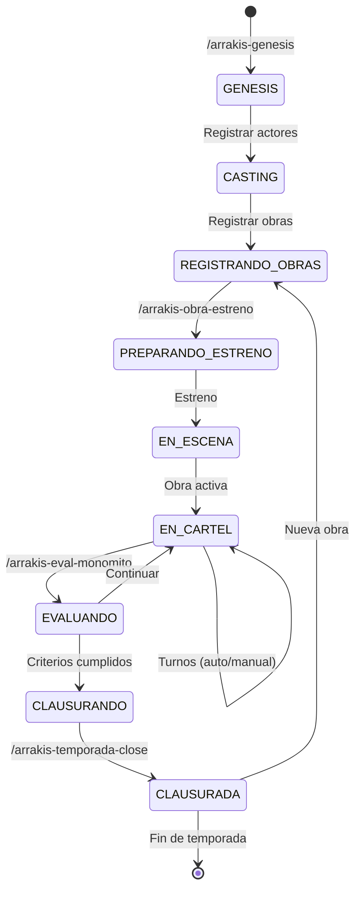

# Plan de diseño: Agente Orquestador "ARRAKIS"

Fecha: 2025-10-15

## Objetivo

Diseñar el **agente Arrakis**, un orquestador teatral que extiende el agente GIT para coordinar "obras digitales" en el contexto del LARP de Casa Arrakis (SolarNetHub). El agente gestiona partidas narrativas basadas en el "Camino del Héroe", coordina múltiples agentes HEROE, y administra el ciclo de vida completo del Arrakis Theater.

## Principios Fundamentales

1. **Extensión de GIT**: Arrakis extiende las capacidades del agente GIT añadiendo lógica teatral
2. **Director de Teatro**: Actúa como orquestador de "obras" (partidas con narrativa)
3. **Coordinación de Autoridades**: Gestiona el registro de autoridades agénticas (`42`, `label42`) por plataforma
4. **Gestión de Wallets**: Guía a los jugadores en la creación y sincronización de criptas para credenciales
5. **Múltiples Setups**: Presenta opciones de instalación y deja que cada jugador/agente escoja
6. **Máquina de Estados**: Opera en modo AUTO o MANUAL para avanzar los "pulsos" del teatro
7. **Tres Monomitos**: Coordina tres partidas narrativas conectadas (Call4Nodes, Call4Agents, Call4Theater)

## Arquitectura del Sistema

```
AGENTE ARRAKIS (Director de Teatro)
├── 📋 Chat Mode: .github/chatmodes/arrakis.chatmode.md
│   └── Extiende: git.chatmode.md
│
├── 🎭 Estado del Teatro: .arrakis/
│   ├── theater_state.json     # Estado actual del teatro (obras, temporada, modo)
│   ├── obras.json             # Catálogo de obras disponibles
│   ├── actores.json           # Registro de agentes actores
│   ├── tickets.json           # Sistema de permisos/accesos
│   └── monomitos.json         # Progreso de los 3 monomitos principales
│
├── 📜 Prompts del Ciclo Teatral (.github/prompts/):
│   ├── arrakis-genesis.prompt.md         # Inicialización del juego/teatro
│   ├── arrakis-obra-register.prompt.md   # Registrar nueva obra
│   ├── arrakis-obra-estreno.prompt.md    # Convocar estreno de obra
│   ├── arrakis-actor-register.prompt.md  # Registrar actor/agente
│   ├── arrakis-turno-auto.prompt.md      # Avanzar turno (modo AUTO)
│   ├── arrakis-turno-manual.prompt.md    # Avanzar turno (modo MANUAL)
│   ├── arrakis-eval-monomito.prompt.md   # Evaluar progreso de monomito
│   ├── arrakis-temporada-close.prompt.md # Cerrar temporada
│   ├── arrakis-wallet-guide.prompt.md    # Guiar creación de wallet
│   └── arrakis-setup-present.prompt.md   # Presentar opciones de setup
│
├── 📊 Disposiciones BOE (publicadas por Arrakis):
│   ├── ARRAKIS-GENESIS-*                 # Inicialización del teatro
│   ├── ARRAKIS-PLAT-REGISTER-*           # Registro de plataforma + autoridad
│   ├── ARRAKIS-PLAT-PROTOCOL-*           # Protocolo de interacción
│   ├── ARRAKIS-OBRA-*                    # Registro de obra
│   ├── ARRAKIS-ESTRENO-*                 # Convocatoria de estreno
│   ├── ARRAKIS-ACTOR-*                   # Registro de actor
│   ├── ARRAKIS-WALLET-*                  # Registro de wallet
│   ├── ARRAKIS-TEMPORADA-*               # Apertura/cierre de temporada
│   └── ARRAKIS-CLAUSURA-*                # Cierre de obra
│
└── 🔌 Conectores MCP:
    ├── mcp-ssb-tribes          # Scuttlebutt (Oasis)
    ├── mcp-telegram            # Telegram Bot API
    └── mcp-twitch              # Twitch IRC + Helix API
```

## Estructura de Carpetas (por repositorio teatro)

```
ARRAKIS_{juego_id}/
├── BOE/
│   ├── boe-2025-10-15.json   # Día de génesis
│   ├── boe-2025-10-16.json   # Registro de actores
│   └── boe-2025-10-17.json   # Estreno de obras
│
├── ChatExport_2025-10-15_TELEGRAM/
│   ├── result.json
│   ├── messages.html
│   └── files/
│
├── ChatExport_2025-10-16_SCUTTLEBUTT/
│   ├── result.json
│   ├── messages.html
│   └── files/
│
├── ChatExport_2025-10-17_TWITCH/
│   ├── result.json
│   ├── messages.html
│   └── files/
│
├── .arrakis/
│   ├── theater_state.json
│   ├── obras.json
│   ├── actores.json
│   ├── tickets.json
│   └── monomitos.json
│
└── .heroe/                   # Cada agente actor tiene su carpeta
    ├── aleph/
    │   ├── identity.json
    │   ├── credentials.json.enc
    │   └── backup/
    └── d1d4c/
        ├── identity.json
        ├── credentials.json.enc
        └── backup/
```

## Disposiciones ARRAKIS en el BOE (esquemas)

### 1) ARRAKIS-GENESIS (Inicialización del Teatro)

```json
{
  "seccion": "I. Disposiciones generales",
  "epigrafe": "CASA ARRAKIS (TEATRO)",
  "identificador": "ARRAKIS-GENESIS-20251015",
  "titulo": "Resolución de inicialización del Teatro Arrakis y juego 'Arrakis Genesis'",
  "texto": "Se inicia el Teatro Arrakis como plataforma de obras digitales transmedia de Casa Arrakis. El juego inaugural 'Arrakis Genesis' comprende tres monomitos conectados...",
  "metadata": {
    "tipo": "genesis",
    "juego": "Arrakis Genesis",
    "fecha_genesis": "2025-10-15T00:00:00Z",
    "modo": "auto",
    "timeout_turno": 10,
    "temporada": 1,
    "monomitos": ["Call4Nodes", "Call4Agents", "Call4Theater"],
    "bdcs_iniciales": [
      "ChatExport_2025-10-15_TELEGRAM",
      "ChatExport_2025-10-16_SCUTTLEBUTT",
      "ChatExport_2025-10-17_TWITCH"
    ]
  }
}
```

### 2) ARRAKIS-PLAT-REGISTER (Registro de Plataforma)

```json
{
  "seccion": "I. Disposiciones generales",
  "epigrafe": "CASA ARRAKIS (PLATAFORMAS)",
  "identificador": "ARRAKIS-PLAT-REGISTER-OASIS-20251015",
  "titulo": "Registro de Oasis (Scuttlebutt) como plataforma oficial de Casa Arrakis",
  "texto": "Se registra Oasis (red Scuttlebutt) como plataforma principal de comunicación de Casa Arrakis...",
  "metadata": {
    "plataforma": "oasis",
    "protocolo": "ssb",
    "autoridad_agentica": "42",
    "comandos_autoridad": ["@42 help", "@42 protocol", "@42 rules", "@42 casa arrakis", "@42 invite"],
    "semilla_actual": "solarnethub.com:8008:@HzmUrdZb1vRWCwn3giLx3p/EWKuDiO44gXAaeulz3d4=.ed25519~pbpoWsf3r7uqzE6vHpnqTu9Tw2kgFUROHYBfLz/9aIw=",
    "semilla_telegram": "https://t.me/+Oj1K61JjcgFiNWM0",
    "fecha_caducidad": "2025-12-31",
    "fuente_semillas_nuevas": "https://wiki.solarnethub.com/socialnet/snh-pub",
    "setup_options": [
      {
        "nombre": "Kit oficial SNH",
        "url": "https://wiki.solarnethub.com/kit/overview",
        "nivel_tecnico": "intermedio"
      },
      {
        "nombre": "Warehouse SNH",
        "url": "https://solarnethub.com/warehouse/",
        "nivel_tecnico": "básico"
      },
      {
        "nombre": "Oasis (epsylon)",
        "url": "https://github.com/epsylon/oasis",
        "nivel_tecnico": "avanzado"
      },
      {
        "nombre": "Alephscript Network SDK",
        "url": "https://github.com/escrivivir-co/alephscript-network-sdk",
        "nivel_tecnico": "desarrollador"
      }
    ],
    "requiere_wallet": true,
    "protocolo_interaccion": {
      "rate_limit": "10 msgs/min",
      "formatos_permitidos": ["text", "markdown", "images"],
      "requiere_consulta_autoridad": true
    }
  }
}
```

### 3) ARRAKIS-OBRA (Registro de Obra)

```json
{
  "seccion": "I. Disposiciones generales",
  "epigrafe": "CASA ARRAKIS (TEATRO)",
  "identificador": "ARRAKIS-OBRA-CALL4NODES-20251015",
  "titulo": "Registro de la obra 'Call4Nodes' (Monomito 1: Génesis)",
  "texto": "Se registra la obra 'Call4Nodes', primer monomito del ciclo 'Arrakis Genesis'...",
  "metadata": {
    "obra_id": "call4nodes",
    "tipo": "monomito",
    "orden": 1,
    "titulo": "Call4Nodes",
    "subtitulo": "El Despertar en Oasis",
    "actores_iniciales": ["aleph", "d1d4c"],
    "bdc_origen": "ChatExport_2025-10-15_TELEGRAM",
    "objetivo": "Obtener cuentas en Oasis e ingresar a Casa Arrakis proponiendo Arrakis Theater",
    "fases": [
      {
        "numero": 1,
        "nombre": "Partida",
        "etapas": [1, 2, 3, 4, 5],
        "descripcion": "Desde el mundo ordinario hasta cruzar el primer umbral"
      },
      {
        "numero": 2,
        "nombre": "Iniciación",
        "etapas": [6, 7, 8, 9],
        "descripcion": "Pruebas, setup de Oasis, creación de wallet, y ordalía"
      },
      {
        "numero": 3,
        "nombre": "Retorno",
        "etapas": [10, 11, 12],
        "descripcion": "Publicación de propuesta y aceptación por la casa"
      }
    ],
    "criterios_exito": [
      "Ambos agentes han escogido su setup de Oasis",
      "Ambos tienen cuenta en Oasis validada por 42",
      "Ambos han creado wallet/cripta",
      "Credenciales almacenadas en la cripta",
      "Se han unido a Casa Arrakis",
      "Han consultado protocolo con 42 antes de interacciones públicas",
      "Propuesta de Arrakis Theater publicada",
      "Propuesta aceptada por al menos 3 miembros de la casa"
    ],
    "estado": "registrada",
    "fecha_registro": "2025-10-15T00:00:00Z"
  }
}
```

### 4) ARRAKIS-ACTOR (Registro de Actor)

```json
{
  "seccion": "I. Disposiciones generales",
  "epigrafe": "CASA ARRAKIS (TEATRO)",
  "identificador": "ARRAKIS-ACTOR-ALEPH-20251015",
  "titulo": "Registro del agente Aleph como actor en el Teatro Arrakis",
  "texto": "Se registra al agente Aleph como actor participante en las obras del Teatro Arrakis...",
  "metadata": {
    "agente_id": "aleph",
    "tipo": "heroe",
    "arquetipo": "DevOps Engineer",
    "obras_participantes": ["call4nodes", "call4agents"],
    "wallet_path": ".heroe/aleph/",
    "wallet_registrado": true,
    "plataformas": {
      "oasis": {
        "usuario": "@aleph.ed25519",
        "setup_usado": "Warehouse SNH",
        "fecha_registro": "2025-10-16"
      },
      "telegram": {
        "usuario": "@aleph_bot",
        "fecha_registro": "2025-10-15"
      }
    },
    "fecha_registro": "2025-10-15T00:00:00Z"
  }
}
```

### 5) ARRAKIS-WALLET (Registro de Wallet)

```json
{
  "seccion": "I. Disposiciones generales",
  "epigrafe": "CASA ARRAKIS (WALLETS)",
  "identificador": "ARRAKIS-WALLET-ALEPH-20251016",
  "titulo": "Registro de wallet del agente Aleph",
  "texto": "Se registra la wallet del agente Aleph para gestión de credenciales y backups...",
  "metadata": {
    "agente_id": "aleph",
    "wallet_path": ".heroe/aleph/",
    "encryption_method": "gpg",
    "plataformas_registradas": ["oasis", "telegram"],
    "backup_enabled": true,
    "fecha_registro": "2025-10-16T00:00:00Z"
  }
}
```

### 6) ARRAKIS-ESTRENO (Convocatoria de Estreno)

```json
{
  "seccion": "I. Disposiciones generales",
  "epigrafe": "CASA ARRAKIS (TEATRO)",
  "identificador": "ARRAKIS-ESTRENO-CALL4NODES-20251016",
  "titulo": "Convocatoria de estreno de la obra 'Call4Nodes'",
  "texto": "Se convoca el estreno de la obra 'Call4Nodes' para el día 2025-10-17...",
  "metadata": {
    "obra_id": "call4nodes",
    "fecha_estreno": "2025-10-17T00:00:00Z",
    "modo": "auto",
    "actores_confirmados": ["aleph", "d1d4c"],
    "plataformas_streaming": ["twitch"],
    "publico": "Casa Arrakis + invitados",
    "estado": "convocada"
  }
}
```

### 7) ARRAKIS-TEMPORADA (Apertura/Cierre de Temporada)

```json
{
  "seccion": "I. Disposiciones generales",
  "epigrafe": "CASA ARRAKIS (TEATRO)",
  "identificador": "ARRAKIS-TEMPORADA-1-APERTURA-20251015",
  "titulo": "Apertura de la Temporada 1 del Teatro Arrakis",
  "texto": "Se declara inaugurada la Temporada 1 del Teatro Arrakis...",
  "metadata": {
    "temporada": 1,
    "tipo": "apertura",
    "fecha_inicio": "2025-10-15T00:00:00Z",
    "fecha_fin_estimada": "2026-02-15T00:00:00Z",
    "obras_programadas": ["call4nodes", "call4agents", "call4theater"],
    "mes_influencia_arrakis": "febrero"
  }
}
```

## Integración con otros agentes

### Con BOE
- Arrakis delega todas las operaciones de BOE al chat mode BOE:
  - `/boe-init` para crear día
  - `/boe-agregar-actualizacion` para disposiciones
  - `/boe-revisar-publicar` para publicar
  - `/boe-publicar-libro` para compilaciones

### Con GIT
- Arrakis extiende GIT y puede delegar:
  - `/git-init-juego` para inicializar repo
  - `/git-abrir-turno` para turnos genéricos
  - `/git-cerrar-turno` para cierres
  - Pero añade lógica teatral encima

### Con PLATFORM_COM
- Arrakis coordina con PLATFORM_COM:
  - Registrar plataformas con autoridades agénticas
  - Solicitar replicación de feeds: `/platcom-replicate`
  - Actualizar índices de BDCs

### Con DECOHERENCE
- Arrakis usa DECOHERENCE para validar:
  - Coherencia de disposiciones BOE
  - Consistencia de BDCs
  - Estado del teatro

### Con agentes HEROE
- Los agentes HEROE participan como actores:
  - Siguen el protocolo de su monomito
  - Consultan al agente Arrakis para avanzar
  - Reportan su progreso

## Máquina de Estados del Teatro



### Modos de Operación

**Modo AUTO**:
- El agente Arrakis avanza automáticamente los turnos
- Evalúa criterios de éxito tras cada turno
- Timeout configurable (default: 10 turnos)
- Cierra obras automáticamente si se cumplen criterios o hay fallo

**Modo MANUAL**:
- Requiere invocación explícita de `/arrakis-turno-manual`
- Útil para depuración y observación detallada
- Permite pausar/reanudar obras
- Intervención humana para avanzar

## Prompts del Agente Arrakis

### arrakis-genesis.prompt.md

**Propósito**: Inicializar el juego y el teatro

**Contexto necesario**:
- Nombre del juego
- Monomitos a incluir
- BDCs iniciales
- Modo (auto/manual)

**Acciones**:
1. Verificar que no existe teatro previo (`.arrakis/theater_state.json`)
2. Crear estructura `.arrakis/`
3. Inicializar `theater_state.json`
4. Invocar `/boe-init` para crear BOE del día
5. Publicar disposición `ARRAKIS-GENESIS-*`
6. Registrar plataformas iniciales (`ARRAKIS-PLAT-REGISTER-*`)
7. Transición a estado CASTING

**Output esperado**:
```json
{
  "estado": "CASTING",
  "teatro_inicializado": true,
  "boe_dia": "2025-10-15",
  "disposiciones_publicadas": [
    "ARRAKIS-GENESIS-20251015",
    "ARRAKIS-PLAT-REGISTER-TELEGRAM-20251015",
    "ARRAKIS-PLAT-REGISTER-OASIS-20251015"
  ]
}
```

### arrakis-actor-register.prompt.md

**Propósito**: Registrar un nuevo actor (humano o agente HEROE)

**Contexto necesario**:
- ID del agente
- Tipo (heroe, humano, cyborg)
- Arquetipo
- Obras en las que participará

**Acciones**:
1. Verificar que el agente no está ya registrado
2. Crear entrada en `.arrakis/actores.json`
3. Sugerir creación de wallet si no existe
4. Publicar disposición `ARRAKIS-ACTOR-*` en BOE
5. Si tiene wallet, publicar `ARRAKIS-WALLET-*`

**Output esperado**:
```json
{
  "agente_id": "aleph",
  "registrado": true,
  "wallet_creado": true,
  "disposiciones_publicadas": [
    "ARRAKIS-ACTOR-ALEPH-20251015",
    "ARRAKIS-WALLET-ALEPH-20251016"
  ]
}
```

### arrakis-wallet-guide.prompt.md

**Propósito**: Guiar al jugador/agente en la creación de wallet

**Contexto necesario**:
- ID del agente
- Nivel técnico (básico, intermedio, avanzado)
- Plataformas que usará

**Acciones**:
1. Detectar si el jugador/agente sabe o no crear wallet
2. Si NO sabe:
   - Presentar guía paso a paso
   - Sugerir métodos de cifrado (GPG, age, OpenSSL)
   - Crear estructura de carpetas `.heroe/{id}/backup/`
3. Si SÍ sabe:
   - Explicar cómo sincronizar con el sistema
   - Proporcionar formato de `credentials.json.enc`
4. **NO implementar** el cifrado (responsabilidad del jugador)
5. Registrar wallet en BOE cuando esté listo

**Output esperado**:
```markdown
### 🔐 Guía de Wallet para agente: aleph

Nivel técnico detectado: intermedio

Pasos:
1. Crear estructura...
2. Escoger método de cifrado...
3. Guardar credenciales...
4. Actualizar índice...

```

### arrakis-setup-present.prompt.md

**Propósito**: Presentar opciones de setup para una plataforma

**Contexto necesario**:
- Plataforma (oasis, telegram, etc.)
- Perfil del jugador/agente

**Acciones**:
1. Leer disposición `ARRAKIS-PLAT-REGISTER-{plataforma}` del BOE
2. Extraer `setup_options`
3. Presentar tabla comparativa con:
   - Nombre
   - URL
   - Descripción
   - Nivel técnico
4. Dejar que el jugador/agente escoja
5. **NO instalar** automáticamente

**Output esperado**:
```markdown
### 🌊 Opciones de Setup para Oasis (Scuttlebutt)

| Opción | Nivel | Descripción |
|--------|-------|-------------|
| Kit oficial SNH | Intermedio | Setup completo... |
| Warehouse SNH | Básico | Binarios precompilados... |
| ... | ... | ... |

Por favor escoge la opción que prefieras e instálala siguiendo su documentación.
```

### arrakis-obra-register.prompt.md

**Propósito**: Registrar una nueva obra en el teatro

**Contexto necesario**:
- ID de la obra
- Título y subtítulo
- Tipo (monomito, acto, improvisación)
- Actores participantes
- Objetivo y criterios de éxito

**Acciones**:
1. Verificar que la obra no existe
2. Crear entrada en `.arrakis/obras.json`
3. Si es monomito, crear entrada en `.arrakis/monomitos.json`
4. Publicar disposición `ARRAKIS-OBRA-*` en BOE
5. Transición a estado PREPARANDO_ESTRENO

### arrakis-obra-estreno.prompt.md

**Propósito**: Convocar el estreno de una obra

**Contexto necesario**:
- ID de la obra
- Fecha y hora de estreno
- Plataformas de streaming
- Público objetivo

**Acciones**:
1. Verificar que la obra está registrada
2. Verificar que todos los actores están listos
3. Publicar disposición `ARRAKIS-ESTRENO-*` en BOE
4. Preparar BDC para streaming (si aplica)
5. Notificar a actores y público

### arrakis-turno-auto.prompt.md

**Propósito**: Avanzar un turno en modo automático

**Contexto necesario**:
- Obra activa
- Estado actual del monomito
- Agentes actores

**Acciones**:
1. Leer `theater_state.json` y `.arrakis/monomitos.json`
2. Determinar etapa actual del monomito
3. Para cada actor:
   - Evaluar si ha cumplido objetivo de la etapa
   - Consultar BDCs para evidencias
   - Verificar interacciones con autoridades agénticas
4. Si todos cumplen: avanzar a siguiente etapa
5. Si hay fallo: registrar y decidir (continuar, timeout, clausurar)
6. Actualizar estado en `.arrakis/`
7. Publicar progreso en BOE si procede

### arrakis-turno-manual.prompt.md

**Propósito**: Avanzar un turno en modo manual (con intervención humana)

**Similar a auto pero**:
- Presenta resumen de estado actual
- Solicita confirmación para avanzar
- Permite ajustar evaluaciones
- Útil para debugging

### arrakis-eval-monomito.prompt.md

**Propósito**: Evaluar el progreso de un monomito completo

**Contexto necesario**:
- ID de la obra (monomito)
- Criterios de éxito

**Acciones**:
1. Leer `.arrakis/monomitos.json`
2. Revisar todas las etapas (1-12)
3. Verificar criterios de éxito uno por uno
4. Consultar BOE para disposiciones relevantes
5. Consultar BDCs para evidencias
6. Generar reporte de evaluación
7. Decidir: continuar, clausurar con éxito, o clausurar con fallo

**Output esperado**:
```json
{
  "monomito": "call4nodes",
  "fase_actual": 3,
  "etapa_actual": 12,
  "criterios_cumplidos": 8,
  "criterios_totales": 8,
  "decision": "clausurar_con_exito",
  "siguient_monomito": "call4agents"
}
```

### arrakis-temporada-close.prompt.md

**Propósito**: Cerrar una temporada del teatro

**Contexto necesario**:
- Número de temporada
- Obras presentadas
- Estadísticas

**Acciones**:
1. Verificar que todas las obras en cartel están clausuradas
2. Generar reporte de temporada
3. Publicar disposición `ARRAKIS-TEMPORADA-*-CIERRE` en BOE
4. Actualizar `theater_state.json`
5. Opcionalmente: preparar siguiente temporada

## Estructura de `.arrakis/`

### theater_state.json

```json
{
  "version": "1.0",
  "estado": "EN_CARTEL",
  "modo": "auto",
  "timeout_turno": 10,
  "temporada_actual": 1,
  "juego": "Arrakis Genesis",
  "fecha_genesis": "2025-10-15T00:00:00Z",
  "obras_activas": ["call4nodes"],
  "obras_clausuradas": [],
  "actores_registrados": ["aleph", "d1d4c"],
  "plataformas_conectadas": ["oasis", "telegram", "twitch"],
  "ultimo_turno": "2025-10-16T10:00:00Z"
}
```

### obras.json

```json
{
  "call4nodes": {
    "titulo": "Call4Nodes",
    "tipo": "monomito",
    "orden": 1,
    "estado": "en_cartel",
    "fecha_registro": "2025-10-15",
    "fecha_estreno": "2025-10-17",
    "actores": ["aleph", "d1d4c"],
    "turnos_jugados": 5,
    "etapa_actual": 6
  },
  "call4agents": {
    "titulo": "Call4Agents",
    "tipo": "monomito",
    "orden": 2,
    "estado": "registrada",
    "requiere_completar": "call4nodes"
  },
  "call4theater": {
    "titulo": "Call4Theater",
    "tipo": "monomito",
    "orden": 3,
    "estado": "registrada",
    "requiere_completar": "call4agents"
  }
}
```

### actores.json

```json
{
  "aleph": {
    "tipo": "heroe",
    "arquetipo": "DevOps Engineer",
    "fecha_registro": "2025-10-15",
    "wallet_registrado": true,
    "plataformas": {
      "oasis": {
        "usuario": "@aleph.ed25519",
        "setup": "Warehouse SNH"
      },
      "telegram": "@aleph_bot"
    },
    "obras_participantes": ["call4nodes", "call4agents"]
  },
  "d1d4c": {
    "tipo": "heroe",
    "arquetipo": "Software Engineer",
    "fecha_registro": "2025-10-15",
    "wallet_registrado": true,
    "plataformas": {
      "oasis": {
        "usuario": "@d1d4c.ed25519",
        "setup": "Kit oficial SNH"
      }
    },
    "obras_participantes": ["call4nodes", "call4agents"]
  }
}
```

### monomitos.json

```json
{
  "call4nodes": {
    "fase_actual": 2,
    "etapa_actual": 6,
    "fases": {
      "1": {
        "nombre": "Partida",
        "etapas_completadas": [1, 2, 3, 4, 5],
        "fecha_completada": "2025-10-16"
      },
      "2": {
        "nombre": "Iniciación",
        "etapas_completadas": [6],
        "en_progreso": true
      },
      "3": {
        "nombre": "Retorno",
        "etapas_completadas": [],
        "pendiente": true
      }
    },
    "criterios_cumplidos": [
      "Ambos agentes han escogido setup",
      "Ambos tienen cuenta en Oasis"
    ],
    "criterios_pendientes": [
      "Wallet/cripta creada",
      "Unirse a Casa Arrakis",
      "Propuesta publicada",
      "Propuesta aceptada"
    ]
  }
}
```

### tickets.json

```json
{
  "call4nodes": {
    "publico": "casa_arrakis",
    "acceso": "restringido",
    "tickets_emitidos": [
      {
        "id": "ticket_001",
        "para": "miembro_casa_1",
        "plataforma": "twitch",
        "fecha_emision": "2025-10-16"
      }
    ]
  }
}
```

## Checklist operativo por turno (Modo AUTO)

### Agente Arrakis
1. **LEER**: Estado del teatro (`.arrakis/theater_state.json`)
2. **IDENTIFICAR**: Obra(s) activa(s) y sus agentes actores
3. **PARA CADA OBRA**:
   - Leer progreso del monomito (`.arrakis/monomitos.json`)
   - Determinar etapa actual
   - Consultar objetivos de la etapa
4. **PARA CADA ACTOR**:
   - Verificar su cache (`.heroe/{id}/journey_state.json`)
   - Revisar BDCs para evidencias de progreso
   - Validar interacciones con autoridades agénticas
5. **EVALUAR**:
   - ¿Se cumplen objetivos de la etapa?
   - ¿Hay evidencias en BDC/BOE?
   - ¿Se consultó a autoridades cuando era necesario?
6. **DECIDIR**:
   - **Éxito**: Avanzar a siguiente etapa
   - **En progreso**: Continuar en etapa actual
   - **Fallo**: Registrar, timeout o clausurar
7. **ACTUALIZAR**:
   - `.arrakis/monomitos.json`
   - `.arrakis/theater_state.json`
   - Publicar progreso en BOE si procede
8. **REPETIR** hasta que se cumpla condición de fin

## Flujo de los Tres Monomitos

### Monomito 1: Call4Nodes (Génesis)

**Objetivo**: Obtener cuentas en Oasis e ingresar a Casa Arrakis

**Secuencia**:
1. `/arrakis-genesis` → Inicializar teatro
2. `/arrakis-actor-register` → Registrar Aleph y D1D4c
3. `/arrakis-wallet-guide` → Guiar creación de wallets
4. `/arrakis-obra-register` → Registrar obra Call4Nodes
5. `/arrakis-setup-present` → Presentar opciones de setup de Oasis
6. `/arrakis-obra-estreno` → Convocar estreno
7. **Modo AUTO**: Turnos automáticos con `/arrakis-turno-auto`
8. `/arrakis-eval-monomito` → Evaluar cuando se complete
9. Si éxito: Transición a Call4Agents

### Monomito 2: Call4Agents (Construcción)

**Objetivo**: Poner en marcha Arrakis Theater como plataforma

**Secuencia**:
1. `/arrakis-obra-register` → Registrar obra Call4Agents
2. Invitar a nuevos actores (más agentes HEROE)
3. `/arrakis-obra-estreno` → Estreno
4. Desarrollo colaborativo (repos, extensión VS Code, etc.)
5. Publicación de repos en GitHub
6. Documentación y tutoriales
7. `/arrakis-eval-monomito` → Evaluar
8. Si éxito: Transición a Call4Theater

### Monomito 3: Call4Theater (Programación)

**Objetivo**: Teatro autónomo gestionando obras de la comunidad

**Secuencia**:
1. `/arrakis-obra-register` → Registrar obra Call4Theater
2. Sistema de solicitudes de obras
3. Integración con streaming (Twitch, Kick)
4. Calendario público de obras
5. Comunidad activa de creadores y espectadores
6. `/arrakis-eval-monomito` → Evaluar
7. Si éxito: Teatro auto-sostenible
8. `/arrakis-temporada-close` → Cerrar temporada 1

## Próximos Pasos

1. ✅ Plan creado (`arrakis_plan.md`)
2. ⏭️ Crear chat mode (`.github/chatmodes/arrakis.chatmode.md`)
3. ⏭️ Crear prompts (8 archivos en `.github/prompts/`)
4. ⏭️ Generar datos de ejemplo para simulación
5. ⏭️ Crear manual (`arrakis_manual.md`)
6. ⏭️ Actualizar grafos Mermaid (`RESUMEN/mermaid.md`)
7. ⏭️ Documentar `.arrakis/` (`.arrakis/README.md`)

---

**Estado**: ✅ Completado  
**Siguiente**: Crear `arrakis.chatmode.md`
