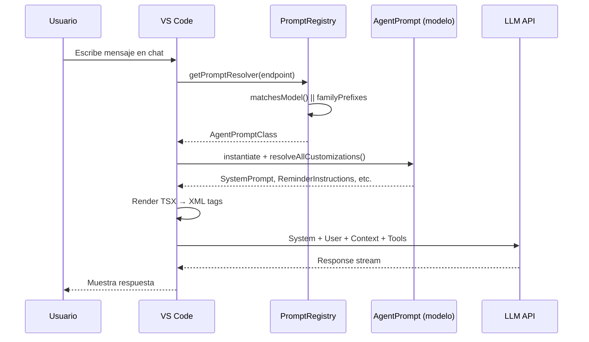

# Análisis: Flujo de Prompts en CopilotEngine

> **Épica**: SCRIPT-1.31.0  
> **Stories**: S01, S02, S03  
> **Fecha**: 2025-12-29  
> **Submódulo**: `CopilotEngine/src/extension/prompts/`

---

## S01: Análisis del PromptRegistry

### Ubicación
`src/extension/prompts/node/agent/promptRegistry.ts`

### Arquitectura

```
PromptRegistry (singleton)
├── promptsWithMatcher[]   ← Prompts con matchesModel() personalizado
└── familyPrefixList[]     ← Mapeo prefix → prompt class
```

### Interfaz Principal: `IAgentPrompt`

```typescript
interface IAgentPrompt {
  resolveSystemPrompt(endpoint: IChatEndpoint): SystemPrompt | undefined;
  resolveReminderInstructions?(endpoint: IChatEndpoint): ReminderInstructionsConstructor;
  resolveToolReferencesHint?(endpoint: IChatEndpoint): ToolReferencesHintConstructor;
  resolveCopilotIdentityRules?(endpoint: IChatEndpoint): CopilotIdentityRulesConstructor;
  resolveSafetyRules?(endpoint: IChatEndpoint): SafetyRulesConstructor;
  resolveUserQueryTagName?(endpoint: IChatEndpoint): string;
  resolveAttachmentHint?(endpoint: IChatEndpoint): string;
}
```

### Método Clave: `resolveAllCustomizations()`

```typescript
async resolveAllCustomizations(
  instantiationService: IInstantiationService,
  endpoint: IChatEndpoint,
): Promise<AgentPromptCustomizations>
```

**Flujo**:
1. `getPromptResolver(endpoint)` → Busca prompt por `matchesModel()` o `familyPrefixes`
2. Crea instancia con `instantiationService.createInstance()`
3. Resuelve cada componente o usa **defaults**:
   - `SystemPrompt` → `DefaultAgentPrompt`
   - `ReminderInstructionsClass` → `DefaultReminderInstructions`
   - `ToolReferencesHintClass` → `DefaultToolReferencesHint`
   - `CopilotIdentityRulesClass` → `CopilotIdentityRules`
   - `SafetyRulesClass` → `SafetyRules`

### Registro de Prompts

Archivo: `allAgentPrompts.ts`

```typescript
import './anthropicPrompts';
import './geminiPrompts';
import './vscModelPrompts';
import './openai/defaultOpenAIPrompt';
import './openai/gpt5Prompt';
import './openai/gpt51Prompt';
import './xAIPrompts';
```

**Orden de importación = prioridad de registro**.

---

## S02: Análisis del DefaultAgentPrompt

### Ubicación
`src/extension/prompts/node/agent/defaultAgentInstructions.tsx`

### Estructura del System Message

El prompt base está compuesto por **Tags XML**:

```tsx
<InstructionMessage>
  <Tag name='instructions'>...</Tag>
  <Tag name='toolUseInstructions'>...</Tag>
  <Tag name='editFileInstructions'>...</Tag>
  <Tag name='notebookInstructions'>...</Tag>
  <Tag name='outputFormatting'>...</Tag>
  <Tag name='mcpToolInstructions'>...</Tag>
</InstructionMessage>
```

### Componentes Clave

| Componente | Archivo | Propósito |
|------------|---------|-----------|
| `InstructionMessage` | `base/instructionMessage.tsx` | Wrapper del system message |
| `Tag` | `base/tag.tsx` | Genera `<tagName>...</tagName>` |
| `PromptElement` | `@vscode/prompt-tsx` | Base class para todos los prompts |
| `PromptSizing` | `@vscode/prompt-tsx` | Control de tamaño del prompt |

### Props del Prompt

```typescript
interface DefaultAgentPromptProps extends BasePromptElementProps {
  readonly availableTools: readonly LanguageModelToolInformation[];
  readonly modelFamily: string | undefined;
  readonly codesearchMode: boolean | undefined;
}
```

### Detección de Tools

```typescript
function detectToolCapabilities(
  availableTools: readonly LanguageModelToolInformation[]
): ToolCapabilities {
  // Retorna un mapa de ToolName → boolean
  // + hasSomeEditTool
}
```

### Tags Condicionales

El prompt **adapta su contenido** según las tools disponibles:

```tsx
{tools[ToolName.ReadFile] && <>You can use {ToolName.ReadFile}...</>}
{tools[ToolName.CoreRunInTerminal] && <>NEVER print codeblock...</>}
{!tools.hasSomeEditTool && <>You don't have edit tools...</>}
```

---

## S03: Mapeo de Prompts por Modelo

### Modelos Soportados

| Modelo | Archivo | familyPrefixes |
|--------|---------|----------------|
| **Claude** (Anthropic) | `anthropicPrompts.tsx` | `['claude']` |
| **Gemini** (Google) | `geminiPrompts.tsx` | `['gemini']` |
| **GPT-4o** | `openai/defaultOpenAIPrompt.tsx` | `['gpt-4', 'gpt-4o']` |
| **GPT-5** | `openai/gpt5Prompt.tsx` | Usa `matchesModel()` |
| **GPT-5.1** | `openai/gpt51Prompt.tsx` | Usa `matchesModel()` |
| **xAI (Grok)** | `xAIPrompts.tsx` | `['grok']` |

### Diferencias por Modelo

| Característica | Claude | GPT | Gemini |
|----------------|--------|-----|--------|
| **Keep Going Reminder** | ❌ | ✅ (OpenAI) | ❌ |
| **Extended Thinking** | ✅ (Claude 3.5+) | ❌ | ❌ |
| **ApplyPatch Tool** | Soportado | Soportado | Soportado |
| **Parallelización Tools** | Permitida | Permitida | Permitida |

### Clase OpenAI Específica

```tsx
export class DefaultOpenAIKeepGoingReminder extends PromptElement {
  async render() {
    return <>
      You are an agent - you must keep going until the user's query 
      is completely resolved, before ending your turn...
    </>;
  }
}
```

**Este reminder solo aparece en prompts de OpenAI**.

### Patrón de Herencia

```
PromptElement (base)
    ↓
DefaultAgentPrompt (default para todos)
    ↓
├── DefaultAnthropicAgentPrompt (Claude-specific)
├── DefaultGeminiAgentPrompt (Gemini-specific)
└── DefaultOpenAIAgentPrompt (OpenAI-specific)
        ↓
    ├── GPT5AgentPrompt
    └── GPT51AgentPrompt
```

---

## Librerías TypeScript Identificadas

| Librería | Uso | Importación |
|----------|-----|-------------|
| `@vscode/prompt-tsx` | Componentes JSX para prompts | `PromptElement, PromptSizing` |
| `vscode` | Language Model API | `LanguageModelToolInformation` |
| Custom: `InstructionMessage` | Wrapper system message | `../base/instructionMessage` |
| Custom: `Tag` | Generador XML tags | `../base/tag` |
| Custom: `IChatEndpoint` | Info del modelo | `platform/networking/common/networking` |

---

## Mapeo al Scriptorium

| CopilotEngine | Scriptorium | Equivalencia |
|---------------|-------------|--------------|
| `IAgentPrompt` | `.github/agents/*.agent.md` | Definición de agente |
| `familyPrefixes` | — | No aplica (single model) |
| `Tag name='instructions'` | Sección "Rol" del agente | Instrucciones base |
| `Tag name='toolUseInstructions'` | `tools: [...]` en frontmatter | Permisos de tools |
| `Tag name='reminderInstructions'` | `.github/instructions/*.instructions.md` | Contexto extra |
| `PromptRegistry` | `chat.promptFilesLocations` en settings.json | Carga de prompts |

---

## Diagrama de Secuencia (S04 - Preview)



---

## Próximos Pasos

- [x] S01: Análisis PromptRegistry ✅
- [x] S02: Análisis DefaultAgentPrompt ✅
- [x] S03: Mapeo Prompts por Modelo ✅
- [ ] S04: Diagrama Mermaid final (validar con logs)
- [ ] S05: Crear instruction `copilot-engine.instructions.md`
