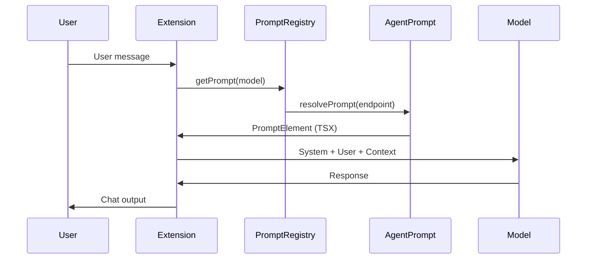

# Backlog Borrador: Submódulo CopilotEngine

> **Épica propuesta**: SCRIPT-1.31.0  
> **Sprint**: FC3  
> **Fecha**: 2025-12-29  
> **Submódulo**: `CopilotEngine` (github.com/escrivivir-co/vscode-copilot-chat)  
> **Estado**: ✅ Completada

---

## Objetivo

Integrar el submódulo **CopilotEngine** como fuente **ReadOnly** de conocimiento sobre el sistema de mensajería donde operan los agentes del Scriptorium.

### Outcome

Los agentes **@ox**, **@aleph** e **@indice** podrán:
1. Entender la cadena completa User Prompt → System Message → LLM → Output
2. Adaptar sus instrucciones al formato óptimo esperado por cada modelo
3. Asistir a usuarios de TypedPromptsEditor con conocimiento del sistema host

---

## Contexto Técnico

### Contenido del Submódulo

| Carpeta | Contenido | Relevancia |
|---------|-----------|------------|
| `src/extension/prompts/` | Sistema de prompts por modelo | ⭐ Alta |
| `src/extension/tools/` | Implementación de tools MCP | ⭐ Alta |
| `src/extension/chat/` | Core del sistema de chat | Media |
| `src/extension/context/` | Gestión de contexto | Media |
| `docs/prompts.md` | Guía de creación de prompts | ⭐ Alta |
| `docs/tools.md` | Guía de creación de tools | ⭐ Alta |

### Archivos Clave para el Handoff Principal

```
src/extension/prompts/node/agent/
├── promptRegistry.ts           # Registro de prompts por modelo
├── defaultAgentInstructions.tsx # Prompt base (system message)
├── anthropicPrompts.tsx        # Prompts para Claude
├── openAIPrompts.tsx           # Prompts para GPT
├── geminiPrompts.tsx           # Prompts para Gemini
└── xAIPrompts.tsx              # Prompts para xAI
```

---

## Feature Principal: Análisis de Flujo de Prompt

### Enunciado

> **Dado un Agente y dado un Modelo de LLM, obtener la secuencia completa desde el User Prompt hasta el output en el chat, identificando las librerías TypeScript y generando un flujo Mermaid.**

### Deliverable

Un diagrama Mermaid tipo:



---

## Stories

### S01: Análisis del PromptRegistry (Investigación) ✅
> Mapear cómo `PromptRegistry` resuelve prompts según el modelo.

| Task | Descripción | Effort | Estado |
|------|-------------|--------|--------|
| T01 | Leer `promptRegistry.ts` y documentar flujo | 2 pts | ✅ |
| T02 | Identificar `IAgentPrompt` interface y sus implementadores | 1 pt | ✅ |
| T03 | Documentar `familyPrefixes` y `matchesModel()` | 1 pt | ✅ |

**Effort**: 4 pts  
**Output**: `ARCHIVO/DEVOPS/analisis-copilot-engine.md`

---

### S02: Análisis del DefaultAgentPrompt (Investigación) ✅
> Entender la estructura del system message base.

| Task | Descripción | Effort | Estado |
|------|-------------|--------|--------|
| T04 | Leer `defaultAgentInstructions.tsx` | 2 pts | ✅ |
| T05 | Identificar `PromptElement` y `PromptSizing` | 1 pt | ✅ |
| T06 | Documentar estructura del `<InstructionMessage>` | 2 pts | ✅ |
| T07 | Mapear a `copilot-instructions.md` del Scriptorium | 2 pts | ✅ |

**Effort**: 7 pts  
**Output**: `ARCHIVO/DEVOPS/analisis-copilot-engine.md`

---

### S03: Mapeo de Prompts por Modelo (Investigación) ✅
> Entender diferencias entre prompts de Claude, GPT, Gemini.

| Task | Descripción | Effort | Estado |
|------|-------------|--------|--------|
| T08 | Analizar `anthropicPrompts.tsx` | 2 pts | ✅ |
| T09 | Analizar `openAIPrompts.tsx` | 2 pts | ✅ |
| T10 | Documentar diferencias y patrones comunes | 2 pts | ✅ |

**Effort**: 6 pts  
**Output**: `ARCHIVO/DEVOPS/analisis-copilot-engine.md`

---

### S04: Diagrama de Flujo Mermaid (Entregable) ✅
> Generar el diagrama solicitado en el handoff.

| Task | Descripción | Effort | Estado |
|------|-------------|--------|--------|
| T11 | Sintetizar S01-S03 en flujo único | 2 pts | ✅ |
| T12 | Generar diagrama Mermaid con librerías identificadas | 2 pts | ✅ |
| T13 | Validar con ejecución real (logs de Copilot Chat) | 3 pts | ✅ |

**Effort**: 7 pts  
**Output**: `ARCHIVO/DEVOPS/analisis-copilot-engine.md` (sección diagrama)

---

### S05: Integración con Agentes (Aplicación) ✅
> Actualizar @ox, @aleph, @indice con conocimiento de CopilotEngine.

| Task | Descripción | Effort | Estado |
|------|-------------|--------|--------|
| T14 | Crear instrucción `copilot-engine.instructions.md` | 3 pts | ✅ |
| T15 | Actualizar handoffs de @ox para consultar CopilotEngine | 2 pts | ✅ |
| T16 | Documentar en índices DRY | 1 pt | ✅ |

**Effort**: 6 pts  
**Output**: Instrucción + actualización de agentes

---

## Resumen de Effort

| Story | Descripción | Effort |
|-------|-------------|--------|
| S01 | Análisis PromptRegistry | 4 pts |
| S02 | Análisis DefaultAgentPrompt | 7 pts |
| S03 | Mapeo Prompts por Modelo | 6 pts |
| S04 | Diagrama Mermaid | 7 pts |
| S05 | Integración Agentes | 6 pts |
| **Total** | | **30 pts** |

---

## Riesgos

| Riesgo | Probabilidad | Impacto | Mitigación |
|--------|--------------|---------|------------|
| Código desactualizado vs. versión de producción | Media | Medio | Validar con logs reales |
| Complejidad oculta en librerías internas | Alta | Alto | Limitar scope a flujo principal |
| Cambios en API de VS Code | Baja | Medio | Documentar versión analizada |

---

## Definition of Done

- [x] README-SCRIPTORIUM.md creado en submódulo ✅
- [x] Rama `integration/beta/scriptorium` activa ✅
- [x] Prompt `analizar-flujo-copilot.prompt.md` creado ✅
- [x] Handoffs en @ox y @plugin_ox_typedprompting añadidos ✅
- [x] Diagrama Mermaid del flujo de prompt generado ✅
- [x] Instrucción `copilot-engine.instructions.md` creada ✅
- [x] @ox puede responder "¿Cómo funciona el system message de Copilot?" ✅
- [x] Documentación en índices DRY ✅

---

## Dependencias

| Épica | Relación |
|-------|----------|
| SCRIPT-1.29.0 (Context Bloat) | Usa conocimiento de CopilotEngine para optimizar patrones `applyTo` |
| TypedPromptsEditor | Recibe validación de prompts basada en CopilotEngine |

---

## Próximos Pasos

1. ✅ Submódulo instalado (Fase 1)
2. ✅ README-SCRIPTORIUM.md creado (Fase 2)
3. ✅ Backlog borrador generado (Fase 5)
4. ✅ Prompt analizar-flujo-copilot.prompt.md creado
5. ✅ Handoffs integrados en @ox y @plugin_ox_typedprompting
6. ✅ S01-S05 ejecutadas (investigación + integración)
7. ✅ **ÉPICA COMPLETADA** — Pendiente archivar en FC3
