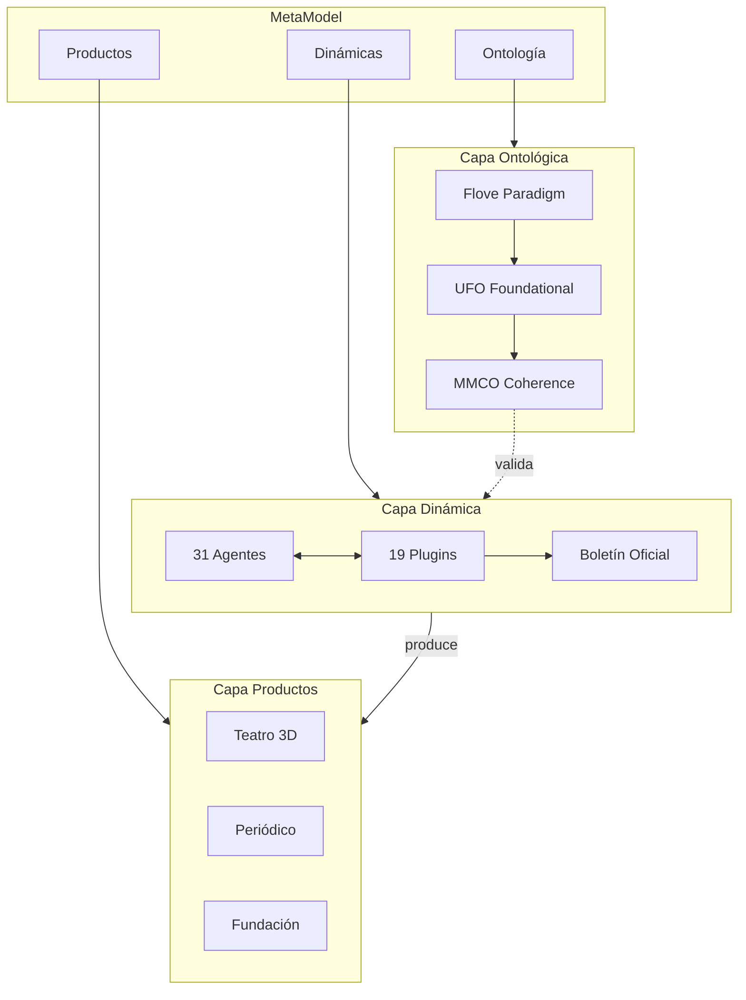

# Backlog Borrador: SCRIPT-1.25.0 — Blueprint Visual Index

> **Épica**: SCRIPT-1.25.0  
> **Feature**: New GH-Pages Index (Blueprint Visual del Scriptorium)  
> **Fecha**: 2025-12-27  
> **Estado**: ✅ CERRADA - Implementado Sprint 1 y 2 (2025-12-27)  
> **Dependencias blandas**: FLOVE_EDITOR, METAMODEL_COMPLIANCE, MMCO, HYPERGRAPH_EDITOR

---

## Objetivo

Refactorizar `docs/index.md` para presentar el Aleph Scriptorium como un **blueprint visual navegable** que muestre:

1. **MetaModel**: Estructura abstracta del sistema de producción transmedia
2. **Hypergraph (Retro Model)**: Configuración de posibilidad y coherencia
3. **Dinámicas de producción**: Flujos entre plugins, agentes y datos

---

## Justificación

El index actual es una landing page convencional. Una vez completadas las épicas de modelado ontológico (FloveEditor, OntologyEditor, MetaModel Compliance, MMCO), tendremos:

- **Ontología formal** del Scriptorium
- **Métricas de coherencia** (phi_mmco)
- **Motor de hipergrafos** para navegación

Esto permite presentar el Scriptorium no como una lista de features, sino como un **sistema modelado** cuya arquitectura es explorable.

---

## Stack Tecnológico

| Componente | Librería | Estado | Razón |
|------------|----------|--------|-------|
| Presentación 3D | **impress.js** | ✅ Instalado | Navegación espacial, ya en uso para Teatro |
| Diagramas | **Mermaid.js** | 🆕 Nuevo | Sintaxis Markdown, compatible Jekyll, diagramas estáticos |
| Estilos | CSS3 | ✅ Existente | Animaciones y transiciones |
| Interactividad | JavaScript vanilla | ✅ Existente | Sin dependencias adicionales |

---

## Épica SCRIPT-1.25.0: Blueprint Visual Index

### Sprint 1: Estructura Base

| ID | Tarea | Tipo | Prioridad | Estimación |
|----|-------|------|-----------|------------|
| T1 | Crear layout `docs/_layouts/presentation.html` para impress.js | feat | Must | 2h |
| T2 | Integrar Mermaid.js en Jekyll (`_config.yml` + include) | feat | Must | 1h |
| T3 | Diseñar estructura de 7 slides para blueprint | design | Must | 2h |
| T4 | Crear diagrama MetaModel en Mermaid | feat | Must | 2h |
| T5 | Implementar navegación por teclado (flechas + espacio) | feat | Must | 1h |
| T6 | Crear fallback noscript con contenido estático | feat | Should | 1h |
| T7 | Documentar estructura de slides en README del borrador | docs | Should | 0.5h |

**Subtotal Sprint 1**: 9.5h

### Sprint 2: Interactividad y Datos

| ID | Tarea | Tipo | Prioridad | Estimación |
|----|-------|------|-----------|------------|
| T8 | Implementar Hypergraph visual con nodos navegables | feat | Must | 4h |
| T9 | Conectar datos dinámicos desde `plugins/registry.json` | feat | Should | 2h |
| T10 | Añadir enlaces contextuales a documentación | feat | Must | 1h |
| T11 | Implementar animaciones de transición entre capas | feat | Should | 2h |
| T12 | Tests de accesibilidad WCAG 2.1 AA | test | Should | 2h |
| T13 | Crear tutorial de navegación (overlay inicial) | feat | Could | 1h |
| T14 | Optimizar carga (lazy loading de slides) | perf | Could | 1h |

**Subtotal Sprint 2**: 13h

**Total Épica**: 22.5h

---

## Estructura de Slides (impress.js)

```
                                    ┌─────────────┐
                                    │  overview   │ (z: 3000)
                                    │  Vista      │
                                    │  panorámica │
                                    └──────┬──────┘
                                           │
           ┌───────────────────────────────┼───────────────────────────────┐
           │                               │                               │
    ┌──────▼──────┐                ┌───────▼───────┐               ┌───────▼──────┐
    │  ontology   │                │     core      │               │   dynamics   │
    │   (x:-1500) │◀───────────────│   (x:0,y:0)   │───────────────▶│   (x:1500)   │
    │  Flove/UFO  │                │ Agentes+Plugin│               │    Flujos    │
    └─────────────┘                └───────┬───────┘               └──────────────┘
                                           │
           ┌───────────────────────────────┼───────────────────────────────┐
           │                               │                               │
    ┌──────▼──────┐                ┌───────▼───────┐               ┌───────▼──────┐
    │  hypergraph │                │   products    │               │     cta      │
    │   (y:1500)  │                │   (y:-1500)   │               │   (z:-1500)  │
    │  Retro Model│                │Teatro/Periódico│              │  Fork/Contrib│
    └─────────────┘                └───────────────┘               └──────────────┘
```

### Contenido por Slide

| Slide | Título | Contenido | Diagrama |
|-------|--------|-----------|----------|
| `overview` | Aleph Scriptorium | Logo + tagline + flecha "explorar" | — |
| `core` | Núcleo del Sistema | Agentes (31) + Plugins (19) + BOE | Mermaid: componentes |
| `ontology` | Capa Ontológica | Flove → UFO → MMCO | Mermaid: capas |
| `dynamics` | Flujos de Producción | DISCO → Producción → Publicación | Mermaid: flowchart |
| `hypergraph` | Configuración de Posibilidad | Nodos interconectados | Canvas/SVG interactivo |
| `products` | Productos Transmedia | Teatro, Periódico, Fundación | Grid de cards |
| `cta` | Únete | Fork + Issues + Contribute | Botones CTA |

---

## Diagrama MetaModel (Mermaid)



---

## Criterios de Aceptación

### Sprint 1
- [ ] `docs/_layouts/presentation.html` existe y funciona
- [ ] Mermaid.js renderiza diagramas en Jekyll
- [ ] 7 slides navegables con flechas de teclado
- [ ] Diagrama MetaModel visible y correcto
- [ ] Fallback noscript muestra contenido estático

### Sprint 2
- [ ] Hypergraph muestra nodos de plugins/agentes
- [ ] Click en nodo navega a documentación
- [ ] Métricas se actualizan desde registry.json
- [ ] Transiciones suaves entre slides
- [ ] Pasa tests de accesibilidad (lighthouse ≥90)

---

## Archivos a Crear/Modificar

| Archivo | Operación | Descripción |
|---------|-----------|-------------|
| `docs/_layouts/presentation.html` | Crear | Layout para impress.js |
| `docs/_includes/mermaid.html` | Crear | Include para cargar Mermaid |
| `docs/_config.yml` | Modificar | Añadir config Mermaid |
| `docs/index.md` | Reemplazar | Nuevo contenido blueprint |
| `docs/assets/css/blueprint.css` | Crear | Estilos específicos |
| `docs/assets/js/blueprint.js` | Crear | Interactividad blueprint |

---

## Riesgos y Mitigaciones

| Riesgo | Probabilidad | Impacto | Mitigación |
|--------|--------------|---------|------------|
| impress.js no funciona en móviles | Media | Alto | CSS responsive + fallback estático |
| Carga lenta por JS pesado | Baja | Medio | Lazy loading + async |
| Confusión UX por navegación 3D | Media | Medio | Tutorial inicial |
| Jekyll no procesa layout impress | Baja | Alto | Layout HTML puro + includes |
| Mermaid no renderiza en GH Pages | Baja | Medio | Pre-renderizar como SVG |

---

## Changelog

| Fecha | Cambio | Autor |
|-------|--------|-------|
| 2025-12-27 | Creación de conversación PO-SM | SM |
| 2025-12-27 | Generación de backlog borrador | SM |
| 2025-12-27 | Aprobación para backlog oficial | PO |

