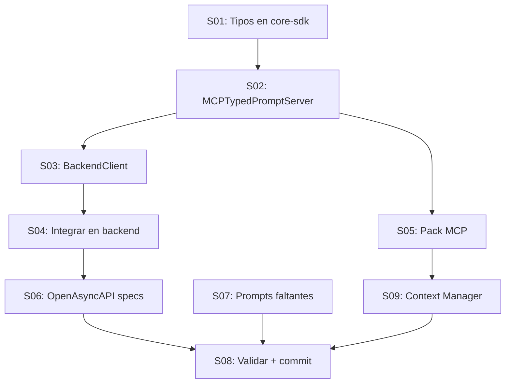

# Backlog: MCPTypedPromptEditor Refactor

> **Épica**: TYPED-MCP-1.0.0  
> **Feature**: Refactorizar TypedPromptsEditor para integrar stack MCP  
> **Sprint**: FC1/FC2  
> **Effort total**: 34 pts  
> **Estado**: 📋 Planificado  
> **Fecha**: 2026-01-04  
> **Autor**: @ox + @scrum

---

## Resumen Ejecutivo

Replicar el patrón exitoso de **PrologEditor** para crear un **MCPTypedPromptEditor** con:

1. **mcp-core-sdk/types/typed-prompts/** → Tipos compartidos DRY
2. **MCPTypedPromptServer** (mesh-sdk) → Servidor MCP para validación
3. **TypedPromptBackendClient** (mesh-sdk) → Comunicación MCP↔REST
4. **TypedPromptsEditor/backend** → REST API Gateway (ya existe)
5. **TypedPromptsEditor/frontend** → UI React (ya existe)
6. **OpenAsyncAPI specs** → Contratos publicados en catálogo

### Patrón a replicar (de PrologEditor)

```
MCPTypedPromptServer ←HTTP→ TypedPromptBackendClient ←REST→ Backend Express ←React→ UI
       :30XX                  (nuevo en mesh-sdk)            :3019              :3019
```

---

## Contexto Arquitectónico

### Artefactos que ya son TypedPrompts

| Artefacto | Ubicación | ¿Es TypedPrompt? |
|-----------|-----------|------------------|
| `AgentPrologBrain.pack.json` | `mcp-presets/packs/` | ✅ Sí (inputSchema JSON Schema) |
| `mcp-core-sdk/types/prolog/` | MCPGallery | ✅ Sí (interfaces TypeScript) |
| `PrologBackendClient.ts` | mesh-sdk/clients | ✅ Sí (contratos tipados) |
| `TypedPromptsEditor/shared/schema.ts` | submódulo | ✅ Sí (Zod + Drizzle) |
| `OpenAPI/AsyncAPI specs` | OPENASYNCAPI_EDITOR | ✅ Sí (contratos formales) |

### Brechas identificadas

| Brecha | Impacto | Solución |
|--------|---------|----------|
| shared/schema.ts no está en mcp-core-sdk | No hay DRY entre proyectos | Mover a core-sdk |
| No existe MCPTypedPromptServer | Sin capa MCP | Crear en mesh-sdk |
| No existe TypedPromptBackendClient | Sin puente MCP↔REST | Crear en mesh-sdk |
| Backend Express no tiene cliente MCP | Comunicación directa | Añadir MCPTypedPromptClient |
| No hay spec OpenAPI/AsyncAPI | Sin contratos formales | Generar y publicar |

---

## Stories y Tasks

### Epic Structure

| # | Story | Nombre | Effort | Deps | Estado |
|---|-------|--------|--------|------|--------|
| S01 | Tipos compartidos en mcp-core-sdk | 5 pts | — | ⏳ |
| S02 | MCPTypedPromptServer en mesh-sdk | 8 pts | S01 | ⏳ |
| S03 | TypedPromptBackendClient en mesh-sdk | 3 pts | S02 | ⏳ |
| S04 | Integrar cliente en backend Express | 3 pts | S03 | ⏳ |
| S05 | Crear MCP Pack TypedPromptEditor | 3 pts | S02 | ⏳ |
| S06 | Publicar specs en OpenAsyncAPI | 5 pts | S04 | ⏳ |
| S07 | Completar prompts faltantes (plugin) | 2 pts | — | ⏳ |
| S08 | Validar con @indice + commit | 2 pts | all | ⏳ |
| S09 | Consolidar Context Manager (2.1.0) | 3 pts | S05 | ⏳ |

**Total**: 34 pts

---

## S01: Tipos compartidos en mcp-core-sdk (5 pts)

**Objetivo**: Mover/crear tipos de TypedPromptsEditor a `mcp-core-sdk/src/types/typed-prompts/`

| Task | Descripción | Archivo | Effort |
|------|-------------|---------|--------|
| T01 | Crear directorio `types/typed-prompts/` | mcp-core-sdk | 0.5 |
| T02 | Migrar `Schema`, `Library`, `ValidationHistory` | index.ts | 1 |
| T03 | Crear `ValidationRequest`, `ValidationResponse` | index.ts | 1 |
| T04 | Crear `AIConfig`, `StoredPrompt` types | index.ts | 1 |
| T05 | Exportar desde `types/index.ts` barrel | index.ts | 0.5 |
| T06 | Actualizar TypedPromptsEditor para importar de core-sdk | shared/schema.ts | 1 |

**Archivos a crear**:
```
MCPGallery/mcp-core-sdk/src/types/
├── typed-prompts/
│   └── index.ts          ← NUEVO (migrar de shared/schema.ts)
└── index.ts              ← ACTUALIZAR exports
```

**Tipos a definir**:
```typescript
// Schema validation types
export interface Schema { ... }
export interface InsertSchema { ... }
export interface Library { ... }
export interface ValidationHistory { ... }
export interface ValidationReport { valid: boolean; errors: ValidationError[] }

// API request/response types
export interface ValidateMessageRequest { schemaId: number; message: string }
export interface ValidateMessageResponse { valid: boolean; report: ValidationReport }
export interface ConvertInterfaceRequest { typescript: string }
export interface ConvertInterfaceResponse { jsonSchema: string }

// AI configuration types
export interface AIConfig { provider: string; apiKey?: string; models: string[] }
export interface StoredPrompt { name: string; content: string; schemaId?: number }
```

---

## S02: MCPTypedPromptServer en mesh-sdk (8 pts)

**Objetivo**: Crear servidor MCP que exponga capacidades de TypedPrompting

| Task | Descripción | Archivo | Effort |
|------|-------------|---------|--------|
| T07 | Crear `MCPTypedPromptServer.ts` (scaffold) | mesh-sdk/src | 2 |
| T08 | Implementar tools (validate, convert, etc.) | MCPTypedPromptServer.ts | 2 |
| T09 | Implementar resources (schemas, libraries) | MCPTypedPromptServer.ts | 1 |
| T10 | Implementar prompts (study-case, suggest) | MCPTypedPromptServer.ts | 1 |
| T11 | Crear config `DEFAULT_TYPED_PROMPT_SERVER_CONFIG` | configs/ | 0.5 |
| T12 | Añadir al npm scripts | package.json | 0.5 |
| T13 | Tests unitarios básicos | tests/ | 1 |

**Tools a implementar** (basado en shared/schema.ts + backend routes):

| Tool | Descripción | Input Schema |
|------|-------------|--------------|
| `typed_validate_message` | Validar mensaje contra schema | `{schemaId, message}` |
| `typed_convert_interface` | TS interface → JSON Schema | `{typescript}` |
| `typed_list_schemas` | Listar schemas disponibles | `{libraryId?}` |
| `typed_create_schema` | Crear nuevo schema | `{name, typescript, jsonSchema}` |
| `typed_get_schema` | Obtener schema por ID | `{schemaId}` |
| `typed_list_libraries` | Listar bibliotecas | `{}` |
| `typed_suggest_ontology` | Sugerir ontología por caso de uso | `{useCase}` |

**Resources a implementar**:

| Resource | URI Pattern | MIME Type |
|----------|-------------|-----------|
| schemas | `typed-prompt://schemas/{id}` | application/json |
| libraries | `typed-prompt://libraries/{id}` | application/json |
| validation-history | `typed-prompt://history/{schemaId}` | application/json |

**Prompts a implementar**:

| Prompt | Descripción | Arguments |
|--------|-------------|-----------|
| `study_case` | Analizar caso de uso | `{context, requirements}` |
| `suggest_ontology` | Sugerir ontología existente | `{domain, constraints}` |
| `install_in_agent` | Guía para instalar en agente | `{agentId, schemaId}` |

---

## S03: TypedPromptBackendClient en mesh-sdk (3 pts)

**Objetivo**: Cliente HTTP para conectar MCPTypedPromptServer con backend REST

| Task | Descripción | Archivo | Effort |
|------|-------------|---------|--------|
| T14 | Crear `TypedPromptBackendClient.ts` | clients/ | 1.5 |
| T15 | Implementar métodos CRUD schemas | TypedPromptBackendClient.ts | 0.5 |
| T16 | Implementar métodos validación | TypedPromptBackendClient.ts | 0.5 |
| T17 | Exportar desde `clients/index.ts` | index.ts | 0.5 |

**Patrón**: Copia de `PrologBackendClient.ts` adaptado a TypedPrompting

```typescript
export class TypedPromptBackendClient {
  constructor(config: { baseUrl: string }) { ... }
  
  // Schema CRUD
  async getAllSchemas(): Promise<Schema[]>
  async getSchema(id: number): Promise<Schema>
  async createSchema(input: InsertSchema): Promise<Schema>
  
  // Validation
  async validateMessage(schemaId: number, message: string): Promise<ValidationReport>
  
  // Libraries
  async getAllLibraries(): Promise<Library[]>
  
  // Health
  async isHealthy(): Promise<boolean>
}
```

---

## S04: Integrar cliente en backend Express (3 pts)

**Objetivo**: El backend de TypedPromptsEditor puede invocar MCPTypedPromptServer

| Task | Descripción | Archivo | Effort |
|------|-------------|---------|--------|
| T18 | Crear servicio `mcp-typed-client.ts` | backend/services/ | 1 |
| T19 | Importar `BaseMCPClient` de core-sdk | package.json deps | 0.5 |
| T20 | Crear endpoint `/api/mcp/validate` | routes/ | 0.5 |
| T21 | Crear endpoint `/api/mcp/suggest` | routes/ | 0.5 |
| T22 | Actualizar rutas existentes para usar cliente MCP opcional | routes/*.ts | 0.5 |

**Cambio en arquitectura**:
```
ANTES:  UI → Backend Express → (validación local)
DESPUÉS: UI → Backend Express → MCPTypedPromptServer → (validación MCP)
                              ↓
                        (fallback local si MCP no disponible)
```

---

## S05: Crear MCP Pack TypedPromptEditor (3 pts)

**Objetivo**: Pack tipado similar a AgentPrologBrain

| Task | Descripción | Archivo | Effort |
|------|-------------|---------|--------|
| T23 | Crear `TypedPromptEditor.pack.json` | mcp-presets/packs/ | 1 |
| T24 | Definir 7 tools con inputSchema | pack.json | 1 |
| T25 | Definir 3 resources | pack.json | 0.5 |
| T26 | Definir 3 prompts | pack.json | 0.5 |

**Archivo a crear**:
```json
{
  "$schema": "../schemas/pack.schema.json",
  "id": "TypedPromptEditor",
  "name": "TypedPrompt Editor Pack",
  "version": "1.0.0",
  "description": "Pack para diseño y validación de ontologías tipadas",
  "mcpServer": {
    "id": "typed-prompt-mcp-server",
    "port": 3020,
    "source": "MCPGallery/mcp-mesh-sdk",
    "startCommand": "npm run start:typed-prompt"
  },
  "tools": [ ... ],
  "resources": [ ... ],
  "prompts": [ ... ]
}
```

---

## S06: Publicar specs en OpenAsyncAPI (5 pts)

**Objetivo**: Generar y catalogar contratos formales

| Task | Descripción | Archivo | Effort |
|------|-------------|---------|--------|
| T27 | Generar `openapi.yaml` desde backend routes | specs/TypedPromptsEditor/ | 2 |
| T28 | Generar `asyncapi.yaml` si hay WebSocket | specs/TypedPromptsEditor/ | 1 |
| T29 | Generar `mcpspec.yaml` desde pack | specs/TypedPromptsEditor/ | 1 |
| T30 | Añadir al `catalog.json` | OPENASYNCAPI_EDITOR/ | 0.5 |
| T31 | Crear `INDEX.md` con use cases | specs/TypedPromptsEditor/ | 0.5 |

**Entradas al catálogo**:
```json
{
  "id": "typed-prompt-editor-openapi",
  "project": "TypedPromptsEditor",
  "type": "openapi",
  "title": "TypedPromptsEditor REST API"
},
{
  "id": "typed-prompt-editor-mcpspec",
  "project": "TypedPromptsEditor", 
  "type": "mcpspec",
  "title": "MCPTypedPromptServer Spec"
}
```

---

## S07: Completar prompts faltantes (plugin) (2 pts)

**Objetivo**: Los 2 prompts declarados en manifest que no existen

| Task | Descripción | Archivo | Effort |
|------|-------------|---------|--------|
| T32 | Crear `sugerir-ontologia.prompt.md` | typed-prompting/prompts/ | 1 |
| T33 | Crear `instalar-en-flujo-arg.prompt.md` | typed-prompting/prompts/ | 1 |

---

## S08: Validar con @indice + commit (2 pts)

| Task | Descripción | Effort |
|------|-------------|--------|
| T34 | Actualizar Tecnico.md con nueva arquitectura | 0.5 |
| T35 | Actualizar Funcional.md con nuevas capacidades | 0.5 |
| T36 | Commit de todo el trabajo | 0.5 |
| T37 | Actualizar BACKLOG-SCRIPTORIUM.md | 0.5 |

---

## S09: Consolidar Context Manager (2.1.0) (3 pts)

**Objetivo**: Unificar con SCRIPT-2.1.0 de Diciembre_29

| Task | Descripción | Effort |
|------|-------------|--------|
| T38 | Crear `context-request.schema.json` usando nuevos tipos | 1 |
| T39 | Implementar @indice.resolverFoco() con MCPTypedPromptServer | 1 |
| T40 | Documentar integración en auto-reflexion.instructions.md | 1 |

---

## Dependencias entre Stories



---

## Estimación por Sprint

| Sprint | Stories | Effort | Objetivo |
|--------|---------|--------|----------|
| FC1-W1 | S01, S07 | 7 pts | Tipos core + prompts plugin |
| FC1-W2 | S02 | 8 pts | MCPTypedPromptServer |
| FC1-W3 | S03, S04 | 6 pts | Cliente + integración backend |
| FC1-W4 | S05, S06 | 8 pts | Pack + specs |
| FC2-W1 | S08, S09 | 5 pts | Validación + Context Manager |

---

## Métricas de Éxito

| Métrica | Antes | Después | Mejora |
|---------|-------|---------|--------|
| Tipos duplicados | 3 copias | 1 (core-sdk) | DRY |
| Líneas shared/schema.ts | 268 | 0 (importa core-sdk) | -268 |
| Servidores MCP | 0 | 1 (MCPTypedPromptServer) | +1 |
| Specs en catálogo | 0 | 2-3 | +2 |
| Prompts en plugin | 2/4 | 4/4 | 100% |

---

## Referencias

| Documento | Propósito |
|-----------|-----------|
| [Diciembre_29_TypedPrompting_ContextManager](../Diciembre_29_TypedPrompting_ContextManager/) | Context Manager original |
| [Enero_02_PrologAgentPack](../Enero_02_PrologAgentPack/) | Patrón a replicar |
| [02_guia-arquitectura.md](02_guia-arquitectura.md) | Arquitectura actual |
| [03_plan-integracion-upgrade.md](03_plan-integracion-upgrade.md) | Plan integración original |
| [MCPPrologServer.ts](../../../../MCPGallery/mcp-mesh-sdk/src/MCPPrologServer.ts) | Ejemplo servidor MCP |
| [PrologBackendClient.ts](../../../../MCPGallery/mcp-mesh-sdk/src/clients/PrologBackendClient.ts) | Ejemplo cliente |

---

## Changelog

| Fecha | Cambio | Autor |
|-------|--------|-------|
| 2026-01-04 | Creación backlog inicial (34 pts, 9 stories, 40 tasks) | @ox + @scrum |
