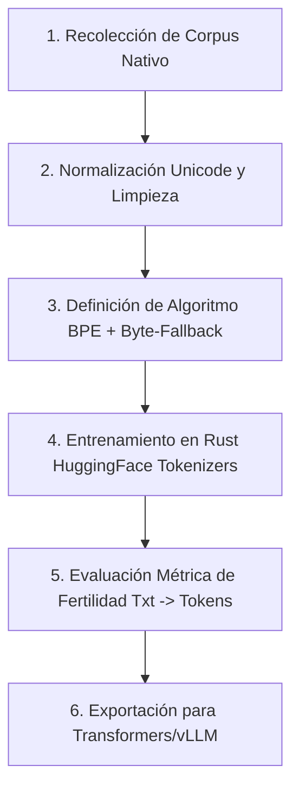

# Informe Ejecutivo: Estrategia y Desarrollo de Tokenizador para Lengua Minoritaria

> [!NOTE]
> **Objetivo del Informe:** Proporcionar un marco conceptual, histórico y procedimental para el desarrollo de un tokenizador nativo dirigido a una lengua minoritaria. Esto es un paso fundamental para la integración del idioma en las arquitecturas modernas de Modelos de Lenguaje Grande (LLMs).

---

## 1. Ficha Histórica y Estado del Arte (State of the Art)

Para entender hacia dónde debemos llevar nuestro tokenizador, es vital comprender la evolución de las herramientas actuales en los idiomas más representados, así como en las arquitecturas más modernas.

### 1.1. Inglés
*El idioma pionero en el Procesamiento de Lenguaje Natural (NLP), que ha dictado el estándar de la industria.*

*   **Historia:** 
    *   *Primera generación:* Basada en reglas y expresiones regulares (e.g., separar por espacios y puntuación usando herramientas como NLTK).
    *   *Segunda generación:* Modelos a nivel de palabra completa (Word-level), que presentaban problemas de "Vocabulario Fuera de Rango" (OOV - *Out Of Vocabulary*).
    *   *Tercera generación:* Subpalabras (Subword tokenization). Algoritmos como **WordPiece** (usado en BERT) y **BPE** (Byte Pair Encoding, introducido con GPT-2).
*   **Estado del Arte (SotA):**
    *   Actualmente domina el **Byte-Level BPE** (BBPE). Herramientas como `tiktoken` de OpenAI (usado en GPT-4) manejan vocabularios masivos (ej. 100k+ tokens).
    *   Al trabajar a nivel de bytes, se asegura que **ninguna palabra quede fuera de vocabulario** (no existe el token `<UNK>`).
    *   Logra tasas de compresión extremadamente altas en inglés, permitiendo enviar más palabras en una misma ventana de contexto de manera muy barata.

### 1.2. Español
*Un idioma morfológicamente rico (flexión de género, número, conjugaciones verbales) que inicialmente sufrió al adaptarse a herramientas diseñadas para inglés.*

*   **Historia:**
    *   Originalmente, se utilizaban tokenizadores multilingües (como mBERT o XLM-R) o herramientas clásicas adaptadas (FreeLing, spaCy).
    *   Los tokenizadores multilingües iniciales sub-representaban el español, provocando que palabras comunes se partieran en demasiados fragmentos ("sobre-fragmentación" o alta *fertilidad*), encareciendo el coste de inferencia.
    *   Surgieron esfuerzos nativos como **BETO** (Spanish BERT) que entrenaron WordPiece exclusivamente sobre corpus en español para mejorar la compresión morfológica.
*   **Estado del Arte (SotA):**
    *   El estándar actual es el **BPE multilingüe balanceado**. Modelos recientes como Llama 3 (vocabulario de 128k) han incrementado masivamente la porción del vocabulario dedicada al español, logrando una eficiencia de compresión casi idéntica a la del inglés.
    *   El uso de *SentencePiece* (que procesa el texto en crudo sin pre-tokenización por espacios) ha solucionado gran parte de los problemas con las tildes y caracteres especiales (ñ, ü).

### 1.3. Jamba / Mamba (Modelos de Espacio de Estados - SSM)
*Las arquitecturas emergentes que desafían al Transformer tradicional por su eficiencia en contextos infinitos.*

*   **Contexto (Mamba/SSM):** A diferencia de los Transformers (que usan atención cuadrática), Mamba procesa secuencias de manera lineal, permitiendo ventanas de contexto teóricamente ilimitadas con bajo coste computacional. Sin embargo, **aún requieren tokenización** de entrada.
*   **Tokenizador de Jamba (AI21 Labs):** Jamba es una arquitectura híbrida (Mamba + Transformer). 
    *   *Algoritmo:* Utiliza **BPE** clásico.
    *   *Vocabulario:* Tamaño optimizado de **64K tokens** (65,536).
    *   *Particularidades:* Destaca por tratar **cada dígito numérico como un token separado** (ej. "1984" -> "1", "9", "8", "4"). Esta convención ha demostrado mejorar radicalmente las capacidades de razonamiento matemático del modelo.
    *   *Estado del Arte:* Su tokenizador está intrínsecamente diseñado para maximizar el uso de su enorme ventana de contexto nativa de **256K**, manteniendo un equilibrio entre el tamaño del vocabulario (para evitar matrices de *embeddings* excesivamente grandes en memoria) y la capacidad expresiva.

---

## 2. Informe Procedimental: Decisiones y Convenciones

Para construir un tokenizador para una lengua minoritaria, el equipo debe seguir un flujo de trabajo riguroso y tomar decisiones arquitectónicas críticas.

> [!IMPORTANT]  
> La mala calidad de un tokenizador puede arruinar el rendimiento de un LLM. Si la lengua minoritaria se sobre-fragmenta (muchos tokens para una sola palabra), el modelo perderá la capacidad de entender el contexto a largo plazo y la inferencia será ineficiente.

### 2.1. Recopilación y Preparación del Corpus
Antes de entrenar el algoritmo, se necesita un conjunto de datos representativo.
1.  **Tamaño y Calidad:** El tamaño del corpus no necesita ser masivo para entrenar el tokenizador (1GB - 5GB de texto limpio es suficiente), pero debe abarcar todas las variedades dialectales, registros formales/informales y vocabulario técnico.
2.  **Normalización (Pre-tokenización):** Definir reglas estrictas sobre el tratamiento de mayúsculas/minúsculas (¿se unifican?), puntuación específica del idioma y caracteres diacríticos. Se recomienda usar la normalización **NFKC** de Unicode.

### 2.2. Decisiones Arquitectónicas del Equipo
El equipo técnico deberá consensuar los siguientes puntos:

*   **Elección del Algoritmo:**
    *   *(Recomendado)* **BPE con Byte-Fallback**: Es el estándar de la industria (usado por Llama, Mistral, OpenAI). Garantiza que si aparece un carácter de otro alfabeto no visto en el entrenamiento, se codificará en bytes en lugar de arrojar el error `<UNK>` (desconocido).
*   **Tamaño del Vocabulario (Vocab Size):**
    *   Para una lengua minoritaria pura, un tamaño entre **16,000 y 32,000 tokens** es óptimo. Si se va a hacer un modelo bilingüe (Lengua minoritaria + Inglés o Español), se sugiere subir a **64,000 tokens** (similar a Jamba). Un tamaño mayor inflaría innecesariamente los parámetros del modelo.
*   **Convenciones Numéricas y de Espaciado:**
    *   *Dígitos:* Adoptar la convención de **separar dígitos individualmente** (como Jamba o Llama 3) para futuras aplicaciones lógicas y matemáticas.
    *   *Espacios:* Utilizar el prefijo metacaracterístico de SentencePiece (generalmente el guion bajo `_` o ` `) para tratar los espacios como parte integral de la palabra, lo que permite la reconstrucción perfecta del texto (*detokenization lossless*).
*   **Tokens Especiales (Control Tokens):**
    *   Definir el listado exacto de tokens de sistema: `<s>` (Inicio), `</s>` (Fin), `<pad>` (Relleno), `<unk>` (Desconocido, aunque idealmente evitado con byte-fallback), y tokens de estructuración de chat si aplica (ej. `<|user|>`, `<|assistant|>`).

### 2.3. Flujo de Trabajo (Workflow)

---

## 3. Exportación Final e Integración

Para asegurar que el tokenizador sea compatible con las herramientas actuales de entrenamiento e inferencia (Hugging Face `transformers`, `vLLM`, `llama.cpp`), el equipo debe seguir un estándar de exportación estricto.

### 3.1. Herramienta de Entrenamiento
El entrenamiento debe realizarse utilizando la librería de código abierto **`tokenizers`** de Hugging Face (escrita en Rust por rendimiento) o **`sentencepiece`** (de Google).

### 3.2. Formato de Exportación
El directorio final del tokenizador exportado debe contener los siguientes artefactos obligatorios:

1.  `tokenizer.json`: El archivo principal (estándar de Hugging Face Fast Tokenizer) que contiene todo el árbol del vocabulario, los *merges* de BPE y la configuración del pre-tokenizador.
2.  `tokenizer_config.json`: Define metadatos de alto nivel, la clase asociada (ej. `PreTrainedTokenizerFast`), y los mapeos de los tokens especiales.
3.  `special_tokens_map.json`: Mapeo explícito para que el software sepa cuál es el token de inicio (BOS), fin (EOS) o relleno (PAD).
4.  *(Opcional/Legacy)* `vocab.json` y `merges.txt`: Necesarios si se quiere mantener retrocompatibilidad estricta con código GPT-2 antiguo, aunque `tokenizer.json` suele consolidarlos.

### 3.3. Prueba de Humo (Smoke Test) Final
Antes de dar el tokenizador por válido para el entrenamiento del LLM, el equipo debe ejecutar un script en Python (vía `transformers`) para verificar dos métricas:
1.  **Paridad de Reconstrucción:** `decode(encode(texto)) == texto`. No debe perderse ningún espacio ni carácter ortográfico.
2.  **Puntuación de Fertilidad (Fertility Score):** Cuántos tokens se generan por palabra de media en la lengua minoritaria. El objetivo debe ser acercarse a una relación de **1.1 a 1.5 tokens por palabra**. Si el número es 2.5 o superior, el vocabulario es demasiado pequeño o no representó bien la morfología de la lengua.

> [!TIP]
> **Integración Rápida:** Al exportar bajo el ecosistema Hugging Face, el tokenizador podrá cargarse en cualquier proyecto simplemente con `AutoTokenizer.from_pretrained("./mi-tokenizador-lengua-minoritaria")`, democratizando inmediatamente el acceso a investigadores de la comunidad.
