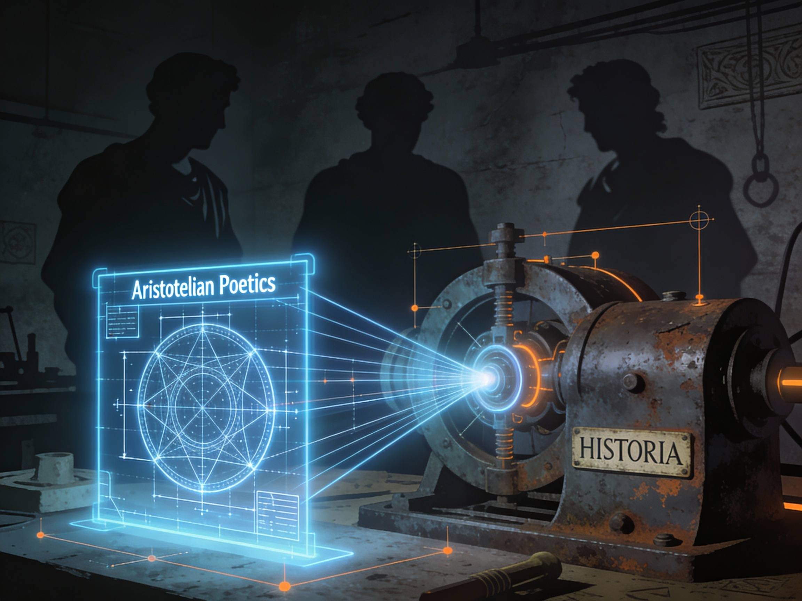

# Poesía como vías alternativas: Aristóteles, Nietzsche y la máquina de futuros

> **Código**: `S08-T031`
> **Fecha**: 2025-12-21
> **Categoría**: poesia / vias-alternativas
> **Fuentes**: 01_gnoseología.md, 02_tragedia.md, 03_gobierno.md, 04_dialectica_retorica.md, 05_metodo.Induccion_y_silogismo.md, 06_estilo.md
> **Perfil recomendado**: Orangeflag (Interlocución y Estilo)
> **Conversación**: `DISCO/Diciembre_25_Poesía_como_vias_alternativas.md/conversacion.md`

---

## Los Hechos (5W)

**WHO (¿Quién?)**
Aristóteles (384-322 a.C.) como sistematizador de la racionalidad occidental, en tensión con Gustavo Bueno (1980) y Nietzsche (1872). No como autoridad muerta, sino como arquitecto de un "marco de expresión" que distingue tres usos del logos: **Poética** (construcción de verosimilitud), **Retórica** (persuasión cívica) y **Dialéctica** (examen crítico).

**WHAT (¿Qué?)**
Se recupera la distinción aristotélica entre **Poesía e Historia** (Poética 1451b) como herramienta política. Mientras la Historia narra "lo que ha ocurrido" (lo particular, lo cerrado), la Poesía explora "lo que podría ocurrir" (lo universal, lo posible). Se propone usar la Poética no como estética, sino como **tecnología de futuros**: un mecanismo para formular "pasados bloqueados" o "futuros cancelados" con rigor estructural, sin quedar atrapados en la crónica de lo fáctico.

**WHERE (¿Dónde?)**
En el cruce entre la filosofía de la ciencia (gnoseología), la teoría política (formas de gobierno) y la técnica discursiva. Es el territorio donde se decide qué cuenta como "racionalidad política" y qué se descarta como "mera literatura".

**WHEN (¿Cuándo?)**
El marco se activa hoy, ante la crisis de imaginación política ("lo tardío"). Cuando la Historia se vuelve una cárcel de hechos consumados, la Poética aristotélica ofrece la llave para reabrir el repertorio de lo posible.

**WHY (¿Por qué?)**
Porque la "posverdad" y la "fractura del mundo común" (ejes de Justificación) son patologías del logos. Aristóteles ofrece el antídoto: distinguir el uso legítimo (retórica/dialéctica) del ilegítimo (sofística), y recordar que la verdad política no es un dato, sino una construcción verosímil y compartida.

---

## El Análisis

### 🔵 Verdad (Blueflag)
La propuesta supera el test de falsificabilidad al ofrecer criterios claros de demarcación. No se trata de "inventar" pasados, sino de modelar **universales posibles**. La distinción Poesía/Historia no es ficción/realidad, sino **necesidad/contingencia**. Una propuesta política es "verdadera" en sentido poético si su trama es coherente y necesaria, aunque históricamente no haya triunfado.

### ⚫ Poder (Blackflag)
El bloqueo de futuros alternativos no es accidental; es un dispositivo de poder. El "régimen de lo tardío" utiliza la Historia (lo que pasó) para censurar la Poesía (lo que podría pasar). Recuperar la Poética es un acto de **insubordinación institucional**: es disputar el derecho a definir qué es "realista". El enemigo es la reducción de la política a mera gestión de lo dado (crónica).

### 🔴 Material (Redflag)
La viabilidad de esta operación depende de traducir los conceptos aristotélicos en **herramientas de producción**.
1. **Matriz de Gobierno**: El patrón concentración/alejamiento (uno/pocos/muchos) sirve como checklist de diseño institucional.
2. **Tecnología de Argumentación**: El uso consciente de silogismos (para examinar) y entimemas (para persuadir) optimiza el recurso escaso de la atención pública.
3. **Escala**: El modelo escala desde la micro-política hasta la constitución estatal.

### 🟠 Registro (Orangeflag)
Este análisis inaugura la función del agente **Orangeflag**. Su tarea no es auditar el contenido, sino la **forma**.
- **Modo**: ¿Estamos examinando (dialéctica) o persuadiendo (retórica)?
- **Auditorio**: ¿Hablamos a expertos (silogismo) o a una asamblea plural (entimema)?
- **Estilo**: ¿Cumplimos las virtudes de claridad, corrección, propiedad y elevación?
Sin esta auditoría, la verdad (Blue), el poder (Black) y la viabilidad (Red) se pierden en la ineficacia comunicativa.

---

## Tesis

**La Poesía es la ingeniería inversa de la Historia.**

Lejos de ser un refugio estético, la *Poética* de Aristóteles es el manual para **des-coherenciar** la realidad dada. Si la Retórica gestiona la "decoherencia" (el colapso de la posibilidad en la realidad sucia de la asamblea), la Poética sostiene la **coherencia de lo posible**.

Para el proyecto de 2026, esto implica un método de trabajo:
1. **Fase Poética**: Diseñar las instituciones del futuro recuperando "líneas de vida" canceladas, tratándolas como universales coherentes (no como fracasos históricos).
2. **Fase Dialéctica**: Examinar su solidez interna mediante silogismos y pruebas de resistencia (auditores).
3. **Fase Retórica**: Traducir esas arquitecturas al lenguaje de la asamblea (entimema, pathos) para disputar la hegemonía.

El "territorio ignoto" que perseguimos más allá de Enero no está en el mapa de lo que existe, sino en el mapa de lo que, según las leyes de la necesidad y la verosimilitud, *debería* poder existir.

---

## Para profundizar

- **Conversación completa**: `DISCO/Diciembre_25_Poesía_como_vias_alternativas.md/conversacion.md`
- **Fuentes originales**: `DISCO/Diciembre_25_Poesía_como_vias_alternativas.md/`
- **Nuevo Agente**: `.github/agents/orangeflag.agent.md`