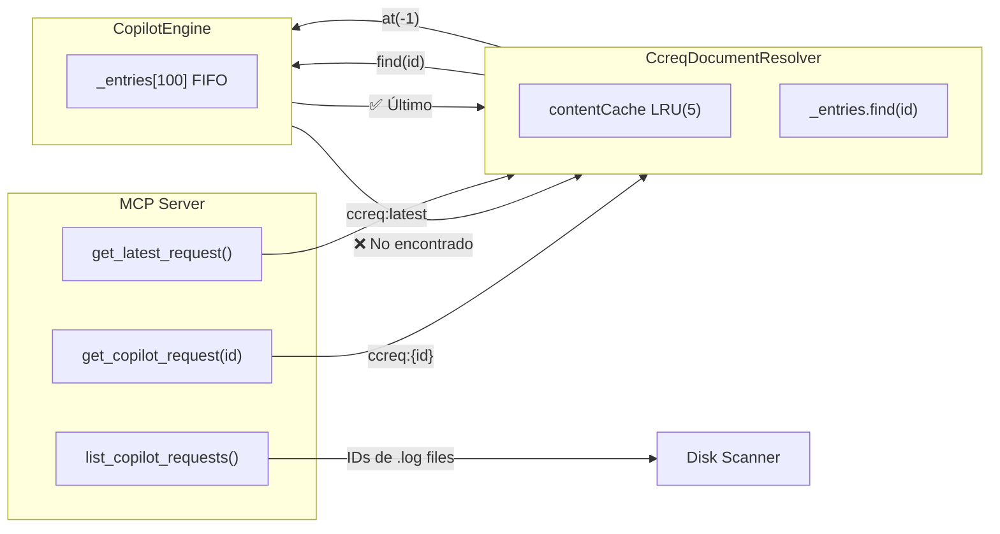
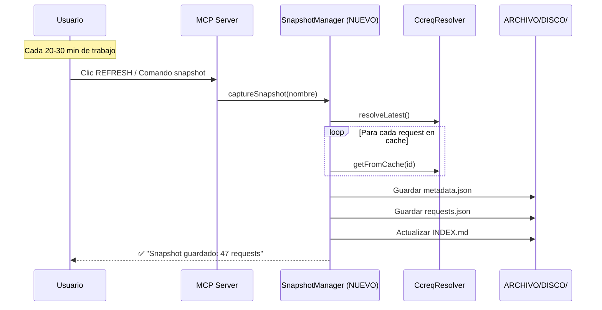
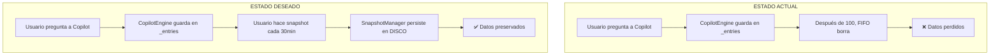
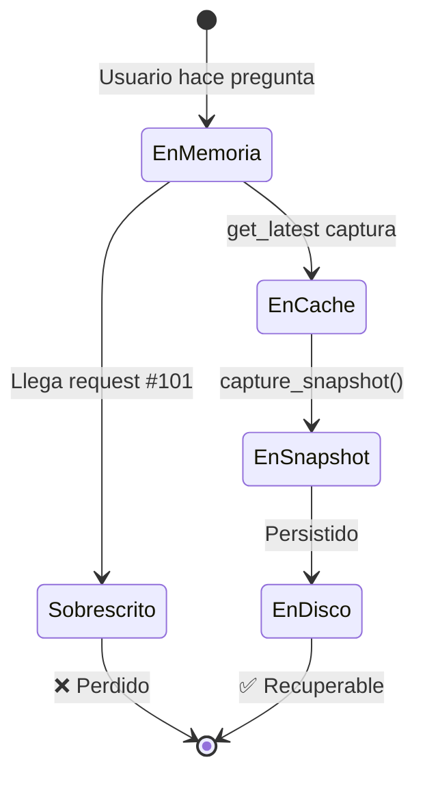

# Chuletario Técnico: FEATURE-SNAPSHOTS-1.0.0

> **Audiencia**: Equipo de Desarrollo  
> **Propósito**: Referencia rápida DRY para implementación  
> **Épica**: FEATURE-SNAPSHOTS-1.0.0  
> **Fuente de Verdad**: [09_validacion_scriptorium_team.md](../../DISCO/BACKLOG_BORRADORES/Enero_2026_CopilotLogsMCP_Bug/09_validacion_scriptorium_team.md)

---

## 1. El Problema (Root Cause)

### Síntoma
```
get_copilot_request("104256da") → ❌ "Request not found"
get_latest_request()           → ✅ Funciona
```

### Causa Raíz (CopilotEngine)

```typescript
// CopilotEngine/src/extension/prompt/vscode-node/requestLoggerImpl.ts

// L240: Array efímero en memoria
private readonly _entries: LoggedInfo[] = [];

// L385-399: FIFO con límite 100
private async _addEntry(entry: LoggedInfo): Promise<boolean> {
    this._entries.push(entry);
    const maxEntries = this._configService.getConfig(ConfigKey.Advanced.RequestLoggerMaxEntries);
    if (this._entries.length > maxEntries) {
        this._entries.shift();   // ← Elimina el más antiguo
    }
}
```

### Configuración por Defecto
```json
// CopilotEngine/package.json L3625
"github.copilot.chat.debug.requestLogger.maxEntries": {
    "default": 100
}
```

---

## 2. Mapa de Arquitectura Existente

```
VsCodeExtension/src/copilotLogs/
├── CopilotLogsMCPServer.ts      # Servidor MCP (10 tools)
├── CcreqDocumentResolver.ts     # Resolver URI ccreq:* + Cache LRU(5)
├── CopilotLogExporterService.ts # Exportación a formatos
├── CopilotMetricsPanelProvider.ts # Panel de métricas (WebView)
├── DiskLogScanner.ts            # Escanea logs .log en disco
├── commands.ts                  # 15+ comandos registrados
└── index.ts                     # Exports
```

### Flujo Actual (Roto)



**Problema**: `find(id)` busca en `_entries[]`, que solo contiene ~100 últimos. Los IDs listados de disco NO están en memoria.

---

## 3. Solución Aprobada: Sistema de Snapshots

### Principio Arquitectónico
> **No podemos cambiar CopilotEngine** → Capturamos proactivamente lo que SÍ está disponible

### Flujo Propuesto



---

## 4. Componentes a Implementar

### 4.1 SnapshotManager.ts (NUEVO)

```typescript
// VsCodeExtension/src/copilotLogs/SnapshotManager.ts

interface SnapshotMetadata {
    id: string;           // "2026-01-01_14-30_fundacion"
    name: string;         // "fundacion-cap3"
    createdAt: string;    // ISO timestamp
    requestCount: number;
    linkedBacklog?: string;
}

interface Snapshot {
    metadata: SnapshotMetadata;
    requests: CcreqDocumentContent[];
}

export class SnapshotManager {
    constructor(
        private resolver: CcreqDocumentResolver,
        private workspaceRoot: string
    ) {}

    async captureSnapshot(name: string): Promise<Snapshot> {
        // 1. Obtener todo lo disponible en cache
        const requests = await this.resolver.getAllCached();
        
        // 2. Generar ID único
        const id = this.generateId(name);
        
        // 3. Crear metadata
        const metadata: SnapshotMetadata = {
            id,
            name,
            createdAt: new Date().toISOString(),
            requestCount: requests.length
        };
        
        // 4. Persistir
        await this.persistToDisco(metadata, requests);
        
        // 5. Actualizar INDEX.md
        await this.updateIndex(metadata);
        
        return { metadata, requests };
    }
}
```

### 4.2 Tool "help" (NUEVO)

```typescript
// Añadir en CopilotLogsMCPServer.ts → registerTools()

{
    name: "help",
    description: "Guía de uso del sistema Copilot Logs",
    inputSchema: { type: "object", properties: {} },
    handler: async () => {
        return {
            content: [{
                type: "text",
                text: `# Copilot Logs - Guía Rápida

## ⚠️ ADVERTENCIA IMPORTANTE
Los logs de Copilot Chat se almacenan en memoria con un **límite de ~100 requests**.
En sesiones largas, los requests antiguos se sobrescriben automáticamente (FIFO).

## Recomendación
**Haz snapshots frecuentes** para no perder contexto.

## Flujo Recomendado
1. Trabajas 20-30 minutos con Copilot
2. Ejecutas: \`mcp_copilot-logs-_capture_snapshot\`
3. Continúas trabajando
4. Repites cada 30 min

## Tools Disponibles
- \`help\`: Esta guía
- \`get_latest_request\`: Obtiene el último request (siempre funciona)
- \`list_copilot_requests\`: Lista IDs disponibles
- \`capture_snapshot\`: Guarda snapshot con nombre
- \`list_snapshots\`: Lista snapshots guardados
`
            }]
        };
    }
}
```

### 4.3 Estructura de Persistencia

```
ARCHIVO/DISCO/COPILOT_SNAPSHOTS/
├── INDEX.md                              # Índice DRY
├── 2026-01-01_14-30_fundacion/
│   ├── metadata.json
│   ├── requests.json
│   └── summary.md
└── 2026-01-01_16-00_debugging/
    ├── metadata.json
    ├── requests.json
    └── summary.md
```

### INDEX.md (Formato)

```markdown
# Índice de Snapshots de Copilot

| ID | Nombre | Fecha | Requests | Backlog |
|----|--------|-------|----------|---------|
| 2026-01-01_14-30 | fundacion-cap3 | 2026-01-01T14:30:00Z | 47 | SCRIPT-2.2.0 |
| 2026-01-01_16-00 | debugging-mcp | 2026-01-01T16:00:00Z | 23 | — |
```

---

## 5. Limitaciones Conocidas y Aceptadas

| Limitación | Causa | Mitigación |
|------------|-------|------------|
| Máximo ~100 requests en memoria | CopilotEngine upstream | Snapshots frecuentes |
| No podemos saber "X/100" exacto | API no expuesta | Mostrar "~N en cache" |
| `get_copilot_request(id)` falla para históricos | FIFO sobrescribe | Usar snapshots persistidos |
| Cache LRU de 5 items | Diseño actual | Capturar antes de overflow |

---

## 6. Estimaciones por Story

| Story | Descripción | Effort | Riesgo |
|-------|-------------|--------|--------|
| S01 | Tool `help()` + advertencia | 1h | 🟢 Bajo |
| S02 | SnapshotManager básico | 4h | 🟡 Medio |
| S03 | Comandos capture/list | 2h | 🟢 Bajo |
| S04 | Persistencia en DISCO | 2h | 🟢 Bajo |
| S05 | INDEX.md automático | 1h | 🟢 Bajo |
| **TOTAL MVP** | | **10h** | |
| S06 | Panel CRUD (WebView) | 8h | 🔴 Alto |
| S07 | Búsqueda y filtrado | 2h | 🟡 Medio |
| **TOTAL COMPLETO** | | **20h** | |

---

## 7. Diagramas de Referencia Rápida

### Estado Actual vs Deseado



### Ciclo de Vida del Request



---

## 8. Checklist de Implementación

### Fase 1: MVP (Definition of Done)

- [ ] `SnapshotManager.ts` creado con `captureSnapshot()`
- [ ] Tool `help` registrado en MCP Server
- [ ] Tool `capture_snapshot` registrado
- [ ] Tool `list_snapshots` registrado
- [ ] Carpeta `ARCHIVO/DISCO/COPILOT_SNAPSHOTS/` creada
- [ ] `INDEX.md` se genera automáticamente
- [ ] Advertencia de límite 100 es prominente
- [ ] Test manual: capturar → listar → verificar persistencia

### Fase 2: UI Completa (Post-MVP)

- [ ] `CopilotLogsPanel.ts` con lista de snapshots
- [ ] Formulario "Nuevo Snapshot"
- [ ] Búsqueda por nombre/fecha
- [ ] Botón eliminar con confirmación
- [ ] Exportar a JSON/MD

---

## 9. Referencias Cruzadas

| Documento | Ruta | Propósito |
|-----------|------|-----------|
| Backlog Aprobado | [01_backlog-borrador.md](../../DISCO/BACKLOG_BORRADORES/Enero_2026_CopilotLogsMCP_Bug/01_backlog-borrador.md) | Acceptance Criteria oficiales |
| Análisis Root Cause | [05_solucion-arquitectonica-propuesta.md](../../DISCO/BACKLOG_BORRADORES/Enero_2026_CopilotLogsMCP_Bug/05_solucion-arquitectonica-propuesta.md) | Investigación de código |
| Plan Aprobado | [08_plan-implementacion-aprobado.md](../../DISCO/BACKLOG_BORRADORES/Enero_2026_CopilotLogsMCP_Bug/08_plan-implementacion-aprobado.md) | Mockups y decisiones |
| Validación Equipo | [09_validacion_scriptorium_team.md](../../DISCO/BACKLOG_BORRADORES/Enero_2026_CopilotLogsMCP_Bug/09_validacion_scriptorium_team.md) | Auditoría Ox con gaps |
