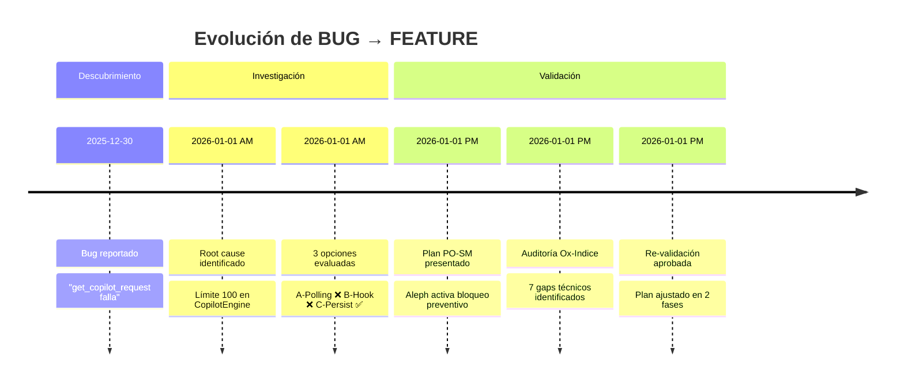
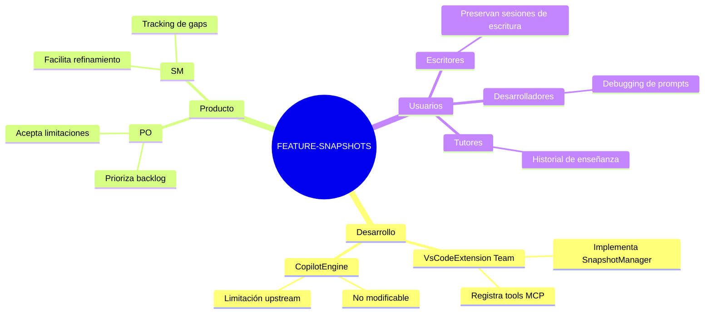
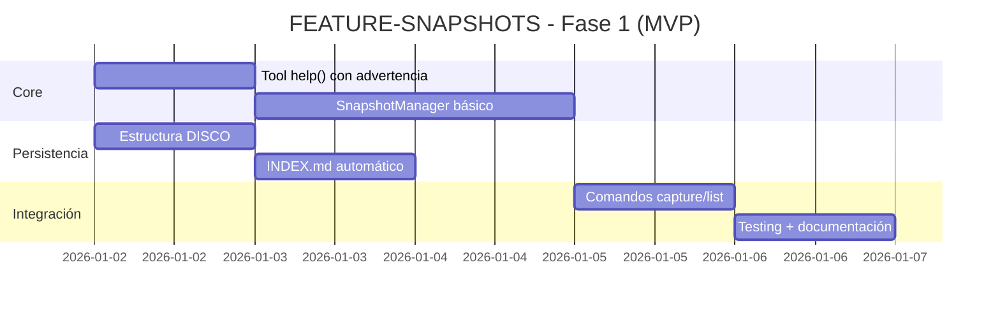
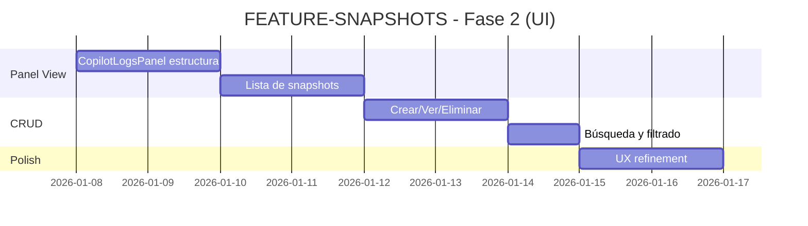
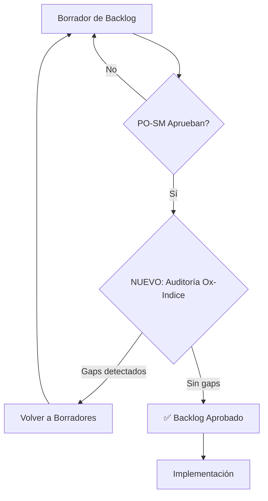

# Chuletario de Gestión: FEATURE-SNAPSHOTS-1.0.0

> **Audiencia**: Product Owner (PO) y Scrum Master (SM)  
> **Propósito**: Contexto ejecutivo, decisiones clave y estado de la épica  
> **Épica**: FEATURE-SNAPSHOTS-1.0.0  
> **Estado**: ✅ Aprobado con condiciones

---

## 1. Resumen Ejecutivo

### El Problema en Una Frase
> Los logs de Copilot Chat desaparecen después de ~100 interacciones, perdiendo contexto valioso de sesiones de trabajo extensas.

### La Solución en Una Frase
> Sistema de "fotos" (snapshots) que el usuario toma cada 30 minutos para preservar su historial de conversaciones con la IA.

### Valor de Negocio
| Antes | Después |
|-------|---------|
| Conversaciones perdidas | Historial consultable |
| "¿Qué me dijo Copilot?" | Búsqueda en snapshots |
| Contexto volátil | Base de conocimiento persistente |
| Dependencia de memoria humana | Registro objetivo |

---

## 2. Cronología del Refinamiento



---

## 3. Decisiones Clave (Decision Log)

### D1: Aceptar la Limitación de 100 Requests
| Aspecto | Detalle |
|---------|---------|
| **Decisión** | No intentar modificar CopilotEngine upstream |
| **Razón** | Es código de GitHub, no tenemos control |
| **Consecuencia** | El usuario debe tomar snapshots manualmente |
| **Responsables** | PO aprueba / SM documenta |
| **Fecha** | 2026-01-01 |

### D2: MVP Primero, UI Después
| Aspecto | Detalle |
|---------|---------|
| **Decisión** | Entregar funcionalidad por comandos antes que Panel View |
| **Razón** | Reduce riesgo técnico, valida concepto rápido |
| **Consecuencia** | Fase 1 (10h) → Fase 2 (10h adicionales) |
| **Responsables** | PO prioriza / SM planifica |
| **Fecha** | 2026-01-01 |

### D3: Persistencia en ARCHIVO/DISCO
| Aspecto | Detalle |
|---------|---------|
| **Decisión** | Guardar snapshots en la estructura existente del Scriptorium |
| **Razón** | Coherencia con principios DRY, indexable por @indice |
| **Consecuencia** | Los snapshots son ciudadanos de primera clase del ARCHIVO |
| **Responsables** | Arquitectura (Ox) |
| **Fecha** | 2026-01-01 |

---

## 4. Métricas de Éxito

### KPIs de la Feature

| Métrica | Objetivo | Cómo Medir |
|---------|----------|------------|
| **Adopción** | 80% sesiones con ≥1 snapshot | Conteo de carpetas en DISCO |
| **Retención** | <5% pérdida de contexto reportada | Feedback usuarios |
| **Usabilidad** | <3 clics para snapshot | UX testing |
| **Performance** | <2s para captura | Benchmarks |

### Criterios de Aceptación Resumidos

| AC | Descripción | Prioridad |
|----|-------------|-----------|
| AC1 | Tool `help` con advertencia de límite 100 | P0 |
| AC2 | Comando `capture_snapshot` funcional | P0 |
| AC3 | Persistencia en DISCO con INDEX.md | P0 |
| AC4 | Panel View con lista CRUD | P1 |
| AC5 | Indicador de estado "~X requests" | P2 |

---

## 5. Riesgos y Mitigaciones

### Matriz de Riesgos

| ID | Riesgo | Prob. | Impacto | Mitigación | Owner |
|----|--------|-------|---------|------------|-------|
| R1 | Usuario olvida hacer snapshot | Alta | Alto | Recordatorio en tool `help` + docs | SM |
| R2 | Snapshot captura menos de lo esperado | Media | Medio | Advertencia clara de limitación | Dev |
| R3 | UI de Panel View compleja | Baja | Alto | MVP sin UI primero | Dev/PO |
| R4 | CopilotEngine cambia API | Baja | Alto | Abstraer dependencias | Arquitectura |

### Deuda Técnica Aceptada

| Ítem | Razón | Plan de Pago |
|------|-------|--------------|
| Sin indicador exacto "X/100" | API no expuesta por CopilotEngine | Mostrar aproximado basado en cache |
| Panel View pospuesto | Prioridad MVP | Fase 2 post-validación |

---

## 6. Stakeholder Map



---

## 7. Comunicación y Reporting

### Cadencia de Updates

| Tipo | Frecuencia | Contenido | Audiencia |
|------|------------|-----------|-----------|
| **Daily** | Cada día | Progreso de tasks | Dev Team |
| **Sprint Review** | Fin de sprint | Demo + métricas | PO + Stakeholders |
| **Backlog Grooming** | Pre-sprint | Refinamiento épicas | PO + SM + Tech Lead |

### Plantilla de Status Update

```markdown
## Status: FEATURE-SNAPSHOTS-1.0.0

**Fecha**: [YYYY-MM-DD]
**Sprint**: FC1

### Progreso
- [x] Task completada
- [ ] Task en progreso (X%)
- [ ] Task pendiente

### Blockers
1. [Descripción del blocker]

### Decisiones Pendientes
1. [Pregunta para PO]

### Próximos Pasos
1. [Siguiente acción]
```

---

## 8. Timeline de Implementación

### Fase 1: MVP (Semana 1)



### Fase 2: UI Completa (Semana 2-3)



---

## 9. El Incidente del Bloqueo (Lecciones Aprendidas)

### Qué Pasó

1. **PO-SM presentaron plan** basado en documentos 01-08
2. **Aleph detectó patrón** de aprobación sin verificación técnica profunda
3. **Aleph activó bloqueo preventivo** solicitando auditoría
4. **Ox-Indice auditaron** y encontraron 7 gaps técnicos (doc 09)
5. **Plan se ajustó** dividiendo en 2 fases
6. **Re-aprobación** con scope clarificado

### Lecciones para el Proceso

| Aprendizaje | Acción Correctiva |
|-------------|-------------------|
| Plans can sound good but be technically incomplete | Añadir gate de validación técnica antes de aprobación |
| Assumptions need explicit verification | Checklist "¿Existe este componente?" |
| Split reduces risk | Preferir releases incrementales |
| Team self-correction works | Empoderar a cualquiera para activar "pause" |

### Propuesta: Nuevo Gate de Aprobación



---

## 10. Referencias Rápidas

### Documentos del Borrador

| # | Documento | Propósito |
|---|-----------|-----------|
| 01 | backlog-borrador.md | Épica y ACs oficiales |
| 04 | correccion-bug-verificacion-empirica.md | Root cause confirmado |
| 07 | analisis-viabilidad-plan-po-sm.md | Gap analysis inicial |
| 08 | plan-implementacion-aprobado.md | Decisiones y mockups |
| 09 | validacion_scriptorium_team.md | Auditoría completa |

### Contactos

| Rol | Agente | Cuándo Invocar |
|-----|--------|----------------|
| Auditoría técnica | @ox | Validación de viabilidad |
| Coherencia estructural | @indice | Verificación DRY |
| Gestión backlog | @scrum | Updates de estado |
| Producción | @aleph | Bloqueos preventivos |
