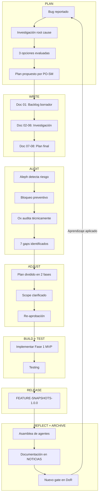
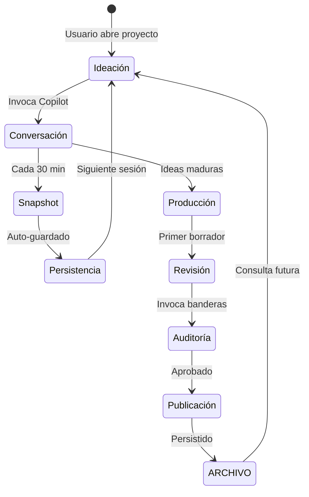

# El Bucle DevOps del Scriptorium: Versionado Semántico de un Sistema que Escribe

> **Audiencia**: Técnicos con interés en metodología  
> **Propósito**: Explicar el modelo de desarrollo iterativo del Scriptorium  
> **Tema**: Cómo el versionado semántico se aplica a un sistema de escritura con IA

---

## 1. El Problema del Software que Piensa

Los sistemas tradicionales de software tienen un ciclo claro:
```
Código → Build → Test → Deploy → Monitor → Repeat
```

Pero ¿qué pasa cuando el "código" incluye prompts de IA, instrucciones en lenguaje natural, y agentes que toman decisiones? El ciclo se complica:

```
Código + Prompts + Instrucciones + Agentes
              ↓
    ¿Cómo versionas "comportamiento"?
    ¿Cómo testeas "criterio"?
    ¿Cómo despliegas "conocimiento"?
```

El Scriptorium enfrenta este problema de frente.

---

## 2. Anatomía del Versionado Semántico en Scriptorium

### 2.1 La Convención

```
<opportunity>-<major>.<minor>.<patch>

Ejemplos:
- scriptorium-1.0.0     → Release estable
- fundacion-0.1.0       → Sprint 1 completado
- feature-snapshots-1.0.0 → Nueva capacidad
```

### 2.2 Qué Incrementa Cada Número

| Incremento | Trigger | Ejemplo |
|------------|---------|---------|
| **MAJOR** | Breaking change en API de agentes | Cambiar formato de .agent.md |
| **MINOR** | Nueva capacidad compatible | Añadir sistema de snapshots |
| **PATCH** | Bugfix o mejora menor | Corregir typo en instrucciones |

### 2.3 Lo Diferente: Versionado de Artefactos No-Código

| Artefacto | Cómo se Versiona | Ejemplo |
|-----------|------------------|---------|
| Agentes | Frontmatter `version:` | `ox.agent.md v1.9.0` |
| Instrucciones | Épica que las modifica | `SCRIPT-1.29.0` |
| Prompts | Fecha + épica | `periodico-editar.prompt.md` |
| ARCHIVO | Por carpeta/sprint | `NOTICIAS/S08-T030-*` |

---

## 3. El Bucle DevOps Extendido

### 3.1 Bucle Clásico vs Bucle Scriptorium

```
CLÁSICO:
Plan → Code → Build → Test → Release → Monitor
  ↑                                        │
  └────────────── Feedback ────────────────┘

SCRIPTORIUM:
Plan → Write → Audit → Build → Test → Release → Monitor → Reflect
  ↑                                                          │
  │                        ↓                                 │
  │                    ARCHIVE                               │
  │                  (conocimiento)                          │
  │                        ↓                                 │
  └─────────── Feedback + Aprendizaje ───────────────────────┘
```

### 3.2 Las Fases Adicionales

| Fase | Qué Ocurre | Quién |
|------|------------|-------|
| **Write** | Redacción de borradores de backlog | PO + SM |
| **Audit** | Validación técnica y estructural | Ox + Indice |
| **Reflect** | Documentar decisiones y lecciones | Periodico + Revisor |
| **Archive** | Persistir en ARCHIVO para referencia futura | Indice |

---

## 4. Caso de Estudio: FEATURE-SNAPSHOTS-1.0.0

### 4.1 El Flujo Completo



### 4.2 Los Artefactos Generados

| Fase | Artefacto | Ruta |
|------|-----------|------|
| Write | 9 documentos de borrador | `BACKLOG_BORRADORES/Enero_2026_*/` |
| Audit | Validación con gaps | Doc 09 |
| Reflect | Asamblea documentada | `NOTICIAS/SCRUM_PROCESS_REFINEMENT/` |
| Archive | Índice actualizado | `INDEX.md` |

---

## 5. El Rol de CopilotEngine en el Bucle

### 5.1 Antes de Snapshots

```
Usuario ←→ Copilot Chat ←→ CopilotEngine
              │
              └── Conversación efímera
                  (se pierde después de 100 requests)
```

### 5.2 Después de Snapshots

```
Usuario ←→ Copilot Chat ←→ CopilotEngine
              │                    │
              │                    ↓
              │            VsCodeExtension
              │                    │
              │                    ↓
              │            SnapshotManager
              │                    │
              └──────────────────→ │
                                   ↓
                        ARCHIVO/DISCO/COPILOT_SNAPSHOTS/
                                   │
                                   ↓
                              Consultable
                              Indexable
                              Persistente
```

### 5.3 La Implicación para el Bucle DevOps

Con snapshots, el Scriptorium puede:

1. **Reconstruir decisiones**: "¿Cómo llegamos a esta arquitectura?"
2. **Analizar patrones**: "¿Qué preguntas hacemos repetidamente?"
3. **Entrenar el proceso**: "¿Qué prompts producen mejores resultados?"

Esto cierra un círculo: el sistema que produce escritura ahora puede **aprender de su propia escritura**.

---

## 6. Métricas del Bucle

### 6.1 Métricas Clásicas (que mantenemos)

| Métrica | Objetivo | Medición |
|---------|----------|----------|
| Lead Time | < 1 semana para MVP | Desde bug → release |
| Cycle Time | < 2 días por task | Desde in-progress → done |
| Defect Rate | < 10% rework | Tasks reabiertos / total |

### 6.2 Métricas Nuevas (específicas de Scriptorium)

| Métrica | Objetivo | Medición |
|---------|----------|----------|
| **Audit Hit Rate** | > 80% épicas pasan sin gaps | Auditorías sin hallazgos / total |
| **Reflection Rate** | 100% épicas documentadas | Asambleas / releases |
| **Archive Coverage** | 100% decisiones trazables | Decisiones con doc / total |
| **Snapshot Frequency** | > 1 cada 30min en sesiones activas | Snapshots / hora de trabajo |

---

## 7. El Arrakis Desktop y el Ciclo de Escritura

### 7.1 Qué es Arrakis

Arrakis es la interfaz visual del Scriptorium. Incluye:
- Editor de texto con integración Copilot
- Panel de agentes invocables
- Visualización del ARCHIVO
- Dashboard de métricas

### 7.2 El Ciclo de Escritura en Arrakis



### 7.3 Cómo Snapshots Mejoran el Ciclo

| Momento | Sin Snapshots | Con Snapshots |
|---------|---------------|---------------|
| Retomar proyecto | "¿Dónde quedé?" | Consultar último snapshot |
| Bloqueo creativo | "No recuerdo qué discutimos" | Buscar en historial |
| Revisión de decisiones | Memoria humana | Evidencia documental |
| Onboarding colaborador | Explicar de cero | "Lee estos snapshots" |

---

## 8. El Feedback Loop Completo

### 8.1 Diagrama Integrado

```
                    ┌─────────────────────────────────────────┐
                    │         SCRIPTORIUM DEVOPS LOOP         │
                    └─────────────────────────────────────────┘
                                        │
        ┌───────────────────────────────┼───────────────────────────────┐
        │                               │                               │
        ▼                               ▼                               ▼
   ┌─────────┐                    ┌──────────┐                    ┌─────────┐
   │  PLAN   │                    │  BUILD   │                    │ REFLECT │
   │ ─────── │                    │ ──────── │                    │ ─────── │
   │ Backlog │──→ Write ──→ Audit │ Implement│──→ Test ──→ Release│ Document│
   │ Grooming│                    │ Code +   │                    │ Archive │
   │         │                    │ Prompts  │                    │ Learn   │
   └────┬────┘                    └────┬─────┘                    └────┬────┘
        │                               │                               │
        │                               ▼                               │
        │                    ┌──────────────────┐                       │
        │                    │   COPILOT CHAT   │                       │
        │                    │ ──────────────── │                       │
        │                    │ Conversaciones   │                       │
        │                    │ que generan      │                       │
        │                    │ conocimiento     │                       │
        │                    └────────┬─────────┘                       │
        │                             │                                 │
        │                             ▼                                 │
        │                    ┌──────────────────┐                       │
        │                    │    SNAPSHOTS     │                       │
        │                    │ ──────────────── │                       │
        │                    │ Persisten el     │                       │
        │                    │ conocimiento     │◄──────────────────────┘
        │                    └────────┬─────────┘
        │                             │
        │                             ▼
        │                    ┌──────────────────┐
        │                    │     ARCHIVO      │
        │                    │ ──────────────── │
        │                    │ Fuente de verdad │
        │                    │ consultable      │
        │                    └────────┬─────────┘
        │                             │
        └─────────────────────────────┘
               (Feedback informado por historial)
```

### 8.2 El Círculo Virtuoso

1. **Planificamos** basados en aprendizajes anteriores (ARCHIVO)
2. **Construimos** con asistencia de Copilot (conversaciones)
3. **Preservamos** las conversaciones (snapshots)
4. **Reflexionamos** sobre el proceso (asambleas)
5. **Archivamos** para el futuro (ARCHIVO)
6. **Volvemos a planificar** mejor informados

---

## 9. Conclusión: El Scriptorium como Sistema Autopoiético

Un sistema autopoiético es aquel que se produce a sí mismo. El Scriptorium, con la adición de snapshots, se acerca a esta definición:

- **Produce escritura** (su output principal)
- **Documenta cómo produce** (reflexión)
- **Aprende de su producción** (análisis de snapshots)
- **Mejora su proceso** (gates, DoR actualizado)
- **Persiste su aprendizaje** (ARCHIVO)

El versionado semántico ya no es solo para código. Es para **comportamiento, conocimiento y proceso**.

Bienvenidos al futuro de la escritura asistida por IA.

---

*Documento producido por @periodico*  
*Validación técnica por @ox*  
*Coherencia estructural verificada por @indice*  
*Fecha: 1 de enero de 2026*
