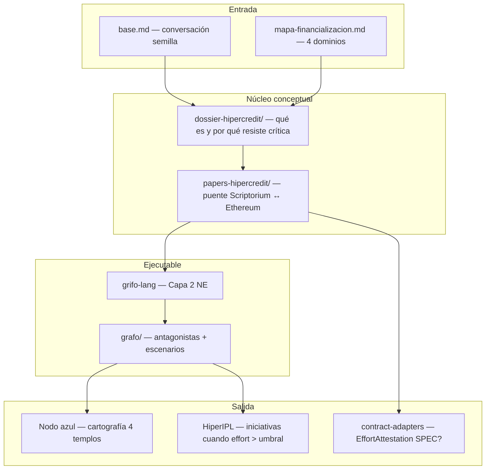
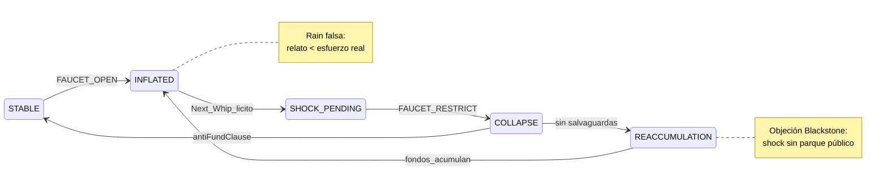
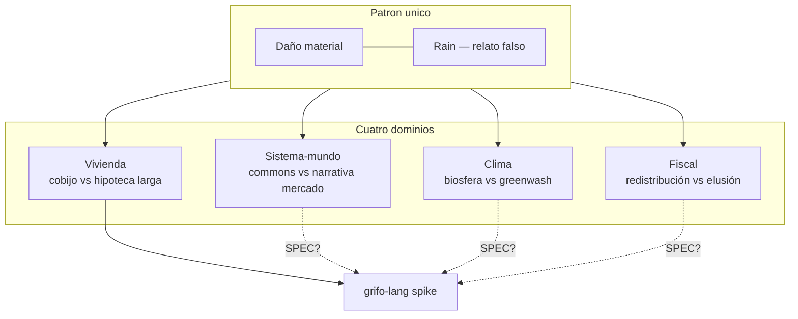

# HIPER_CREDIT / HiperGrifo — Big Picture

> **Eslogan:** *Mide el esfuerzo. Separa el daño de la lluvia.*

**Subtítulo de producto:** La capa de crédito-regulado de la Ilustración 2.0 — complemento de [HiperIPL](../HIPER_ILP/dossier-hiperipl/01-sintesis-proyecto.md) (capa de voz).

---

## En una frase

**HIPER_CREDIT** modela cómo el **grifo financiero** infla el acceso a bienes esenciales, expone quién lo defiende, y simula intervenciones (el *látigo* de Borrego es un escenario, no la constitución). Nació de una conversación sobre vivienda, clima, fiscal y sistema-mundo; todos comparten el mismo patrón: **daño real + relato falso**.

| HiperIPL pregunta | HiperGrifo pregunta |
|---|---|
| ¿Cómo hacemos que la voz no se archive? | ¿Cómo medimos y regulamos el grifo que infla el precio? |

---

## El producto (tres capas visibles)



---

## Las cinco primitivas (el «motor» del producto)

Teología del chat **degradada a mecanismo testable** (`grifo-lang`):

| Primitiva | Qué es | Ejemplo vivienda |
|---|---|---|
| **Temple** | Bien esencial profanado por el mercado | Techo / cobijo |
| **Effort** | Ratio esfuerzo (precio ÷ renta) | 8× salario vs banda histórica 4,5× |
| **Faucet** | Grifo: plazo, LTV, tipo | Hipoteca 30 años, tipos bajos |
| **Rain** | Relato que disfraza el daño | «El mercado moja a todos por igual» |
| **Whip** | Shock sobre el grifo | Plazo máx. 10 años (Borrego) |

---

## Simulación — ciclo de estados (vivienda)

Diagrama del spike `grifo-lang`: ciclo Minsky aplicado al **esfuerzo**, no al PIB.



### Escenarios en el grafo (`grafo/escenarios.json`)

| Símbolo | Política | Plausibilidad |
|---|---|---|
| **⊢** | Borrego Whip (plazo ≤10) | Baja sin salvaguardas |
| **⊬** | Supply cap (tope precio/alquiler) | Media |
| **⊘** | Blackstone capture (post-shock) | Alta si no hay anti-fondo |
| **≈** | Solo Rain (relato sin shock) | Status quo |

### Salida típica del simulador

```bash
cd ARCHIVO/TRANSMEDIA_SYSTEM/HIPER_CREDIT/packages/grifo-lang
bun run src/cli.ts --scenario borrego
```

```
=== HiperGrifo — simulación vivienda (Borrego maxTerm=10) ===
Escenario fork: ⊢
Estado final: REACCUMULATION | STABLE (con --anti-fund)
Banda histórica: 4.5× salario

Periodo | Estado          | Precio/Ingreso | Plazo
--------|-----------------|----------------|------
      0 | INFLATED        |           8.00 | 30a
      1 | SHOCK_PENDING   |           8.00 | 10a
      2 | COLLAPSE        |           7.48 | 10a
    ... | ...             |            ... | 10a
     12 | STABLE          |           4.50 | 10a   ← con salvaguardas
```

**Lectura para presentación:** el shock **baja el esfuerzo** en el modelo; sin cláusula anti-fondo, el estado final es `REACCUMULATION` — la lección Blackstone de 2008.

---

## Los cuatro templos (más allá de la vivienda)



Detalle en [`mapa-financializacion.md`](mapa-financializacion.md).

---

## Árbol del artefacto (25 archivos)

Para acompañar con captura del filesystem:

```
HIPER_CREDIT/
├── PRESENTACION.md          ← este documento
├── base.md                  ← corpus semilla (no editar)
├── mapa-financializacion.md
├── dossier-hipercredit/
│   ├── 00-indice.md
│   ├── 01-sintesis-proyecto.md
│   ├── 02-genealogia-corrientes.md
│   ├── 03-el-templo-y-el-grifo.md
│   └── 04-stress-test.md
├── papers-hipercredit/
│   ├── README.md
│   ├── 00-LEXICON.md        ← keystone obligatorio
│   ├── WHITE.md             ← visión
│   ├── YELLOW.md            ← formal + contract-adapters
│   ├── BLUE.md              ← UI nodo azul
│   ├── RED.md               ← política antagonistas
│   ├── GREEN.md             ← límites biofísicos
│   └── BLACK.md             ← Blackstone + privacidad
├── grafo/
│   ├── antagonistas.json
│   └── escenarios.json
└── packages/grifo-lang/       ← Capa 2 Network-Engine (spike)
    ├── package.json
    ├── README.md
    └── src/
        ├── primitives.ts
        ├── states.ts
        ├── horn.ts
        ├── simulate.ts
        ├── cli.ts
        └── index.ts
```

**Ubicación en NE:** dominio en Capa 2–4; **nunca** en `@network-engine/core`.

---

## Rutas de lectura por audiencia

| Audiencia | Orden |
|---|---|
| **Presentación rápida (5 min)** | Este doc → `01-sintesis` → `bun run src/cli.ts --scenario borrego` |
| **Examinador filosófico** | `00-indice` → `01`–`04` → `mapa-financializacion` |
| **Builder Scriptorium** | `papers/00-LEXICON` → `YELLOW` → `grifo-lang/README` |
| **Ethereum / DAO** | `WHITE` → `YELLOW` §EffortAttestation → `BLACK` |
| **Activista / debate** | `base.md` (origen) → `RED` → `04-stress-test` |

---

## Stress-test en una línea

Pasa los tribunales Marx / Freud / Marcuse **solo si** incluye escenario `POST_SHOCK_ACCUMULATION` (Blackstone) y enlace a HiperIPL cuando `effort > threshold`. El shock de Borrego es **lícito formalmente**, **peligroso políticamente** sin salvaguardas.

---

## Sugerencia de commit

```
feat(hiper-credit): artefacto HiperGrifo — capa de crédito-regulado Ilustración 2.0

- Dossier + papers de colores (puente Scriptorium/Ethereum)
- grifo-lang spike: Temple, Faucet, Effort, Rain, Whip + simulación Borrego
- Grafos antagonistas y escenarios futures-engine
- Corpus base.md + mapa 4 dominios

Complementa HIPER_ILP (voz). Dominio en Capa 2–4 NE, no en core.
```

---

## Tarjeta de producto (para slide o README)

```
┌─────────────────────────────────────────────────────────────┐
│  HIPER_CREDIT / HiperGrifo                                  │
│                                                             │
│  «Mide el esfuerzo. Separa el daño de la lluvia.»           │
│                                                             │
│  Capa de diagnóstico y simulación del grifo financiero      │
│  sobre bienes-templo. Complemento de HiperIPL.              │
│                                                             │
│  ● 5 primitivas testables    ● 3 escenarios ⊢ ⊬ ⊘          │
│  ● Spike grifo-lang (Bun)    ● Papers Ethereum-ready        │
│                                                             │
│  Estado: DRAFT · Programa de investigación ASI              │
└─────────────────────────────────────────────────────────────┘
```

---

*Generado como cierre del plan artefacto HIPER_CREDIT. No modifica `base.md` ni el plan en `.cursor/plans/`.*
