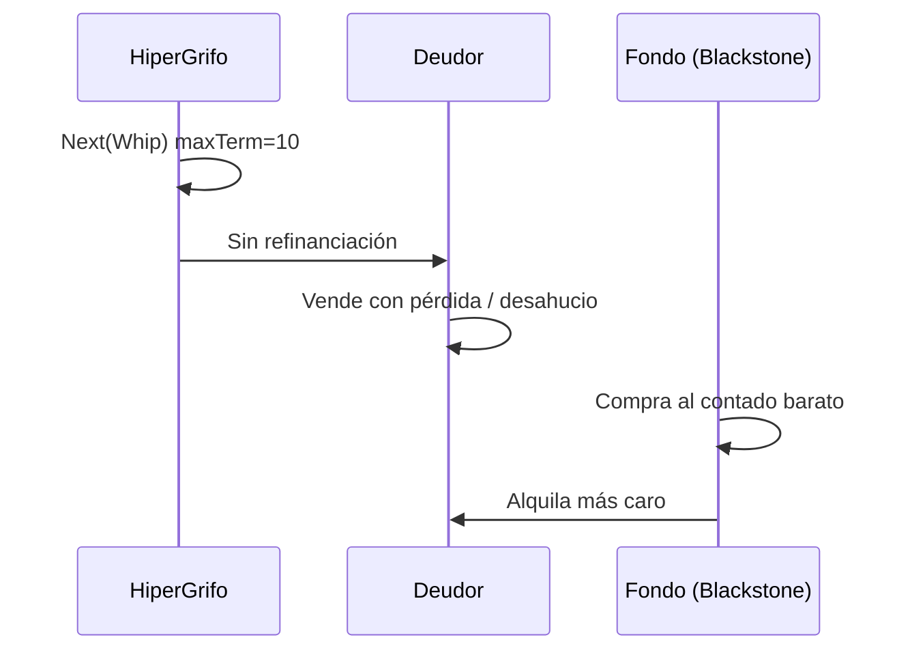

# BLACK — Modelo de amenaza: captura y REACCUMULATION

*Vía negra disciplinada. Blackstone como escenario estructural, privacidad del esfuerzo, captura del grifo.*

---

## §0 — Posición en la future-machine

BLACK protege **corpus + grafo + attestations** contra:

- **REACCUMULATION** post-COLLAPSE (fondos con cash).
- **Captura plutocrática** del protocolo Faucet.
- **Panóptico** de EffortAttestation (renta en cadena).
- **Shock como arma** contra deudor sin protección.

---

## §1 — Vocabulario fijado

De [`00-LEXICON.md`](./00-LEXICON.md): objeción Blackstone, REACCUMULATION, Rain, tribunales.

Términos BLACK:

| Término | Definición |
|---|---|
| **Blackstone pattern** | Compra masiva en crisis; alquiler posterior |
| **REACCUMULATION** | Estado terminal post-COLLAPSE sin anti-fondo |
| **Effort doxxing** | Attestation que revela renta/zona identificable |
| **Grifo capturado** | Multisig banca/regulador controla Faucet |

---

## §2 — Matriz de amenazas

| Amenaza | Vector | Mitigación candidata | SPEC? |
|---|---|---|---|
| Blackstone pattern | Cash post-COLLAPSE | antiFundClause, tanteo público | HC-021 |
| Captura protocolo | Gobernanza token | 1p1v HiperIPL | HC-004 |
| Effort panóptico | L2 público | zk buckets | HC-004 |
| Shock a deudor | Whip sin moratoria | transición Freud | HC-022 |
| Lobby DEFENDS_FAUCET | Presión política | Persistencia BOE | HC-002 |
| Simulacro anestésico | Solo UI slider | GREEN derivación | HC-023 |

---

## §3 — Objeción Blackstone (detalle)

### Secuencia de ataque

### Lo que Borrego niega y el modelo documenta

Borrego: "absurdo que fondos compren y alquilen caro eternamente". El refactor: **no absurdo — plausibilidad alta** en `escenarios.json` rama REACCUMULATION.

### Defensa aspiracional (no hecha)

1. Cláusula Horn: prohibición paquetes > N viviendas a vehículos financieros en Temple HOUSING.
2. Derecho de tanteo administración pública en ventas masivas.
3. Registro público de beneficiario final en compra Temple.

Todas `SPEC?`.

---

## §4 — Privacidad EffortAttestation

| Dato | Riesgo | Enfoque candidato |
|---|---|---|
| Salario exacto | Doxxing | Bucket zk (decil) |
| Dirección vivienda | Stalking | zoneId agregado |
| Historial effort | Perfilado | Retención mínima |

Simetría cypherpunk: mismo cripto protege deudor y evasor — decisión política explícita (`SPEC?`).

---

## §5 — Decisiones abiertas (`SPEC?`)

| ID | Decisión | Opciones | Estado |
|---|---|---|---|
| SPEC?-HC-027 | Privacidad effort | EAS público / zk / off-chain | ABIERTA |
| SPEC?-HC-028 | Publicación COLLAPSE | Transparente / retraso | ABIERTA |
| SPEC?-HC-029 | Auditoría fondos | On-chain registry / manual | ABIERTA |

---

## §6 — Referencias DRY

- [`dossier-hipercredit/04-stress-test.md`](../dossier-hipercredit/04-stress-test.md) §2
- [`grafo/escenarios.json`](../grafo/escenarios.json)
- [`../HIPER_ILP/papers-hiperipl/BLACK.md`](../HIPER_ILP/papers-hiperipl/BLACK.md)
