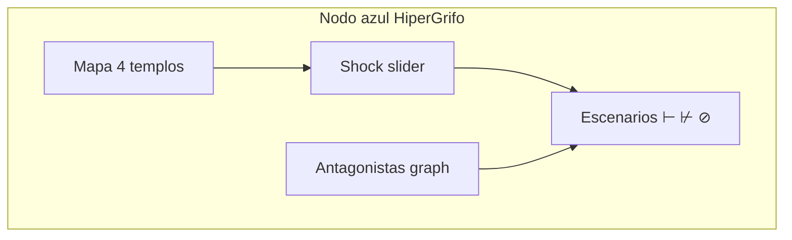

# BLUE — Nodo azul: cuatro templos y el shock slider

*Lente central. Cómo la ciudadanía ve el grifo, navega antagonistas y experimenta escenarios — sin confundir UI con política.*

---

## §0 — Posición en la future-machine

BLUE es **superficie humana** de HiperGrifo: el nodo azul que HiperIPL usa para voz; aquí para **válvulas y esfuerzo**.

```
Grafista (antagonistas + escenarios) → simulación → NODO AZUL (shock slider + mapa templos)
```

**Patrón UI:** `DocumentMachineSDK/docs/azul/cuadernos/` + `thread-eigenstate-viewer`.

---

## §1 — Vocabulario fijado

De [`00-LEXICON.md`](./00-LEXICON.md): nodo azul, Temple, Effort, Rain, operadores ⊢⊬⊘.

Términos BLUE:

| Término | Definición |
|---|---|
| **Cuaderno grifo** | HTML/visual derivado de azul para HIPER_CREDIT |
| **Shock slider** | Control UI: maxTermYears 10–30 → preview Effort/COLLAPSE |
| **Mapa cuatro templos** | Vista de dominios (sistema, clima, fiscal, vivienda) |
| **Modo antagonista** | Grafo `antagonistas.json` renderizado |

---

## §2 — Cartografía de los cuatro templos

Cada dominio del `mapa-financializacion.md` es un **templo** con su Rain:

| Templo | ID | Métrica UI | Rain típica |
|---|---|---|---|
| Sistema-mundo | `TEMPLE_SYSTEM` | Índice concentración | "Libre mercado" |
| Clima | `TEMPLE_CLIMATE` | Emisiones / lobby spend | "Sostenibilidad" |
| Fiscal | `TEMPLE_FISCAL` | Tipo efectivo por decil | "Lluvia fiscal" |
| Vivienda | `TEMPLE_HOUSING` | priceToIncome (Effort) | "Acceso a vivienda" |



---

## §3 — Shock slider UI (especificación, no implementación)

### Controles

| Control | Rango | Efecto simulado |
|---|---|---|
| `maxTermYears` | 10 – 30 | Llama `grifo-lang` simulate |
| `scenario` | ⊢ / ⊬ / ⊘ | Selecciona rama `escenarios.json` |
| `historicalBand` | 3 – 6× | Umbral Effort |
| `showRain` | toggle | Overlay narrativa vs dato |

### Paneles de salida

1. **Effort actual vs banda** (gráfico barras).
2. **Trayectoria de estados** (STABLE → … → COLLAPSE).
3. **Alerta REACCUMULATION** si escenario ⊢ sin anti-fondo.
4. **Enlace HiperIPL** — "proponer iniciativa supply-side" (`⊬`).

### Flujos mínimos

| Acción | Operación | Vista |
|---|---|---|
| Explorar dominios | navegar 4 templos | Modo mapa |
| Probar shock | mover slider → `simulate()` | Panel consecuencias |
| Ver quién bloquea | grafo antagonistas | Modo coalición |
| Comparar escenarios | ⊢ vs ⊬ vs ⊘ | Vista bifurcación |

---

## §4 — Decisiones abiertas (`SPEC?`)

| ID | Decisión | Opciones | Estado |
|---|---|---|---|
| SPEC?-HC-013 | Stack UI | azul cuadernos / React / ImpressJS | ABIERTA |
| SPEC?-HC-014 | 3D vs 2D | clusters.html / 2d only | ABIERTA |
| SPEC?-HC-015 | Datos live | estático / API effort | ABIERTA |

---

## §5 — Integración

- Input: `grafo/antagonistas.json`, `grafo/escenarios.json`, salida CLI `grifo-lang`.
- Output: cuaderno en `docs/azul/cuadernos/hipergrifo_*` — **no creado** (`SPEC?`).

---

## §6 — Referencias DRY

- [`00-LEXICON.md`](./00-LEXICON.md)
- [`mapa-financializacion.md`](../mapa-financializacion.md)
- [`../HIPER_ILP/papers-hiperipl/BLUE.md`](../HIPER_ILP/papers-hiperipl/BLUE.md) (patrón)
