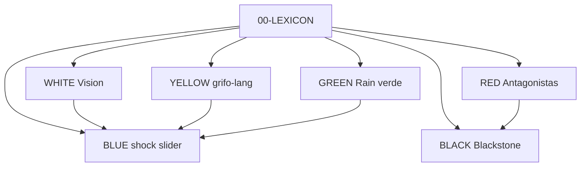

# Papers de colores — HIPER_CREDIT / HiperGrifo

*Dossier técnico-filosófico para audiencia Ethereum y ecosistema Aleph Scriptorium. HiperGrifo como dispositivo de regulación crediticia de la future-machine, complementario de HiperIPL.*

**Estado:** DRAFT · **Decisiones:** ABIERTAS · **Dispositivo:** HIPER_CREDIT / HiperGrifo — pendiente de fijar

---

## Qué es este dossier

No es un whitepaper cerrado. Es un **conjunto de papers de colores** que:

1. **Fijan vocabulario** ([`00-LEXICON.md`](./00-LEXICON.md)) entre filosofía (`mapa-financializacion`, dossier), corpus (`base.md`) y técnica (`grifo-lang`).
2. **Documentan decisiones abiertas** (`SPEC?`) — no las toman.
3. **Posicionan HiperGrifo** como capa de grifo regulado + cartografía, complementaria de HiperIPL (voz).

**No modifica** `base.md` (corpus semilla).

---

## Orden de lectura

| Orden | Paper | Color | Para quién |
|---|---|---|---|
| 0 | [`00-LEXICON.md`](./00-LEXICON.md) | — | Todos (obligatorio) |
| 1 | [`WHITE.md`](./WHITE.md) | Blanco | Visión general, Ethereum |
| 2 | [`BLUE.md`](./BLUE.md) | Azul | UI, shock slider, 4 templos |
| 3 | [`YELLOW.md`](./YELLOW.md) | Amarillo | grifo-lang, Horn, adapters |
| 4 | [`RED.md`](./RED.md) | Rojo | Coalición antagonista, shock |
| 5 | [`GREEN.md`](./GREEN.md) | Verde | Clima, green faucet |
| 6 | [`BLACK.md`](./BLACK.md) | Negro | Blackstone, privacidad |

**Atajo por rol:**

- **Builder L2:** WHITE → YELLOW → BLACK → RED
- **Producto / UX:** WHITE → BLUE → RED
- **Activista vivienda:** WHITE → RED → [`dossier-hipercredit/04`](../dossier-hipercredit/04-stress-test.md)
- **Dev spike:** LEXICON → YELLOW → [`packages/grifo-lang`](../packages/grifo-lang/)

---

## Mapa de colores

| Color | Rol | Capa future-machine |
|---|---|---|
| WHITE | Visión + puente HiperIPL | Todas (mapa) |
| YELLOW | Primitivas, Horn, simulate | Grafista + sustrato |
| BLUE | Nodo azul, 4 templos | Dramaturgo → UI |
| RED | Coalición, ⊢⊬⊘ | Grafista |
| GREEN | Límites eco, anti-simulacro | Transversal Horn |
| BLACK | Blackstone, privacidad | Corpus + grafo |

---

## Relación con HiperIPL

| HiperIPL | HiperGrifo |
|---|---|
| Voz / iniciativa | Grifo / válvulas |
| Centro vacío | Effort band |
| Cuórum guillotina | Whip guillotina |
| [`papers-hiperipl/`](../HIPER_ILP/papers-hiperipl/) | `papers-hipercredit/` (este dossier) |
