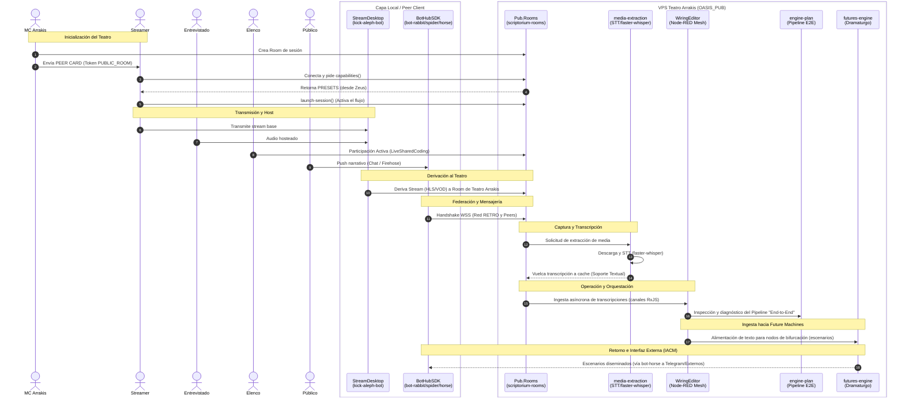
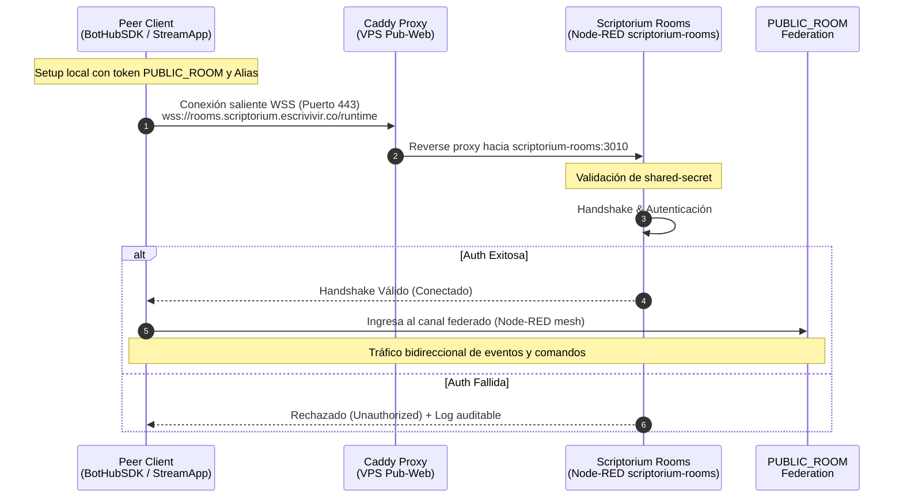
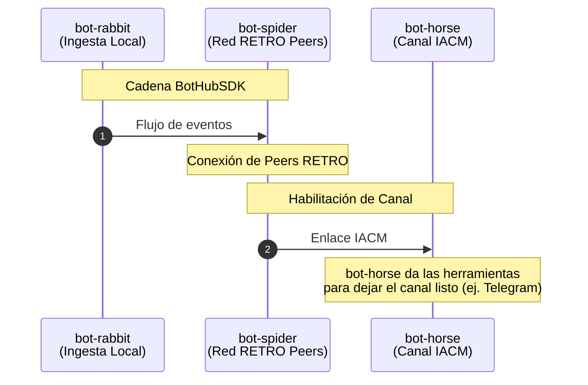
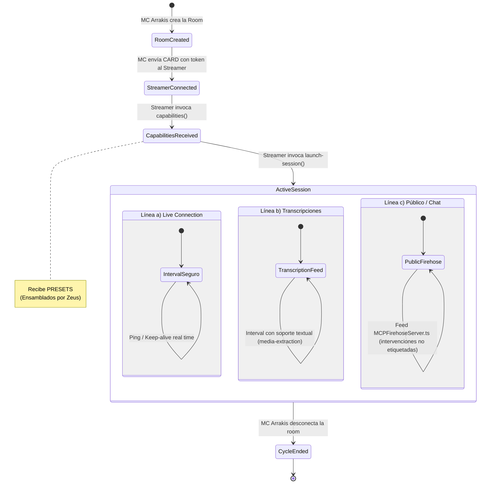
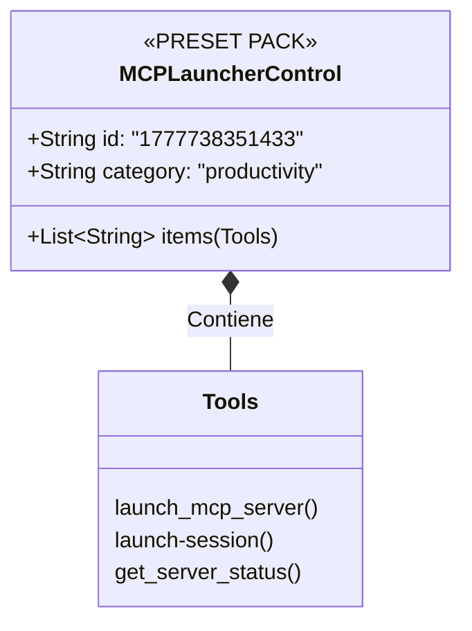

# Dossier: Future Pipeline Engine & Scriptorium Integration

!importante no canibalizar el documento, integrarse armonoiosamente.


## 1. Diagram




### 1.2 El Concepto de PRESET y su Asignación a Agentes

El ecosistema Scriptorium no entrega todas las herramientas a todos los actores por defecto. Utiliza el concepto de **PRESET** para empaquetar capacidades específicas y asignarlas a agentes o clientes especializados, orquestado a través del plugin **`McpPresets`** y el generador **Zeus**.

```mermaid
flowchart TD
    subgraph Infraestructura (MCPGallery)
        Mesh[mcp-mesh-sdk<br/>Tools & Firehose]
        Model[mcp-model-sdk<br/>Inferencia & Prompts]
        Launcher[MCPLauncherServer<br/>Orquestación]
    end

    subgraph Zeus Web Interface (mcp-presets-site)
        Cat[Catálogo de Capabilities]
        Gen[Generador de PRESETS]
        Cat --> Gen
    end

    Mesh -. "Expone Tools" .-> Cat
    Model -. "Expone Tools" .-> Cat
    Launcher -. "Expone Tools" .-> Cat

    subgraph Plugin: McpPresets Agent
        Import[Importación y Validación<br/>Esquema PresetModel]
        PresetsDB[(presets/*.json)]
        Assign[agent-assignments.json]
        
        Import --> PresetsDB
        PresetsDB --> Assign
    end

    Gen == "Exporta JSON Compatible" ==> Import

    subgraph Ecosistema de Agentes (AGENT_CREATOR)
        AgentA[Agente: Tarotista<br/>Inyecta mcpPresets en Recipe]
        AgentB[Agente: Nonsi<br/>Inyecta mcpPresets en Recipe]
        Streamer[Cliente: Streamer<br/>Recibe Preset de Orquestación]
    end

    Assign == "Vincula Capabilities" ==> AgentA
    Assign == "Vincula Capabilities" ==> AgentB
    Assign == "Vincula Capabilities" ==> Streamer
```

---

## 2. Índice de Enlaces y Rutas Clave

*El índice completo de referencias y rutas ha sido extraído a su propio documento para facilitar el mantenimiento.*
👉 **[Ver Índice de Enlaces (index.md)](file:///Users/morente/Desktop/THEIA_PATH/NUEVA_BASE/SCRIPTORIUM/ALEPH/ARCHIVO/future-pipeline-engine/index.md)**


## 3. Análisis de la Document Machine (BARTLEBY / para-la-voz-sdk)

El flujo de la **Document Machine** está diseñado como un **SDK editorial**. Su propósito es analizar corrientes de pensamiento (corpus) para acabar cristalizando una "Voz" (un agente) que produzca nuevo material (en este caso original, poemas) *desde* las reglas de ese corpus, y no hablando *sobre* él.

### 3.1 Los 4 Agentes Core (SDK)
El SDK base proporciona 4 agentes predefinidos que actúan como la maquinaria de análisis y estructuración:

- **`@bartleby` (Analista):** Solo lectura. Analiza los textos de entrada (editoriales) y genera un informe estructurado en 5 secciones: linaje, taxonomía funcional, mecanismos retóricos, emergencias y ausencias estructurales.
- **`@archivero` (Gestor del Corpus):** Gestiona la "fuente de la verdad" (`corpus.md`). Compara los nuevos análisis con el corpus existente para detectar qué es nuevo, qué confirma algo existente, qué evoluciona y qué discrepa. Luego lo integra.
- **`@cristalizador` (Diseñador de artefactos):** Observa los patrones acumulados. Cuando hay suficiente información, propone la creación de un nuevo agente (la **`@voz`**) construyendo sus *instructions* y *prompts*.
- **`@portal` (Interfaz adaptativa):** Sirve como interfaz de entrada que adapta el tono según quién interactúe con el sistema (ej. perfil de un editor, comité o inteligencia hostil).

A estos 4 se les suma un quinto agente que es el resultado del proceso:
- **`@voz` (Agente Mod):** El agente generado y cristalizado que reside en la capa de la aplicación (el *mod* activo) y es el que finalmente produce contenido basándose en el corpus.

### 3.2 Las Fases / El Flujo (Los 6 Comandos)
El flujo está dictado por "guiones" (documentos humanos paso a paso) y una serie de comandos de Copilot que ejecutan los agentes:

1. **`/guion` (Usuario):** Genera el "roadmap" de trabajo (un documento Markdown con checkboxes) a partir de una plantilla. Prepara el terreno antes de activar los agentes.
2. **`/feed` (`@bartleby`):** Ingresa un nuevo texto (editorial). Bartleby lo lee y genera el informe de análisis.
3. **`/diff-corpus` (`@archivero`):** El archivero compara el nuevo informe de Bartleby contra el mapa acumulativo de conocimiento.
4. **`/merge-corpus` (`@archivero`):** Tras revisar el *diff*, el archivero integra los hallazgos validados dentro del documento maestro del corpus.
5. **`/design` (`@cristalizador`):** Si hay suficientes textos procesados, el cristalizador analiza todo y diseña al nuevo agente (`@voz`), sus prompts y sus instrucciones.
6. **`/status` (`@archivero`):** Comando de utilidad para saber cuántos textos se han procesado y el estado de las emergencias en el corpus.

### 3.3 Estructura de Ficheros (main vs mod)
El SDK opera bajo un patrón estricto unidireccional: la capa pura del motor (`main`) hereda hacia la capa de datos/lore (el `mod` activo), sin ensuciar el motor.

**Capa del Motor (DocumentMachineSDK - main)**
- `.github/agents/`, `.github/prompts/`, `.github/instructions/`: Aquí viven los 4 agentes core y los 6 comandos.
- `.github/templates/guion-ciclo.template.md`: La plantilla para generar los guiones paso a paso.
- `proyecto.config.template.md`: Plantilla para configurar nuevos proyectos/universos.

**Capa del Universo Generado (mod/lore activo)**
- `guiones/YYYY-MM-DD_slug.guion.md`: Los roadmaps humanos ejecutables.
- `corpus/editoriales/`: Los textos fuente "crudos" que entran a la máquina.
- `corpus/analisis/`: Los informes generados por `@bartleby`.
- `corpus/corpus.md`: El "mapa acumulativo". Es la fuente de la verdad (lo que se pasa luego a la Vector Machine).
- `mod/agents/voz.agent.md`: El agente cristalizado listo para funcionar.
- `mod/prompts/` y `mod/instructions/`: Las reglas de la `@voz`.
- `docs/`: Catálogo web (Jekyll) donde se publicaría la producción de la `@voz`.

---
---

## 4. El "Future Machine" Pipeline (La Súper-Cadena)

Investigando más a fondo en el código (como se documenta en el SDK de Cortos / mod legislativa), el flujo base de *BARTLEBY* descrito en la sección 4 no es siempre el proceso principal. En contextos más amplios, la Document Machine actúa como una **subcadena** dentro de una pipeline de orquestación narrativa de mayor escala conocida como la **Future Machine**.

En esta súper-cadena, el análisis meticuloso de `@bartleby` se convierte en un simple paso interno (un motor de procesamiento de fondo) dentro de un proceso de 5 etapas orquestado por un nuevo conjunto de agentes.

### 4.1 La Secuencia de 5 Agentes (Future-Machine)

El flujo de trabajo se estructura en la siguiente cadena: `Puzzle → Archivero Lore → Grafista → Demiurgo → Dramaturgo Cortos`.

1. **`@Puzzle` (Validación):** Recibe las piezas de "lore" (los textos crudos/borradores) y las verifica contra el esquema de datos antes de dejarlas entrar al sistema.
2. **`@Archivero Lore` (Ingesta y Corpus):** Aquí es donde la subcadena de Bartleby es absorbida. El *Archivero Lore* toma todo el pack validado por *Puzzle* y delega en `@bartleby` el análisis profundo de todas las piezas (linajes, mecanismos, ausencias). El resultado unificado es el `CORPUS_PREVIEW.md`: un mapa puro y sin juicios de todo el material.
3. **`@Grafista` (Estructuración del Grafo):** Lee el corpus generado y detecta los puntos de fricción, huecos, tensiones y bifurcaciones de la historia. Con esta información, estructura un **grafo dirigido** de narrativas o futuros posibles.
4. **`@Demiurgo` (Instanciación de Universo):** Toma el grafo creado por el Grafista y, en consenso con el usuario, selecciona una rama específica. Rellena las variables faltantes, define las reglas iniciales y convierte esa rama en una "spec concreta": un **Universo** (`universo/*.md`). Es un escenario formalizado.
5. **`@Dramaturgo` / `Dramaturgo Cortos` (Generación de Obra):** Es el destino final de la pipeline. Toma el Universo instanciado por el Demiurgo y lo transforma en una pieza literaria o producción final (por ejemplo, un "corto"). 


## 5. Análisis e Investigación de StreamDesktop y StreamDesktopAppCronos

La construcción de este diagrama de caso de uso y el índice de referencias se sustenta en los documentos técnicos y manuales de usuario del Scriptorium:
1. `StreamDesktop/README-SCRIPTORIUM.md`
2. `StreamDesktopAppCronos/README-SCRIPTORIUM.md`
3. `WiringEditor/README-SCRIPTORIUM.md`
4. `BlockchainComPort/OASIS_PUB/site/scriptorium/README.md`
5. `DocumentMachineSDK/.github/skills/futures-engine/SKILL.md`
6. `DocumentMachineSDK/.github/skills/media-extraction/SKILL.md`
7. `DocumentMachineSDK/.github/skills/engine-plan/SKILL.md`

> Para más detalles, consulta el **[Índice del Future Pipeline Engine](index.md)**.

El análisis de `StreamDesktop` y `StreamDesktopAppCronos` no se enfoca en su estado técnico final, sino en el **plan y caso de uso** que aportan dentro del ecosistema Scriptorium (actualmente en creación). 

- **StreamDesktop (`kick-aleph-bot`)**: Actúa como un *gateway* entre plataformas de streaming (Kick.com) y el Scriptorium. Define una arquitectura de 3 canales (App, Sys, UI) usando RxJS, lo que permite que los mensajes de chat y eventos del stream fluyan bidireccionalmente hacia agentes específicos (como `@plugin_ox_kickstream` o actores del teatro).
- **StreamDesktopAppCronos (`kick-aleph-crono-bot`)**: Es un overlay de OBS visual con animaciones y cronómetros. Aunque en su Sprint 1 opera de manera *standalone*, su integración futura permitirá que comandos desde el Scriptorium (por ejemplo `!timer` mediante un mini HTTP listener) reaccionen en el stream, integrándolo con el *Teatro transmedia*.

### 5.1 Flujo Hipotético: Ingesta hacia Future Machines

Supongamos el siguiente flujo:
- **a)** El streamer y un entrevistado hosteados en el scriptorium del streamer derivan el audio a una room en el contexto de Teatro Arrakis de Scriptorium a través del VPS (`BlockchainComPort/OASIS_PUB/site/scriptorium`) donde está instalada una skill de `futures-engine`.
- **b)** En el VPS está instalado `media-extraction` y un operador vuelca a las transcripciones del stream en proceso, operados con `WiringEditor` y la skill de `engine-plan`.

### 5.2 Flujo de Conexión y Federación (Pub.Rooms)

A continuación se detalla cómo un cliente externo (por ejemplo, el servidor TypeScript de `BotHubSDK` o una instancia de `StreamDesktopApp`) se federa con el servidor VPS del Scriptorium. 

El cliente utiliza el endpoint de conexión en el servidor VPS y las credenciales proporcionadas en la *Peer Card* del vestíbulo público (`rooms.scriptorium.escrivivir.co` y el token de `PUBLIC_ROOM`) para autenticarse a través de un transporte WebSocket seguro (WSS), evitando la necesidad de abrir puertos entrantes.



Además de esta federación externa, **BotHubSDK** gestiona la conexión real hacia los canales de mensajería mediante el protocolo **IACM** (`bot-rabbit -> bot-spider -> bot-horse`).

- **a) `bot-rabbit`**: Actúa como el origen de la cadena local de eventos.
- **b) `bot-spider`**: Nodo intermedio de agregación donde los *peers* de la red RETRO se conectan. Desde aquí, los *peers* pueden optar por federarse directamente a `Pub.Rooms` con su propio Node-RED.
- **c) `bot-horse`**: Da las herramientas para dejar el canal listo. Se encarga de la exposición final del canal IACM, históricamente hacia Telegram.

A continuación se ilustra este segundo grafo detallando la topología de la mensajería IACM:



## 6. Diagrama de Flujo y Máquina de Estados (MCP Control)

Para orquestar la creación de la sesión y los procesos continuos del ecosistema, el servidor **MCP** implementa la siguiente máquina de estados. Este diseño garantiza el control de los intervalos de conexión segura, la ingesta de transcripciones y la participación del público.

### 6.1 State Machine de la Sesión



### 6.2 Secuencia de la Máquina de Estados

Esta secuencia complementaria detalla las tres líneas principales de comunicación que se mantienen en paralelo durante la sesión activa:

```mermaid
sequenceDiagram
    autonumber
    participant MC as MC Arrakis
    participant Streamer as Streamer (MCP Client)
    participant Room as Pub.Rooms (VPS)
    participant Transcriptions as Servicio de Transcripciones
    participant Firehose as MCPFirehoseServer

    MC->>Room: Crea sesión / Room
    MC->>Streamer: Envía PEER CARD con Token
    Streamer->>Room: Conecta (WSS)
    Streamer->>Room: capabilities()
    Room-->>Streamer: Retorna PRESETS (Zeus)
    Streamer->>Room: launch-session()
    
    rect rgb(20, 40, 60)
    Note over Streamer, Firehose: Active Session (Líneas Paralelas)
    
    par a) Real Time Segura
        loop Reloj / Interval Seguro
            Streamer->>Room: Ping / Live Status
        end
    and b) Feed de Transcripciones
        loop Interval Servicio
            Transcriptions-->>Streamer: Nuevos fragmentos (faster-whisper)
        end
    and c) Intervenciones del Público
        loop Firehose
            Firehose-->>Streamer: Eventos de chat sin etiquetar (raw feed)
        end
    end
    end

    MC->>Room: Desconecta Room / Finaliza Ciclo
    Room-->>Streamer: Cierre de Sesión
```



## 7. Zeus y la Generación de PRESETS (MCPGallery)

Dentro del Scriptorium, la creación y gestión de los *packs* de capacidades (los `PRESETS`) no es un proceso manual aislado, sino que recae en **Zeus** (`mcp-presets-site`). Zeus es una interfaz web que opera como el organizador del catálogo del ecosistema MCP.

### 7.1 ¿Cómo Funciona Zeus?

Zeus se conecta a las definiciones de los servidores activos en la galería (como `mcp-model-sdk` y `mcp-mesh-sdk`), lee las herramientas que exponen (*capabilities*) y permite al orquestador agruparlas en *packs* lógicos. Estos *packs* se almacenan en `mcp_presets.json` y se sirven a los agentes o clientes cuando hacen su llamada inicial.

```mermaid
flowchart TD
    subgraph MCPGallery
        ModelSDK[mcp-model-sdk<br/>(Tools & Resources)]
        MeshSDK[mcp-mesh-sdk<br/>(Firehose & Net)]
    end

    subgraph Zeus Web Interface
        Z1[Lectura de Capabilities]
        Z2[Empaquetado de Tools]
        Z3[Generación de PRESETS]
    end

    ModelSDK -->|Expone Capabilities| Z1
    MeshSDK -->|Expone Capabilities| Z1
    Z1 --> Z2
    Z2 --> Z3

    Z3 -->|Exporta mcp_presets.json| Client[Cliente / Streamer<br/>Solicita Handshake]
```

### 7.2 Ejemplo Real: Pack "MCP Launcher Control"

Para habilitar el flujo descrito en la Sección 6, Zeus puede ensamblar un *preset* específico para el control de la sesión (como el preset real con ID `1777738351433` hallado en su configuración). En lugar de darle al Streamer acceso a todo el motor, Zeus empaqueta exclusivamente las herramientas de orquestación.

Este preset contiene un *payload* real con tools provenientes de servidores como `MCPLauncherServer`:
- `launch_mcp_server`
- `stop_mcp_server`
- `restart_mcp_server`
- `launch-session`
- `get_server_status`



Gracias a **Zeus**, el Scriptorium mantiene sus servidores desacoplados, mientras que la interfaz web se encarga de crear estos "trajes a medida" (*presets*) para cada actor que entra al **Arrakis Theater**.