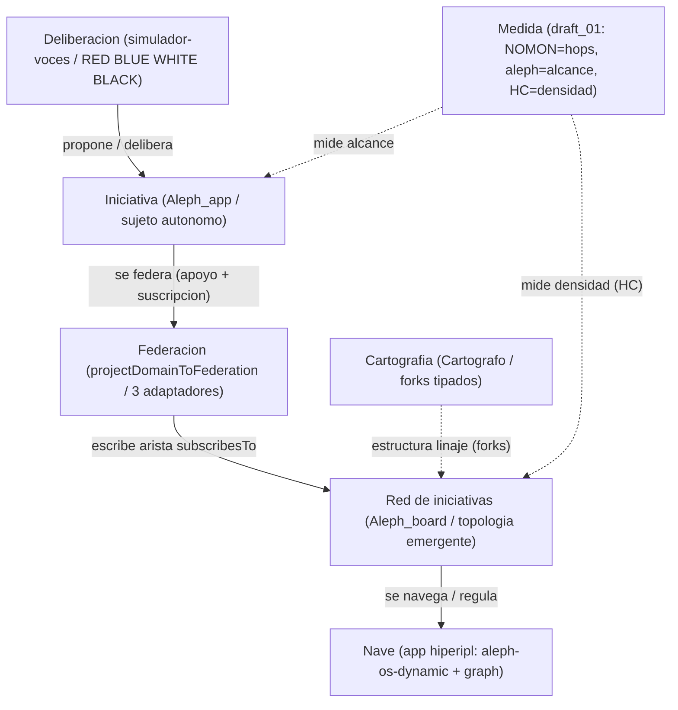

# HiperIPL — hoja de ruta de integración (caso de uso real sobre el Programa ASI del 6-jun)

> **Función.** Documentar **cómo construir HiperIPL** montándolo SOBRE el programa ya
> definido el 6-jun ([`Federation_ASI_Program.md`](SESION_06_JUNIO/Federation_ASI_Program.md)
> + [`MVP.md`](SESION_06_JUNIO/MVP.md)), **sin reinventar** Epic F ni cerrar ninguna `SPEC?`.
> **Naturaleza.** Hoja de ruta documental. La implementación es fase posterior: aquí **no se
> escribe código**, **no se cierran `SPEC?`**, **no se migran piezas del Mac**, **no se arregla `draft_01.ts`**.
> **Tesis heredada (no se re-discute).** La Federación es una **PROYECCIÓN** del `DomainContract`
> (`projectDomainToFederation()`, tres adaptadores SSB / IACM-RNFP / Pub.Rooms); F6 RESUELTO =
> "federar todo"; NETWORK-ENGINE = cerebro de contratos que proyecta.
> **Entregables hermanos (Entregable A).** [`hiperipl-reanclaje.md`](hiperipl-reanclaje.md),
> [`hiperipl-reconciliacion.md`](hiperipl-reconciliacion.md), [`auditoria-hiperipl.md`](auditoria-hiperipl.md).

---

## 1. Posicionamiento — HiperIPL como instancia del díptico

HiperIPL **no es un programa nuevo**: es una **instancia jugable** del Tablero Aleph del 6-jun.
Cada concepto de HiperIPL reancla en una pieza ya existente del workspace, sin green-field.

| Rol HiperIPL | Modelo del 6-jun | Pieza existente reutilizable | Estado pieza |
|---|---|---|---|
| **Iniciativa** (unidad de propuesta política) | `Aleph_app` — sujeto autónomo con máquina de estado + ventana de contexto | [`Aleph_app.md`](SESION_06_JUNIO/Aleph_app.md); juegos ① Builder / ② Player ([`games/01`](SESION_06_JUNIO/games/01-arg-builder.md), [`games/02`](SESION_06_JUNIO/games/02-arg-player.md)) | READY (conceptual) |
| **Red de iniciativas** (el Tablero) | `Aleph_board` — topología emergente keyring + suscripciones | [`Aleph_board.md`](SESION_06_JUNIO/Aleph_board.md); ③ Router / ④ Regulador ([`games/03`](SESION_06_JUNIO/games/03-arg-router.md), [`games/04`](SESION_06_JUNIO/games/04-juego-de-la-vida-regulador.md)) | READY (conceptual) |
| **Deliberación** (tribunales, palabra continental) | Sesión multi-voz por colores | [`simulador-voces/SKILL.md`](../../../SCRIPTORIUM-GAMES/SCRIPTORIUM-CATALOG-PLAYER/.github/skills/simulador-voces/SKILL.md) + pack [`red-blue-white-black-pack`](../../../SCRIPTORIUM-GAMES/SCRIPTORIUM-CATALOG-PLAYER/.github/skills/simulador-voces/packs/red-blue-white-black-pack/recap.md) | READY (RED/BLUE/WHITE/BLACK) |
| **Cartografía / bifurcación** (genealogía de propuestas) | Cálculo de forks `⊢ ⊬ ⊘ ⥱ ⟲ ≈` | Cartógrafo `yo-no-soy-yo` | **MISS** (solo puntero al Mac) |
| **Persistencia / federación** (voz que persiste) | Tercera proyección del `DomainContract` | Epic F → `projectDomainToFederation()` (adaptadores SSB/IACM/Pub.Rooms) | BUILD (declarada, sin runtime) |
| **Medida** (alcance, densidad) | `NOMON = hops`, `ℵ = alcance`, `HC = densidad` | [`draft_01.ts`](../draft_01.ts) | **BUILD — no compila** (ver §5) |
| **Superficie / UI ciudadana** (la Nave) | App del catálogo + cuaderno azul | patrón [`aleph-os-dynamic`](../packages/apps/src/catalog/aleph-os-dynamic/contract.ts) + grafo [`graph/app.ts`](../packages/apps/src/catalog/graph/app.ts) | READY |

> **Lectura.** Una **iniciativa** (sujeto `Aleph_app`) nace de una **deliberación** por voces, se
> **federa** mediante la proyección del contrato (escribiendo una arista `aleph:subscribesTo` en
> el grafo del `Aleph_board`), su **linaje** se cartografía con los operadores de fork, y todo se
> **mide** con `draft_01` y se **navega** en la Nave. El Cartógrafo aparece punteado: es dependencia
> no migrada (§4, §5).

---

## 2. Slices de construcción (REUSO, no green-field)

Cada slice cita la pieza concreta que reutiliza. Ninguno arranca de cero.

### Slice A — App `hiperipl` (la Nave) · READY para empezar

| Qué | Reusa (cita) | Salida documentada |
|---|---|---|
| Launcher + MCP App UI declarativa | patrón [`aleph-os-dynamic/contract.ts`](../packages/apps/src/catalog/aleph-os-dynamic/contract.ts) (`createKnowledgeSystemContract`, `launcherName`) + montaje [`aleph-os-dynamic/app.ts`](../packages/apps/src/catalog/aleph-os-dynamic/app.ts) (`projectDomainToMCP` → `mountMcpRoute`) | `catalog/hiperipl/{contract.ts,app.ts}` (NO se escribe aún) |
| Grafo de iniciativas (nodos + aristas) | [`graph/app.ts`](../packages/apps/src/catalog/graph/app.ts): ya carga `aleph0..3` como `Universe` con `GraphStorePlugin` y consulta SPARQL tipada (`select`/`triple`) | Iniciativas = nodos; apoyos/suscripciones = predicados `aleph:subscribesTo` |
| Publicación estática (cuaderno) | cuadernos azul de `DocumentMachineSDK/docs/azul/cuadernos/` | `hiperipl_2d.html` (nombre ABIERTO en SPEC?-013) |

**DoD slice A:** la ciudadanía **navega** un grafo de iniciativas (lectura) en MCP App o cuaderno
estático, sin wallet ni identidad criptográfica obligatoria (consistente con el §5 "qué NO es el
MVP" de [`MVP.md`](SESION_06_JUNIO/MVP.md): "keyring puede empezar como `IdentityContract`").

### Slice B — `DomainContract` de HiperIPL (resuelve la *forma* de SPEC?-009)

| Qué | Reusa (cita) | Salida documentada |
|---|---|---|
| Entidad de dominio → contrato | [`contract-adapters/entity-metadata.ts`](../packages/contract-adapters/src/entity-metadata.ts): `fromEntityMetadata()` ya genera collection-resource, item-template, prompt de diseño, `persist_*` y sampling de crítica desde `EntityMetadataLike` | `InitiativeMetadata`, `SupportRecord`, `ForkRecord` como entradas a `fromEntityMetadata()` |
| Proyección a agentes/IDE | `projectDomainToMCP()` (matriz [`ECOSYSTEM.md`](../INSTRUCTIONS/LAYER_1/ECOSYSTEM.md): proyección declarativa pura, CERO acoplamiento al SDK) | Resources `aleph://initiatives` y `aleph://initiatives/{id}` (lecturas, NO tools CRUD) |
| Proyección a clientes HTTP | `projectDomainsToGraphQL()` (misma matriz) | Query de iniciativas (post-MVP) |

**Nota de alcance (SPEC?-009 sigue ABIERTA).** Este slice **no decide** entre "InitiativeMetadata
dedicado" vs "reutilizar el genérico"; solo documenta que **el andamio `fromEntityMetadata()` ya
soporta ambas vías sin EVM** (el seam EVM de YELLOW §3.4 es `SPEC?`, no código). La decisión la
toma el *NE maintainer*.

**DoD slice B:** una iniciativa se expresa como `DomainContract` y se proyecta a MCP **sin generar
tools CRUD automáticas** (regla Resource-first de `ECOSYSTEM.md`).

### Slice C — Federación como capa de voz/persistencia (Epic F, fases 0-5)

Montado **explícitamente** sobre las fases del Programa ASI; cada fila es una fila del backlog de
Epic F, no invención nueva.

| Fase Epic F | Slice HiperIPL | Pieza / cita | Desbloquea |
|---|---|---|---|
| **0 · Desbloqueo** | Relay real del hub + routing `target`/`room` | [`hub/app.ts`](../packages/apps/src/catalog/hub/app.ts) (`createPubSubHub`) + bridge publicable de [`hello/app.ts`](../packages/apps/src/catalog/hello/app.ts) (`markPublishable`) | ③ Router; base de ④; MVP §3 pasos 2-3 |
| **1 · Contratos** | `projectDomainToFederation()` esqueleto declarativo | tesis §3 del Programa ASI (simetría con MCP/GraphQL) | proyección testeable sin red |
| **2 · Protocolos** | IACM/RNFP como tipos de borde | ADR 0012 candidata; `@network-engine/protocols` | mensajería tipada entre sujetos-iniciativa |
| **3 · Topología** | Quads `aleph:subscribesTo` + cálculo de alcance ℵ | [`graph/app.ts`](../packages/apps/src/catalog/graph/app.ts) + ADR 0013 candidata + spike F5 | MVP §3 pasos 3-5 |
| **4 · Adaptadores reales** | Cliente SSB + Pub.Rooms WSS | servicios externos `BlockchainComPort` (SSB) y `ScriptoriumVps` (Pub.Rooms) — F6 "federar todo" | persistencia BOE/feeds append-only |
| **5 · Regulador HC** | Slider `concentration` + visor radicoma↔hegemón | ④ [`games/04`](SESION_06_JUNIO/games/04-juego-de-la-vida-regulador.md): graduar `friends.hops`/pubs | cierra el díptico con datos |

**DoD slice C (MVP mínimo):** Fase 0 + Fase 1 + una arista en el grafo (= [`MVP.md`](SESION_06_JUNIO/MVP.md) §3, pasos 1-3).
El resto (fases 4-5) depende de adaptadores externos.

### Slice D — Deliberación (conecta papers ↔ juego existente)

El hallazgo de reconciliación: los colores **RED/BLUE/WHITE/BLACK** de los papers **coinciden** con
el pack ya implementado de `simulador-voces`. No se recrea; se **reusa**.

| Qué | Reusa (cita) | Correspondencia |
|---|---|---|
| Voces y paradigmas | [`recap.md`](../../../SCRIPTORIUM-GAMES/SCRIPTORIUM-CATALOG-PLAYER/.github/skills/simulador-voces/packs/red-blue-white-black-pack/recap.md): RED (restitutiva/Bartleby), BLUE (Turin/metrólogo), WHITE (cartógrafo/Hilbert), BLACK (legislativa) | mapea a [`RED.md`](../../../papers-hiperipl/RED.md), [`BLUE.md`](../../../papers-hiperipl/BLUE.md), [`WHITE.md`](../../../papers-hiperipl/WHITE.md), [`BLACK.md`](../../../papers-hiperipl/BLACK.md) |
| Estructura de sesión | 5 rondas (Mapeo, Delta, Tensión, Síntesis, Final) del `SKILL.md` | delibera una iniciativa antes de federarla |
| Fricción como valor | "Merge Agéntico": la contradicción se documenta como `MERGE_CONFLICT` (valor cartográfico para el Radicoma) | sustrato de los forks `⊬`/`⟲` y de la prioridad eco↔cuórum (SPEC?-011) |

**Pendiente (no se cierra):** extender el pack con YELLOW/GREEN (existen [`YELLOW.md`](../../../papers-hiperipl/YELLOW.md), [`GREEN.md`](../../../papers-hiperipl/GREEN.md) como papers, no como voces del pack). Es decisión de diseño, no de este roadmap.

**DoD slice D:** una sesión de voces sobre una iniciativa produce `recap-<voz>.md` + nodos candidatos
para el grafo (entrada al Slice A/C).

### Slice E — Motor formal de licitud · BUILD/BLOQUEADO (no bloquea el MVP)

| Qué | Estado | Bloqueo / SPEC? |
|---|---|---|
| `draft_01.ts` como motor de licitud (`Next`/Horn) | **BUILD — no compila** | Spike previo obligatorio (§5); SPEC?-010 |
| Prioridad Horn: eco > cuórum vs cuórum > eco | ABIERTA | SPEC?-011 (RED + GREEN) |
| Mecanismo de gracia/fork | ABIERTA | SPEC?-012 (RED); depende del Cartógrafo (MISS) |

> El MVP del 6-jun usa **solo cardinalidad/alcance** del lenguaje Aleph, **no** el port completo de
> ZFC/Horn ([`MVP.md`](SESION_06_JUNIO/MVP.md) §5). Slice E es **opcional y posterior**; no debe bloquear A-D.

---

## 3. Spikes y decisiones abiertas — correspondencia SPEC? ↔ F1-F6

Solo se citan IDs `SPEC?` **verificados** en los papers. No se inventan IDs ni se cierran decisiones.

### 3.1 Tabla SPEC? (papers) ↔ Epic F

| SPEC? | Decisión abierta (paper) | Spike/Feature de Epic F | Fase | Quién (paper) |
|---|---|---|---|---|
| SPEC?-002 | Persistencia BOE (L2 / Oasis / híbrido / IPFS) — WHITE, BLACK | F4 adaptador SSB (append-only); F1 topología | 3-4 | Arquitectura |
| SPEC?-003 | Cadena/rollup destino — WHITE, YELLOW | fuera del Epic F inicial (EVM aspiracional, seam `SPEC?`) | posterior | Comunidad |
| SPEC?-004 | Identidad/voto (1p1v / token / attestations / zk) — WHITE, RED, BLACK | **F2** keyring SSB ed25519 (ADR 0011) | 4 | Diseño + Marx |
| SPEC?-006 | Scope MVP (off-chain / on-chain / gobernanza) — WHITE | MVP §3 (5 pasos); fija el DoD | 0-3 | PO + engine-plan |
| SPEC?-008 | Schema grafo HiperIPL (futures-engine / Cartógrafo / híbrido) — YELLOW | **F1** topología en `GraphStoreProtocol` vs Mongo vs on-read SSB | 3 | Grafista + PO |
| SPEC?-009 | Extensión contract-adapters (`InitiativeMetadata` / genérico) — YELLOW | Feature `KeyringContract` + Initiative contract sobre `fromEntityMetadata()` | 1 | NE maintainer |
| SPEC?-010 | Motor de licitud (`draft_01`/`Next` / Prolog / Solidity) — YELLOW | Slice E (spike `draft_01`) | E (posterior) | Formalistas |
| SPEC?-011 | Prioridad Horn (cuórum>eco / eco>cuórum / paralelo) — YELLOW, GREEN | mapea a "Merge Agéntico" del simulador (fricción no resuelta) | E | RED + GREEN |
| SPEC?-012 | Inmutabilidad vs gracia / fork (manual / multisig / on-chain) — YELLOW, RED | depende del Cartógrafo (MISS); operadores `⊢ ⊬ ⊘ ⥱ ⟲ ≈` | BLOQUEADO | RED |
| SPEC?-013 | Stack UI cuaderno (HTML / Three.js / Angular) — BLUE | Slice A (`hiperipl_2d.html`) | 1-2 | UI lead |

### 3.2 Incertidumbres de Epic F (F1-F6) ancladas a HiperIPL

| ID | Pregunta abierta del Programa ASI | Enlace concreto a HiperIPL |
|---|---|---|
| F1 | ¿Topología en RDF (`GraphStoreProtocol`), Mongo o on-read del follow graph SSB? | Dónde viven iniciativas + apoyos + aristas (↔ SPEC?-008) |
| F2 | ¿Identidad = adaptador a SSB real o `KeyringContract` abstracto? | Firma de apoyos sin doxxing (↔ SPEC?-004, SPEC?-027 privacidad) |
| F3 | ¿`@network-engine/protocols` por copia, submódulo o dependencia npm? | Mensajería entre sujetos-iniciativa |
| F4 | ¿Relay interno (Socket.IO) y Pub.Rooms = dos adaptadores o uno reemplaza al otro? | ③ Router de iniciativas |
| F5 | ¿`NOMON`/`hops` on-read (query de alcance) o materializado por eventos? | Cálculo de ℵ (alcance) por iniciativa |
| F6 | **RESUELTO (PO, 06-jun): federar todo.** Consumir hermanas como servicios; NE = cerebro de contratos | HiperIPL **no porta SSB/Oasis**: lo consume vía `BlockchainComPort`/`ScriptoriumVps` |

### 3.3 Operadores de fork (cartografía de linaje — Cartógrafo, MISS)

Tomados de YELLOW §3.2 (no se redefinen aquí; solo se listan para el spike del Cartógrafo):
`⊢` fork reconocido por la autora · `⊬` rechazo de fork que reclama paternidad (caso Marx 1882) ·
`⊘` adopción póstuma sin juicio del padre · `⥱` atribución retroactiva · `⟲` dos distros combatiendo
el mismo linaje · `≈` iniciativas cognadas sin filiación. Estos operadores **requieren** el Cartógrafo
real (no migrado) para volverse machine-readable; hoy solo viven como texto en los papers.

---

## 4. Orden de trabajo por fases (alineado con fases 0-5 del Programa ASI)

> No se fija el orden como decreto (espíritu del §7 de [`Federation_ASI_Program.md`](SESION_06_JUNIO/Federation_ASI_Program.md)).
> Lo que se fija es **qué cuenta como hecho** y **qué está BLOQUEADO** por piezas no migradas.

### Fase 0 — Desbloqueo (Epic F fase 0 · MVP paso 0)
- [ ] Relay real del `PubSubHub` + routing `target`/`room` en el bridge.
- [ ] Test: 2 bridges, A emite ⥱ B recibe por room.
- **Bloqueo:** ninguno. Es deuda existente, riesgo bajo. Reusa [`hub/app.ts`](../packages/apps/src/catalog/hub/app.ts).

### Fase 1 — Contratos (Epic F fase 1)
- [ ] Esqueleto declarativo `projectDomainToFederation()` (sin runtime).
- [ ] `Initiative`/`SupportRecord` como `DomainContract` vía [`entity-metadata.ts`](../packages/contract-adapters/src/entity-metadata.ts).
- [ ] App `hiperipl` en catálogo, modo lectura (Slice A).
- **Bloqueo:** ninguno crítico. SPEC?-009 queda ABIERTA (se documenta, no se cierra).

### Fase 2 — Deliberación + ingestión
- [ ] Sesión `simulador-voces` sobre una iniciativa de prueba (Slice D).
- [ ] Pipeline manual corpus → grafo (skill `futures-engine` de `DocumentMachineSDK`, sin agentes runtime).
- **Bloqueo (BLOQUEADO):** el **Cartógrafo `yo-no-soy-yo`** está MISS (solo puntero al Mac); los
  forks `⊢ ⊬ ⊘ ⥱ ⟲ ≈` se anotan a mano, no se calculan. `future-pipeline-engine/` NO migrado:
  cualquier paso que lo invoque es **dependencia, no base lista**.

### Fase 3 — Topología (Epic F fase 3 · MVP pasos 3-5)
- [ ] Arista `aleph:subscribesTo` sobre el grafo de [`graph/app.ts`](../packages/apps/src/catalog/graph/app.ts).
- [ ] Spike F5: `hops → alcance → ℵ` para 3 nodos toy.
- [ ] Regulador `concentration` + visor HC (④).
- **Bloqueo (BLOQUEADO):** [`draft_01.ts`](../draft_01.ts) **no compila** (§5). Hasta el spike, usar
  una **métrica simplificada** derivada del grafo (conteo de alcanzables), no el motor `Next`.

### Fase 4 — Adaptadores reales (Epic F fase 4)
- [ ] Cliente Pub.Rooms WSS (`/runtime`) hacia `ScriptoriumVps`.
- [ ] Adaptador de identidad SSB (`whoami`/unix-socket) hacia `BlockchainComPort`.
- **Bloqueo:** requiere la red Docker `oasis_pub_net` y los servicios hermanos operativos (F6 = federar todo).

### Fase 5 — Formalismo + anclaje (posterior)
- [ ] Compilar `draft_01` mínimo (solo lo que mide alcance/cardinalidad).
- [ ] SPEC? EVM / attestations / oráculo eco, si el PO los prioriza.
- [ ] **Portar o reconstruir** el Cartógrafo (decisión THEIA_PATH vs green-field; ver Entregable A).
- **Bloqueo (BLOQUEADO):** Cartógrafo MISS, seam EVM aspiracional, SPEC?-002/003/004/010/011/012 ABIERTAS.

### Mapa de bloqueos (resumen)

| Pieza no lista | Tipo | Bloquea fase(s) | Tratamiento |
|---|---|---|---|
| `future-pipeline-engine/` | NO migrado | 2 (ingestión profunda) | dependencia; pipeline manual mientras tanto |
| Cartógrafo `yo-no-soy-yo` | MISS (puntero Mac) | 2, 3 (forks), 5 | spike de port/reconstrucción; forks a mano |
| `draft_01.ts` | BUILD — no compila | 3 (medida), 5 (licitud) | métrica simplificada; spike de compilación |
| Servicios hermanos (SSB/Pub.Rooms) | externos (Docker) | 4 | consumir vía F6, no portar |

---

## 5. Spike `draft_01.ts` — por qué es BUILD y no READY

[`draft_01.ts`](../draft_01.ts) es un **borrador**: define el sustrato formal (NOMON/Region/ℵ/HC)
pero **no compila**. Errores concretos que cualquier paso del "motor de licitud" debe tratar como
spike (no como base lista):

- `new RegionNatural()` (no existe tal clase; solo `RegionN`) y `console.log(isZFCRegion(N))` (usa el **tipo** `N` como valor).
- `isZFCRegion(reg: Region): boolean {}` con cuerpo vacío (no retorna `boolean`).
- `new Next()` instanciando una clase **abstracta**.
- `c.value(c)` en `HornNextContinous.tail` (invoca como función un `value: NOMON_COUNT` numérico).
- `isRQegion` con `if (reg.seed)` sin retorno en la rama y campo `seed` inexistente en `CtxParamsContinousR`.

Conclusión: el cálculo `NOMON=hops / ℵ=alcance / HC=densidad` se documenta como **objetivo medible**,
pero su materialización pasa por un spike de compilación. No se arregla aquí (fuera de alcance).

---

## 6. Niveles de "HiperIPL integrado" (no confundir con el MVP Tablero)

| Nivel | Criterio | Depende de |
|---|---|---|
| **MVP Tablero** (6-jun) | los 5 pasos de [`MVP.md`](SESION_06_JUNIO/MVP.md) §3 — dos sujetos federan, arista en grafo, regulador HC, ℵ derivada | fases 0-3 |
| **MVP HiperIPL** | iniciativa modelada (Slice B) + deliberación por voces (Slice D) + grafo navegable (Slice A) + persistencia federada BOE/SSB (Slice C fase 4) | + fase 4 |
| **HiperIPL completo** | + motor formal de licitud + anclaje L2 + oráculo eco + privacidad zk | + fase 5 + SPEC? cerradas por scrum |

Este roadmap apunta al **MVP HiperIPL**, usando el MVP Tablero como **subconjunto** (fases 0-3).

---

## 7. Fuera de alcance (de este documento)

- **No se escribe código** en este paso (es una hoja de ruta; la implementación es fase posterior).
- **No se cierra ninguna decisión `SPEC?`** (se respeta la regla de oro de los papers; solo se mapean).
- **No se migra** ninguna pieza desde el Mac: `future-pipeline-engine/`, Cartógrafo `yo-no-soy-yo`,
  `mapa-ilustracion-2.0.md`, `EXTERNO.md` quedan marcadas como dependencia/bloqueo.
- **No se arregla `draft_01.ts`** (spike documentado en §5; ejecución posterior).
- **No se hace testing end-to-end** (la síntesis la cubre otro paso/worker).

---

## 8. Promoción (cuando scrum valide)

1. Fusionar Epic F + slices HiperIPL en `DOSSIERS/federation-topology.md` (promoción ya prevista en
   el §10 del [`Federation_ASI_Program.md`](SESION_06_JUNIO/Federation_ASI_Program.md)).
2. Devolver el hallazgo "colores papers == pack `simulador-voces`" al equipo de diseño de
   [`papers-hiperipl/`](../../../papers-hiperipl/README.md) como nota (opcional, según visto bueno).
