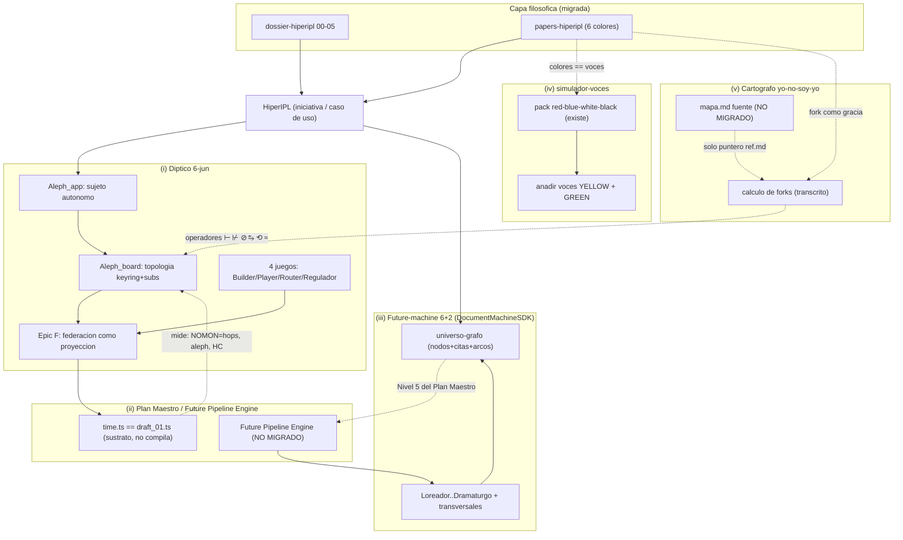

# HiperIPL — Reconciliación de genealogías del Scriptorium federado

> **Qué es esto.** Documento que sitúa **HiperIPL** dentro de las cinco genealogías que
> conviven en el workspace `aleph-scriptorium` y muestra que **no son rivales: son
> compatibles y reconciliables** porque viven en el **mismo workspace federado** (un núcleo
> `NETWORK-ENGINE` + submódulos hermanos), que es además una migración parcial del árbol
> THEIA_PATH del autor.
>
> **Tesis del documento (FIJA, no `SPEC?`):** HiperIPL es **una iniciativa / caso de uso**
> que se deja describir, sin contradicción, por las cinco lentes a la vez. Cada genealogía
> aporta una capa distinta (sujeto, sustrato, pipeline, deliberación, cálculo de filiación) y
> todas se anclan en piezas reales del workspace (ver `hiperipl-reanclaje.md` para el grado
> `READY/BUILD/MISS` de cada una).
>
> **Registro:** español, denso. Único set de operadores permitido: `⊢ ⊬ ⊘ ⥱ ⟲ ≈`.

---

## 0. Las cinco genealogías (de un vistazo)

| # | Genealogía | Pregunta que responde | Fuente de verdad (workspace) |
|---|---|---|---|
| (i) | **Díptico 6-jun** (`Aleph_app` / `Aleph_board`) + 4 juegos | ¿Qué es un nodo y qué forma toma su red? | `…/NETWORK-ENGINE/SCRATCHPAD/SESION_06_JUNIO/` |
| (ii) | **Plan Maestro / Future Pipeline Engine** + `time.ts`/`draft_01` | ¿Cómo cobra vida una sesión y qué transición es lícita? | `…/SCRIPTORIUM-CORE/01_PLAN_MAESTRO_TOPDOWN.md`, `…/STATE-MACHINE/DOCS/00_PLAN_MAESTRO.md`, `…/NETWORK-ENGINE/draft_01.ts` |
| (iii) | **Future-machine 6+2** (DocumentMachineSDK) | ¿Cómo se mueve un corpus hacia futuros bifurcados? | `DocumentMachineSDK/.github/skills/{futures-engine,engine-plan}/SKILL.md` |
| (iv) | **simulador-voces** (colores) | ¿Cómo se delibera entre posturas? | `…/SCRIPTORIUM-CATALOG-PLAYER/.github/skills/simulador-voces/` (+ pack `red-blue-white-black`) |
| (v) | **Cartógrafo `yo-no-soy-yo`** (cálculo de forks) | ¿Qué tipo de filiación/cancelación es cada fork? | cálculo `⊢⊬⊘⥱⟲≈` transcrito en `papers-hiperipl/00-LEXICON.md §C.5` (mapa fuente NO MIGRADO) |

> Las cinco están ancladas a la **capa filosófica** (`dossier-hiperipl/`, `papers-hiperipl/`)
> que da a HiperIPL su sentido político: **órgano de voz de la Ilustración 2.0**, centro
> vacío como neutralidad creíble, fork como derecho de gracia.

---

## 1. (i) Díptico 6-jun — el sujeto y su topología

`SESION_06_JUNIO/` parte de "¿qué pinta tiene un Tablero Scriptorium?" y separa dos voces:

- **`Aleph_app.md` (mitad A):** un nodo = **sujeto autónomo** con máquina de estado, proceso
  local y espacio agéntico propio, que se federa con transmedia.
- **`Aleph_board.md` (mitad B):** la red de esos nodos = **topología emergente** de
  *keyring + suscripciones* (no del tráfico).
- **4 juegos** (`games/`) = caras jugables del díptico: ① Builder (el sujeto se construye),
  ② Player (se ejecuta), ③ Router (se federa — "la deuda del relay"), ④ Juego de la Vida
  (regulador de topología, radicoma ↔ hegemón).
- **`Federation_ASI_Program.md`:** Epic F — la **federación como proyección** del
  `DomainContract` (igual que MCP y GraphQL son proyecciones): `projectDomainToFederation()`
  sobre tres raíles reales en submódulos (`BlockchainComPort`=SSB, `BotHubSDK`=IACM/RNFP,
  `ScriptoriumVps`=Pub.Rooms). Decisión PO (06-jun, F6): **federar todo**.

**Posición de HiperIPL aquí:** una **iniciativa** se modela como `Aleph_app` (sujeto); la
**red de iniciativas** es `Aleph_board` (topología). La deliberación pública es ③ Router; el
regulador de concentración del poder es ④ Juego de la Vida.

---

## 2. (ii) Plan Maestro / Future Pipeline Engine + sustrato `time.ts`

`01_PLAN_MAESTRO_TOPDOWN.md` nombra el core **"Future Pipeline Engine"** y lo recorre
**top-down** en 6 niveles (sesión en vivo → roles/PRESETS → transporte/federación → ingesta →
Document/Future Machine → **sustrato formal**). `00_PLAN_MAESTRO.md` recorre **bottom-up** el
mismo sistema (tablero formal → producto). Su §9 lo dice explícito: *"describen el mismo
sistema en direcciones opuestas; no se contradicen, se encuentran en el medio."*

- **`time.ts` = Nivel 6 = sustrato formal**: regiones ZFC + cláusulas de Horn + clase `Next`
  (`NOT_ZFC_REGION`). Su fuente de verdad real es **`draft_01.ts`** (alias `time.ts`; ver
  `00-LEXICON §G.5`).
- **Matiz crítico (issue residual):** `draft_01.ts` **no compila** hoy (boceto, no motor —
  ver `auditoria-hiperipl.md §3.1`). Y el núcleo nominal **`future-pipeline-engine/`** que el
  Plan cita (`index.md`, `dossier.md`) **no está migrado** (solo en THEIA_PATH).

**Posición de HiperIPL aquí:** se **mide** con `draft_01` (NOMON = saltos, ℵ = alcance,
HC = densidad de federación) y, cuando una bifurcación quiera tratarse con rigor, se valida
como una invocación de `Next` (lectura YELLOW: `Next(init)`, `Next(quorum_reached)` como
"guillotina del cuórum").

---

## 3. (iii) Future-machine 6+2 — el pipeline editorial

`DocumentMachineSDK/.github/skills/futures-engine/SKILL.md` + `engine-plan/SKILL.md` definen
el **pipeline 6+2**: 6 capas de datos (**Loreador → Bartleby → Archivero → Grafista →
Demiurgo → Dramaturgo**) + 2/3 transversales (**Pipeline / Portal / Cristalizador**). No
predice: **bifurca**. Su forma persistente es el **universo-grafo** (nodos con cita `[P-01]`,
niveles `T-N/T=0/T+∞`, arcos con plausibilidad `alta/media/baja`). De aquí salen también el
**contrato de existencia** `READY/BUILD/MISS` y la marca `SPEC?`.

**Relación con (ii):** la future-machine 6+2 **es** el Nivel 5 del Plan Maestro
("Document/Future Machine"). No es un marco rival: es **la misma pieza vista como Skill**.
Esto desmonta el falso dilema de la 1ª auditoría ("díptico vs. future-machine"): el Plan
Maestro ya las integra.

**Posición de HiperIPL aquí:** una iniciativa = **nodo** del universo-grafo; deliberar =
`expandir`/`bifurcar`; el **Grafista** porta voz/mando y el cálculo de forks; el
**Dramaturgo** produce la obra/UI (nodo azul).

---

## 4. (iv) simulador-voces — la deliberación entre colores (HALLAZGO DE REÚSO)

`simulador-voces/SKILL.md` orquesta debates entre **voces** en 5 rondas (Mapeo → Delta →
Tensión → Síntesis → Final) con **Merge Agéntico** (consolida el conocimiento sin forzar
consenso falso; documenta la fricción como un `MERGE_CONFLICT`, valor cartográfico del
Radicoma). Trae un **pack ya construido**: `packs/red-blue-white-black-pack/` (con `samples`
de sesiones, p. ej. `sesion-01-test-voice-fidelity/{red,blue,white,black}-statement-round-*`).

### El solapamiento (oportunidad, no recreación)

Los papers usan la paleta **WHITE / YELLOW / BLUE / RED / GREEN / BLACK**. El
`simulador-voces` ya tiene **RED / BLUE / WHITE / BLACK**. Solapan en **cuatro de seis**:

| Color paper | ¿Existe como voz en el pack? | Acción |
|---|---|---|
| RED (constitución, voz/mando) | **Sí** (`red-…`) | **reusar** |
| BLUE (nodo azul, Nave, UI) | **Sí** (`blue-…`) | **reusar** |
| WHITE (visión, ecosistema) | **Sí** (`white-…`) | **reusar** |
| BLACK (amenazas, NRx, privacidad) | **Sí** (`black-…`) | **reusar** |
| YELLOW (sustrato formal, Horn, forks) | No | **añadir** voz |
| GREEN (límites eco, anti-anestésico) | No | **añadir** voz |

**Consecuencia operativa:** la deliberación entre colores de los papers **no hay que
recrearla**. Se **reusa** el motor `simulador-voces` con su pack `red-blue-white-black`, y
solo se **añaden** dos *Voice Cards* (YELLOW, GREEN). Esto conecta, por primera vez, los
**papers** ↔ el **juego** existente: los seis papers de colores se vuelven los seis
perfiles deliberantes de una sesión de `simulador-voces` sobre una iniciativa HiperIPL.

---

## 5. (v) Cartógrafo `yo-no-soy-yo` — el cálculo de forks

El Cartógrafo formaliza la relación **padre ⇄ derivación** con el álgebra
`⊢ ⊬ ⊘ ⥱ ⟲ ≈`:

| Operador | Lectura | Uso en HiperIPL |
|---|---|---|
| `⊢` | fork aceptado / lineal | enmienda consensuada que el Core reconoce |
| `⊬` | fork rechazado ("yo no soy yo", con cita) | el Core rechaza una captura; secesión documentada |
| `⊘` | fork póstumo / no juzgado | regla heredada de una IPL estatal sin autora viva |
| `⥱` | atribución retroactiva | "esta distro es la verdadera Ilustración" |
| `⟲` | fork-vs-fork en nombre del padre | plutocracia vs. 1p1v invocando el mismo linaje |
| `≈` | parecido sin filiación | dos iniciativas cognadas, autores distintos |

**Estado de migración:** el **mapa fuente** (`AgentLoreSDK/.../yo-no-soy-yo-propositions-engine/mapa.md`)
**no está migrado** (solo el puntero `…/temas/yo-no-soy-yo-proposition-engine/ref.md`, una
línea a THEIA_PATH). Pero **la gramática sobrevive transcrita** en `00-LEXICON §C.5` y
`YELLOW §3.2`, así que es usable como vocabulario (`READY`; ver `hiperipl-reanclaje.md` B2).

**Posición de HiperIPL aquí:** el cálculo formaliza el **fork como derecho de gracia** (A.4)
y las **dos cancelaciones** (A.5). Caso fundacional de `⊬`: Marx 1882, *«je ne suis pas
marxiste»* — el padre que se autoexcluye de su descendencia con cita verificable.

---

## 6. Por qué son COMPATIBLES (la reconciliación)

Las cinco no compiten: **se acoplan en capas** sobre el mismo objeto (una iniciativa), y
todas residen en el **mismo workspace federado**:

1. **Mismo sustrato de medida.** `draft_01`/`time.ts` (ii) es a la vez el Nivel 6 del Plan
   Maestro y el "instrumento de medida" del díptico 6-jun: `NOMON == friends.hops` (SSB),
   ℵ = alcance, HC = densidad. El díptico (i) y el Plan Maestro (ii) **comparten física**.
2. **Misma pieza, dos nombres.** La future-machine 6+2 (iii) **es** el Nivel 5 del Plan
   Maestro (ii). No hay dos arquitecturas; hay una vista "Skill" y una vista "pila".
3. **Misma topología.** El `Aleph_board` (i) = el follow-graph SSB que Epic F proyecta = el
   campo de eigenstates que el Cartógrafo (v) cartografía. *Keyring + suscripciones* es la
   forma ejecutable de la topología que el Cartógrafo describe como grafo navegable.
4. **Misma deliberación.** Los colores de los papers (capa filosófica) = las voces de
   `simulador-voces` (iv); deliberar sobre un nodo del universo-grafo (iii) = correr una
   sesión de 5 rondas; la fricción no resuelta se registra como `⟲`/`MERGE_CONFLICT` (v).
5. **Misma disciplina.** `SPEC?` (de engine-plan, iii) = la REGLA DE ORO del dossier (capa
   filosófica): documentar lo abierto, no decidir. Las cinco respetan que cadena, token,
   identidad y cuórum quedan ABIERTOS.

**La federación es el pegamento.** Porque `NETWORK-ENGINE` es un **cerebro de contratos que
proyecta** (no un monolito), cada genealogía puede vivir en su submódulo y **acoplarse por
proyección/adaptador** sin fusionarse. Lo que parecían "genealogías rivales" eran **capas de
un mismo sistema federado** vistas por separado.

---

## 7. Diagrama de reconciliación

---

## 8. Cierre

Las cinco genealogías describen **el mismo objeto** (una iniciativa, su red, su deliberación
y su filiación) desde **capas distintas**, y conviven en el **mismo workspace federado**. La
reconciliación no exige elegir una y descartar las otras: exige **acoplarlas por proyección**
—exactamente el patrón que `NETWORK-ENGINE` ya usa (MCP/GraphQL/Federación)— y **reusar** lo
que ya existe (el pack de colores de `simulador-voces`, los cuadernos azul, los submódulos de
federación) en vez de recrearlo. Lo único genuinamente pendiente son las piezas **no
migradas** (`future-pipeline-engine`, Cartógrafo `mapa.md`/`mapa.graph.json`,
`mapa-ilustracion-2.0.md`, `EXTERNO.md`) y los **issues residuales** ya consolidados
(`draft_01.ts` no compila; seam EVM aspiracional). Todo lo demás **reconcilia**.

> Decisiones `SPEC?` (cadena, token, identidad, cuórum, schema del grafo, prioridad Horn
> eco-vs-cuórum, qué es `draft_01`) **permanecen abiertas**: este documento reconcilia
> genealogías, **no cierra diseño**.
