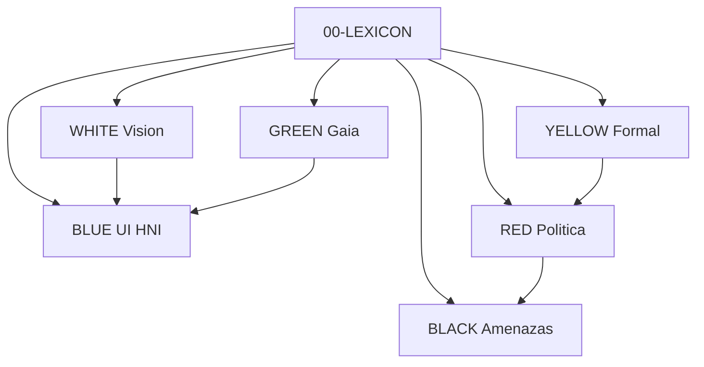

# Papers de colores — HiperIPL

*Dossier técnico-filosófico para audiencia Ethereum y ecosistema Aleph Scriptorium. HiperIPL como dispositivo de la future-machine, diseñado desde el nodo azul.*

**Estado:** DRAFT · **Decisiones:** ABIERTAS · **Dispositivo:** HiperIPL / HiperILP — pendiente de fijar

---

## Qué es este dossier

No es un whitepaper cerrado. Es un **conjunto de papers de colores** que:

1. **Fijan vocabulario** ([`00-LEXICON.md`](./00-LEXICON.md), incl. **§G conflictos**) entre filosofía (dossier/mapa), Scriptorium (future-machine) y Ethereum (L2, attestations).
2. **Documentan decisiones abiertas** (`SPEC?`) — no las toman.
3. **Posicionan HiperIPL** como capa de voz + cartografía de la Ilustración 2.0, hosteado en TRANSMEDIA_SYSTEM / NETWORK-ENGINE, UI en nodo azul, integración futura en AgentLoreSDK/docs.

**No modifica** el repo `aleph-scriptorium`; referencia rutas en THEIA_PATH y GitHub.

---

## Orden de lectura

| Orden | Paper | Color | Para quién |
|---|---|---|---|
| 0 | [`00-LEXICON.md`](./00-LEXICON.md) | — | Todos (obligatorio) |
| 1 | [`WHITE.md`](./WHITE.md) | Blanco | Ethereum / visión general |
| 2 | [`BLUE.md`](./BLUE.md) | Azul | UI, cartografía, ciudadanía |
| 3 | [`YELLOW.md`](./YELLOW.md) | Amarillo | Formalismo, implementadores |
| 4 | [`RED.md`](./RED.md) | Rojo | Gobernanza, política |
| 5 | [`GREEN.md`](./GREEN.md) | Verde | Ecología, materialismo |
| 6 | [`BLACK.md`](./BLACK.md) | Negro | Seguridad, NRx, privacidad |

**Atajo por rol:**

- **Builder L2:** WHITE → YELLOW → BLACK → RED
- **Producto / UX:** WHITE → BLUE → RED
- **Activista / fiscal robespieriano:** WHITE → RED → [`dossier-hiperipl/05`](../dossier-hiperipl/05-defensa-ante-el-fiscal.md)
- **Dev Scriptorium:** LEXICON → YELLOW → engine-plan gaps

---

## Mapa de colores

| Color | Rol | Capa future-machine |
|---|---|---|
| WHITE | Visión + ecosistema | Todas (mapa) |
| YELLOW | Garantías, Horn, forks | Grafista + sustrato |
| BLUE | Nodo azul, Nave | Dramaturgo → UI |
| RED | Constitución, voz/mando | Grafista + Pipeline |
| GREEN | Límites eco, anti-anestésico | Transversal Horn |
| BLACK | Amenazas, privacidad | Corpus + grafo |

---

## Mapa de procedencias

| Material | Origen | Uso en papers |
|---|---|---|
| Dossier refactorizado | [`dossier-hiperipl/`](../dossier-hiperipl/) | Tesis, stress-test, defensa |
| Mapa Ilustración 2.0 | [`mapa-ilustracion-2.0.md`](../mapa-ilustracion-2.0.md) | Marco filosófico |
| EXTERNO (crudo) | [`EXTERNO.md`](../EXTERNO.md) | Gaia, arquitecturas (refactorizado) |
| futures-engine | DocumentMachineSDK skill | Universo, bifurcación |
| engine-plan | DocumentMachineSDK skill | Pipeline, SPEC?, gaps |
| Cartógrafo | AgentLoreSDK mapa.md | Forks, eigenstates |
| Nodo azul | docs/azul | UI cartográfica |
| NETWORK-ENGINE | TRANSMEDIA_SYSTEM | contract-adapters, orquestación |
| Ethereum | Vitalik, L2, EAS, ERC-4337 | Anclaje (vocabulario) |

---

## Forja e integración (pendiente)

| Fase | Dónde | Estado |
|---|---|---|
| Papers conceptuales | `papers-hiperipl/` (este dossier) | DRAFT |
| Caso de uso lore | `AgentLoreSDK/docs/biblioteca/hiperipl/` | SPEC? — no creado |
| Seam contratos | `NETWORK-ENGINE/packages/contract-adapters` | BUILD |
| Cuaderno azul | `DocumentMachineSDK/docs/azul/cuadernos/` | SPEC?-013 |
| Despliegue | ScriptoriumVps + BlockchainComPort | Referenciado |

---

## Plantilla y disciplina

- Plantilla común: [`_PLANTILLA.md`](./_PLANTILLA.md)
- **Regla de oro:** no cerrar SPEC? en este dossier; escalar al PO / comunidad / engine-plan.

---

## Índice de SPEC? consolidado (muestra)

| ID | Tema | Papers |
|---|---|---|
| SPEC?-001 | Nombre HiperIPL/ILP | Todos |
| SPEC?-002 | Persistencia BOE | WHITE, BLACK |
| SPEC?-003 | Cadena/rollup | WHITE, YELLOW |
| SPEC?-004 | Identidad/voto | WHITE, RED, BLACK |
| SPEC?-011 | Eco vs cuórum | YELLOW, GREEN |
| SPEC?-012 | Gracia/fork | YELLOW, RED |
| SPEC?-013 | Stack UI | BLUE |
| SPEC?-023 | Modo urgencia eco | GREEN |
| SPEC?-027 | Privacidad apoyos | BLACK |

*Lista completa en cada paper §4.*

---

## Relación con otros dossiers del workspace

- [`dossier-hiperipl/`](../dossier-hiperipl/) — argumentación filosófica y defensa ante el fiscal (complementario).
- [`mapa-ilustracion-2.0.md`](../mapa-ilustracion-2.0.md) — mapa de situación Ilustración vs NRx.
- Este dossier — **puente técnico Ethereum ↔ Scriptorium** para presentación a builders.
