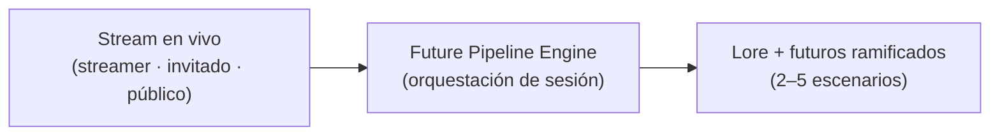
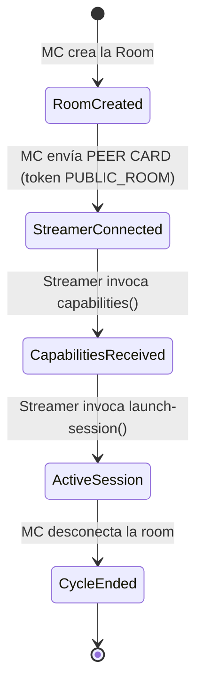
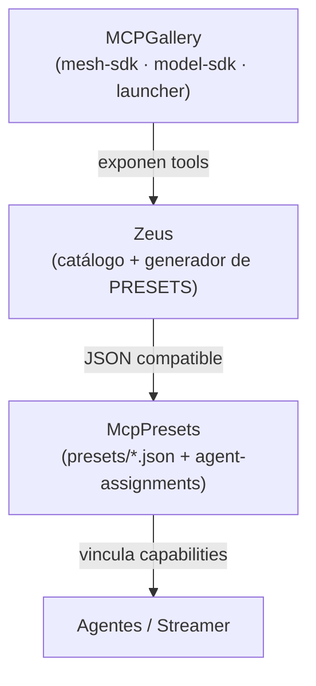
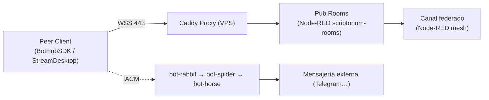
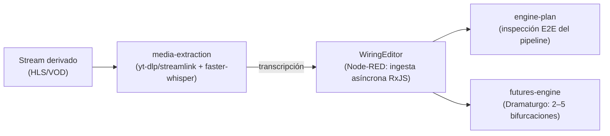
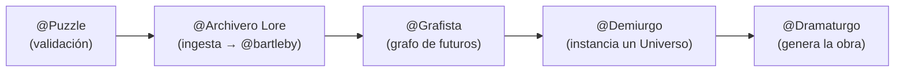
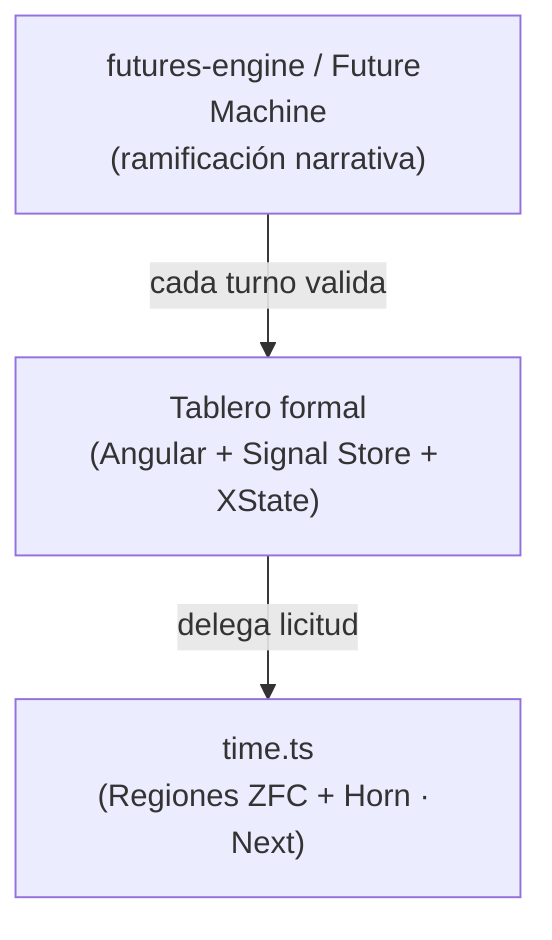
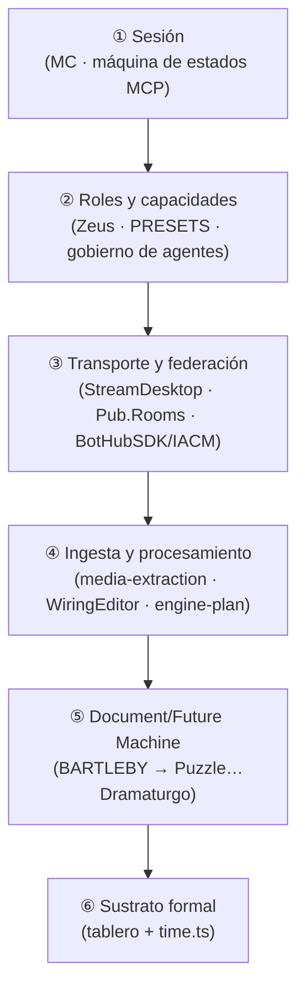

# Scriptorium — Plan Maestro (diseño Top-Down desde el Core)

Este documento rediseña el sistema **de arriba hacia abajo** partiendo del *core machine*
real que ya corre en el ecosistema: el **Future Pipeline Engine** documentado en
`ALEPH/ARCHIVO/future-pipeline-engine/` (`index.md`, `dossier.md`). Donde
[00_PLAN_MAESTRO.md](00_PLAN_MAESTRO.md) reconstruyó el concepto *bottom-up* (desde el
motor formal `time.ts` hacia el producto), aquí se invierte la dirección: se entra por la
**máquina que orquesta sesiones en vivo** y se desciende, capa a capa, hasta el sustrato
lógico.

El marco de gobierno es `ALEPH/.github/copilot-instructions.md` (hub de agentes
Aleph Scriptorium): fija el ecosistema de agentes (`@ox` como oráculo, banderas de
auditoría, `@scrum`/backlogs) y las **reglas de oro DRY** que este plan respeta —
referenciar fuentes de verdad, no duplicarlas, y ubicar el *qué* en `ARCHIVO/`, el *cómo*
en `.github/instructions`/plugins, el *cuándo* en backlogs y el *quién* en `@ox`.

---

## 0. Mapa de documentos

| Documento | Rol |
|-----------|-----|
| [01_PLAN_MAESTRO_TOPDOWN.md](01_PLAN_MAESTRO_TOPDOWN.md) | Este fichero. Diseño top-down desde el core. |
| [00_PLAN_MAESTRO.md](00_PLAN_MAESTRO.md) | Reconstrucción bottom-up (tablero formal → producto). |
| `ARCHIVO/future-pipeline-engine/dossier.md` | Core machine: secuencias, federación, máquina de estados. |
| `ARCHIVO/future-pipeline-engine/index.md` | Inventario de componentes reales y sus rutas. |
| `ALEPH/.github/copilot-instructions.md` | Gobierno de agentes (DRY, `@ox`, banderas, backlogs). |
| `ARCHIVO/simulator-hub/implementation_plan.md` | Futures Engine de simulación (ver 00, §7). |
| `ARCHIVO/SCRIPTORIUM-SKINS/` | Contenedor de producto (ver 00, §8). |

---

## 1. El Core: qué es la máquina

El **core machine** no es un componente, es un **pipeline de orquestación de sesiones
transmedia en vivo**. Su función única: tomar un *stream* real (un streamer + invitado +
elenco + público) y convertirlo en **lore procesado y futuros narrativos ramificados**,
federando el tráfico sin que ningún participante tenga que abrir puertos.

Todo lo demás —el tablero formal, el simulador, el envoltorio de producto— son **vistas o
sustratos** de esta máquina. El diseño top-down consiste en abrir esta caja por niveles.

> [!IMPORTANT]
> El core se gobierna bajo las reglas DRY del hub (`copilot-instructions.md`): cada pieza
> tiene **una fuente de verdad** y una ubicación canónica. Este plan **referencia**, no
> reimplementa.

---

## 2. Nivel 1 — La sesión y su máquina de estados (el "cuándo")

La capa más alta es el **ciclo de vida de una sesión**, conducido por el **MC (Arrakis
Theater)** y materializado en una máquina de estados MCP (`dossier.md`, §6):

Dentro de `ActiveSession` corren tres líneas concurrentes:

| Línea | Qué sostiene | Componente real |
|-------|--------------|-----------------|
| a) Live Connection | Keep-alive / ping en tiempo real | Pub.Rooms (WSS) |
| b) Transcripciones | Soporte textual del stream | `media-extraction` (STT) |
| c) Público / Chat | Intervenciones no etiquetadas | `MCPFirehoseServer` |

> Esta máquina de sesión es la **lectura "en producción"** de lo que el plan bottom-up
> modela como ciclo conductual XState ([00_PLAN_MAESTRO.md](00_PLAN_MAESTRO.md), §3 ③):
> los turnos del tablero son los intervalos de `ActiveSession`.

---

## 3. Nivel 2 — Roles y gobierno de capacidades (el "quién" y el "con qué")

Antes de procesar nada, el sistema reparte **quién puede hacer qué**. No se entregan todas
las herramientas a todos: se empaquetan en **PRESETS** generados por **Zeus** y asignados
por el plugin `McpPresets` (`dossier.md`, §1.2).

Esta capa **es la frontera con el gobierno de agentes** del hub
(`copilot-instructions.md`): los roles (MC, elenco, banderas de auditoría, `@ox`) y su
taxonomía viven allí; los PRESETS son el mecanismo técnico que **inyecta** esas capacidades
por sesión.

| Concepto del core | Gobierno en el hub |
|-------------------|--------------------|
| PRESETS / Zeus | Capacidades por rol (DRY: una fuente, `agent-assignments.json`) |
| MC / Elenco / Público | Taxonomía de agentes (`@ox` como oráculo) |
| Auditoría de sesión | Banderas (🔵⚫🔴🟡🟠) + auto-reflexión |
| Catálogo público (SKU) | Ubicación canónica del *qué* en `ARCHIVO/` |

---

## 4. Nivel 3 — Transporte y federación (el "por dónde")

Una vez repartidos los roles, el tráfico viaja por una **malla federada** que evita abrir
puertos: clientes externos (`BotHubSDK`, `StreamDesktop`) se conectan **saliente** vía WSS
al VPS, usando el token de la *Peer Card* (`dossier.md`, §5.2).

- **`StreamDesktop` (`kick-aleph-bot`)** — gateway bidireccional Kick↔Scriptorium con tres
  canales RxJS (App/Sys/UI) mapeados a agentes.
- **`Pub.Rooms` (ScriptoriumVps)** — vestíbulo de salas *layer2*; replicación y bootstrap
  federado sin puertos entrantes.
- **`BotHubSDK`** — peer TypeScript que corre la cadena IACM `bot-rabbit → bot-spider →
  bot-horse` hacia plataformas externas.

> Esta es la **capa de concurrencia transmedia** que el plan bottom-up reserva como
> extensión ([00_PLAN_MAESTRO.md](00_PLAN_MAESTRO.md), §6). Aquí, top-down, **es la
> infraestructura de entrada**, no un añadido futuro.

---

## 5. Nivel 4 — Ingesta y procesamiento (el "qué se hace con el flujo")

Con la sesión activa y federada, el flujo entra en las **Skills del motor** (definiciones
portables del `DocumentMachineSDK`, `index.md` §4):

| Skill | Responsabilidad | Salida |
|-------|-----------------|--------|
| `media-extraction` | Descarga + STT local | Soporte textual versionable (Lore) |
| `engine-plan` | Inspección/diagnóstico E2E; detecta huecos de spec | 6 capas de datos + 2 transversales |
| `futures-engine` | Detecta nodos de bifurcación | 2–5 escenarios paralelos |

> `futures-engine` es **la misma pieza** que el simulador analizado en el plan bottom-up
> ([00_PLAN_MAESTRO.md](00_PLAN_MAESTRO.md), §7): el core lo expone como Skill en producción;
> el simulador lo explora como pipeline de 4 voces.

---

## 6. Nivel 5 — La Document/Future Machine (el "cómo se cristaliza el conocimiento")

Bajo la Skill `futures-engine` opera una cadena editorial que convierte corpus en obra. En
su forma base es la **Document Machine (BARTLEBY)**; en su forma amplia, la **Future
Machine** la absorbe como subcadena (`dossier.md`, §3–§4).

- **Document Machine (base):** `@bartleby` (analista), `@archivero` (corpus), `@cristalizador`
  (diseña la `@voz`), `@portal` (interfaz adaptativa) → producen una **`@voz`** que escribe
  *desde* las reglas del corpus.
- **Future Machine (súper-cadena):** `Puzzle → Archivero Lore → Grafista → Demiurgo →
  Dramaturgo`, donde el análisis de `@bartleby` queda como motor de fondo.
- **Patrón `main`/`mod`:** el motor (`main`) es puro y agnóstico; el lore generado vive en
  el `mod` activo, sin ensuciar el motor. Es el mismo principio de **separación estricta**
  del plan bottom-up ([00_PLAN_MAESTRO.md](00_PLAN_MAESTRO.md), §3).

---

## 7. Nivel 6 — El sustrato formal (el "qué transición es lícita")

En el fondo del descenso está la **física** del sistema: el tablero formal y su motor
lógico-temporal. Es exactamente lo que el plan bottom-up construye desde abajo; aquí es el
**piso** al que llega el top-down.

- El **tablero formal** (4 capas convergentes) y `time.ts` (Regiones ZFC, cláusulas de Horn,
  clase `Next`) están especificados en [00_PLAN_MAESTRO.md](00_PLAN_MAESTRO.md), §3–§5.
- La conexión: una **bifurcación** del `futures-engine` que quiera tratarse como simulación
  formal (un "Juego de la Vida") se resuelve como una invocación de `Next` validada por
  XState. Así el motor narrativo del core se apoya, cuando hace falta rigor, en el sustrato
  lógico.

---

## 8. La pila completa (síntesis top-down)

| Nivel | Pregunta que responde | Fuente de verdad |
|-------|------------------------|------------------|
| ① Sesión | ¿Cuándo y en qué estado está la partida? | `dossier.md` §6 |
| ② Roles/capacidades | ¿Quién puede qué? | Zeus + `copilot-instructions.md` |
| ③ Transporte | ¿Por dónde viaja el flujo? | `dossier.md` §5; `index.md` §1,§5 |
| ④ Ingesta | ¿Qué se hace con el stream? | `index.md` §4 (Skills) |
| ⑤ Document/Future Machine | ¿Cómo se cristaliza el lore en obra? | `dossier.md` §3–§4 |
| ⑥ Sustrato formal | ¿Qué transición es lícita? | [00_PLAN_MAESTRO.md](00_PLAN_MAESTRO.md) §3–§5 |

---

## 9. Correspondencia entre los dos planes

Los dos documentos describen **el mismo sistema** recorrido en direcciones opuestas. No se
contradicen: se encuentran en el medio.

| Bottom-up ([00_PLAN_MAESTRO.md](00_PLAN_MAESTRO.md)) | Top-down (este documento) |
|------------------------------------------------------|----------------------------|
| §4 `time.ts` (física) | Nivel 6 (sustrato formal) |
| §3 Tablero (4 capas) | Nivel 6 ← Nivel 5 |
| §3 ③ XState (turnos) | Nivel 1 (máquina de sesión) |
| §6 Concurrencia transmedia | Nivel 3 (transporte/federación) |
| §6 Capa semántica | Nivel 4–5 (ingesta + corpus) |
| §7 Simulador (Futures Engine) | Nivel 4 (`futures-engine` Skill) |
| §8 Contenedor de producto | Vista externa de toda la pila |

> El plan bottom-up explica **por qué el núcleo es sólido** (parte de la lógica); este plan
> explica **cómo el sistema cobra vida en una sesión real** (parte del core en producción).
> Juntos cubren el sistema de extremo a extremo.
