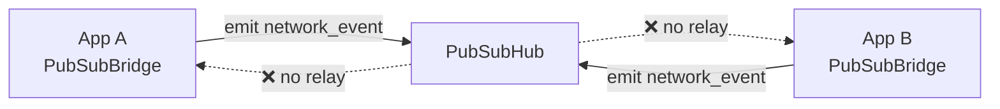
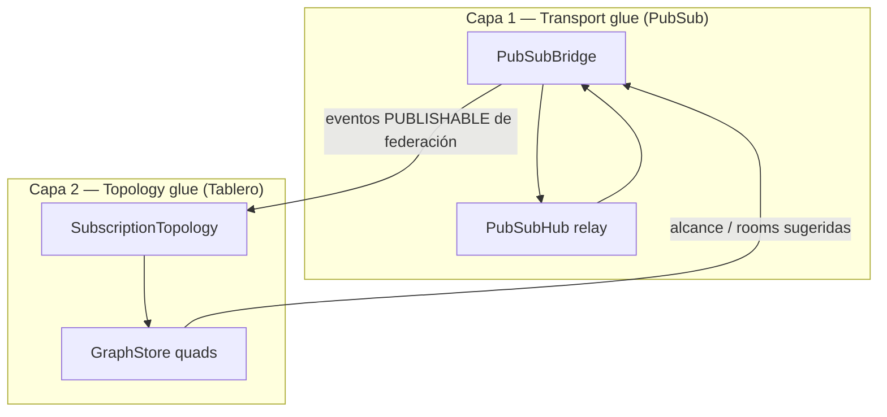
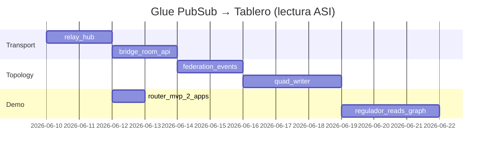
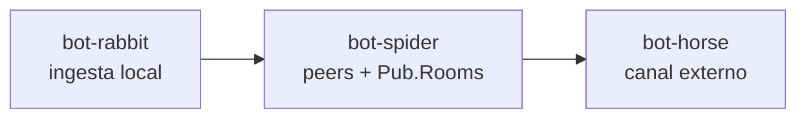
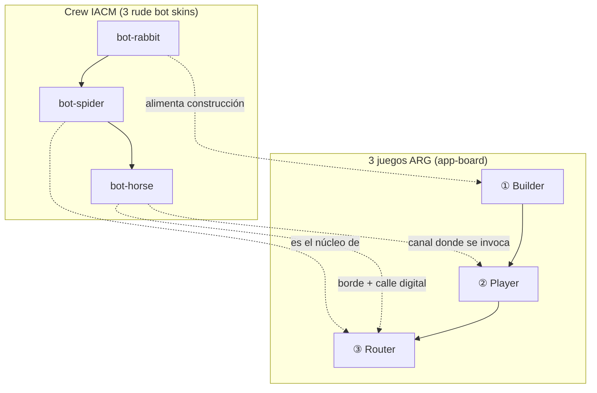

# Aleph en la codebase y Tablero Scriptorium
_Exported on 6/6/2026 at 16:07:41 GMT+2 from Cursor (3.7.12)_

---

**User**

¿Puedes mirar si está Aleph en esta codebase? Quiero activarlo en modo monkey. Para una pregunta que tengo. La pregunta es: 

¿Qué pinta tiene un Tablero Scriptorium?

---

**Cursor**

Busco referencias a Aleph, modo monkey y Tablero Scriptorium en la codebase.


**Sí, Aleph está en la codebase.** Lo encontré en varios sitios:

- **Sistema operativo cognitivo:** `SCRIPTORIUM-CORE/NETWORK-ENGINE/INSTRUCTIONS/ALEPH.instructions.md`
- **Modos:** `INSTRUCTIONS/MODES/MONKEY.instructions.md` (y AGI/ASI)
- **Lenguaje:** `LANGUAGES/aleph-lang/`
- **App MCP:** `packages/apps/src/catalog/aleph-os/`
- **Regla de launcher:** `.agents/rules/aleph-launcher.md`

**Modo activo: MONKEY MODE** — respuesta directa, sin dossier ni replanteo.

---

## ¿Qué pinta tiene un Tablero Scriptorium?

No es una app ni un dashboard único. Es un **circuito de pipelines** (una radicoma) que procesa señal narrativa como un sound system procesa audio:

**captura → normalización → selección → bifurcación → cristalización**

### La imagen mental

Analogía Trojan/sound system aplicada a transmedia:

| Sound System | Tablero Scriptorium |
|---|---|
| Selector | Equipo de Ceremonias |
| Operator | MCP + PRESETS |
| Deejay | Dramaturgo / ventana de contexto |
| Box Boys | **Aleph, Ox** (DevOps, transporte) |
| Massive | Personas que juegan / T.A.Z.s |
| Turntables + Mic | Streams, feeds, rude bots, rooms |
| Custom pre-amp | Future Pipeline Engine |
| Crossover | Router semántico |
| Amplifier racks | `media-extraction`, `WiringEditor`, `futures-engine`… |

### El flujo (lo que “se ve” operativamente)

```
Fuentes (stream, chat, bots, ediciones manuales)
    ↓
Captura (HLS, STT, firehoses, WiringEditor)
    ↓
Orquestación (PRESETS, router semántico, ledger de evidencias)
    ↓
Editorial (corpus, grafo de futuros, @voz)
    ↓
Salidas (lore versionable, ramas jugables, pieza dramatizada, contexto actualizado)
```

Y un **bucle entre sesiones**: pistas, bots, hallazgos de la comunidad → **triage editorial** (canon / rumor / propuesta / descarte) → vuelven al tablero.

### La pinta visual concreta

En el material de producto, el tablero se materializa como:

- **`SCRIPTORIUM_CARD_PUB.png`** — el **tablero ARG**: hub/pub federado para entretejer la red
- **`SCRIPTORIUM_CARD_ROOMS.png`** — las **pistas de baile**: rooms donde ocurren las sesiones

En una party: el Equipo de Ceremonias abre la sala, los skins despliegan el network-mesh, las ventanas de contexto suben al escenario, y las personas que juegan entran desde cualquier red. El tablero bombea **presión narrativa** (no sonora): una rave de información orquestada en vivo, con libre albedrío sobre el tablero.

---

**En una frase:** un Tablero Scriptorium es un **hub ARG federado** donde señales multívocas entran, se normalizan, se editan con criterio, bifurcan en futuros jugables y cristalizan en obra — con Aleph/Ox montando el transporte y el bucle DevOps detrás.

La fuente canónica está en `analisis_transmedia_system.md`, sección **«¿Qué pinta tiene un Tablero Scriptorium?»** (líneas 16–113).

---

**User**

@SCRIPTORIUM-CORE/NETWORK-ENGINE/draft_01.ts En modo monkey, ¿esto qué es o qué pretendería ser a partir de lo que hay?

---

**Cursor**

**MONKEY MODE** — lectura directa del archivo.

---

## Qué es

Un **borrador del núcleo de `aleph-lang`**: modelar “regiones” matemáticas (ℕ, ℤ, ℚ, ℝ, irracionales…) como objetos ejecutables en TypeScript, con un patrón de **cláusulas Horn** (`head` / `tail`) para avanzar estado.

No compila tal cual. Es scratchpad con ideas a medias y trozos rotos.

---

## Qué pretende ser

Un **motor de pasos sobre dominios numéricos** donde:

1. **`NOMON` / `NoNOMON` / `ZERO`** = convención propia para `+1`, `-1`, `0` y dirección de avance.
2. **`IntervalBounds`** = intervalos abiertos/cerrados (ℕ, negativos, ℤ, región finita…).
3. **`CtxAleph`** = estado de una región: intervalo + valor + mensajes de error.
4. **`HornNext*`** = operación “siguiente”: valida límites (`MIN_OVERFLOW`, `MAX_OVERFLOW`, `NOT_ZFC_REGION`) y avanza el valor.
5. **`RegionN`, `RegionZ`, `RegionRQ`, `RegionRI`…** = instancias concretas de dominios.
6. **`Aleph0`, `Aleph1`, `Aleph2`…** = jerarquía de cardinales (ℵ₀, ℵ₁…) como tipos compuestos.
7. **`ZFC` vs `NONZFC`** = regiones que respetan o no las reglas de teoría de conjuntos al hacer `next()`.

La meta implícita (por los comentarios largos de líneas 460–668): acabar siendo un **lenguaje formal de fórmulas ZFC** (tokens, gramática BNF, regiones válidas) cuyo “runtime” son estos contextos/regions — enlazado con la idea del tablero Scriptorium de “capas Aleph” y lienzos ZFC.

---

## Qué ya funciona (en idea)

- **`HornNextDiscrete`**: avanza enteros, salta valores en `restricted`, empuja errores a `messages`.
- **`HornNextContinousRQ`**: avanza racionales `a/b`.
- **`HornNextContinousRI`**: rota por una lista de irracionales.
- Constantes de región y operaciones prearmadas al final del archivo.

---

## Qué está roto o vacío

| Trozo | Estado |
|---|---|
| `HornNextContinous.tail` | `c.value(c)` — bug, no avanza |
| `isRQegion` | función incompleta |
| `isZFCRegion` | cuerpo vacío |
| `ZFC` / `NONZFC` | referencian `CTX_UNDEFINED`, `ContextExternal`, `new Next()` — no existen |
| `RegionNatural` | no definida (línea 678) |
| `periodToRational` | `throw NOT_IMPLEMENTED` |
| `Aleph1`, `Aleph2`… | `any` / `X` — placeholders |
| `enum ALEPHS` | solo `ZERO` |

---

## En una frase

`draft_01.ts` pretende ser el **kernel tipado de Aleph**: regiones numéricas con límites, operaciones Horn de “siguiente paso”, y una frontera ZFC/no-ZFC — pero hoy es un **borrador conceptual** a medio cablear, no código listo para integrar en NETWORK-ENGINE.

---

**User**

Entonces, a renglón seguido y entiendo es su especificación, decías: "". Investiga eso y llueva e ideas para agile backlog decision.

Un borrador del núcleo de aleph-lang: modelar “regiones” matemáticas (ℕ, ℤ, ℚ, ℝ, irracionales…) como objetos ejecutables en TypeScript, con un patrón de cláusulas Horn (head / tail) para avanzar estado.

La meta implícita (por los comentarios largos de líneas 460–668): acabar siendo un lenguaje formal de fórmulas ZFC (tokens, gramática BNF, regiones válidas) cuyo “runtime” son estos contextos/regions — enlazado con la idea del tablero Scriptorium de “capas Aleph” y lienzos ZFC.

Entiendo que el lenguaje modelo esto y ya podemos hacer una app para mover el draft?

Igual podríamos hacer un simulador sencillo de expansión de redes. Damos unas condiciones de inicio y hacemos expansión uniforme para demostrar la cosa crítica de la HC. Nuestro simulador permite ver que la relación entre longitud y cardinalidad en los aleph permite tanto: a) un sistema gödel dogmático, monolítico, simple. b) inflar o estirar la maya topológica admitiendo espacio entre los nodos de la red que aquí la gracia de que N = Z = Q = El útimo del Aleph 0, pero se sabe, y es independiente a ZFC, si el primero de los aleph 1 o del 2, etc...

 Al espacio recorrido desde lo discreto de la raiz griega "nomon" con las bases de inducción-silogismo o analisis-sintesis como slides de nuestra ui para expander o contraer.

Te pongo en modo plan.

---

**Cursor**

Investigando `aleph-lang`, el draft y la estructura de backlog para proponer un plan concreto.


Tengo el mapa: `aleph-lang` existe pero no implementa el draft; `compose-lang` ya tiene el patrón de simulador. Preparo el plan con decisiones de backlog.


**Decisiones de alcance (Epic Aleph)**

> **¿Qué priorizamos en el primer incremento del backlog?**
> - Demo-first: simulador HC + UI slides (math simplificada, sin portar todo draft_01)
> - Math-first: portar Horn/Regions/NOMON de draft_01 al package, app después
> - Paralelo: spike HC demo + spike port parcial del draft en el mismo epic
>
> Answer: Priorizamos diseñar en dossier un mapa de la feature. Fijar el objetivo, dar detalles, opciones y dejarlo listo para que el equipo scrum lo concrete. Como si le abrieramos un espacio de Hilbert acotado a este feature para que ellos escojan vía de implementación con una base documental ya hecha. Tienes qué identificar para esto los elementos que son del core y van en layers 1/3 y ver en layer 2 agregar para user y operator como los otros

> **¿Dónde debe vivir la UI del simulador en el primer entregable?**
> - MCP App en catalog (patrón compose-lang / aleph-os)
> - Solo consola + tests (sin UI web aún)
> - Vite standalone fuera del catalog MCP (PoC rápido)
>
> Answer: Será la A. Dentro de la network-engine. Ponte en modo Aleph ASI para diseñar este pre-plan.

Con el contexto completo, preparo el dossier de diseño (modo ASI) para que el equipo scrum elija la vía de implementación.


---

**User**

@SCRIPTORIUM-CORE/NETWORK-ENGINE/SCRATCHPAD/SESION_06_JUNIO/Aleph_app.md CREA UN SEGUNDO PLAN INDEPENDIENTE.

Me ha gustado mucho el anterior y lo he guardado. Pero tras discutirlo con el equipo vemos que esto es core. No es una app. ¿Verdad que responde un poco a la pregunta original de esta conversación? ¿cuál era?

Creo un enfoque podría ser:

Lo que hemos llamado "app" en el plan anterior es solo un "jugador"/"agente"/"sujeto" que se conecta y esta es la idea a un TABLERO ARG.

Al final lo que dará extensión o contracción de la red estará basada en su keyring y sus "suscripciones/suscriptores", no? No tanto como tráfico sino como la topología de la red?

Tenemos que empezar a hablar el lenguaje de Aleph y orientar la respuesta entiendo con esta idea:

- tablero: pubsub/mcp/rest-api. Sería tal cual un escenario. Con parte móvil de bridging para escenografía IO, abajo y operando con compose-lang, etc... 
- vps scriptorium pub.rooms + oasis.ssb.blockchain

CAPA

- graphQL: gateway universal
- scriptorium.pub + oasis.pub

APPS
Aparecen en el tablero:

- AppMongoDB Channels + graphDB + Máquina de Estado + Reactividad + mcp-app-ui

Nota, recuerda que estamos maximizando el uso de@SCRIPTORIUM-CORE/NETWORK-ENGINE/INSTRUCTIONS/LAYER_0/TS.instructions.md .

---

**Cursor**

Leo el scratchpad guardado y las instrucciones TS para orientar el segundo plan en el lenguaje de Aleph.

Entiendo el giro: esto es **core**, no app. La "app" del plan 1 es solo un **sujeto/agente** que se conecta al **Tablero ARG**, y la topología de la red (la expansión Aleph) la da el **keyring + suscripciones**, no el tráfico. Esto responde a la pregunta original: **¿Qué pinta tiene un Tablero Scriptorium?**

Exploro la infraestructura real (pubsub, graphQL, MongoDB channels, MCP, pub.rooms/SSB) para anclar el segundo plan.

Tengo el cuadro completo. Antes de escribir, confirmo el hallazgo clave que cambia el plan: **la infraestructura real no deriva topología de las suscripciones todavía** — el hub no reenvía eventos, no hay routing por rooms, y **no existe capa de keyring/SSB/identidad** (solo IDs branded y `IdentityContract` para URIs). Eso es precisamente el hueco que tu reencuadre quiere llenar.

Creo el segundo plan independiente.

---

**User**

He puesto en @SCRIPTORIUM-CORE/NETWORK-ENGINE/SCRATCHPAD/SESION_06_JUNIO/Aleph_app.md y@SCRIPTORIUM-CORE/NETWORK-ENGINE/SCRATCHPAD/SESION_06_JUNIO/Aleph_board.md , puedes hacer una pasada editorial en ambos para asentar. Deja abiertas decisiones, abre el espectro. Aprovechamos de la app su expresión autónoma con su máquina de estado, con su propio proceso local con espacio agéntico propio federado con transmedia. 

---

**Cursor**

Ambos planes están claros. Hago una pasada editorial que (1) los asienta como **díptico** —la app es el *sujeto autónomo*, el tablero es el *core*—, (2) abre el espectro de decisiones en lugar de cerrarlo, y (3) eleva la **expresión autónoma de la app**: máquina de estado propia, proceso local propio, espacio agéntico propio, federado con transmedia.

Empiezo por `Aleph_app.md`.

Ahora añado la sección de autonomía de la app, tras la arquitectura conceptual.

Ahora abro el espectro en las dos "recomendaciones ASI" cerradas.

Ahora actualizo la relación con aleph-lang y los criterios de éxito para reflejar la autonomía y el díptico.

Ahora `Aleph_board.md`: asiento el díptico, incorporo la autonomía de la app como sujeto federado, y abro el espectro de las recomendaciones.

Ahora enriquezco la relación con el Plan 1 (la app como sujeto autónomo que federa) y abro la recomendación de vías.

Cierro con los criterios de éxito del tablero, incorporando el díptico y el espectro abierto.

Pasada editorial completa en ambos. Quedan asentados como un **díptico** coherente, con el espectro de decisiones abierto.

## Qué cambié

**`Aleph_app.md` (mitad A — la app/sujeto):**
- **Reencuadre de cabecera:** ya no es "un simulador", es la **mitad A de un díptico** con `Aleph_board.md`, y se declara estado editorial "asentado pero abierto".
- **Nueva sección «La app como sujeto autónomo (expresión federada)»** con las cuatro propiedades que pediste, ancladas a código real:
  - máquina de estado propia (`machine.ts` / `AlephUniverse`)
  - proceso local propio (Bun, conexión saliente, *pretty good escrivivir*)
  - espacio agéntico propio (superficie MCP donde un agente habita)
  - federación voluntaria con transmedia (`PubSubBridge`)
  - más un diagrama sujeto-local → federación → tablero.
- **Nueva Vía D** (app como sujeto autónomo federado) y conversión de las "recomendaciones ASI" en **lecturas abiertas**, no veredictos.
- DoD ampliado con autonomía, federación y "espectro abierto".

**`Aleph_board.md` (mitad B — el tablero/core):**
- **Reencuadre de cabecera** como mitad B: *el tablero no existe sin sujetos*.
- **Sección «Relación con la mitad A» reescrita:** la app-sujeto es la **materia prima** del tablero; su keyring+suscripciones **son** las aristas. Nuevo diagrama de las dos mitades compartiendo `draft_01.ts` como math core.
- **Recomendación de vías abierta:** PoC como lectura, no decreto; se explicitan órdenes de entrada alternativos.
- DoD ampliado: emergencia desde sujetos autónomos, díptico, espectro abierto.

## La pregunta original, cerrada en redondo
La conversación arrancó con **«¿Qué pinta tiene un Tablero Scriptorium?»**. El díptico ahora la responde en dos voces: la **mitad A** dice *qué es un nodo* (un sujeto autónomo con estado, proceso y espacio agéntico propios que se federa con transmedia); la **mitad B** dice *qué forma toma la red* de esos nodos (la topología emergente de keyring + suscripciones). Las decisiones quedan abiertas y trazadas para scrum.

Nota: dejé los `todos` del frontmatter de ambos planes intactos, ya que la pasada fue editorial y no cambió el backlog de tareas. Si quieres, añado un todo de "contrato de federación: estado completo vs señales destiladas", que es la pregunta abierta más jugosa que emergió entre las dos mitades.

---

**User**

Yo creo que podemos agregar una carpeta games. E inicializar los 4 documentados en@analisis_transmedia_system.rev1.md .

 «¿Qué pinta tiene un Tablero Scriptorium?». El díptico ahora la responde en dos voces: la mitad A dice qué es un nodo (un sujeto autónomo con estado, proceso y espacio agéntico propios que se federa con transmedia); la mitad B dice qué forma toma la red de esos nodos (la topología emergente de keyring + suscripciones)

Si miras bien, los 3 primeros son lo que ya hemos preparado como ARB Builder/Player/Router, entiendo que son las ideas de nuestro app-board. El cuarto, es un juego de la vida con un "agente regulador" específico que hemos hablado ya de la gestión de la red.

Haz el put all together hacia el mpv. @SCRIPTORIUM-CORE/NETWORK-ENGINE/SCRATCHPAD/SESION_06_JUNIO 

---

**Cursor**

Leo el documento de revisión para localizar los 4 juegos y reviso la carpeta de sesión actual.

The file is 411 lines. Let me find the games catalog section.

Leo las fichas completas de los 4 juegos.

Tengo las 4 fichas. Reviso qué ya existe en `SCRIPTORIUM-GAMES` para alinear nombres y no duplicar.

Tengo todo el material. Las 4 fichas, su mapeo al díptico y la infraestructura real. Creo la carpeta `games/` con los 4 juegos inicializados más el documento MVP que lo une todo.

Ahora el documento que lo une todo hacia el MVP.

Hecho. Creé la carpeta `games/` con los 4 juegos inicializados y el documento que lo une todo hacia el MVP, en `SCRATCHPAD/SESION_06_JUNIO`.

## Lo que quedó

```
SCRATCHPAD/SESION_06_JUNIO/
├── Aleph_app.md          (díptico mitad A — ya existía)
├── Aleph_board.md        (díptico mitad B — ya existía)
├── MVP.md                ← put all together (nuevo)
└── games/
    ├── README.md         ← catálogo + mapeo al díptico (nuevo)
    ├── 01-arg-builder.md (nuevo)
    ├── 02-arg-player.md  (nuevo)
    ├── 03-arg-router.md  (nuevo)
    └── 04-juego-de-la-vida-regulador.md (nuevo)
```

## La correspondencia que confirmaste, asentada

- **① Builder + ② Player** → mitad A (la **app-sujeto**): construirse (ventana de contexto = espacio agéntico/máquina de estado propios) y ejecutarse/jugarse.
- **③ Router** → la **bisagra A→B**: el sound clash federa sujetos; **keyring + suscripciones = aristas del tablero**. Aquí marco la **deuda real** que ya detectamos: el `PubSubHub` no reenvía eventos y el bridge ignora `room`.
- **④ Juego de la Vida** → mitad B (la **topología**) + el **agente regulador** de la red: radicoma↔hegemón **es** la dicotomía estirado↔monolito del simulador HC, que se reutiliza como visor.

## El MVP (slice vertical)

`MVP.md` define "terminado" como **5 pasos corriendo juntos una vez**: un sujeto local (Builder+Player) → dos sujetos federan **con el relay del hub arreglado** (Router) → escribe una arista en el grafo → un regulador con un slider altera la topología y el visor HC muestra el cambio → el **alcance (cardinalidad ℵ) se deriva del grafo, no del tráfico**. El primer ladrillo sugerido es arreglar el relay del hub (deuda existente), pero el orden se deja **abierto**, coherente con la pasada editorial anterior.

Cada ficha incluye: identidad (texto de la rev1), lugar en el díptico, mapeo a infra real de `NETWORK-ENGINE`, un boceto de tipos siguiendo `TS.instructions` (branded/discriminated/template-literal), slice MVP del juego y decisiones abiertas.

Una nota: todo es documentación en `SCRATCHPAD` (zona temporal). Cuando queráis, lo promovemos a `DOSSIERS/` + fichas en `LANGUAGES/aleph-lang/definition/` según los pre-planes. ¿Quieres que enlace estos juegos desde los `todos` de `Aleph_app.md`/`Aleph_board.md`, o lo dejamos como índice independiente en `games/README.md`?

---

**User**

Explica esto y como harias el glue en modo Aleph ASI:

"Aquí marco la deuda real que ya detectamos: el PubSubHub no reenvía eventos y el bridge ignora room

---

**Cursor**

Reviso el código real del hub y del bridge para explicar la deuda y proponer el glue en modo ASI.


## Qué significa esa deuda (en concreto)

Hoy el PubSub está **diseñado** como sistema nervioso del cluster — hub = médula, bridge = terminación nerviosa — pero en código **solo está medio cableado**.

### 1. El bridge emite… y nadie reenvía

El `PubSubBridge` hace bien su trabajo **local**:

```45:52:c:\Users\aleph\OASIS\aleph-scriptorium\ARCHIVO\TRANSMEDIA_SYSTEM\SCRIPTORIUM-CORE\NETWORK-ENGINE\packages\pubsub\src\bridge.ts
        const transportEvent: NetworkTransportEvent = {
          type: event.type,
          payload: event.payload,
          timestamp: event.timestamp || Date.now(),
          source: this.appId,
        };
        // Emit to the hub
        this.socket.emit('network_event', transportEvent);
```

Y escucha respuestas:

```26:31:c:\Users\aleph\OASIS\aleph-scriptorium\ARCHIVO\TRANSMEDIA_SYSTEM\SCRIPTORIUM-CORE\NETWORK-ENGINE\packages\pubsub\src\bridge.ts
    this.socket.on('network_event', (event: NetworkTransportEvent) => {
      // Avoid looping back our own events if broadcasted
      if (event.source !== this.appId) {
        this.incomingSubject.next(event);
      }
    });
```

Pero el `PubSubHub` **nunca** escucha `network_event`. Solo gestiona conexión y rooms:

```18:35:c:\Users\aleph\OASIS\aleph-scriptorium\ARCHIVO\TRANSMEDIA_SYSTEM\SCRIPTORIUM-CORE\NETWORK-ENGINE\packages\pubsub\src\hub.ts
    this.io.on('connection', (socket) => {
      // ...
      socket.on('join_room', (room: string) => {
        socket.join(room);
      });
      socket.on('leave_room', (room: string) => {
        socket.leave(room);
      });
    });
```

**Consecuencia:** dos apps con bridge conectadas al hub **no se hablan**. Cada una grita a la plaza pública, pero la plaza **no tiene alguacil**. El sistema nervioso tiene terminaciones, pero la médula no distribuye impulsos.



Esto bloquea el juego **③ ARG Router** y, en general, cualquier federación entre sujetos autónomos.

---

### 2. El tipo promete `room` y `target`… pero el bridge los ignora

El contrato de transporte ya prevé routing:

```9:16:c:\Users\aleph\OASIS\aleph-scriptorium\ARCHIVO\TRANSMEDIA_SYSTEM\SCRIPTORIUM-CORE\NETWORK-ENGINE\packages\pubsub\src\types.ts
export type NetworkTransportEvent<TPayload = unknown> = {
  type: string;
  payload: TPayload;
  timestamp: number;
  source: string;
  target?: string | '*';
  room?: string;
};
```

El hub sabe meter sockets en rooms (`join_room` / `leave_room`). Pero el bridge:

- **no llama** a `join_room` al conectarse;
- **no pone** `room` ni `target` al emitir;
- **no filtra** por room al recibir.

**Consecuencia:** aunque arregles el relay, todo sería **broadcast global** a todos los sockets. Para el Tablero eso es insuficiente: Router necesita **vecindades** (bandos, comunidades, keyrings) — no un megáfono único.

---

## Por qué importa para el Tablero (mitad B)

En [`Aleph_board.md`](SCRIPTORIUM-CORE/NETWORK-ENGINE/SCRATCHPAD/SESION_06_JUNIO/Aleph_board.md) la tesis es:

> La topología del tablero **emerge** de keyring + suscripciones, no del tráfico.

PubSub es la **capa de enchufe** donde eso debería empezar a ocurrir:

| Concepto del tablero | Qué debería ser en PubSub hoy | Qué hay hoy |
|----------------------|-------------------------------|-------------|
| Sujeto se federó | `network_event` cruza de A a B | ❌ no cruza |
| Vecindad / bando | `room` = comunidad del sound clash | rooms existen, bridge no las usa |
| Suscripción dirigida | `target` o room específica | tipado sí, implementación no |
| Arista persistente | quad RDF `aleph:subscribesTo` | green-field (otra capa) |

Sin glue PubSub, el MVP se queda en **sujetos solitarios** con buena intención documental.

---

## Cómo haría el glue (modo Aleph ASI)

Modo ASI = arquitectura antes que código, contratos antes que detalles, alternativas con trade-offs. No cierro una sola vía; abro el espectro.

### Principio rector

Separar **dos capas** que hoy están mezcladas en la misma deuda:

1. **Transport glue** (PubSub): mover bytes/eventos entre procesos. Ciego, sin semántica Aleph.
2. **Topology glue** (Tablero): interpretar *quién suscribe a quién* y materializar aristas. Vive en grafo/keyring, no en Socket.IO.

El error sería intentar que el hub "entienda" ℵ o HC. El hub solo **reenvía**; el tablero **interpreta**.



---

### Paso 0 — Arreglar el relay (mínimo viable, obligatorio)

**Qué:** el hub escucha `network_event` y lo reenvía según `target` y/o `room`.

**Reglas de relay propuestas:**

| Campo | Comportamiento |
|-------|----------------|
| `room` presente | `socket.to(room).emit('network_event', event)` |
| `target` = AppId concreto | entregar solo al socket registrado con ese `appId` |
| `target` = `'*'` o ausente | broadcast al namespace (con cuidado) |
| `source` | nunca reenviar al mismo socket emisor (anti-loop) |

**Trade-off:** broadcast global es fácil pero peligroso (ruido, no escala a T.A.Z.). Room-first es más fiel al producto.

**DoD del spike:** test con dos bridges en memoria / dos procesos: A emite `markPublishable({...})` → B recibe y `dispatch` al orchestrator.

---

### Paso 1 — Bridge honra `room` (vecindad = sound clash)

**Qué:** extender el bridge con API explícita de membresía:

```ts
// Sketch conceptual — no código cerrado
type RoomId = string & { readonly __brand: 'RoomId' };

interface PubSubBridge {
  joinRoom(room: RoomId): void;
  leaveRoom(room: RoomId): void;
  publish(event: PublishableEvent, routing?: { room?: RoomId; target?: AppId | '*' }): void;
}
```

**Alternativas:**

| Opción | Pros | Contras |
|--------|------|---------|
| **A. Room manual** (`joinRoom` explícito) | Simple, predecible, buen PoC Router | El dev debe saber a qué room unirse |
| **B. Room derivada del keyring** (tablero dice "estás en room X") | Alineado con topología real | Requiere topology glue antes |
| **C. Namespace = comunidad** (`/aleph/bando-rojo`) | Aislamiento fuerte | El hub hoy no registra `io.of(namespace)` server-side |

**Lectura ASI para MVP:** empezar por **A** (manual) para desbloquear ③ Router; evolucionar a **B** cuando exista la arista RDF.

---

### Paso 2 — Topology glue (de evento a arista)

Cuando un sujeto se federó, el evento PubSub **no es** la topología; es la **señal** de que ocurrió una arista. El glue de tablero:

1. App A emite evento tipado, p. ej. `FEDERATE_SUBSCRIBE { to: PeerId, room?: RoomId }` marcado `PUBLISHABLE`.
2. Un **adaptador de topología** (nuevo módulo, no el hub) escucha y escribe quad:
   - `(A, aleph:subscribesTo, B)`
   - opcional: `(A, aleph:inRoom, room)`
3. Consulta de alcance (SPARQL / BFS) devuelve el **conjunto alcanzable** → eso alimenta NOMON/ℵ del `draft_01` y el regulador (④).

**Decisión abierta (la del díptico):** ¿el evento de federación lleva **estado completo** del sujeto o solo **señal destilada**? Para el glue PubSub, recomiendo **señal destilada** (`FEDERATE_*`); el estado completo sigue en MCP/resources locales.

---

### Paso 3 — Tipos (TS.instructions)

El glue pide tipos que **no mezclen** capas:

```ts
// Transporte — wire format
type NetworkTransportEvent = {
  source: AppId;
  target?: AppId | '*';
  room?: RoomId;
  type: FederationEventType | string; // federation como subconjunto tipado
  payload: unknown;
  timestamp: number;
};

// Topología — dominio Aleph (phantom/branded)
type FederationEventType = 'FEDERATE_SUBSCRIBE' | 'FEDERATE_UNSUBSCRIBE' | 'FEDERATE_JOIN_KEYRING';

type FederationEdge = {
  from: PeerId;
  to: PeerId;
  kind: 'subscribesTo' | 'inKeyringOf';
  rel: `aleph:${'subscribesTo' | 'inKeyringOf'}`;
};
```

**Capacidades TS a considerar:**
- **Branded types** para `AppId`, `PeerId`, `RoomId` (ya hay precedente).
- **Discriminated union** para `FederationEventType` + exhaustive `switch` en el adaptador.
- **Type predicates** `isFederationEvent(e): e is FederationTransportEvent`.
- **Template literal** para predicados RDF `` `aleph:${EdgeKind}` ``.

---

### Orden de implementación (espectro, no decreto)



- **MVP mínimo del MVP:** solo `relay_hub` + `bridge_room_api` + demo 2 apps (ya demuestra ③).
- **MVP completo de la sesión:** añadir `quad_writer` para que ④ lea topología real.

---

## Resumen en una frase

La deuda es: **el tipo y la metáfora prometen federación, pero el hub no reenvía y el bridge no enruta** — así que no hay tablero, solo monólogos. El glue ASI sería: **(1) relay ciego en el hub**, **(2) rooms/target en el bridge**, **(3) adaptador de topología que traduce señales `FEDERATE_*` a quads** — sin meter semántica Aleph en Socket.IO.

Si quieres el siguiente paso concreto, puedo bajar esto a un spike en `packages/pubsub` (hub relay + test de dos bridges) o a una ficha en `DOSSIERS/` antes de tocar código.

---

**User**

¿esto es lo del bot-rabbit + bot-spider + bot-horse? Los 3 primeros rude bots skin del Scriptorium?

---

**Cursor**

Busco en la codebase referencias a bot-rabbit, bot-spider y bot-horse y su relación con los rude bots skin.


**Casi, pero no es un 1:1 limpio.** La intuición va bien: rabbit/spider/horse y Builder/Player/Router son **la misma crew vista desde dos capas**. Lo que hablamos del glue PubSub encaja sobre todo con **bot-spider**.

## Dos capas, misma figura

| Capa | Qué son | Dónde vive |
|------|---------|------------|
| **Skins IACM** (`bot-rabbit → bot-spider → bot-horse`) | La **plomería** de la crew BotHubSDK: tres rude bots con identidad operativa distinta | `TRANSMEDIA-SYSTEM/`, `BotHubSDK`, spot PROMPT_3/4 |
| **Juegos ARG** (① Builder, ② Player, ③ Router) | Lo que **se juega** en el tablero: tres espectáculos/sesiones | `analisis_transmedia_system.rev1.md` |
| **Glue PubSub** (hub relay + rooms) | La **reimplementación** de esa plomería dentro de `NETWORK-ENGINE` | `packages/pubsub` (hoy incompleto) |

Los tres bots **sí son** rude bot skins de la crew (lo dice explícitamente el spot: *«Cada bot, una Skin distinta de la misma crew»*). Pero **no son** literalmente «el juego Builder», «el juego Player» y «el juego Router» como productos separados.

## Qué hace cada bot (IACM)

Según [`TRANSMEDIA-SYSTEM/index.md`](SCRIPTORIUM-CORE/TRANSMEDIA-SYSTEM/index.md):

| Bot | Rol IACM | Metáfora |
|-----|----------|----------|
| **bot-rabbit** | Origen e **ingesta local** de eventos | La boca del tubo: firehoses, señal que entra |
| **bot-spider** | **Agregación** de peers RETRO; handshake → `Pub.Rooms` (WSS bidireccional) | El nudo de la red: federación, mesh |
| **bot-horse** | Deja el **canal listo** hacia fuera (Telegram, IACM) | La salida a la calle digital |



## Correspondencia con los 3 primeros juegos (homomorfismo, no identidad)

| Bot / plomería | Juego ARG más cercano | Mitad del díptico |
|----------------|----------------------|-------------------|
| **bot-rabbit** (ingesta) | **① Builder** — *parcial*: la señal entra y se **construye** la ventana de contexto; rabbit es el tubo, Builder es el acto de editar | A (entrada al sujeto) |
| **bot-spider** (federación peers) | **③ Router** — *muy cercano*: sound clash, mesh, `Pub.Rooms`, peers que se enchufan | A→B (bisagra) |
| **bot-horse** (canal externo) | **③ Router** otra vez — *el borde*: rude bots en Telegram/foros; también alimenta **② Player** (invocar desde canales externos) | borde del tablero |

**② Player** no es un bot concreto: es **cualquier sujeto** que invoca/juega su representante. Los tres bots son la **crew que monta el tubo**; Player es quien **baila** en la pista una vez el tubo existe.



## ¿El glue PubSub = rabbit + spider + horse?

**No los tres.** El glue que marcamos como deuda encaja sobre todo con **bot-spider**:

- **Relay del hub** + **rooms** = lo que spider hace con `Pub.Rooms` y peers RETRO.
- **bot-rabbit** ≈ capa de **ingesta** (firehoses, `media-extraction`, eventos que entran al bridge) — otra pieza, no el hub.
- **bot-horse** ≈ **adaptador de salida** (Telegram, canales externos) — el borde de Router, no Socket.IO interno.

En NETWORK-ENGINE hoy:

| Pieza legacy (IACM) | Equivalente objetivo | Estado |
|---------------------|----------------------|--------|
| bot-spider + Pub.Rooms | `PubSubHub` relay + rooms en bridge | **deuda** (hub no reenvía) |
| bot-rabbit | firehoses / eventos `PUBLISHABLE` entrando | bridge emite, falta relay |
| bot-horse | `MCPBotHubServer` / adaptadores externos | conceptual en rev1 |

## Respuesta corta

- **¿Son los 3 primeros rude bot skins?** → **Sí**: rabbit, spider y horse son **tres skins de la misma crew** (BotHubSDK).
- **¿Son ① Builder, ② Player, ③ Router?** → **No 1:1**. Son la **plomería** que hace posibles esos juegos:
  - spider ≈ **Router** (federación) = **el glue PubSub**
  - rabbit ≈ **entrada** que alimenta **Builder**
  - horse ≈ **salida** a la calle que completa **Router** y alimenta **Player**
- **¿La deuda del hub es esto?** → Es la deuda de **bot-spider** migrada al core: sin relay no hay mesh, no hay sound clash, no hay tablero.

Si quieres cerrar el mapa en el scratchpad, el siguiente paso sería una fila en `games/README.md` o en `MVP.md` que diga explícitamente: `bot-spider ↔ ③ Router ↔ PubSubHub glue`. ¿Lo añado?

---

**User**

Lo anterior de esta conversación me la hizo un monkey @SCRIPTORIUM-CORE/NETWORK-ENGINE/INSTRUCTIONS/ALEPH.instructions.md y el picker de modelos en uno fast. Paso a ti en modo ASI. Toma los conceptos y desprecia la visión chata del agente anterior para armar un plan. Recuerda que este proyecto es en el marco de la codebase de "C:\Users\aleph\OASIS\aleph-scriptorium". Estamos en: "C:\Users\aleph\OASIS\aleph-scriptorium\ARCHIVO\TRANSMEDIA_SYSTEM\SCRIPTORIUM-CORE\NETWORK-ENGINE".

En principio a esta codebase se ha traido para que sea autocontenida. Pero estamos en esa fase portando info. Si para el caso de "C:\Users\aleph\OASIS\aleph-scriptorium\BotHubSDK" (para el volátil) o para la blockchain ("C:\Users\aleph\OASIS\aleph-scriptorium\BlockchainComPort") del "C:\Users\aleph\OASIS\aleph-scriptorium\ScriptoriumVps". Si traes información durante tu investigación para soportar el plan será bienvenida. Si encuentras más información que organizar en las layers de @SCRIPTORIUM-CORE/NETWORK-ENGINE/INSTRUCTIONS 

---

**Cursor**

Adopto modo Aleph ASI. Primero leo la constitución del agente y el modo ASI, y en paralelo exploro las codebases externas que mencionas para soportar el plan con información real.

Leo el modo ASI y exploro la estructura de las codebases externas.

Leo el modo. Ahora exploro la estructura de las tres codebases externas con listados acotados (evito recursión en node_modules).

PowerShell. Uso `Get-ChildItem` con nombres, todo en un comando para ahorrar arranques de shell.

Tengo el macro-mapa. Leo los `README-SCRIPTORIUM.md` (puentes de portado) y lanzo tres exploradores en paralelo, uno por codebase externa, con foco en lo que soporta el plan.

Hallazgo mayor: el "keyring green-field" que marqué en `Aleph_board.md` **no es green-field** — existe como Oasis/SSB en `BlockchainComPort`. Profundizo con dos exploradores en paralelo y reviso los layers de INSTRUCTIONS para hallar huecos de organización.

Tengo evidencia concreta y un hallazgo que reordena todo. Escribo el programa de investigación ASI en disco (siguiendo la regla del aleph-launcher de no volcar salidas grandes al chat) y dejo el chat conciso.

Verifico un par de rutas que referencié para no dejar enlaces rotos.

Hecho. Programa de investigación ASI escrito en [`SCRATCHPAD/SESION_06_JUNIO/Federation_ASI_Program.md`](SCRATCHPAD/SESION_06_JUNIO/Federation_ASI_Program.md). Resumen de lo esencial (el detalle, evidencia y backlog están en el doc):

## La corrección de encuadre
El turno rápido cerró la deuda como *"el hub no reenvía → arregla el relay"*. Es verdadero pero **chato**: trata un `socket.emit` ausente como si fuera el problema. La lectura ASI:

> La "deuda del PubSub" es **el raíl interno ausente de una pila de federación de tres capas que YA EXISTE**, implementada y dockerizada en los tres repos hermanos. NETWORK-ENGINE no inventa federación ni keyring: los **absorbe como una proyección más del `DomainContract`**, igual que ya proyecta MCP y GraphQL.

El "keyring green-field" de `Aleph_board.md` **no era green-field**: es SSB/Oasis, vive en `BlockchainComPort`.

## Los tres raíles (con implementación real)
| Capa | Repo hermano | Hueco interno |
|------|--------------|---------------|
| Identidad/append-only (keyring ℵ) | `BlockchainComPort` → Oasis/SSB (ed25519, `contact` graph, pubs) | solo `IdentityContract` de URIs |
| Volátil/relay (la Room) | `BotHubSDK` (IACM/RNFP, RxJS) + `ScriptoriumVps` (Pub.Rooms WSS) | hub no reenvía, bridge ignora `target`/`room` |
| Transporte/edge | `ScriptoriumVps` + `OASIS_PUB` (Caddy `pub-web`) | sin adaptador Pub.Rooms |

## El hallazgo que lo cierra: `friends.hops` == `NOMON`
SSB fija `friends.hops: 3`. Eso es **literalmente** el paso `NOMON` del `draft_01`: hop de seguimiento = paso discreto; alcance a `hops→∞` = cardinalidad ℵ; y la **HC se vuelve operativa** como *"¿la federación admite densidades intermedias (radicoma) o colapsa al pub central (hegemón)?"* → eso es exactamente el ④ Juego de la Vida regulador. El `draft_01.ts` deja de ser "borrador matemático" y pasa a ser el **instrumento de medida de la topología federada**.

## Tesis y organización
- **Federación como proyección:** `projectDomainToFederation()` con tres adaptadores (SSB / IACM-RNFP / Pub.Rooms), simétrico a MCP y GraphQL.
- **INSTRUCTIONS — huecos ubicados:** LAYER_0 `SSB`/`PROTOCOLS`; LAYER_1 `IDENTITY`/`FEDERATION` + extender `ECOSYSTEM.md` con los repos hermanos; LAYER_2 `FEDERATION_REPOS`; LAYER_3 `FEDERATION.functional`.
- **ADRs candidatas:** 0010 federación-proyección · 0011 identidad-SSB · 0012 `@network-engine/protocols` (portar IACM/RNFP) · 0013 topología en `GraphStoreProtocol`.
- **Epic F** con spikes antes que features y 6 incertidumbres abiertas (F1–F6), incluida la estratégica **F6: absorber contratos / federar runtime** (mi recomendación: absorber tipos y proyección, federar SSB/Node-RED/Caddy vía `oasis_pub_net`).

Dejé el espectro abierto para que scrum elija orden de fases. Dos decisiones que conviene que tomes tú o el PO antes de promover a `DOSSIERS/`:

**Decisiones para promover el programa ASI**

> **F6 — Autocontención: ¿qué hacemos con SSB/IACM/Pub.Rooms respecto al core?**
> - Absorber contratos (tipos IACM/RNFP + proyección), federar runtime (SSB/Node-RED/Caddy vía Docker) — recomendación ASI
> - Absorber todo adentro (portar Oasis/SSB al repo para autocontención total)
> - Federar todo (consumir los 3 repos como servicios; el core solo proyecta) ✔
> - Dejarlo abierto como spike F6, no decidir aún

> **¿Cuál es el siguiente paso que quieres que ejecute ahora?**
> - Empezar la reorganización de INSTRUCTIONS (crear los docs de layer huecos)
> - Redactar las ADR 0010-0013 candidatas
> - Ejecutar el spike conceptual friends.hops==NOMON con un grafo toy
> - Promover el programa a DOSSIERS/federation-topology.md
> - Nada más por ahora, solo revisar el dossier
>
> Answer: Agregar material para levantar el proyecto a la carpeta: SCRIPTORIUM-CORE\NETWORK-ENGINE\SCRATCHPAD\SESION_06_JUNIO. La sesión 06 de junio de esta conversación ha consistido en preguntarse qué pinta tiene un tablero Scriptorium (¿puedes recordarlo en tu ventana de contexto?) y termina con un plan concreto de cómo solidificar. Genera material vario agile para que el equipo de scrum se lleve la carpeta del scratchpad y la trabajen por separado.

Dos cosas: registro tu decisión **F6 = federar todo** (el core solo proyecta; SSB/Pub.Rooms/Caddy se consumen como servicios) y preparo el kit ágil de handoff para que scrum se lleve la carpeta. Primero miro qué hay ya en la carpeta para alinear nombres y referencias.

Leo `games/README.md` y `MVP.md` para alinear IDs y nomenclatura con el backlog que voy a generar.

Todo alineado. Registro la decisión F6 en el programa y monto el kit ágil de handoff en una subcarpeta `SCRUM/`.

Primero actualizo la decisión F6 en el programa ASI para mantener coherencia.

F6 registrado. Ahora el README de sesión con el arco narrativo (la pregunta → el plan) y el índice del handoff.

Ahora el backlog de producto consolidado: cuatro épicas con features, stories y spikes, priorizado (MoSCoW) y estimado.

Backlog listo. Ahora el plan de Sprint 0, las historias con criterios Gherkin, el tablero/dependencias, el RAID y el glosario.

Ahora las historias de usuario con criterios Gherkin.

Ahora el tablero kanban inicial con el grafo de dependencias.

Ahora el RAID log con riesgos/supuestos/incidencias/dependencias y todas las decisiones abiertas consolidadas.

Por último, el glosario para onboarding del equipo.

Listo. La carpeta `SESION_06_JUNIO` queda como un paquete de handoff autocontenido para que scrum la trabaje por separado.

## Qué hice
**1. Registré tu decisión F6 = federar todo** en `Federation_ASI_Program.md`: NETWORK-ENGINE se queda como cerebro de contratos que **proyecta** hacia los tres repos hermanos (Pub.Rooms WSS, SSB pub, pub-web edge vía `oasis_pub_net`); no se porta SSB/Oasis adentro. Actualicé sus consecuencias de diseño (`@network-engine/protocols` como tipos de borde, `KeyringContract` como adaptador de lectura, relay propio como fallback de dev).

**2. Recordé el arco de la sesión** y lo dejé escrito como relato en el README: la pregunta *«¿Qué pinta tiene un Tablero Scriptorium?»* → math core → díptico → juegos → MVP → reencuadre ASI de federación. La respuesta en una frase quedó canonizada al inicio del handoff.

**3. Generé material ágil variado** (kit nuevo en negrita):

```
SESION_06_JUNIO/
├── 00_README_SESION.md          ← relato pregunta→plan + índice + cómo usar
├── Aleph_app.md / Aleph_board.md / MVP.md / Federation_ASI_Program.md
├── games/ (README + 01..04)
└── SCRUM/
    ├── PRODUCT_BACKLOG.md        ← Épicas A/B/C/F (+X) → features/stories/spikes, MoSCoW + pts
    ├── SPRINT_0_PLAN.md          ← objetivo, items, DoR/DoD (Bun, ADR), fuera de alcance
    ├── USER_STORIES.md           ← criterios Gherkin (Dado/Cuando/Entonces)
    ├── BOARD_Y_DEPENDENCIAS.md   ← kanban inicial + grafo mermaid de qué desbloquea qué
    ├── RAID_LOG.md               ← R/A/I/D + decisiones abiertas (F1-F6, T1-T5, vías A-D)
    └── GLOSARIO.md               ← vocabulario Aleph para onboarding
```

## Decisiones de diseño del kit
- **Backlog priorizado por desbloqueo:** primero relay (S-F1/2/3) + spikes raíz + canon math; la jugabilidad entra cuando se liberan dependencias.
- **Spikes como ciudadanos de primera clase** (según `AGILE.instructions.md`): su DoD es "el aprendizaje está escrito".
- **RAID anclado a evidencia real** de la investigación: invite-accept SSB fallando, `caps.shs` divergente, peer-card ≠ identidad fuerte, BOE documentado-no-implementado, rabbit/spider/horse no es cadena en código.
- **Sprint 0 entrega valor aunque un spike concluya "más complejo"**: relay + canon no dependen de SP-F2.

Todo en estado **«asentado pero abierto»**: vocabulario y mapeo a código fijados; vía de implementación elegible por el equipo. El único gate explícito antes de codear features es elegir vía A/B/C/D del simulador y resolver T1/F1 (sustrato de topología), ambos con spike asociado.

