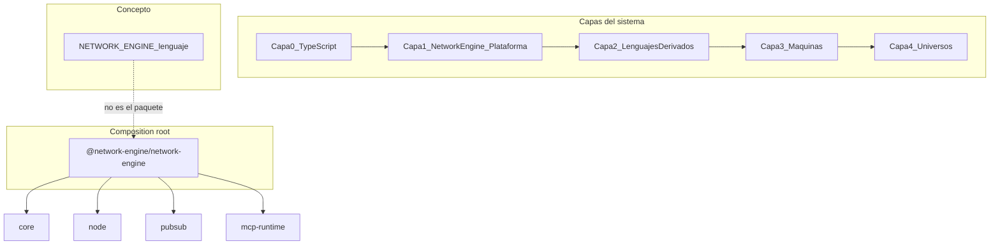

# Network-Engine

Plataforma metalingüística para construir **lenguajes**, **máquinas**, **universos** y **sistemas de inferencia** sobre TypeScript moderno.

> La codebase es el **laboratorio**. El lenguaje/plataforma es el **producto conceptual**. Las apps son demostraciones.

---

## Arquitectura Mental



**Distinción crítica:** `NETWORK_ENGINE` (documentado en `INSTRUCTIONS/LAYER_1` y `LAYER_3`) es la plataforma/lenguaje conceptual. El paquete `@network-engine/network-engine` es solo el **composition root** que ensambla runtime sin lógica de dominio.

---

## Paquetes Principales

| Categoría | Paquetes |
| --- | --- |
| Núcleo | `core` |
| Runtimes / adapters | `node`, `browser`, `contract-adapters` |
| Protocolos | `mcp`, `mcp-runtime`, `pubsub`, `graph` |
| Lenguajes | `aleph-lang` |
| Composition root | `network-engine` |
| Demos | `apps` |

Matriz completa concepto ↔ paquete ↔ capa: [`INSTRUCTIONS/LAYER_1/ECOSYSTEM.md`](INSTRUCTIONS/LAYER_1/ECOSYSTEM.md).

---

## Uso y Validación

Usar **siempre Bun** (`bun install`, `bun run`, `bun x`). No `npm` / `npx` / `npm run` salvo instrucción explícita.

```bash
bun install
bun run validate:traceability   # matriz doc ↔ packages/*
bun run typecheck
bun run test
bun run start                   # launcher de apps
```

---

## Composition Root

`createNetworkEngine()` cablea el motor sin duplicar wiring en cada app o lenguaje:

```typescript
import { createNetworkEngine } from '@network-engine/network-engine';
import { testMachine, type TestSemantics } from '@network-engine/core';

const { orchestrator, pubsubBridge, mcpRuntime } = createNetworkEngine<TestSemantics>(
  testMachine,
  {
    pubsub: { config: { hubUrl: 'http://localhost:3001' }, appId: 'hello' },
    // mcp: { projection: myProjection },
  },
);
```

- Lenguajes (`aleph-lang`): `createNetworkEngine(machine)` sin slots.
- Apps: añaden pubsub/MCP cuando corresponda.
- Regla de guarda: el orquestador **conecta**, no implementa dominio. Ver [ADR 0003](ADR/0003-network-engine-orchestrator-package.md).

---

## Sistema de Conocimiento

| Ubicación | Contenido |
| --- | --- |
| [`INSTRUCTIONS/`](INSTRUCTIONS/ALEPH.instructions.md) | Constituciones, capas L0–L4, modos cognitivos |
| [`DOSSIERS/`](DOSSIERS/README.md) | Líneas de investigación activas y memoria a largo plazo |
| [`ADR/`](ADR/README.md) | Decisiones arquitectónicas irreversibles |
| [`LANGUAGES/`](LANGUAGES/README.md) | Dossiers de lenguajes derivados instanciados |
| [`SCRATCHPAD/`](SCRATCHPAD/README.md) | Trabajo temporal (no canónico) |

Punto de entrada del OS Cognitivo: [`INSTRUCTIONS/ALEPH.instructions.md`](INSTRUCTIONS/ALEPH.instructions.md).

---

## Roadmap Inmediato

Próximos ejes (detalle en [`ECOSYSTEM.md`](INSTRUCTIONS/LAYER_1/ECOSYSTEM.md)):

1. **MCP Resource-first** — proyecciones, prompts y sampling antes que tools CRUD.
2. **Storage / repositories** — interfaces async-first y migraciones de contratos.
3. **Apps UI desde contratos** — MCP Apps generadas desde `DomainContract.ui`.
4. **Seguridad MCP runtime** — Origin allowlist, auth hooks, validación Streamable HTTP.
5. **Lenguajes derivados** — expandir huéspedes más allá de `aleph-lang`.
