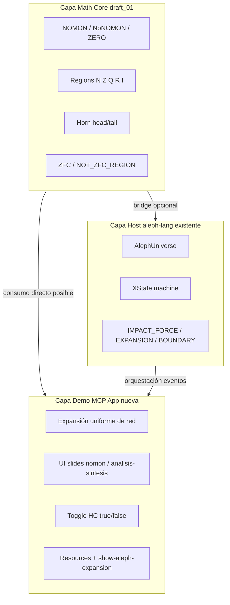
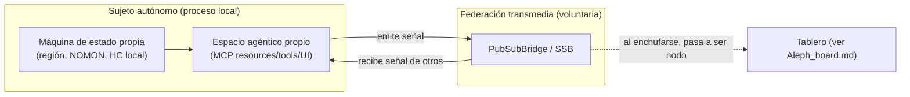
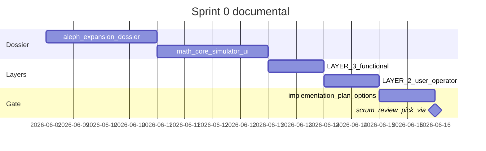

# Dossier: Aleph Math Core + Simulador HC (pre-plan ASI)

> **Lectura como díptico.** Este documento es la **mitad A** (la *app / sujeto*). Su par es [`Aleph_board.md`](Aleph_board.md) (la *mitad B*: el *Tablero / core*). No son planes rivales: la app es el **sujeto autónomo** que se enchufa; el tablero es la **topología** que esos sujetos componen al federarse. Leer uno sin el otro deja la mitad de la figura.
>
> **Estado editorial:** asentado pero **abierto**. Las "recomendaciones" de más abajo son *lecturas posibles*, no decretos. El espectro de vías se deja a propósito sin cerrar para que scrum elija con contexto.

## Respuesta directa a tu pregunta

**¿El lenguaje ya modela esto y podemos hacer una app para mover el draft?**

**Parcialmente, no todavía.**

| Capa | Qué hay | Qué falta |
|------|---------|-----------|
| **Especificación** | [`draft_01.ts`](SCRIPTORIUM-CORE/NETWORK-ENGINE/draft_01.ts) — Regions, Horn, NOMON, ZFC | No está canonizado en `definition/`; no compila |
| **Runtime host** | [`aleph-lang/package`](SCRIPTORIUM-CORE/NETWORK-ENGINE/LANGUAGES/aleph-lang/package) — Universe, Force, Dimension, XState | Metáfora ℵ, no matemática; sin Regions/Horn/NOMON |
| **App operativa** | [`aleph-lang/app`](SCRIPTORIUM-CORE/NETWORK-ENGINE/LANGUAGES/aleph-lang/app) + MCP tools en [`packages/mcp`](SCRIPTORIUM-CORE/NETWORK-ENGINE/packages/mcp) | Demo de fuerzas/integridad, no simulador de red/cardinalidad |
| **Patrón a copiar** | [`compose-lang/definition/simulator.md`](SCRIPTORIUM-CORE/NETWORK-ENGINE/LANGUAGES/compose-lang/definition/simulator.md) + MCP App UI | No existe equivalente para aleph |

**Conclusión:** Sí se puede abrir una app MCP **ahora**, pero el equipo debe elegir si la app consume (a) math core portado del draft, (b) math simplificado solo para demo HC, o (c) ambos en paralelo. Este dossier acota ese espacio de decisión.

---

## Objetivo del feature (frase única)

> Demostrar, de forma interactiva y determinista, que **longitud de camino en una malla** (métrica de grafo) y **cardinalidad asignada a nodos** (etiqueta ℵ) son dimensiones independientes — y que la **HC** es una elección de universo (app puede opinar), no una consecuencia del motor de expansión.

Enlace con Scriptorium: el Tablero como **crossover semántico** entre señales discretas (nomon/inducción) y mallas estirables (análisis/síntesis) encaja con la metáfora sound-system del [`analisis_transmedia_system.md`](analisis_transmedia_system.md).

---

## Arquitectura conceptual (tres capas)

**Principio de frontera** (ya en [`LAYER_3/LANGUAGES.functional.md`](SCRIPTORIUM-CORE/NETWORK-ENGINE/INSTRUCTIONS/LAYER_3/LANGUAGES.functional.md) §2):
- **Core/LAYER 1–3:** contratos, tipos, leyes del simulador, Horn como patrón de operación.
- **App/LAYER 2:** opinión sobre HC, presets de UI, narrativa de slides, despliegue MCP.

[`APPS.functional.md`](SCRIPTORIUM-CORE/NETWORK-ENGINE/INSTRUCTIONS/LAYER_3/APPS.functional.md) ya autoriza: *"una app puede decidir que en su universo la Hipótesis del Continuo es falsa"*.

---

## La app como sujeto autónomo (expresión federada)

> El giro que asienta este documento: la "app" **no es una vista** del tablero. Es un **sujeto** —jugador, agente, heterónimo, *rude bot skin*— con vida propia. Su valor no es renderizar; es **existir y opinar** desde su propio rincón, y luego **federarse**.

Cuatro propiedades la constituyen como sujeto, no como cliente:

| Propiedad | Qué significa | Anclaje en código |
|-----------|---------------|-------------------|
| **Máquina de estado propia** | La app corre su **propia** `createNetworkMachine` / `AlephUniverse`. Su estado (región activa, paso NOMON, HC local) es suyo, no del tablero. | [`aleph-lang/package/src/machine.ts`](SCRIPTORIUM-CORE/NETWORK-ENGINE/LANGUAGES/aleph-lang/package/src/machine.ts), `NetworkOrchestrator` |
| **Proceso local propio** | Es un proceso Bun independiente. Arranca, vive y decide **offline** si hace falta. Conexión **saliente** (sin abrir puertos — *pretty good escrivivir*). | `App.init()/run()`, patrón `serve:*` |
| **Espacio agéntico propio** | Expone su **propia** superficie MCP (resources/tools/UI): un lugar donde un agente *habita* y razona sobre **su** universo Aleph antes de hablar con nadie. | `projectDomainToMCP`, `mcp-app-ui` |
| **Federada con transmedia** | Cuando quiere, **emite** su señal al tejido común vía PubSub/SSB y **recibe** la de otros. La federación es un acto **voluntario**, no un acoplamiento. | `PubSubBridge.connect(orchestrator)` |

**Consecuencia para el diseño (abre espectro, no lo cierra):**

- La **autonomía local** y la **expresión federada** son **dos modos del mismo sujeto**, no dos productos. La misma app debe poder correr aislada (demo determinista, modo *chill*) **o** enchufada (nodo del tablero, modo *sound clash*).
- Esto deja **abierta** una pregunta de diseño jugosa: ¿la app **publica su máquina de estado** entera al tablero, o solo **señales destiladas** (eventos `markPublishable`)? Las dos lecturas son legítimas; conviene **no** zanjarla aquí.
- El "simulador HC" pasa a ser **una expresión** de este sujeto (su forma de pensar en voz alta), no su única razón de ser.

---

## La demostración HC (qué debe enseñar el simulador)

### Leyes propuestas (borrador para `simulator.md`)

1. **Expansión uniforme** — Desde raíz `nomon`, cada tick añade nodos a distancia `d+1` en todas las direcciones (BFS/radial). Determinista dado `(seed, radius, branching)`.
2. **Colapso ℵ₀** — Regiones `N`, `Z`, `Q` comparten etiqueta cardinal `aleph0` (mismo conteo); difieren en **color/tipo de arista** o **restricciones Horn** (`restricted`, dirección NOMON).
3. **Métrica dual** — Cada nodo expone:
   - `pathLength`: distancia desde raíz (discreto, nomon)
   - `cardinalSlot`: bucket ℵ asignado por reglas del universo
4. **Modo monolítico (HC=true)** — Tras agotar bucket `aleph0`, el siguiente nodo salta directo a `aleph1` sin slots intermedios. Visual: malla **densa**, aristas cortas, sensación gödeliana/dogmática (*un solo salto cardinal*).
5. **Modo estirado (HC=false)** — Entre `aleph0` y `aleph1` aparecen **nodos fantasma** o **huecos métricos** (distancia grande, cardinalidad aún ℵ₀, o slot `aleph?` intermedio). Visual: malla **inflada**, espacio entre nodos.
6. **Independencia ZFC** — El motor de expansión **no deduce** HC; el operador (o preset de universo) la fija. Documentar explícitamente: *Gödel/Cohen → independencia; la app simula universos, no prueba teoremas.*

### UI slides (patrón compose-lang [`ui.md`](SCRIPTORIUM-CORE/NETWORK-ENGINE/LANGUAGES/compose-lang/definition/ui.md))

| Slide | Control | Metáfora pedagógica |
|-------|---------|---------------------|
| **Nomon** | Stepper ±1 (`NOMON`/`NoNOMON`) | Inducción / silogismo — pasos discretos desde raíz griega νόμος |
| **Análisis–Síntesis** | Zoom + contracción de malla | Separar nodos (análisis) vs compactar capas (síntesis) |
| **Cardinal gap** | Toggle HC | Monolito vs malla estirada |
| **Region lens** | Selector N / Z / Q | Misma cardinalidad, distinta regla Horn |

Entregable UI: MCP App `ui://aleph-lang/expansion-mcp-app.html` + launcher `show-aleph-expansion`.

---

## Puente draft_01 ↔ aleph-lang (mapa para el dossier)

| `draft_01.ts` | Rol funcional | En aleph-lang hoy | Decisión scrum |
|---------------|---------------|-------------------|----------------|
| `CtxAleph` + `IntervalBounds` | Estado de región | `AlephContext` (sin intervalos) | Extender context o módulo `regions/` |
| `Horn.head/tail` | Operación con guard + efecto | XState `assign` | ¿Port Horn como clase o reescribir como guards/actions? |
| `NOMON` direction | Paso ±1 | `weight` numérico | Renombrar/adoptar NOMON en API pública |
| `RegionN/Z/RQ/RI` | Dominios | Solo `dimension++` | Spike: ¿Dimension = región o contador? |
| `ZFC` / `NOT_ZFC_REGION` | Validez axiomática | Ausente | Fase 2 (post-demo) o stub en simulador |
| Comentarios ZFC BNF (L460–668) | Lenguaje formal futuro | Ausente | Epic separado: `aleph-zfc-lang` spike |

**Lectura ASI (no decisión):** una vía de bajo riesgo es no bloquear la MCP App por el port completo del draft — canonizar el draft en `definition/math-core.md` y portar solo `HornNextDiscrete` + colapso ℵ₀ para un v1. **Pero queda abierto** lo contrario: si el equipo ve el draft como *math core compartido* con el tablero (mitad B), puede preferir portarlo entero primero. Ambas puertas siguen abiertas.

---

## Artefactos documentales a crear (el entregable de este pre-plan)

### 1. DOSSIER principal (backlog scrum)

**Nuevo:** [`DOSSIERS/aleph-expansion-simulator.md`](SCRIPTORIUM-CORE/NETWORK-ENGINE/DOSSIERS/aleph-expansion-simulator.md)

Contenido mínimo:
- Objetivo + no-objetivos (no probar teoremas; no reemplazar aleph-lang host)
- Diagrama de capas (arriba)
- Tabla Epic C con items tipo [`conceptual-physical-alignment.md`](SCRIPTORIUM-CORE/NETWORK-ENGINE/DOSSIERS/conceptual-physical-alignment.md) §5
- **3 vías de implementación** (equipo elige una)
- Incertidumbres U5–U8 (nuevas)
- Criterios DoD por story

### 2. Extensión `LANGUAGES/aleph-lang/definition/`

| Archivo | Propósito | Capa |
|---------|-----------|------|
| `math-core.md` | Canoniza `draft_01.ts`: NOMON, Regions, Horn, errores, relación ℵ₀ | Conceptual |
| `simulator.md` | Leyes del twin de expansión (como compose) | Conceptual |
| `ui.md` | Contrato MCP App + slides | Conceptual |
| `implementation_plan.md` | P1–P5 con **opciones A/B/C**, sin status Approved aún | Gate scrum |

Mover o referenciar [`draft_01.ts`](SCRIPTORIUM-CORE/NETWORK-ENGINE/draft_01.ts) → [`SCRATCHPAD/draft_01.ts`](SCRIPTORIUM-CORE/NETWORK-ENGINE/SCRATCHPAD/draft_01.ts) tras extracción a `math-core.md`.

### 3. LAYER 1 — instrucciones técnicas (core)

**Actualizar:** [`INSTRUCTIONS/LAYER_1/LANGUAGES.instructions.md`](SCRIPTORIUM-CORE/NETWORK-ENGINE/INSTRUCTIONS/LAYER_1/LANGUAGES.instructions.md)

Añadir sección breve:
- Patrón **Horn Operation** (`head` = guard, `tail` = transition) como convención opcional de lenguajes derivados
- Módulo `regions` dentro de `-lang/package` vs paquete hermano
- Proyección MCP: seguir patrón `defineDomainContract` de compose-lang

*(Solo si el equipo elige vía A o B; spike documenta esto antes de editar.)*

### 4. LAYER 3 — constitución funcional (core)

**Actualizar:** [`INSTRUCTIONS/LAYER_3/LANGUAGES.functional.md`](SCRIPTORIUM-CORE/NETWORK-ENGINE/INSTRUCTIONS/LAYER_3/LANGUAGES.functional.md)

Nueva §7 *Aleph Math Core*:
- Regions como extensión opcional de los 5 primitivos (no romper límite de 5 en v1 host)
- Simulador HC como **app demostrativa**, no axioma de plataforma
- Trazabilidad `draft_01` → `math-core.md` → `package/src/regions/`

**Actualizar:** [`INSTRUCTIONS/LAYER_3/APPS.functional.md`](SCRIPTORIUM-CORE/NETWORK-ENGINE/INSTRUCTIONS/LAYER_3/APPS.functional.md)

Añadir bullet: *Aleph Expansion Simulator* como ejemplo concreto de app que fija HC.

### 5. LAYER 2 — contexto user / operator (nuevo)

**Nuevo:** [`INSTRUCTIONS/LAYER_2/ALEPH_EXPANSION.instructions.md`](SCRIPTORIUM-CORE/NETWORK-ENGINE/INSTRUCTIONS/LAYER_2/ALEPH_EXPANSION.instructions.md)

Estructura en dos mitades (como pide el README de LAYER_2):

**Para USER (jugador / investigador / agente MCP):**
- Cómo invocar `show-aleph-expansion`
- Qué significa cada slide (nomon, analisis-sintesis, HC toggle)
- Interpretación: N=Z=Q=ℵ₀ vs hueco cardinal
- Qué **no** promete el simulador

**Para OPERATOR (devops / CD):**
- `bun run serve:aleph-expansion` (nombre TBD)
- Registro en [`packages/apps/src/catalog/index.ts`](SCRIPTORIUM-CORE/NETWORK-ENGINE/packages/apps/src/catalog/index.ts)
- Build Vite singlefile (patrón compose)
- Variables `APPS_ENV`, health del MCP HTTP edge

**Actualizar:** [`INSTRUCTIONS/LAYER_2/APPsDEV.instructions.md`](SCRIPTORIUM-CORE/NETWORK-ENGINE/INSTRUCTIONS/LAYER_2/APPsDEV.instructions.md) — enlace al doc anterior como app de referencia matemática.

---

## Epic C — Backlog propuesto (para tabla en dossier)

### Incertidumbres nuevas

| ID | Pregunta |
|----|----------|
| U5 | ¿Horn se porta tal cual o se mapea a XState guards? |
| U6 | ¿`Dimension` host = contador o = `Region` activa? |
| U7 | ¿Simulador en `aleph-lang/app` o catalog app `aleph-expansion` separada? |
| U8 | ¿HC false modela nodos fantasma o solo edge-length stretch? |

### Items backlog

| Tipo | Item | Resuelve | DoD |
|------|------|----------|-----|
| **Spike** | Validar leyes del simulador con grafos toy (sin UI) | U8 | Tabla input→output en dossier |
| **Spike** | Mapeo Horn ↔ XState en 1 operación (`HornNextDiscrete`) | U5 | ADR o sección en math-core |
| **Feature** | `math-core.md` + extracción desde draft_01 | U5,U6 | Definition completa; draft movido a SCRATCHPAD |
| **Feature** | `simulator.ts` determinista (mesh + cardinal rules) | U8 | Tests tipo [`compose-lang/simulator.test.ts`](SCRIPTORIUM-CORE/NETWORK-ENGINE/LANGUAGES/compose-lang/package/src/simulator.test.ts) |
| **Feature** | MCP resources `aleph://expansion/{id}/mesh` + tools tick/step | U7 | Contrato en ui.md |
| **Feature** | MCP App UI slides + launcher | — | Paridad mínima con compose ui.md |
| **Story** | Colapso visual N=Z=Q (misma etiqueta ℵ₀) | — | 3 presets en UI |
| **Story** | Toggle HC monolito vs estirado | — | Demo grabable en 30s |
| **Story** | Alinear `semantics.md` EXPANDING state con machine | U6 | Estado `expanding` en XState |
| **ADR** | Dimensión vs Región en aleph-lang | U6 | ADR 0010 (propuesto) |

---

## Tres vías de implementación (equipo scrum elige)

### Vía A — Extensión in-package (recomendada para coherencia)

- `aleph-lang/package/src/regions/` ← port parcial draft
- `aleph-lang/package/src/expansion-simulator.ts` ← leyes mesh
- `aleph-lang/app/` ← MCP HTTP edge + UI (como compose-lang)
- **Pros:** un solo language unit; trazabilidad limpia
- **Contras:** mezcla host event-driven con math declarativo

### Vía B — App catalog separada

- Nuevo descriptor `aleph-expansion` en [`packages/apps/src/catalog/`](SCRIPTORIUM-CORE/NETWORK-ENGINE/packages/apps/src/catalog/)
- Importa `@network-engine/aleph-lang` + módulo math copiado/adaptado
- **Pros:** no toca machine existente; demo rápida
- **Contras:** riesgo de duplicar tipos; deuda de convergencia

### Vía C — Math-first bloqueante

- Port completo Regions/Horn/ZFC antes de UI
- **Pros:** fidelidad al draft; base para lenguaje formal ZFC
- **Contras:** retrasa demo HC meses; choca con "PoC WIP" del producto

### Vía D — App como sujeto autónomo federado (abre el espectro)

- La app no se diseña primero como "simulador", sino como **proceso local con máquina de estado y espacio agéntico propios** (ver sección *La app como sujeto autónomo*). El simulador HC es una de sus expresiones; la federación al tablero (mitad B) es otra.
- **Pros:** alinea las dos mitades del díptico desde el día 1; la misma app sirve para demo aislada **y** como nodo del tablero; encaja con la metáfora *rude bot skin* del producto.
- **Contras:** más superficie conceptual por adelantado; exige decidir el contrato de federación (¿estado completo vs señales destiladas?) antes de lo que una demo pura necesitaría.

**Espectro abierto (lectura, no veredicto):** las vías A–D **no son excluyentes**. Una secuencia plausible es *A (demo) → D (autonomía) → federación con la mitad B*, pero el equipo puede entrar por D si prioriza la naturaleza-sujeto, o por C si prioriza el rigor matemático. Lo que este pre-plan **fija** es el vocabulario y los trade-offs; lo que **deja abierto** es la puerta de entrada.

---

## Secuencia sugerida (solo documentación, sprint 0)

Sprint 1+ (post-aprobación): código según vía elegida — fuera de alcance de este pre-plan.

---

## Relación con aleph-lang existente (no romper)

El runtime actual en [`universe.ts`](SCRIPTORIUM-CORE/NETWORK-ENGINE/LANGUAGES/aleph-lang/package/src/universe.ts) sigue siendo válido como **metáfora operativa** (fuerzas → integridad → expansión). El math core **no lo reemplaza**; lo **ancla**:

- `Force.weight` puede derivar de pasos NOMON acumulados
- `REACH_BOUNDARY` ↔ `MAX_OVERFLOW` / `MIN_OVERFLOW`
- `COMPLETE_EXPANSION` ↔ salto de `aleph_n` a `aleph_{n+1}` en el simulador

Estados faltantes vs [`semantics.md`](SCRIPTORIUM-CORE/NETWORK-ENGINE/LANGUAGES/aleph-lang/definition/semantics.md): añadir `EXPANDING` al backlog como story de alineación, no como bloqueante del simulador.

---

## Criterios de éxito del dossier (DoD pre-plan)

- [ ] Un dev puede leer el dossier y situar las vías A–D sin reunión (el doc **no** obliga a una)
- [ ] Queda escrito que la app es un **sujeto autónomo** (estado + proceso + espacio agéntico propios) y no una mera vista
- [ ] Queda explícita la **federación voluntaria** hacia la mitad B ([`Aleph_board.md`](Aleph_board.md))
- [ ] USER y OPERATOR tienen instrucciones separadas en LAYER_2
- [ ] LAYER_3 distingue axioma de plataforma vs opinión de app (HC)
- [ ] `math-core.md` hace obsoleto leer `draft_01.ts` directamente
- [ ] Backlog Epic C con spikes antes de features
- [ ] MCP App contract especificado antes de Vite scaffold
- [ ] El espectro de decisiones queda **abierto y trazado**, no cerrado
