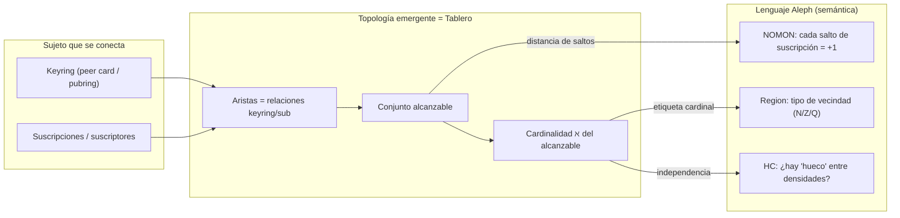
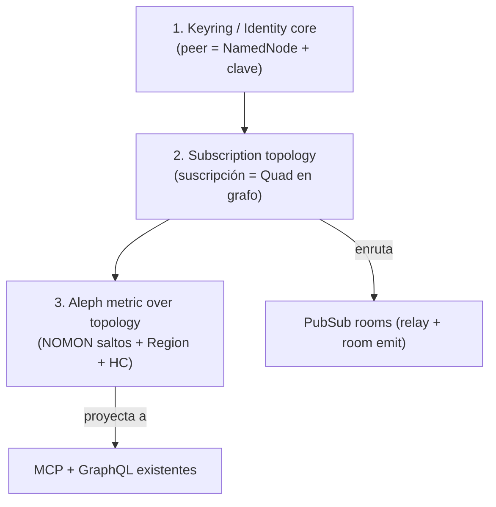
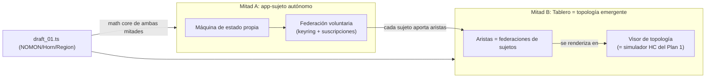

# Plan 2 (independiente): El Tablero Aleph como CORE

> **Lectura como díptico.** Este documento es la **mitad B** (el *Tablero / core*). Su par es [`Aleph_app.md`](Aleph_app.md) (la *mitad A*: la *app / sujeto autónomo*). El tablero **no existe sin sujetos**: su topología es, literalmente, el tejido que forman las apps-sujeto al federarse. La mitad A define **qué es un nodo**; esta mitad B define **qué forma toma la red** de esos nodos.
>
> **Estado editorial:** asentado pero **abierto**. Las vías A–C y la "recomendación ASI" son *lecturas posibles*; el espectro se deja sin cerrar a propósito.

## La pregunta original de esta conversación

Era: **«¿Qué pinta tiene un Tablero Scriptorium?»**

Y sí — este reencuadre **la responde en código**, no en metáfora. El Plan 1 ([`SCRATCHPAD/SESION_06_JUNIO/Aleph_app.md`](SCRIPTORIUM-CORE/NETWORK-ENGINE/SCRATCHPAD/SESION_06_JUNIO/Aleph_app.md)) describía un **simulador-demo** (una app que dibuja la HC). Este Plan 2 dice algo más fuerte:

> El **Tablero ES el core**. Lo que el Plan 1 llamó "app" es solo un **sujeto** (jugador/agente/heterónimo) que se **enchufa** al tablero. La **forma** del tablero —su expansión y contracción Aleph— **emerge de la topología**: quién está en el keyring de quién y quién suscribe a quién. **No es tráfico; es topología.**

Esto conecta directamente con la ficha de producto [`analisis_transmedia_system.md`](analisis_transmedia_system.md): el Tablero como *crossover* / *network-mesh* donde los skins "se activan y esperan para entrar a la red, cual nodos, que se hipervincularán en un tejido".

---

## Tesis central (el salto conceptual)

**Lo que demuestra el Tablero (no el simulador aislado):** N = Z = Q = ℵ₀ significa que **distintas reglas de vecindad** (a quién admites en tu keyring / a quién suscribes) pueden producir **la misma cardinalidad de alcance** pero distinta **métrica de saltos**. La HC (independiente de ZFC) se vuelve una **propiedad operativa del tablero**: ¿la federación admite estirar la malla (huecos entre densidades de suscriptores) o colapsa monolíticamente?

---

## Mapa: tu arquitectura propuesta ↔ infraestructura que YA existe

Tu boceto en tres estratos, anclado a lo encontrado en `packages/`:

### TABLERO (el escenario / stage)

| Tu término | Existe hoy | Estado real | Hueco |
|------------|-----------|-------------|-------|
| **pubsub** | [`packages/pubsub`](SCRIPTORIUM-CORE/NETWORK-ENGINE/packages/pubsub) — `PubSubHub`, `PubSubBridge` (Socket.IO + RxJS) | Hub-and-spoke, pero **el hub NO reenvía `network_event`** y **rooms/namespaces no se enrutan** | Relay + routing por room = primer ladrillo del tablero |
| **mcp** | [`packages/mcp`](SCRIPTORIUM-CORE/NETWORK-ENGINE/packages/mcp) + [`packages/mcp-runtime`](SCRIPTORIUM-CORE/NETWORK-ENGINE/packages/mcp-runtime) — `projectDomainToMCP`, HTTP edge, `subscriptions/listen` (SSE) | Funcional (proyección desde `DomainContract`) | SSE es shim (ADR 0001); no hay topología de peers |
| **rest-api** | Solo MCP + GraphQL + demos | **No hay router REST de primera clase** | Documentado como target, no implementado |
| **bridging IO / escenografía** | `PubSubBridge.connect(orchestrator)` | Adjunta por `appId` string | Sin identidad criptográfica |
| **compose-lang abajo** | [`LANGUAGES/compose-lang`](SCRIPTORIUM-CORE/NETWORK-ENGINE/LANGUAGES/compose-lang) — simulador determinista + MCP App UI | Patrón maduro a imitar | — |

### VPS Scriptorium (transporte federado)

| Tu término | Existe hoy | Hueco |
|------------|-----------|-------|
| **pub.rooms** | `NetworkTransportEvent.room` tipado; hub hace `join_room`/`leave_room` | El bridge **ignora** room; no hay emit room-dirigido |
| **oasis.ssb.blockchain** | **Nada en código** (ni SSB, ni scuttlebutt, ni keyring, ni peer card) | **Capa de identidad/keyring = green-field** — es el núcleo de este plan |

### CAPA (gateway universal)

| Tu término | Existe hoy | Hueco |
|------------|-----------|-------|
| **graphQL gateway** | [`packages/graphql`](SCRIPTORIUM-CORE/NETWORK-ENGINE/packages/graphql) — proyección por contrato; `startGraphQLServer` | `projectDomainsToGraphQL([])` existe pero **la federación multi-dominio NO está cableada** |
| **scriptorium.pub + oasis.pub** | — | Federación de pubs = unión de proyecciones + identidad |

### APPS (lo que aparece en el tablero)

| Tu término | Existe hoy |
|------------|-----------|
| **AppMongoDB Channels** | [`packages/mongo`](SCRIPTORIUM-CORE/NETWORK-ENGINE/packages/mongo) — `MongoDocumentStore.changes()` (change streams, replica-set `rs0`) |
| **graphDB** | [`packages/graph`](SCRIPTORIUM-CORE/NETWORK-ENGINE/packages/graph) (in-memory SPO/POS/OSP) + [`packages/node`](SCRIPTORIUM-CORE/NETWORK-ENGINE/packages/node) `GraphDbStore` (Ontotext SPARQL) |
| **Máquina de Estado** | `NetworkOrchestrator` + `createNetworkMachine` (XState v5) en [`packages/core`](SCRIPTORIUM-CORE/NETWORK-ENGINE/packages/core) |
| **Reactividad** | RxJS `events$` / `selectEvent` / `store.changes()` → `wireDocumentSyncLoop` (ADR 0007) |
| **mcp-app-ui** | `@modelcontextprotocol/ext-apps` — ref. [`aleph-os/ui/mcp-app.ts`](SCRIPTORIUM-CORE/NETWORK-ENGINE/packages/apps/src/catalog/aleph-os/ui/mcp-app.ts) |

**Hallazgo clave:** ya existe la ontología RDF `aleph0..aleph3` con `aleph:originatesFrom` (cadena 0←1←2←3) y `aleph:dimension` en [`catalog/graph/app.ts`](SCRIPTORIUM-CORE/NETWORK-ENGINE/packages/apps/src/catalog/graph/app.ts). **Ese grafo es el sustrato natural donde la topología del tablero debe vivir** — pero hoy modela conocimiento de dominio, no "quién suscribe a quién".

---

## El núcleo que falta (lo que este plan define)

Tres piezas core inexistentes, en orden de dependencia:

1. **Identidad / Keyring (core):** un peer no es un `appId` string; es un nodo con clave. Reusar/extender [`IdentityContract`](SCRIPTORIUM-CORE/NETWORK-ENGINE/packages/core/src/contracts.ts) y los branded IDs.
2. **Topología de suscripción (core):** "A suscribe a B" y "B está en el keyring de A" son **aristas** = quads RDF en `GraphStoreProtocol`. El grafo `aleph:` se extiende con `aleph:subscribesTo`, `aleph:inKeyringOf`.
3. **Métrica Aleph (lenguaje):** sobre ese grafo, `NOMON` = un salto de suscripción; `Region` = forma de la vecindad; cardinalidad del alcanzable = nivel ℵ; HC = ¿la federación admite densidades intermedias?

---

## Modelado por tipos (maximizando [`TS.instructions.md`](SCRIPTORIUM-CORE/NETWORK-ENGINE/INSTRUCTIONS/LAYER_0/TS.instructions.md))

Siguiendo "tipos antes que clases, contratos antes que detalles", el plan **prioriza el diseño de tipos** y enumera capacidades TS candidatas (a decidir conscientemente por el equipo, no impuestas):

| Concepto del tablero | Capacidad TS candidata | Por qué (valor arquitectónico) |
|----------------------|------------------------|-------------------------------|
| `PeerId`, `KeyringId`, `SubscriptionId` | **Branded / Opaque types** | Ya hay precedente (`AppId`, `UniverseId`); evita mezclar identidades |
| Nivel cardinal `aleph0 \| aleph1 \| ...` | **Discriminated union** + **exhaustive checking** | HC como `switch` exhaustivo sobre niveles |
| Aristas `subscribesTo` / `inKeyringOf` | **Template literal types** (estilo `ForceVector` existente) | Predicados RDF tipados: `` `aleph:${EdgeKind}` `` |
| Vecindad / Region (N/Z/Q) | **Phantom types** sobre `Region<TKind>` | Misma cardinalidad, distinta ley — sin coste runtime |
| Paso NOMON sobre el grafo | **Variadic tuples** / **recursive types** | Camino de saltos como tupla tipada |
| Proyección topología→MCP/GraphQL | **Mapped + conditional types** | Reusa el patrón `projectDomainToMCP` ya existente |
| Guard de pertenencia al keyring | **Type predicates** | `isReachable(peer): peer is ReachablePeer` |

**Nota de método (TS.instructions §"Comportamiento esperado"):** cada decisión de tipos debe llegar al equipo con alternativas + trade-offs, no como código cerrado. Por eso este plan es documental.

---

## Frontera de capas (dónde vive cada cosa)

| Capa INSTRUCTIONS | Qué se añade | Archivos |
|-------------------|--------------|----------|
| **LAYER_1 (técnico/core)** | Contratos de Keyring + Subscription topology; patrón "topología = quads"; relay del hub | [`LAYER_1/NETWORK_ENGINE.instructions.md`](SCRIPTORIUM-CORE/NETWORK-ENGINE/INSTRUCTIONS/LAYER_1/NETWORK_ENGINE.instructions.md), [`LAYER_1/PUBSUB.instructions.md`](SCRIPTORIUM-CORE/NETWORK-ENGINE/INSTRUCTIONS/LAYER_1/PUBSUB.instructions.md), nuevo `LAYER_1/IDENTITY.instructions.md` |
| **LAYER_3 (funcional)** | Tablero como constitución: el sujeto se enchufa, la topología emerge; Aleph mide; HC es opinión de federación | [`LAYER_3/LANGUAGES.functional.md`](SCRIPTORIUM-CORE/NETWORK-ENGINE/INSTRUCTIONS/LAYER_3/LANGUAGES.functional.md) §7, [`LAYER_3/PUBSUB.functional.md`](SCRIPTORIUM-CORE/NETWORK-ENGINE/INSTRUCTIONS/LAYER_3/PUBSUB.functional.md) |
| **LAYER_2 (user/operator)** | USER: cómo conecta un sujeto (keyring, suscripción). OPERATOR: levantar pub.rooms / VPS / federación | nuevo [`LAYER_2/TABLERO.instructions.md`](SCRIPTORIUM-CORE/NETWORK-ENGINE/INSTRUCTIONS/LAYER_2/TABLERO.instructions.md) |

---

## Artefactos a crear (entregable documental, sprint 0)

### 1. ADR — la decisión irreversible

**Nuevo:** [`ADR/0010-tablero-topology-from-subscriptions.md`](SCRIPTORIUM-CORE/NETWORK-ENGINE/ADR/0010-tablero-topology-from-subscriptions.md)

- Decisión: la topología del tablero **se deriva de keyring + suscripciones**, persistida como **quads RDF** en `GraphStoreProtocol`, no como estado ad-hoc del hub.
- Alternativas: (a) topología en grafo RDF; (b) topología en Mongo (colección de aristas); (c) topología efímera en el hub. Trade-offs de cada una.
- Consecuencia: el grafo `aleph:` pasa de "ontología de dominio" a "sustrato de tablero".

### 2. DOSSIER — backlog scrum

**Nuevo:** [`DOSSIERS/tablero-aleph-core.md`](SCRIPTORIUM-CORE/NETWORK-ENGINE/DOSSIERS/tablero-aleph-core.md)

Formato Epic/Feature/Story/Spike como [`conceptual-physical-alignment.md`](SCRIPTORIUM-CORE/NETWORK-ENGINE/DOSSIERS/conceptual-physical-alignment.md) §5, con incertidumbres y DoD.

### 3. Definition del lenguaje — extender aleph-lang

| Archivo | Propósito |
|---------|-----------|
| [`LANGUAGES/aleph-lang/definition/topology.md`](SCRIPTORIUM-CORE/NETWORK-ENGINE/LANGUAGES/aleph-lang/definition/topology.md) | La topología de suscripción como semántica Aleph (NOMON sobre saltos, Region como vecindad, HC como propiedad de federación) |
| [`LANGUAGES/aleph-lang/definition/grammar.md`](SCRIPTORIUM-CORE/NETWORK-ENGINE/LANGUAGES/aleph-lang/definition/grammar.md) | Extender con tipos de arista (template literals) |
| [`LANGUAGES/aleph-lang/definition/implementation_plan.md`](SCRIPTORIUM-CORE/NETWORK-ENGINE/LANGUAGES/aleph-lang/definition/implementation_plan.md) | P1–P5 del tablero-core (gate, sin Approved) |

### 4. Instrucciones de capa (ver tabla "Frontera de capas")

---

## Epic T — Backlog propuesto

### Incertidumbres

| ID | Pregunta |
|----|----------|
| T1 | ¿La topología vive en `GraphStoreProtocol` (RDF), en Mongo, o ambas (read-model)? |
| T2 | ¿Keyring = capa criptográfica real (SSB/PGP) o abstracción `IdentityContract` primero? |
| T3 | ¿La expansión Aleph se calcula on-read (query SPARQL sobre alcance) o se materializa por eventos? |
| T4 | ¿El relay del hub se enruta por `room` = "vecindad de keyring", o por suscripción explícita? |
| T5 | ¿HC=false (huecos) se modela como peers fantasma o como métrica de densidad de suscriptores? |

### Items

| Tipo | Item | Resuelve | DoD |
|------|------|----------|-----|
| **Spike** | Modelar "A suscribe a B" como quads `aleph:subscribesTo`; query de alcance con `sparql-dsl` | T1,T3 | Tabla input→output en dossier; reusa [`catalog/graph/app.ts`](SCRIPTORIUM-CORE/NETWORK-ENGINE/packages/apps/src/catalog/graph/app.ts) |
| **Spike** | Diseño de tipos `PeerId`/`Edge`/`AlephLevel` (branded + template literal + discriminated union) con alternativas | T2 | Doc de tipos con trade-offs (TS.instructions) |
| **Spike** | Mínimo de keyring: ¿`IdentityContract` basta o hace falta SSB? | T2 | Hipótesis confirmada/refutada por escrito |
| **Feature** | `definition/topology.md` + ADR 0010 | T1,T3 | Definition + ADR aprobados |
| **Feature** | Relay real en `PubSubHub` (reenvío de `network_event`) | T4 | Test: dos bridges, A emite, B recibe |
| **Feature** | Routing por room/vecindad en `PubSubBridge` | T4 | `room` honrado en emit/subscribe |
| **Feature** | `KeyringContract` + `SubscriptionTopology` en `packages/core` | T2 | Tipos + proyección a grafo |
| **Story** | Federación multi-dominio: cablear `projectDomainsToGraphQL([])` | — | `/graphql` une ≥2 contratos |
| **Story** | Cálculo de nivel ℵ del alcance (N=Z=Q colapso) | T3,T5 | Demo: 3 reglas de vecindad, misma ℵ₀ |
| **Story** | Toggle HC sobre la federación (monolito vs estirado) | T5 | Documentado + test conceptual |

---

## Tres vías de implementación (scrum elige)

### Vía A — Topology-in-Graph (recomendada)

- Topología = quads en `GraphStoreProtocol`; alcance vía SPARQL; Aleph como query derivada.
- **Pros:** reusa grafo `aleph:` ya existente; semántico; SPARQL ya tipado (`sparql-dsl.ts`).
- **Contras:** requiere consolidar `GraphDbStore` Ontotext (hoy las apps usan in-memory).

### Vía B — Topology-in-Mongo (read-model)

- Aristas en colección Mongo; `change streams` → orchestrator; grafo solo para vista.
- **Pros:** reactividad y persistencia ya probadas (`wireDocumentSyncLoop`).
- **Contras:** duplica lo que RDF expresa nativamente; menos "Aleph".

### Vía C — Topology-ephemeral (hub-only)

- El hub mantiene la topología en memoria a partir de quién hace `join_room`.
- **Pros:** rapidísimo PoC; demuestra el relay que hoy falta.
- **Contras:** sin persistencia ni federación; no escala a VPS/oasis.

**Lectura ASI (no veredicto):** una entrada de bajo riesgo es un **PoC Vía C** (arregla el relay del hub —deuda existente— y valida el concepto sin tocar RDF), y dejar la **Vía A** como horizonte del core. **Pero el espectro queda abierto:** si la federación de identidad (SSB/keyring) se considera prioritaria, puede convenir atacar T2 antes que el relay; si se prioriza la persistencia probada, la Vía B entra primero. Lo que este pre-plan fija es el **mapa**; la **puerta de entrada** la elige scrum.

---

## Relación con el Plan 1 / mitad A (no se tira nada)

La app de la mitad A no es un satélite del tablero: es su **materia prima**. El tablero es lo que **emerge** cuando varios sujetos autónomos se federan.

- **La app-sujeto autónoma** (su máquina de estado, su proceso local y su espacio agéntico propios — ver [`Aleph_app.md`](Aleph_app.md) §*La app como sujeto autónomo*) es **el nodo**. Al ejercer su federación voluntaria (PubSub/SSB), su **keyring** y sus **suscripciones** se convierten en **aristas** del tablero. Sin sujetos no hay topología; con sujetos, la topología **es** el tablero.
- **El simulador HC** del Plan 1 sigue válido como **lente visual** y como **modo offline/determinista**: la misma `mcp-app-ui` se convierte en el **visor de topología** del tablero, pero ahora los "nodos" no son ficticios — son peers/suscripciones reales.
- **draft_01.ts** (`NOMON`, `Region`, `Horn`) es el **math core compartido por las dos mitades**, con una **interpretación operativa**: `Horn.head/tail` modela "dar un paso de suscripción y validar si sigues en región ZFC (alcanzable) o caes en `NOT_ZFC_REGION` (desconectado)".

**Lo que queda abierto (a propósito):** ¿el sujeto federa su **estado completo** o solo **señales destiladas**? ¿La pertenencia al tablero es **simétrica** (suscribir = ser suscrito) o **dirigida**? Estas preguntas viven en la frontera entre las dos mitades y **no se zanjan aquí**.

---

## Criterios de éxito (DoD del pre-plan)

- [ ] Queda escrito que la pregunta original ("¿qué pinta tiene un Tablero?") se responde: **es la topología emergente de keyring + suscripciones**.
- [ ] ADR 0010 fija dónde vive la topología (decisión irreversible).
- [ ] El diseño de tipos llega con alternativas y trade-offs (cumple TS.instructions).
- [ ] LAYER_1/2/3 ubican core vs user/operator sin solapamiento.
- [ ] El backlog distingue: arreglar relay del hub (deuda), modelar topología (nuevo), federar gateway (nuevo).
- [ ] Plan 1 / mitad A queda explícitamente integrado: la app-sujeto autónoma es **el nodo**, el visor es su simulador.
- [ ] Queda escrito que la topología **emerge de sujetos autónomos que se federan voluntariamente**, no de un orquestador central.
- [ ] El espectro de vías (A/B/C + orden de entrada) queda **abierto y trazado**, no cerrado.
