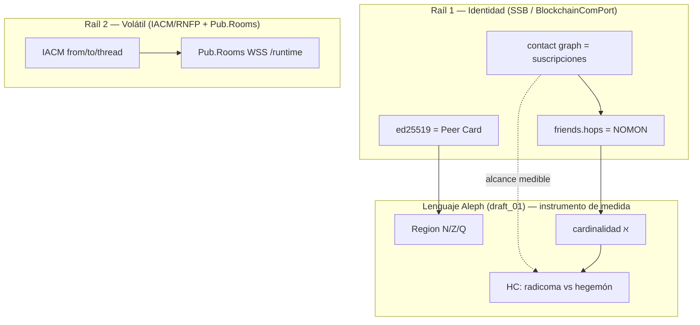
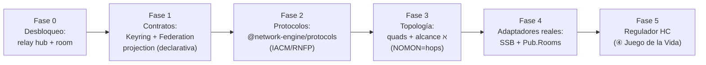

# Programa ASI — La Federación como Proyección

> **Modo Aleph ASI.** Problema → Programa de Investigación (no pregunta → respuesta).
> **Encuadre:** este documento toma los conceptos de la sesión (díptico [`Aleph_app.md`](Aleph_app.md) / [`Aleph_board.md`](Aleph_board.md), los [`games/`](games/README.md), la "deuda del PubSub", la cadena rabbit/spider/horse) y **descarta la lectura chata** que produjo el turno anterior en modo rápido.

---

## 0. La corrección de encuadre (qué desprecio del turno monkey)

El turno anterior cerró así la deuda:

> *"el PubSubHub no reenvía eventos y el bridge ignora room → arregla el relay."*

Eso es **verdadero pero chato**. Trata un síntoma (un `socket.emit` que falta) como si fuera el problema. La lectura ASI es:

> **La "deuda" es el raíl interno ausente de una pila de federación de tres capas que YA EXISTE, implementada y dockerizada, distribuida en tres repos hermanos del workspace.** NETWORK-ENGINE no tiene que *inventar* federación ni keyring: tiene que **absorberlos como una proyección más del `DomainContract`** — exactamente el mismo patrón con el que ya proyecta MCP ([`packages/mcp`](../../packages/mcp)) y GraphQL ([`packages/graphql`](../../packages/graphql)).

El "keyring green-field" que marqué en [`Aleph_board.md`](Aleph_board.md) **no es green-field**: es SSB/Oasis, vive en `BlockchainComPort`. El error de la visión chata fue mirar `packages/pubsub` en aislamiento, sin ver que es un fragmento de un organismo de tres órganos.

---

## 1. Los tres raíles reales (evidencia, no metáfora)

La intuición del producto ([`analisis_transmedia_system.rev1.md`](../../../../analisis_transmedia_system.rev1.md)) ya nombraba tres capas:
*"La Room a modo de Layer 2, blockchains volátiles… La layer 1 (de append-only) mantiene la fuente de verdad… La Peer Card a modo de GPG Key/Rings card."*

La investigación confirma que **cada capa tiene una implementación externa real** y **un hueco interno concreto** en NETWORK-ENGINE:

| Capa Aleph | Repo hermano (implementación real) | Qué aporta | Hueco en NETWORK-ENGINE |
|------------|-----------------------------------|-----------|--------------------------|
| **Identidad / Append-only** (el keyring ℵ, Layer-1) | `BlockchainComPort` → **Oasis/SSB** | ed25519 por nodo, `contact` follow graph, feeds append-only, pubs/invites, `friends.hops`, BOE (documentado) | Solo `IdentityContract` (esquemas URI) + branded IDs. Sin identidad criptográfica. `GraphStoreProtocol` (RDF) existe pero modela ontología, no "quién sigue a quién" |
| **Volátil / Relay vivo** (la Room, Layer-2) | `BotHubSDK` (IACM/RNFP, RxJS) + `ScriptoriumVps` (Pub.Rooms) | IACM (11 mensajes tipados `from/to/thread`), RNFP (federación), `RuntimeEmitter`, Pub.Rooms (Socket.IO/WSS `/runtime`, outbound-only, peer-card token) | `packages/pubsub` = esqueleto Socket.IO; **hub no reenvía**, bridge **descarta `target`/`room`** |
| **Transporte / Edge** (federación pública) | `ScriptoriumVps` + `BlockchainComPort/OASIS_PUB` | Caddy `pub-web` (80/443), subdominios (`rooms.*`, `mcp.*`, `npm.*`), MCP DevOps, red docker `oasis_pub_net` | `docker-compose` (ADR 0008) + edges MCP/GraphQL, pero sin adaptador Pub.Rooms WSS |

### Evidencia destacada por raíl

- **SSB es el keyring.** `BlockchainComPort/src/server/ssb_metadata.js` imprime `@<base64>.ed25519`; `main_models.js` publica `{ type: "contact", contact: feedId, following, blocking }`. El `secret` (clave privada) se persiste y respalda. Esto **es** una Peer Card criptográfica.
- **IACM es el contrato volátil tipado.** `BotHubSDK/src/core/iacm/iacm-types.ts`: `IacmMeta { message_type, from_agent, to_agent, timestamp, message_id, thread_id?, reply_to? }`. Mapea 1:1 a `NetworkTransportEvent { type, source, target, room }`: `from_agent→source`, `to_agent→target`, `thread_id→room`.
- **Pub.Rooms es el relay de transporte.** `ScriptoriumVps/node-red-projects/rooms-mvp-candidate.flow.json`: servidor Socket.IO `managed-port 3010`, namespace `/runtime`; cliente conecta outbound a `wss://rooms.scriptorium.escrivivir.co/runtime` con `auth:{token,room,user}`. **Es exactamente** el relay room-based que a `packages/pubsub` le falta.
- **rabbit/spider/horse no es una cadena en código.** Son tres plugins co-residentes en un bot grammY (`BotHubSDK/examples/dashboard`). `SpiderBot extends FederationBotPlugin` (RNFP), `HorseBot extends IacmBotPlugin` (IACM), `RabbitBot` = broadcast. La "cadena" es topología planificada, no `message-passing` interno. → corrige la lectura anterior: spider≈RNFP/federación, horse≈IACM/canal, rabbit≈ingesta/broadcast.

---

## 2. La aportación conceptual ASI: el lenguaje Aleph MIDE estos raíles

Aquí está el salto que la visión chata no podía ver. El `draft_01.ts` (NOMON/Region/ℵ/HC) **no es matemática decorativa**: es el **instrumento de medida** de la topología que estos tres raíles producen.

### La correspondencia que lo cierra todo: `friends.hops` == NOMON

`BlockchainComPort/OASIS_PUB/config/ssb/config` fija `friends.hops: 3` (pub) y el cliente usa `hops: 2`. En SSB, **hops = número de saltos de seguimiento (`contact`) desde tu identidad** hasta el conjunto de feeds que replicas.

Eso es, **literal y operativamente**, el `NOMON` del `draft_01`:

| `draft_01.ts` (math core) | SSB / federación (real) |
|---------------------------|--------------------------|
| `NOMON` = +1 (un paso) | un salto de `contact`/follow |
| `value` (posición en región) | profundidad de replicación (`hops`) |
| `Region` N/Z/Q (vecindad) | reglas de vecindad: follow / block / pub |
| conjunto alcanzable | feeds replicados a `hops` dado |
| cardinalidad ℵ del alcance | tamaño del alcanzable cuando `hops→∞` |
| `NOT_ZFC_REGION` (desconectado) | feed fuera del horizonte de replicación |
| **HC** (¿hueco entre densidades?) | **¿la federación admite densidades intermedias (radicoma) o colapsa a pub central (hegemón)?** |

→ El **keyring + suscripciones = topología** de [`Aleph_board.md`](Aleph_board.md) **ya es ejecutable**: es el follow graph de SSB. El **④ Juego de la Vida** ([`games/04-juego-de-la-vida-regulador.md`](games/04-juego-de-la-vida-regulador.md)) no es un simulador abstracto: su "regulador de concentración (radicoma↔hegemón)" es **graduar `friends.hops` y la política de pubs** sobre un grafo SSB real.



---

## 3. La tesis arquitectónica: Federación como PROYECCIÓN

NETWORK-ENGINE ya tiene un patrón maduro y probado (matriz [`LAYER_1/ECOSYSTEM.md`](../../INSTRUCTIONS/LAYER_1/ECOSYSTEM.md)):

> Un `DomainContract` es la fuente de verdad. **MCP** y **GraphQL** son *proyecciones* declarativas de ese contrato (`projectDomainToMCP`, `projectDomainsToGraphQL`).

La tesis ASI es **extender esa simetría**: la **Federación es una tercera proyección**.

```
DomainContract (fuente de verdad)
   ├── projectDomainToMCP()        → agentes/IDE        [existe]
   ├── projectDomainToGraphQL()    → clientes HTTP      [existe]
   └── projectDomainToFederation() → peers/topología    [PROPUESTO]
            ├── adapter SSB        (identidad + append-only)
            ├── adapter IACM/RNFP  (mensajería volátil tipada)
            └── adapter Pub.Rooms  (relay Socket.IO/WSS)
```

Esto convierte la "deuda del hub" en lo que realmente es: **el primer adaptador (Socket.IO interno) de una proyección de federación todavía no declarada**. El relay no es el objetivo; es el *paso 0* de un programa.

Implicación fuerte (alineada con [`TS.instructions.md`](../../INSTRUCTIONS/LAYER_0/TS.instructions.md)): los protocolos IACM/RNFP son **contratos tipados portables** (el subagente confirmó que `iacm-types.ts` es agnóstico de Telegram). Deben extraerse a un paquete **`@network-engine/protocols`** y consumirse por la proyección, no reimplementarse.

---

## 4. Reorganización de INSTRUCTIONS (huecos detectados)

La investigación reveló que el OS cognitivo no tiene dónde colgar tres familias de conocimiento. Propuesta (abierta):

### LAYER_0 (drivers / tecnologías base)
| Nuevo doc | Por qué |
|-----------|---------|
| `SSB.instructions.md` | Hay `SOCKETIO`, `MONGODB`, `GRAPHDB`… pero **no Scuttlebutt**, siendo el sustrato de identidad real |
| `PROTOCOLS.instructions.md` (o sección) | IACM/RNFP como formatos de mensaje tipados — hoy sin hogar |

### LAYER_1 (análisis técnico estricto)
| Nuevo doc | Por qué |
|-----------|---------|
| `IDENTITY.instructions.md` | Keyring/Peer Card/ed25519: contrato de identidad criptográfica (hoy solo `IdentityContract` de URIs) |
| `FEDERATION.instructions.md` | La proyección de federación y sus tres adaptadores; relación con `PUBSUB` (que queda como **un** adaptador) |
| Extender `ECOSYSTEM.md` | La matriz mapea paquetes **internos**; añadir **fila de repos hermanos** (BotHubSDK, BlockchainComPort, ScriptoriumVps) como ecosistema federado |

### LAYER_2 (contexto operativo / devops)
| Nuevo doc | Por qué |
|-----------|---------|
| `FEDERATION_REPOS.instructions.md` | Documentar los tres repos hermanos como contexto USER/OPERATOR: qué son, cómo se enchufan, qué se porta vs qué se consume vía Docker (`oasis_pub_net`, Pub.Rooms, pub-web) |

### LAYER_3 (funcional)
| Actualización | Por qué |
|---------------|---------|
| `PUBSUB.functional.md` | Reencuadrar: el "sistema nervioso" es **un raíl** de la federación, no toda ella |
| `FEDERATION.functional.md` (nuevo) | Constitución funcional: identidad soberana, suscripción = arista, topología emergente, HC como opinión de federación |

---

## 5. ADRs candidatas

| ADR | Decisión | Estado |
|-----|----------|--------|
| **0010** | Federación como **proyección** del `DomainContract` (no como parche del hub) | propuesta |
| **0011** | Identidad/keyring **sobre SSB ed25519** vía adaptador (puente a `BlockchainComPort`), no reinvención criptográfica | propuesta |
| **0012** | `@network-engine/protocols`: portar IACM/RNFP como paquete tipado compartido | propuesta |
| **0013** | Topología de suscripción persistida en `GraphStoreProtocol` (quads `aleph:subscribesTo`, `aleph:inKeyringOf`) — reusa grafo `aleph0..3` de [`catalog/graph/app.ts`](../../packages/apps/src/catalog/graph/app.ts) | propuesta |

---

## 6. Epic F — Federación del Tablero (backlog ASI)

### Incertidumbres (spikes de primera clase)

| ID | Pregunta abierta |
|----|------------------|
| F1 | ¿La topología vive en `GraphStoreProtocol` (RDF), en Mongo (read-model) o se deriva on-read del follow graph SSB? |
| F2 | ¿Identidad = adaptador a SSB real (`BlockchainComPort`) o abstracción `KeyringContract` con SSB como una implementación? |
| F3 | ¿`@network-engine/protocols` porta IACM/RNFP por copia, por submódulo o por dependencia npm (`heteronimos-semi-asistidos-sdk`)? |
| F4 | ¿El relay interno (Socket.IO) y Pub.Rooms (Node-RED) son dos adaptadores del mismo contrato, o Pub.Rooms reemplaza al hub propio? |
| F5 | ¿`NOMON`/`hops` se calcula on-read (query de alcance) o se materializa por eventos de federación? |
| F6 | ✅ **RESUELTO (PO, 06-jun): federar todo.** Consumir los tres repos como servicios (Pub.Rooms WSS, SSB pub, pub-web edge); NETWORK-ENGINE se queda como **cerebro de contratos que proyecta** hacia ellos. SSB/Oasis NO se porta adentro |

### Items

| Tipo | Item | Resuelve | DoD |
|------|------|----------|-----|
| **Spike** | `friends.hops == NOMON`: validar la correspondencia con un grafo SSB toy y una query de alcance | F5 | Tabla hops→alcance→ℵ escrita en este dossier |
| **Spike** | Portabilidad de IACM/RNFP a `@network-engine/protocols` (qué compila sin grammY) | F3 | Lista de módulos portables + ADR 0012 |
| **Spike** | Adaptador de identidad: ¿`ssb-admin.js whoami` / unix-socket basta para exponer ed25519 al core? | F2 | Hipótesis confirmada/refutada por escrito |
| **Feature** | Paso 0: relay real en `PubSubHub` + routing `target`/`room` en `PubSubBridge` | F4 | Test: 2 bridges, A emite → B recibe por room |
| **Feature** | `projectDomainToFederation()` declarativo (esqueleto, sin runtime) | — | Proyección testeable sin red, como `projectDomainToMCP` |
| **Feature** | `KeyringContract` + `SubscriptionTopology` en `core`; escritura de quads a `GraphStoreProtocol` | F1,F2 | Tipos + proyección a grafo |
| **Feature** | Adaptador Pub.Rooms WSS (cliente outbound a `/runtime`) | F4 | Conecta a `rooms.*` con peer-card token |
| **Story** | Cálculo de nivel ℵ del alcance (colapso N=Z=Q) sobre follow graph | F5 | Demo: 3 reglas de vecindad, misma ℵ₀ |
| **Story** | Regulador HC (radicoma↔hegemón) = graduar hops/pubs → alimenta ④ Juego de la Vida | F5 | Demo grabable |
| **Story** | Extender matriz `ECOSYSTEM.md` con repos hermanos | — | Fila de federación trazada |

---

## 7. Programa por fases (espectro abierto, no decreto)



- **MVP mínimo:** Fase 0 + Fase 1 (relay + contrato de proyección declarativo). Ya demuestra ③ ARG Router con dos sujetos.
- **MVP del programa:** + Fase 3 (alcance ℵ medible sobre grafo) → cierra el díptico con datos reales.
- **No se fija orden como dogma.** Si scrum prioriza autocontención (F6) puede atacar el adaptador SSB antes; si prioriza demo, Fase 0+1 bastan.

---

## 8. Relación con el resto de la sesión (todo encaja)

- **Díptico:** [`Aleph_app.md`](Aleph_app.md) (sujeto) + [`Aleph_board.md`](Aleph_board.md) (topología) → este programa aporta el **sustrato real** (SSB) que el board teorizaba como green-field.
- **Juegos:** ③ Router = adaptador de federación; ④ Juego de la Vida = regulador HC sobre `hops`/pubs. ① Builder / ② Player = sujetos que se federan (la app autónoma de [`MVP.md`](MVP.md)).
- **rabbit/spider/horse:** spider≈RNFP (federación de peers), horse≈IACM (canal), rabbit≈ingesta/broadcast. Skins de la misma crew; el glue PubSub es sobre todo **spider**.
- **draft_01.ts:** deja de ser "borrador matemático" → es el **instrumento de medida** de la topología federada (NOMON=hops, ℵ=alcance, HC=densidad).

---

## 9. Autocontención: nota estratégica (F6)

El repo se trajo para ser **autocontenido**, pero está en fase de portado.

> **Decisión PO (06-jun): FEDERAR TODO.** Se consumen los tres repos hermanos como **servicios externos** (Pub.Rooms WSS, SSB pub, pub-web edge vía Docker `oasis_pub_net`). NETWORK-ENGINE **no porta SSB/Oasis adentro**: se queda como el **cerebro de contratos** que **proyecta** hacia esos raíles. La autocontención se entiende, por tanto, como *autocontención del modelo de contratos y proyecciones*, no como autocontención del runtime de federación.

**Consecuencias de la decisión (para diseño):**

- `@network-engine/protocols` (IACM/RNFP) se justifica solo como **tipos de borde / cliente** para hablar con los servicios externos — no como reimplementación interna del runtime. Pendiente de spike F3 confirmar si se consume vía dependencia npm (`heteronimos-semi-asistidos-sdk`) o copia de tipos.
- El `KeyringContract` es un **adaptador de lectura** sobre la identidad SSB externa (`@…ed25519` vía `whoami`/unix-socket), no un almacén de claves propio.
- El relay interno del `PubSubHub` se mantiene como **bus local de desarrollo / fallback**, pero el transporte productivo es **Pub.Rooms** (cliente WSS outbound). Ver F4.
- Coherente con la regla de capas de `ECOSYSTEM.md`: *"los adapters importan el core, nunca al revés."* Los tres raíles externos son adaptadores; el core solo declara y proyecta.

---

## 10. DoD de este programa (pre-plan)

- [x] Se descarta la lectura chata: la deuda es un raíl de una pila de 3 capas, no un bug aislado.
- [x] Cada capa anclada a evidencia real en repos hermanos.
- [x] Aportación conceptual: `friends.hops == NOMON`; follow graph == grafo de suscripción; HC == densidad de federación.
- [x] Tesis: Federación como proyección del `DomainContract`.
- [x] Huecos de INSTRUCTIONS identificados y ubicados por capa.
- [x] ADRs candidatas + Epic F con spikes antes que features.
- [ ] Revisión scrum: elegir orden de fases y promover a `DOSSIERS/federation-topology.md`.
- [x] Decidir F6 (absorber vs federar) con PO → **federar todo** (06-jun).
