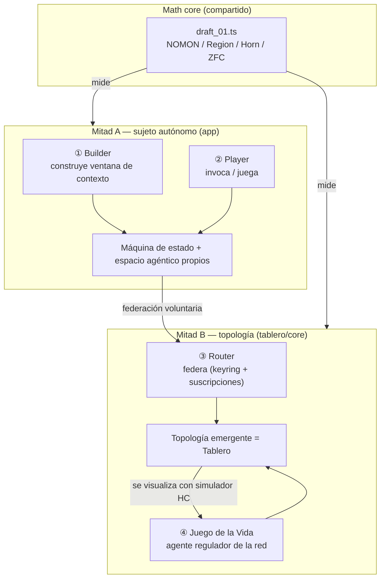
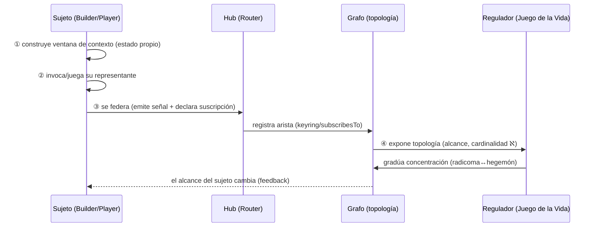

# Put All Together — hacia el MVP

> Síntesis de la sesión 06 junio. Reúne en una sola figura: el **díptico** ([`Aleph_app.md`](Aleph_app.md), [`Aleph_board.md`](Aleph_board.md)), el **math core** ([`draft_01.ts`](../../draft_01.ts)) y los **4 juegos** ([`games/`](games/README.md)). El objetivo es un **slice vertical** que demuestre la tesis con piezas reales, dejando el espectro de implementación abierto.

## 1. La figura completa

**La frase que cierra la conversación:** *«¿Qué pinta tiene un Tablero Scriptorium?»* → Un Tablero es la **topología emergente** de **sujetos autónomos** (Builder/Player) que **se federan** (Router) y cuya **forma↔distribución** se lee y regula como un **juego de la vida** (Regulador), todo medido con el **lenguaje Aleph** (NOMON/Region/ℵ del `draft_01`).

## 2. Correspondencia juego ↔ díptico (lo que el equipo confirmó)

| # | Juego | Es la cara jugable de… | Pieza nueva vs deuda |
|---|-------|------------------------|----------------------|
| ① | ARG Builder | el sujeto **construyéndose** (mitad A) | reusa CRUD + UI existentes |
| ② | ARG Player | el sujeto **ejecutándose** (mitad A) | reusa MCP read/execute |
| ③ | ARG Router | la **federación** A→B (bisagra) | **deuda:** relay del hub + routing por room |
| ④ | Juego de la Vida | la **gestión de topología** (mitad B) + agente regulador | **nuevo:** topología en grafo + regulador |

## 3. El slice vertical MVP (el camino mínimo)

Un solo recorrido que toca las cuatro caras una vez:

### Definición del MVP (mínimo demostrable)

1. **Un sujeto** corre local (su `AlephUniverse` + ventana de contexto) — Builder+Player en un binario, dos modos.
2. **Dos sujetos federan** por el hub **con el relay arreglado** (hoy es deuda) — Router mínimo.
3. La federación **escribe una arista** en el grafo (`aleph:subscribesTo`).
4. Un **regulador** con un slider (`concentration`) altera la topología y el **visor HC** muestra radicoma↔hegemón.
5. El **alcance** (cardinalidad ℵ del conjunto alcanzable) se **deriva** del grafo, no del tráfico.

Si esos 5 pasos corren juntos una vez, el MVP **demuestra la tesis del díptico con sujetos reales**.

## 4. Orden de ataque sugerido (abierto)

El **primer ladrillo** es compartido por la mitad B y el juego ③: **arreglar el relay del `PubSubHub`** (deuda existente). Sin relay no hay federación, y sin federación no hay topología que regular.

| Paso | Qué desbloquea | Riesgo |
|------|----------------|--------|
| 0. Relay del hub (PoC Vía C) | ③ Router mínimo + base de ④ | bajo — arregla deuda |
| 1. Arista en grafo (`subscribesTo`) | sustrato de la topología (mitad B) | medio — decidir RDF vs Mongo (T1) |
| 2. Sujeto Builder+Player local | mitad A jugable | bajo — reusa `aleph-lang` |
| 3. Regulador + visor HC | ④ jugable; cierra la figura | medio — reusa simulador (mitad A) |

> **No se fija el orden como decreto.** Si scrum prioriza identidad/keyring (T2) o persistencia (Vía B), el camino cambia. Lo que el MVP fija es **qué cuenta como "terminado": los 5 pasos del §3 corriendo juntos.**

## 5. Qué NO es el MVP (para proteger el alcance)

- No es SSB/blockchain real todavía (keyring puede empezar como `IdentityContract`).
- No es federación multi-dominio GraphQL completa (eso es post-MVP).
- No es el port completo de ZFC/Horn del `draft_01` (solo lo que mide alcance/cardinalidad).
- No prueba teoremas: **simula universos**; la HC sigue siendo opinión de la federación.

## 6. Trazabilidad

- Sujeto / app: [`Aleph_app.md`](Aleph_app.md)
- Tablero / topología: [`Aleph_board.md`](Aleph_board.md)
- Math core: [`draft_01.ts`](../../draft_01.ts)
- Juegos: [`games/README.md`](games/README.md) → `01`..`04`
- Producto/assets: `SCRIPTORIUM-GAMES/` (en especial `GAME-04-NETWORK-TOPOLOGIST/`)
- Fuente narrativa: [`analisis_transmedia_system.rev1.md`](../../../../analisis_transmedia_system.rev1.md)
