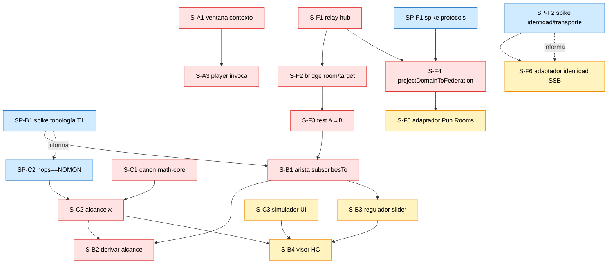
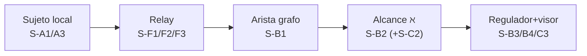

# Tablero kanban + grafo de dependencias

> Foto inicial del tablero y el orden de desbloqueo. Mover tarjetas en vuestra herramienta; aquí queda el estado de partida y, sobre todo, **qué desbloquea qué**.

## Kanban inicial (estado de partida)

| 🧊 Icebox | 📋 Ready (candidatas Sprint 0) | 🚧 In progress | 👀 Review | ✅ Done |
|-----------|-------------------------------|----------------|-----------|---------|
| S-F6 identidad SSB real | S-F1 relay hub | — | — | — |
| S-X1 LAYER_0 SSB/PROTOCOLS | S-F2 bridge room/target | | | |
| S-X2 LAYER_1 IDENTITY/FED | S-F3 test A→B | | | |
| S-X4 LAYER_2 repos | S-C1 canon math-core | | | |
| S-X5 LAYER_3 functional | SP-F1 spike protocols | | | |
| S-B4 visor HC | SP-F2 spike identidad/transporte | | | |
| S-C3 simulador UI | SP-B1 spike topología (T1) | | | |
| | S-X3 ECOSYSTEM repos | | | |
| | S-X6 ADR 0010-0013 | | | |

> Las stories de "jugabilidad" (S-A*, S-B1/2/3, S-C2, S-F4/5) están **Ready pero no en Sprint 0**: entran cuando el desbloqueo (relay + spikes) libera sus dependencias.

## Grafo de dependencias (qué desbloquea qué)

## Camino crítico al MVP (5 pasos del slice vertical)

El **MVP** ([`../MVP.md`](../MVP.md) §3) se demuestra cuando: sujeto local → se federa por relay → escribe arista → se deriva alcance ℵ → regulador gradúa y el visor muestra radicoma↔hegemón. **Una pasada completa = release del programa.**

## Leyenda de bloqueos

- **Bloqueo duro (flecha sólida):** la tarjeta destino no puede empezar hasta que la origen esté `done`.
- **Informa (flecha punteada):** el resultado de un spike orienta la tarjeta, pero no la bloquea formalmente.
- **Decisiones abiertas que afectan al grafo:** ver [`RAID_LOG.md`](RAID_LOG.md) (T1 cambia el sustrato de S-B1; F4 cambia si S-F5 reemplaza al hub propio).
