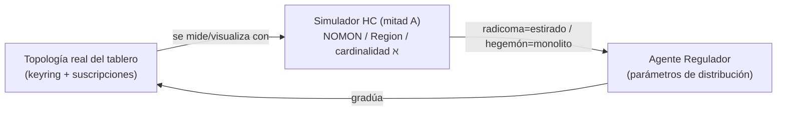

# ④ Juego de la Vida — *Regulador de Distribución*

> *«Topologías vivas que reparten el valor producido.»*
> Assets y escenas: `SCRIPTORIUM-GAMES/GAME-04-NETWORK-TOPOLOGIST/`.

## Identidad

Espectáculo-experimento con forma de **simulador de juego de la vida**. Según la parametrización de condiciones y actores, distintas **topologías y graduaciones** producen entramados que van de **mallas radicoma** a **centros hegemón**. La comunidad obtiene marco teórico para hipótesis sobre lo real: leer la relación entre **forma de la red** y **distribución del valor**. Es a la vez **juego, debate y simulador participativo**. Sobre el escenario se monta una **topología orgánica** (nodos, relés, asambleas, federaciones) y se le aplica un guion económico en tres estados:

```
Solicitar → Producir → Plusvalía → (criba al final de la iteración)
```

Las personas que juegan **gradúan los reguladores** (concentración de medios, trabajo, recursos, ecosistema) y observan cómo cambia la **topología** según las relaciones entre quienes producen y quienes deciden el reparto.

## Lugar en el díptico — mitad B (topología) + el agente regulador

Este es el juego que el usuario identificó como **«juego de la vida con un agente regulador específico para la gestión de la red»**. Es la **cara jugable de la mitad B**:

- La topología que Builder/Player/Router **forman** ([`Aleph_board.md`](../Aleph_board.md)) es aquí **el tablero de juego**.
- El **regulador** es el agente que **lee y ajusta** esa topología — gestión de red hecha juego.
- Conexión directa con el **simulador HC** de la mitad A ([`Aleph_app.md`](../Aleph_app.md)): el regulador es el **operador** que decide si la malla **colapsa monolítica (HC=true)** o **se estira con huecos (HC=false)**. Radicoma ↔ hegemón **es** la dicotomía estirado ↔ monolito.



## Mapeo a infraestructura existente

| Pieza del juego | Anclaje en `NETWORK-ENGINE` |
|-----------------|------------------------------|
| Topología orgánica | `GraphStoreProtocol` (RDF quads) — el grafo `aleph:` como sustrato (mitad B) |
| Lectura forma↔valor | SPARQL tipado (`sparql-dsl.ts`) sobre el alcance |
| Tres estados (Solicitar/Producir/Plusvalía) | `XState` (`createNetworkMachine`) con guion económico |
| Reguladores (sliders) | `mutations` MCP → `dispatch`; UI con sliders (patrón slides de la mitad A) |
| Indicadores en vivo | `events$` (RxJS) + `notifyResourceUpdated` (SSE) |
| Comparar topologías | snapshots versionables del grafo |

## Modelado por tipos (TS.instructions)

El nivel de concentración pide una **escala discriminada** y el estado del ciclo una **unión exhaustiva**:

```ts
type EconomicPhase = 'request' | 'produce' | 'surplus' | 'cull';
type Distribution = 'radicoma' | 'mesh' | 'hub' | 'hegemon'; // de distribuido a concentrado

type RegulatorState = {
  phase: EconomicPhase;
  concentration: number; // 0 = radicoma, 1 = hegemón
  shape: Distribution;   // derivado de concentration (conditional/guard)
};
```

**Decisión abierta:** ¿`shape` se **deriva** de `concentration` (función pura, un solo origen de verdad) o son ejes independientes que el jugador gradúa por separado (más expresivo)?

## Slice MVP de este juego

- Topología semilla en RDF (reusa el universo `aleph0..aleph3` de [`catalog/graph/app.ts`](../../../packages/apps/src/catalog/graph/app.ts)).
- 1 regulador: `concentration` 0→1.
- Visor que muestra la malla pasar de radicoma a hegemón (= simulador HC reutilizado como viewer).
- Lectura mínima: indicador de "reparto" por nodo.

## Decisiones abiertas

- ¿El guion económico es contenido (preset de universo) o axioma del simulador? (la mitad A insiste: **la app puede opinar, el core no decide HC**).
- ¿La criba (`cull`) es determinista o estocástica con seed?
- ¿El regulador es un **agente** (bot autónomo que propone) o solo control humano? El nombre "agente regulador" sugiere lo primero — queda abierto.
