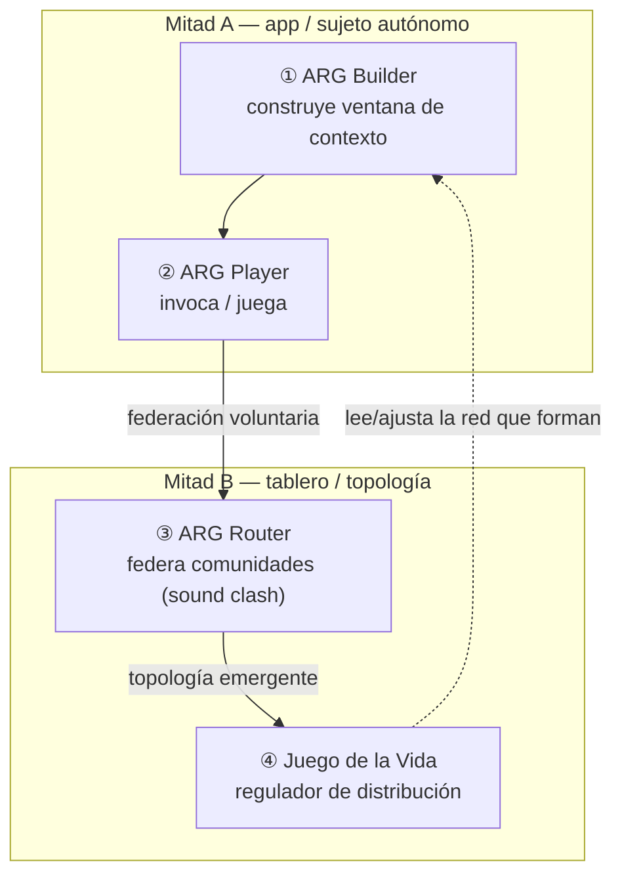

# Catálogo de juegos — Sesión 06 junio

> Inicialización de los 4 juegos documentados en [`analisis_transmedia_system.rev1.md`](../../../../../analisis_transmedia_system.rev1.md) (§*catálogo de juegos previstos*), atados al **díptico Aleph**: [`Aleph_app.md`](../Aleph_app.md) (mitad A — sujeto autónomo) y [`Aleph_board.md`](../Aleph_board.md) (mitad B — topología/core).

## La tesis de esta carpeta

Los 4 juegos del catálogo **no son apps sueltas**: son las **caras jugables** del mismo díptico app-board.

- Los **3 primeros** (ARG Builder / Player / Router) son la expresión jugable de la **app-board**: un sujeto **construye** su ventana de contexto, la **juega/invoca**, y la **federa** con otras comunidades.
- El **4.º** (Juego de la Vida — Regulador de Distribución) es el **agente regulador** de la red: la cara jugable de la **gestión de topología** (mitad B), y el consumidor natural del simulador HC de la mitad A.

## Mapeo juego ↔ díptico ↔ infraestructura

| Juego | Mitad del díptico | Rol en el sujeto/tablero | Infra existente | Doc |
|-------|-------------------|--------------------------|-----------------|-----|
| **① ARG Builder** | A (sujeto) | Construir el **espacio agéntico propio** (ventana de contexto = máquina de estado del sujeto) | `aleph-lang`, `mcp-app-ui`, `DocumentStore` (CRUD) | [`01-arg-builder.md`](01-arg-builder.md) |
| **② ARG Player** | A (sujeto) | **Invocar/jugar** la ventana de contexto; el sujeto como proceso local que decide | MCP resources/tools, `selectEvent` (RxJS) | [`02-arg-player.md`](02-arg-player.md) |
| **③ ARG Router** | A→B (federación) | **Federar** sujetos: keyring + suscripciones = aristas del tablero | `PubSubHub`/`PubSubBridge`, rooms, `projectDomainsToGraphQL` | [`03-arg-router.md`](03-arg-router.md) |
| **④ Juego de la Vida** | B (topología) | **Regular** la red: leer forma↔distribución, ajustar parámetros | `GraphStoreProtocol` (RDF), simulador HC (mitad A), `XState` | [`04-juego-de-la-vida-regulador.md`](04-juego-de-la-vida-regulador.md) |

## Estado editorial

Igual que el díptico: **asentado pero abierto**. Cada ficha fija vocabulario, mapeo a código y un *slice* MVP; deja las decisiones de implementación trazadas pero **sin cerrar**. El "put all together" hacia el MVP vive en [`../MVP.md`](../MVP.md).

## Relación con la carpeta `SCRIPTORIUM-GAMES/` del repo

El catálogo de producto y los assets viven en `SCRIPTORIUM-GAMES/` (p. ej. `GAME-04-NETWORK-TOPOLOGIST/`). Esta carpeta `games/` es la **vista de ingeniería** (cómo cada juego se apoya en el díptico y en `NETWORK-ENGINE`), no el material de marca.
