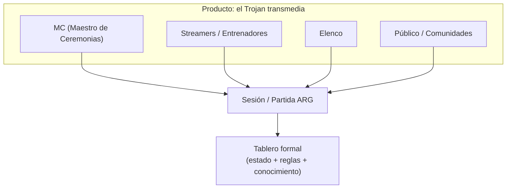
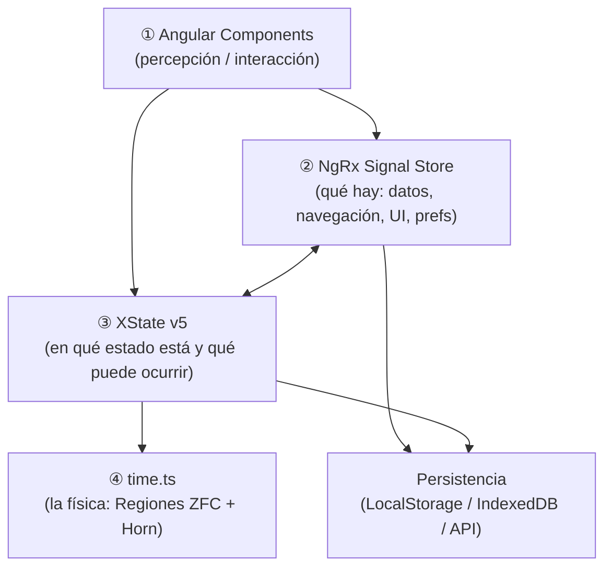
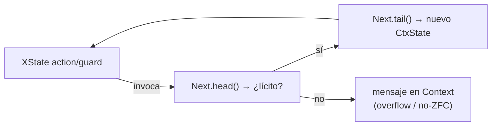
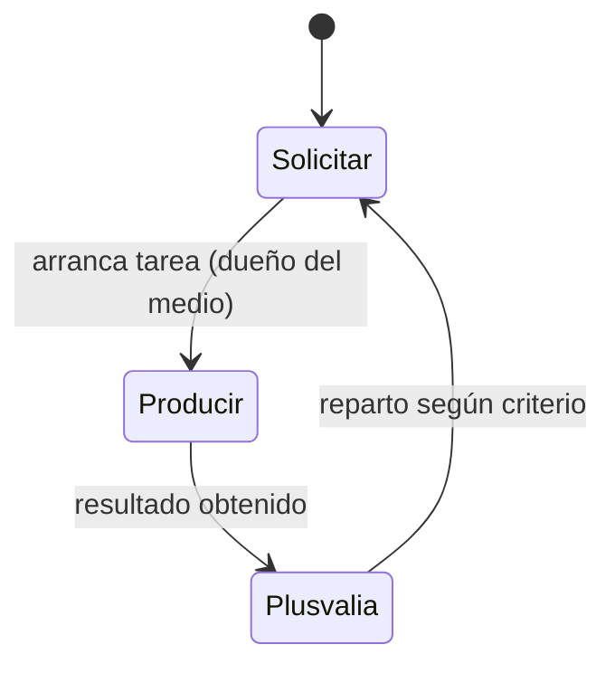
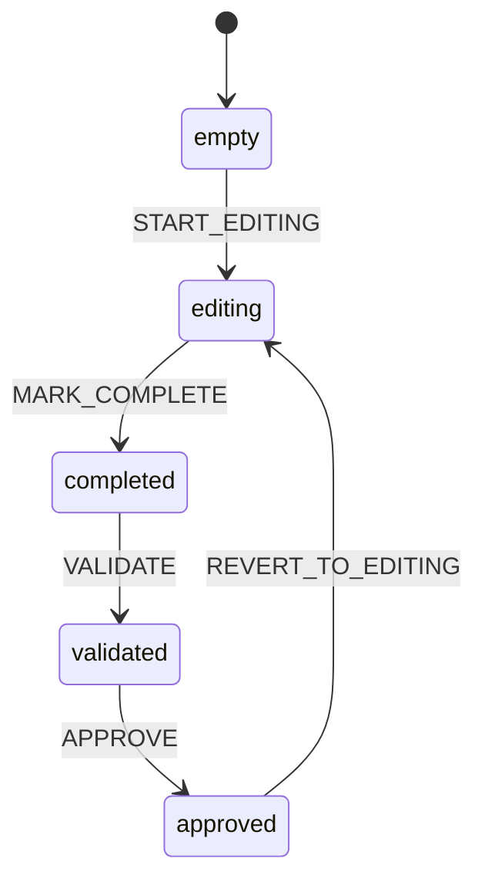
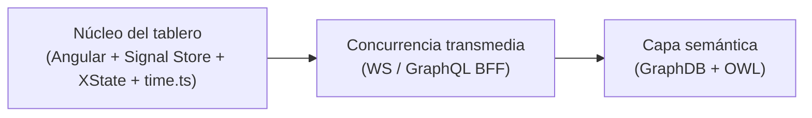
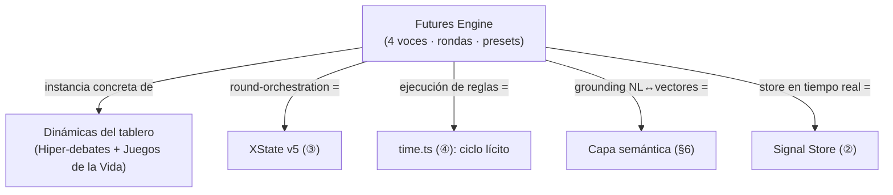
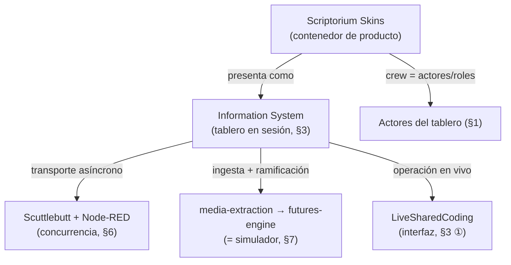

# Scriptorium Transmedia-System — Plan Maestro

## 0. Mapa de documentos

| Documento | Rol en el concepto |
|-----------|--------------------|
| [00_PLAN_MAESTRO.md](00_PLAN_MAESTRO.md) | Big picture + índice + ruta. |
| [plan_base.md](plan_base.md) | Visión y recapitulación narrativa (qué, cómo). |
| [prompt02.md](prompt02.md) | Casos de uso paradigmáticos (ARG) + plan de implementación del tablero. |
| [prompt01.md](prompt01.md) | Decisiones técnicas: CommonKADS, XState v5, NgRx Signal Store, OWL/Prolog, GraphQL BFF. |
| [time.ts](time.ts) | El motor lógico-temporal (Regiones ZFC, cláusulas de Horn, `Next`). |

---

## 1. La idea en una frase

**Scriptorium Transmedia-System** es un *sound system portátil para la Web*: en lugar de
emitir música en una geolocalización, orquesta **partidas/sesiones interactivas (ARG)**
donde un MC, streamers, elenco y público mutan en tiempo real una **ventana de contexto**
y ejecutan **simulaciones sociales** ("Juegos de la Vida") sobre un tablero formal.

---

## 2. Las tres dinámicas (el "para qué")

Todo el producto sirve **tres casos de uso** que comparten infraestructura
(detalle completo en [prompt02.md](prompt02.md)):

1. **IA Builder** — El elenco mantiene una *ventana de contexto* viva; el público y los
   streamers la usan para inferencia conversacional orquestada.
2. **Hiper-debates** — Streamers como entrenadores; sus comunidades hiperdirigen a un
   "representante"; el MC gestiona el bucle de diálogo y el cierre.
3. **Juegos de la Vida (simulaciones)** — Se ejecutan *n* ciclos de vida de actores sobre
   una topología diseñada (ej. `Solicitar → Producir → Plusvalía`), gradando parámetros
   (centralización, producción, reparto) para estudiar resultados emergentes.

> [!IMPORTANT]
> Los tres casos son **el mismo motor** visto desde tres encuadres: el caso 3 es el más
> cerrado y el que valida el núcleo formal.

---

## 3. La arquitectura del tablero (el "cómo")

Cuatro capas que convergen. Cada una tiene **una sola responsabilidad** y una tecnología
de referencia decidida en [prompt01.md](prompt01.md).

| # | Capa | Tecnología | Responsabilidad | Función cognitiva |
|---|------|-----------|-----------------|-------------------|
| ① | Interfaz | Angular 21 + Signals | Render, interacción del MC/streamers | Percepción |
| ② | Operacional | NgRx Signal Store | Datos en memoria, navegación, caché, preferencias | Memoria episódica |
| ③ | Conductual | XState v5 | Ciclo de vida, turnos, transiciones, reglas temporales | Función ejecutiva |
| ④ | Físico-formal | `time.ts` | Cálculo del siguiente ciclo lícito (conjuntos/lógica) | Sustrato lógico |
| (futuro) | Semántico | GraphDB + OWL | Conocimiento, inferencia, razonamiento neo-simbólico | Memoria semántica |

> [!IMPORTANT]
> **Separación estricta** (la regla que evita el monstruo inmantenible):
> el Signal Store sabe *qué hay*; XState sabe *en qué estado está y qué puede pasar*;
> `time.ts` decide *qué transición es lícita*. No se mezclan responsabilidades.

---

## 4. El motor formal: `time.ts` (la "física")

`time.ts` es el núcleo que da solidez a las simulaciones. XState **delega** en él para
calcular el siguiente estado en lugar de hardcodear la lógica en las transiciones.

- **Regiones** de tiempo/espacio matemático: Naturales, Negativos, Enteros, continuas y
  discretas, con límites (`IntervalBounds`, `IntervalLimits`) y base axiomática **ZFC**.
- **Cláusulas de Horn** (`Horn`, `Clause`) y la clase **`Next`** (`HornNextDiscrete`,
  `HornNextContinous`…) que modela el avance de un ciclo deductivo `head`/`tail`.
- **Manejo de errores como mensajes** (`MIN_OVERFLOW`, `MAX_OVERFLOW`, `NOT_ZFC_REGION`):
  un ciclo "ilícito" no rompe, devuelve `null` + mensaje en el contexto.

> Conexión clave: un **turno** del Juego de la Vida = una invocación de `Next` validada
> por XState y reflejada como dato en el Signal Store.

---

## 5. La topología base del Juego de la Vida

El caso base orquesta **un Juego de la Vida simple** end-to-end sobre las cuatro capas.
Topología mínima de un actor:

Y el ciclo de vida de cada *worksheet*/modelo CommonKADS que enmarca el tablero
(detalle en [prompt02.md](prompt02.md), §1–§7):

**Artefactos técnicos del tablero** (especificados en [prompt02.md](prompt02.md)):
`src/models/types.ts`, `worksheet.machine.ts`, `project.machine.ts`, `project.store.ts`,
`project-workflow.service.ts`, `persistence.service.ts`, `worksheet.registry.ts`.

---

## 6. Capas de extensión de la arquitectura

Sobre las cuatro capas convergentes del tablero (§3), la arquitectura admite dos niveles
de capacidad adicionales que amplían su alcance sin alterar el núcleo:

- **Concurrencia transmedia** — Sincronización del tablero entre elenco, streamers y
  público mediante WebSockets/streams, con un **GraphQL BFF** como fachada fina de lectura
  (no como capa de razonamiento).
- **Capa semántica** — **GraphDB + OWL** (y, en su caso, Prolog/ASP) para inferencia y
  razonamiento neo-simbólico sobre el conocimiento acumulado en el tablero.

---

## 7. Integración con el simulador (Futures Engine)

El equipo del simulador trabaja, en `ALEPH/ARCHIVO/simulator-hub/implementation_plan.md`,
un **Futures Engine Simulation Pipeline**: un orquestador donde **cuatro personas/voces de
IA** (los "alephs" Red, Blue, Black, White) debaten un tema desde *eigenstates*
epistemológicos estables. El pipeline encadena rondas (Baseline → Delta → Friction →
Proposition) y abre una ronda de **ejecución** en la que las voces actúan como si el motor
"corriera" sus reglas y reaccionan al comportamiento emergente del sistema.

### 7.1. Qué problema resuelve y por qué casa con nosotros

Su núcleo conceptual es **Data Grounding vs. Persona**: cómo alimentar conocimiento de
código en tiempo real (vía `VectorMachineSDK` y `DocumentMachineSDK`, moviendo lenguaje
natural → vectores → lenguaje natural) a agentes que son, en esencia, "ventanas de contexto
atadas a herramientas", envueltos en personas mediante `WiringEditor`. Ese es exactamente
el sustrato de nuestras tres dinámicas (§2): una *ventana de contexto* viva alimentada por
una capa de recuperación.

### 7.2. Mapa de correspondencias

| Concepto del simulador | Lugar en el Plan Maestro |
|------------------------|--------------------------|
| 4 personas/voces (alephs Red·Blue·Black·White) | **Actores** del tablero (elenco/streamers, §1) |
| Rondas Baseline→Delta→Friction→Proposition | **Turnos** del ciclo conductual (XState v5, §3 ③) |
| Ronda de **Execution Simulation** | **Juegos de la Vida** (§2, caso 3): correr reglas y observar lo emergente |
| Debate dirigido por presets | **Hiper-debates** (§2, caso 2): el MC gestiona el bucle |
| "Ventana de contexto atada a herramientas" + grounding | **IA Builder** (§2, caso 1) |
| `VectorMachineSDK` / `DocumentMachineSDK` (NL↔vectores) | **Capa semántica** de extensión (§6) |
| Presets Stress-Test / Synthesis / Execution | **Modos de orquestación** del MC sobre el tablero |
| `Futures.Machine` (round-orchestration) | Máquina **XState v5** (§3 ③) |
| "real-time codebase store" ↔ chat ↔ engine | **NgRx Signal Store** (§3 ②) como puente de estado |
| `WiringEditor` (wrappers de voz) | Vínculo **persona ↔ rol** que asigna el tablero |

### 7.3. Lectura de la convergencia

El simulador es una **instancia concreta y exploratoria** (vive en `ARCHIVO/`) de las
dinámicas que el tablero formaliza: sus rondas son turnos, su "Execution Simulation" es un
Juego de la Vida, y su capa de grounding (`VectorMachineSDK`/`DocumentMachineSDK`)
prefigura la capa semántica (§6). Su panel de control ("nave") es una materialización de la
interfaz de orquestación del MC.

### 7.4. Solapamientos a vigilar

- **Doble noción de "preset/modo".** El simulador define presets de *ejecución del debate*
  (Stress-Test, Synthesis, Execution); el tablero define *encuadres* (las tres dinámicas de
  §2). Son ejes ortogonales: un mismo encuadre puede correrse con cualquiera de los presets.
  Conviene mantenerlos separados para no colapsar "qué se simula" con "cómo se ejecuta".
- **Dos motores de estado.** `Futures.Machine` y nuestra máquina XState describen el mismo
  rol (orquestar rondas/turnos). La integración armónica pasa por tratarlos como **una
  única función ejecutiva**, no por duplicarla.
- **Frontera del razonamiento.** El simulador apoya el grounding en SDKs de vectores; el
  tablero reserva la inferencia profunda para la capa semántica. Coinciden en que la
  recuperación no debe mezclarse con la lógica del ciclo (`time.ts` decide lo lícito).

---

## 8. El contenedor de producto (Scriptorium Skins / Information System)

En `ALEPH/ARCHIVO/SCRIPTORIUM-SKINS/` el proyecto se documenta desde su **envoltorio de
producto**: cómo se nombra, se empaqueta y se presenta el sistema hacia fuera. Donde el
Plan Maestro describe el *tablero formal* (capas internas, §3), este material describe el
**Information System** que ese tablero hace funcionar y la metáfora rectora que le da
identidad: un *sound system para la Web*, heredero del modelo Trojan, donde lo que viaja no
es música sino **transmedia asíncrono**.

### 8.1. La metáfora rectora

- **Information System** = el despliegue completo de una sesión transmedia (la "fiesta de
  datos"). Es la materialización externa del *tablero* (§3): Scriptorium no aporta pantallas
  ni periféricos, **aporta la arquitectura pura y el flujo**.
- **Rude Bot Skins** = identidades operativas (no temas visuales): el "traje" con el que
  cada agente toma su rol al levantar el Information System. Son la lectura *de producto* de
  los **actores** del tablero (§1) y de los wrappers de voz del simulador (§7).
- **El productor/streamer manda la fiesta física**; la *crew* de skins corre el sistema por
  debajo, de forma federada y asíncrona. Es la misma división MC / actores de §1, nombrada
  para el público.

> El sustrato Trojan/sound-system es **una capa subsumida de origen**: punto de partida
> conceptual, no parte de la presentación del producto.

### 8.2. Vocabulario operativo real (rejilla de mapeo)

El dossier fija jerga que designa componentes reales del ecosistema. Conviene anclarla al
Plan Maestro para no duplicar conceptos:

| Término del contenedor | A qué corresponde en el Plan Maestro |
|------------------------|--------------------------------------|
| **Information System** | El **tablero formal** desplegado y en sesión (§3) |
| **Rude Bot Skin** | Identidad/rol operativo de un **actor** (§1); wrapper de voz (§7) |
| **Pub.Rooms** | Vestíbulo / salas federadas de la sesión (capa de concurrencia, §6) |
| **Node-RED / `WiringEditor`** | Enrutado de flujos entre nodos (capa de concurrencia, §6) |
| **Scuttlebutt (SSB)** | Transporte descentralizado y **asíncrono** del transmedia (§6) |
| **`media-extraction`** | Ingesta: stream → transcripción (entrada de la capa semántica, §6/§7) |
| **`futures-engine`** | El "Dramaturgo": ramifica 2–5 futuros (= el **simulador**, §7) |
| **`engine-plan`** | Inspección/diagnóstico del pipeline de punta a punta |
| **`BotHubSDK`** | Federa peers y corre la cadena `bot-rabbit → bot-spider → bot-horse` |
| **`kick-aleph-bot`** | Gateway que conecta el streaming con el Scriptorium |
| **Zeus / PRESETS** | Ensambla los *packs* de capacidades de cada agente al conectarse |
| **LiveSharedCoding** | El elenco operando en vivo (capa de interfaz, §3 ①) |
| **ARG / Transmedia** | El tipo de juego/narrativa que sirve el sistema (§2) |

### 8.3. Lectura de la convergencia

El contenedor **no añade arquitectura nueva**: nombra, empaqueta y da identidad de producto
a lo que el tablero ya formaliza. Su valor para el análisis es el **vocabulario canónico**
(la rejilla de §8.2): fija cómo se llaman de cara al exterior los componentes internos, de
modo que `futures-engine` (producto) y el *Futures Engine* del simulador (§7) son la misma
pieza vista desde el envoltorio y desde la implementación.

### 8.4. Solapamientos a vigilar

- **"Skin" como rol, no como tema visual.** El término designa identidad operativa de un
  actor; no debe colapsarse con estilos de UI de la capa de interfaz (§3 ①).
- **Transporte vs. lógica.** Scuttlebutt/Node-RED resuelven *distribución* (capa de
  concurrencia, §6); no deben absorber la lógica del ciclo (`time.ts`, §4) ni el estado
  conductual (XState, §3 ③).
- **Una sola noción de "motor de futuros".** `futures-engine` (producto) y el simulador
  (§7) son la misma capacidad; mantenerlos como una sola para no bifurcar el concepto.
