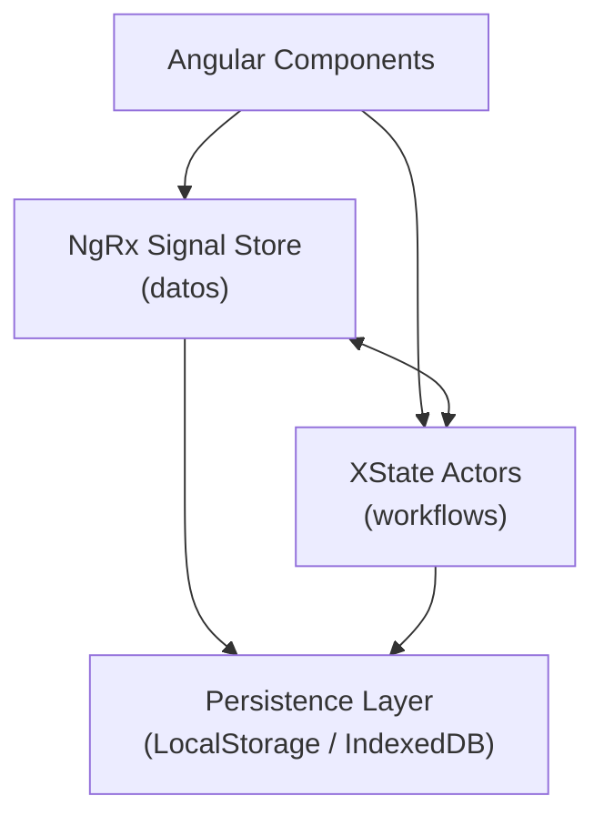
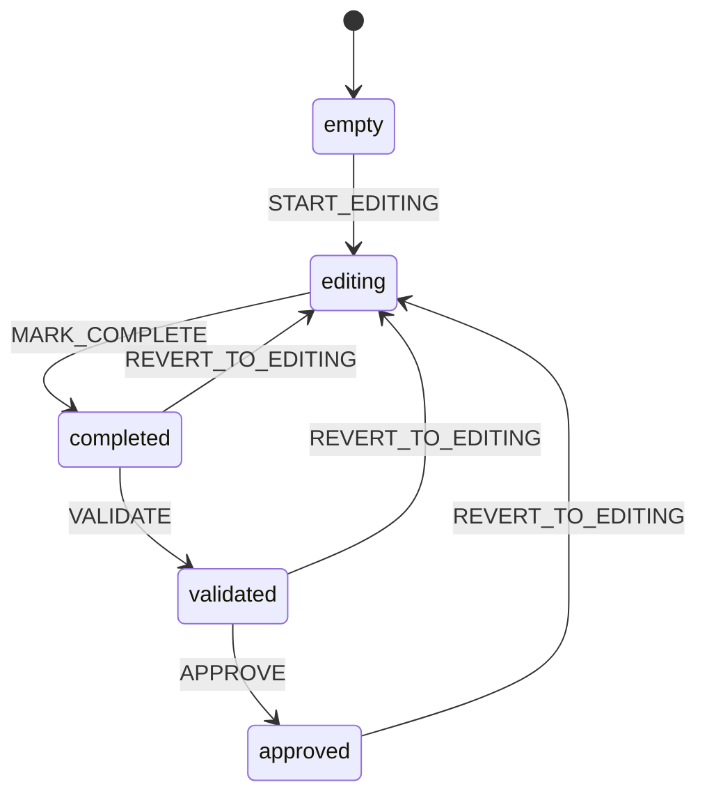
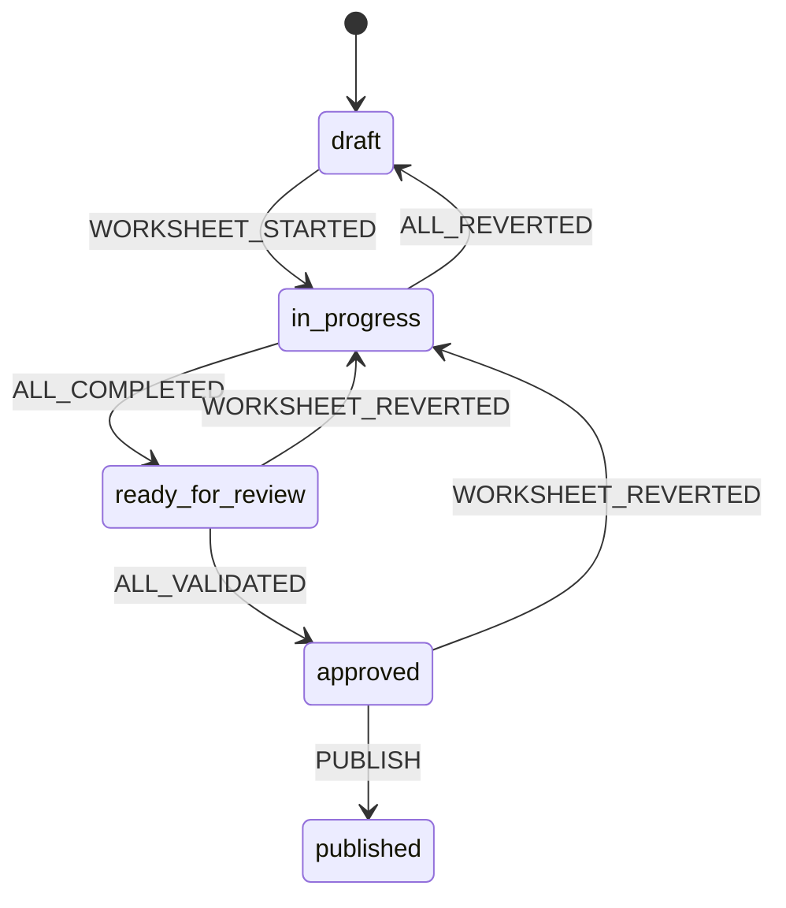
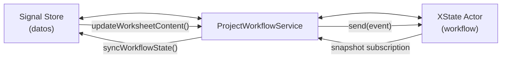

Casos de usos paradigmáticos del sound-system-trojan like "transmedia-system-scriptorium". This is product, like Trojan lorry, is portable Transmedia-System to run Parties. A diferencia del sound system que emite y opera en una geolocalización, el Scriptorium Transmedia-System opera sobre la Web en la forma de juego ARG.


## IA builder

La sesión gira alrededor de mantener una "ventana de contexto" por parte del Elenco. Esta ventana está disponible para que el público use sus sistemas de inferencia agéntica conversacional o, através del streamer, las rooms de scriptorium para conversaciones orquestadas.

Flujo:

El MC crea la sesión.

El streamer orquesta en la UI, los rude bot scriptorium skin en backend:

- el crud de la ventana de contexto --> Elenco, en un proceso constante desde que arranca la sesión muta el estado de la ventana.
- la inferencia --> Público sincronizando la ventana o via stream app.

## Hiper-debates

Extiende el caso de uso anterior. Distintos streamers actúan como entrenadores con sus comunidades y orquestan la ventana de contexto en un escenario donde n otros streamers presentan sus candidatos para orquestar un debate en stream.

Flujo:

El MC crea la sesión.

Los streamer arrancan sus comunidades.

El MC convoca al debate.

Los streamers suscriben a sus representantes.

El MC gestiona bucle de diálogo.

Los streamers canalizan a sus comunidades (elenco/publico) para hiperdirigir colectivamente la participación de su representante.

El MC pide conclusiones y cierra debate.

## Juegos de la vida

### Regulador de centralización

Se describe un paradigma y se ejecuta gradando parámetros para obtener el resultado. El simulador ejecuta n ciclos de vida en una topología diseñada para el experimento. 

El diseño de la red considera un escenario simple xState, con los estados

Estados:

- Solicitar: un actor dueño de un medio de producción arranca una tarea.
- Producir: ejecutar la tarea. Obtener el resultado. Enviar al dueño del medio de producción
- Plus valía: el actor reparte el resultado de la tarea según criterio.

Distintas topologías y sus caracterización producirán distintos resultados.

## Topos

Basándome en los dos prompts de [prompt01.md](file:///Users/morente/Desktop/THEIA_PATH/NUEVA_BASE/SCRIPTORIUM/ALEPH/AAIAGallery/alephscript/src/FIA/paradigmas/sbc/v02/SCRIPTORIUM/DOCS/prompt01.md), voy a implementar la arquitectura completa de un editor para Scriptorium centrándome en la parte de "tablero" basada en CommonKADS como infraestructura para desplegar los casos de uso de los juegos de la vida que indicas con dos capas claramente separadas:

| Capa | Tecnología | Responsabilidad |
|------|-----------|-----------------|
| **Workflow** | XState v5 | Ciclo de vida, transiciones, validaciones, reglas temporales |
| **Estado global** | NgRx Signal Store | Datos del proyecto, navegación, UI, preferencias, caché |



> [!IMPORTANT]
> **Separación estricta**: Signal Store sabe *qué hay*. XState sabe *en qué estado está y qué puede ocurrir después*. No se mezclan responsabilidades.

---

## User Review Required

> [!WARNING]
> **Tecnología de persistencia**: El plan usa `localStorage` para la primera versión. ¿Prefieres IndexedDB directamente, o un backend API?

> [!IMPORTANT]
> **Ubicación de ficheros**: Todos los archivos se crearán bajo `SCRIPTORIUM/src/`. ¿Es correcta esta ruta, o prefieres otra estructura de directorios?

## Open Questions

1. **¿Angular CLI existente?** ¿Tienes ya un proyecto Angular 21 inicializado, o debo crear la estructura desde cero?
2. **¿Modelos de formulario?** ¿Ya tienes definidas las interfaces de contenido de cada worksheet (OM-1 fields, etc.), o las defino yo también?
3. **¿Tests?** ¿Quieres tests unitarios (Vitest/Jest) como parte del entregable, o en una fase posterior?

---

## Proposed Changes

La implementación se divide en **7 componentes**. Todos los archivos se crean bajo:
```
SCRIPTORIUM/src/
├── models/          # Tipos compartidos
├── machines/        # XState v5 machines
├── stores/          # NgRx Signal Stores  
├── services/        # Servicios Angular de integración
└── utils/           # Persistencia, helpers
```

---

### 1. Modelo de Dominio (Types)

#### [NEW] [types.ts](file:///Users/morente/Desktop/THEIA_PATH/NUEVA_BASE/SCRIPTORIUM/ALEPH/AAIAGallery/alephscript/src/FIA/paradigmas/sbc/v02/SCRIPTORIUM/src/models/types.ts)

Tipos compartidos entre XState y Signal Store:

```typescript
// WorksheetType — los 10 modelos CommonKADS
type WorksheetType = 'OM1' | 'OM2' | 'OM3' | 'OM4' | 'OM5' | 'TM' | 'AM' | 'KM' | 'CM' | 'DM';

// WorksheetLifecycleState — estados del ciclo de vida (XState)
type WorksheetLifecycleState = 'empty' | 'editing' | 'completed' | 'validated' | 'approved';

// ProjectLifecycleState — estado global agregado (XState)
type ProjectLifecycleState = 'draft' | 'in_progress' | 'ready_for_review' | 'approved' | 'published';

// Worksheet — modelo de datos (Signal Store)
interface Worksheet { id, type, title, content, metadata }

// Project — modelo de datos (Signal Store)
interface Project { id, name, description, worksheets, createdAt, updatedAt }
```

---

### 2. XState — Worksheet Machine

#### [NEW] [worksheet.machine.ts](file:///Users/morente/Desktop/THEIA_PATH/NUEVA_BASE/SCRIPTORIUM/ALEPH/AAIAGallery/alephscript/src/FIA/paradigmas/sbc/v02/SCRIPTORIUM/src/machines/worksheet.machine.ts)

Máquina de estados para el ciclo de vida de **un** worksheet individual.



**Implementación con `setup()` API de XState v5:**
- `types:` context (worksheetId, worksheetType, lastModified, validationErrors), events
- `guards:` `hasContent`, `isValid`, `canApprove`
- `actions:` `assignLastModified`, `clearValidationErrors`, `notifyParent`
- Usa `sendParent()` para notificar cambios al project machine

---

### 3. XState — Project Machine

#### [NEW] [project.machine.ts](file:///Users/morente/Desktop/THEIA_PATH/NUEVA_BASE/SCRIPTORIUM/ALEPH/AAIAGallery/alephscript/src/FIA/paradigmas/sbc/v02/SCRIPTORIUM/src/machines/project.machine.ts)

Máquina agregadora que gestiona el estado global del proyecto.



**Diseño:**
- Utiliza **estados paralelos** para gestionar cada worksheet como actor hijo (`spawn`)
- Context almacena un `Record<WorksheetType, ActorRef>` de actores hijos
- Guards calculan el estado global a partir de los snapshots de los hijos
- Soporta persistencia: `getPersistedSnapshot()` / restauración desde JSON
- **Autosave**: acción invocada que hace debounce y guarda al persistence layer

---

### 4. NgRx Signal Store — ProjectStore

#### [NEW] [project.store.ts](file:///Users/morente/Desktop/THEIA_PATH/NUEVA_BASE/SCRIPTORIUM/ALEPH/AAIAGallery/alephscript/src/FIA/paradigmas/sbc/v02/SCRIPTORIUM/src/stores/project.store.ts)

```typescript
export const ProjectStore = signalStore(
  { providedIn: 'root' },
  withState<ProjectStoreState>({ ... }),
  withComputed((store) => ({
    currentWorksheet: computed(...),
    allWorksheets: computed(...),
    worksheetCount: computed(...),
    completionPercentage: computed(...),
    projectStatistics: computed(...),
    navigationTree: computed(...),
  })),
  withMethods((store) => ({
    loadProject(id: string) { ... },
    saveProject() { ... },
    createProject(name: string) { ... },
    importProject(json: string) { ... },
    exportProject(): string { ... },
    updateWorksheetContent(id: string, content: unknown) { ... },
  })),
  withHooks({ onInit(store) { /* autosave, load preferences */ } })
);
```

**Estado:**
```typescript
interface ProjectStoreState {
  project: Project | null;
  worksheets: Record<string, Worksheet>;
  selectedWorksheetId: string | null;
  selectedTab: string;
  breadcrumbs: BreadcrumbItem[];
  loading: boolean;
  saving: boolean;
  errors: AppError[];
  notifications: Notification[];
  preferences: UserPreferences;
}
```

---

### 5. Servicio de Integración XState ↔ Signal Store

#### [NEW] [project-workflow.service.ts](file:///Users/morente/Desktop/THEIA_PATH/NUEVA_BASE/SCRIPTORIUM/ALEPH/AAIAGallery/alephscript/src/FIA/paradigmas/sbc/v02/SCRIPTORIUM/src/services/project-workflow.service.ts)

Este servicio es el **puente** entre ambas capas:



**Responsabilidades:**
- Crea y arranca el `projectMachine` actor
- Suscribe snapshots del actor a signals Angular
- Expone señales derivadas: `isProjectReady`, `completionPercentage`, `approvedWorksheets`, `pendingWorksheets`
- Método `send()` tipado para enviar eventos al workflow
- Gestiona persistencia del snapshot XState
- Sincroniza cambios del Signal Store → XState (nuevo contenido → `MARK_COMPLETE`)

---

### 6. Persistencia

#### [NEW] [persistence.service.ts](file:///Users/morente/Desktop/THEIA_PATH/NUEVA_BASE/SCRIPTORIUM/ALEPH/AAIAGallery/alephscript/src/FIA/paradigmas/sbc/v02/SCRIPTORIUM/src/utils/persistence.service.ts)

Formato JSON serializable:

```json
{
  "version": "1.0",
  "projectId": "uuid",
  "savedAt": "ISO-8601",
  "project": {
    "id": "uuid",
    "name": "Mi Proyecto CK",
    "worksheets": [
      {
        "id": "uuid",
        "type": "OM1",
        "title": "Problems & Opportunities",
        "content": { ... },
        "metadata": { "createdAt": "...", "updatedAt": "..." }
      }
    ]
  },
  "workflowState": {
    "projectState": "in_progress",
    "worksheetStates": {
      "OM1": "completed",
      "OM2": "editing",
      "TM": "empty"
    }
  },
  "preferences": { "theme": "dark", "language": "es", "autosave": true }
}
```

- `saveToLocalStorage()` / `loadFromLocalStorage()`
- `exportToJSON()` → descargable
- `importFromJSON()` → carga + hidratación de XState actors

---

### 7. Escalabilidad

#### [NEW] [worksheet.registry.ts](file:///Users/morente/Desktop/THEIA_PATH/NUEVA_BASE/SCRIPTORIUM/ALEPH/AAIAGallery/alephscript/src/FIA/paradigmas/sbc/v02/SCRIPTORIUM/src/models/worksheet.registry.ts)

Registro dinámico de tipos de worksheet:

```typescript
const WORKSHEET_REGISTRY = new Map<string, WorksheetDefinition>();

function registerWorksheet(def: WorksheetDefinition): void { ... }
function getWorksheetDefinition(type: string): WorksheetDefinition { ... }

// Añadir un nuevo modelo CommonKADS sin tocar la máquina principal:
registerWorksheet({
  type: 'OM6_CUSTOM',
  title: 'Custom Extension',
  template: { sections: [...] },
  validationRules: [...]
});
```

La máquina principal no cambia: simplemente spawneará un `worksheetMachine` por cada entrada del registro.

---

## Resumen de Archivos

| Archivo | Tipo | Descripción |
|---------|------|-------------|
| `src/models/types.ts` | [NEW] | Tipos TypeScript compartidos |
| `src/models/worksheet.registry.ts` | [NEW] | Registro extensible de worksheets |
| `src/machines/worksheet.machine.ts` | [NEW] | XState v5 — ciclo de vida worksheet |
| `src/machines/project.machine.ts` | [NEW] | XState v5 — agregador de proyecto |
| `src/stores/project.store.ts` | [NEW] | NgRx Signal Store — estado global |
| `src/services/project-workflow.service.ts` | [NEW] | Integración XState ↔ Signal Store |
| `src/utils/persistence.service.ts` | [NEW] | Persistencia localStorage / JSON |

---

## Verification Plan

### Automated Tests
- Crear scripts de test para las máquinas XState (pure TypeScript, sin Angular)
- Verificar transiciones: `empty → editing → completed → validated → approved`
- Verificar transiciones inversas: `approved → editing`
- Verificar que el project machine calcula el estado global correctamente
- Verificar serialización / deserialización del snapshot

### Manual Verification
- Instanciar el `ProjectWorkflowService` y verificar que las signals Angular se actualizan correctamente
- Verificar que `exportProject()` produce JSON válido y `importProject()` lo restaura
- Confirmar que los tipos TypeScript compilan sin errores con `tsc --noEmit`

### Compilation Check
```bash
npx tsc --noEmit --strict
```

Sí, y de hecho hay varias rutas bastante maduras para pasar de ontologías OWL hechas en Protégé a motores de razonamiento, sistemas lógicos o incluso simuladores basados en reglas.

La clave es entender que:

-   OWL = lógica descriptiva (Description Logic)

-   Prolog = lógica de predicados con resolución SLD

-   No son equivalentes exactos, pero sí parcialmente traducibles.

1\. OWL → razonamiento automático directo
=========================================

Primero: OWL ya tiene "razonadores".

En Protégé puedes usar reasoners como:

-   HermiT

-   Pellet

-   FaCT++

Estos:

-   infieren clases

-   detectan contradicciones

-   clasifican ontologías

-   responden queries lógicas

Ejemplo:

```
Human ⊆ MortalSocrates : Human
```

el reasoner infiere:

```
Socrates : Mortal
```

Eso ya es "simulación de razonamiento" en cierto sentido.

* * * * *

2\. OWL → Prolog
================

Sí se puede, pero con límites.

Problema fundamental
--------------------

OWL trabaja bajo:

-   Open World Assumption

-   monotonicidad

-   semántica declarativa fuerte

Prolog normalmente usa:

-   Closed World Assumption

-   negación por fallo (`not`)

-   búsqueda procedural

Entonces la traducción nunca es perfecta.

* * * * *

3\. Herramientas reales OWL → Prolog
====================================

SWI-Prolog semweb
-----------------

[SWI-Prolog Semantic Web Library](https://www.swi-prolog.org/pldoc/package/semweb.html?utm_source=chatgpt.com)

Muy importante.

Permite:

-   cargar RDF/OWL

-   consultar triples

-   razonamiento parcial

Ejemplo:

```
rdf(Socrates, rdf:type, human).rdf(human, rdfs:subClassOf, mortal).
```

y consultas tipo:

```
rdf(X, rdf:type, mortal).
```

* * * * *

Thea2
-----

[Thea2 OWL Library for Prolog](https://github.com/vangelisv/thea?utm_source=chatgpt.com)

Convierte OWL ↔ Prolog.

Muy usado académicamente.

* * * * *

OWL2Prolog
----------

Hay papers y herramientas experimentales:

-   OWL → Horn clauses

-   Description Logic → Datalog/Prolog

pero suelen restringir OWL a subconjuntos tipo:

-   OWL RL

-   Horn-SHIQ

-   EL++

* * * * *

4\. Lo más práctico hoy: OWL → RDF → reglas
===========================================

La pipeline real suele ser:

```
Protégé   ↓OWL/RDF   ↓Triple store / grafo semántico   ↓SPARQL + reglas
```

o:

```
OWL   ↓Datalog / Rule engine   ↓Simulación
```

* * * * *

5\. OWL + simulación dinámica
=============================

Aquí ya entras en IA simbólica seria.

OWL describe:

-   entidades

-   taxonomías

-   relaciones

pero NO modela bien:

-   tiempo

-   procesos

-   causalidad

-   estados mutables

Para simulación necesitas combinarlo con:

| Tecnología | Función |
| --- | --- |
| OWL | ontología |
| Prolog | inferencia |
| Drools | motor de reglas |
| CLIPS | sistema experto |
| Answer Set Programming | razonamiento no monotónico |
| agentes BDI | simulación cognitiva |

* * * * *

6\. OWL → CLIPS / sistemas expertos
===================================

Muy típico históricamente:

```
OWL ontology   ↓Reglas IF-THEN   ↓Motor experto
```

Ejemplo:

```
(defrule mortal-rule   (human ?x) =>   (assert (mortal ?x)))
```

* * * * *

7\. Lo interesante filosóficamente
==================================

OWL está más cerca de:

-   taxonomía aristotélica

-   lógica descriptiva

-   categorización formal

Prolog está más cerca de:

-   deducción operacional

-   cálculo lógico ejecutable

Kafka/NATS/etc. son otra cosa: sistemas de eventos.

* * * * *

8\. Arquitectura moderna típica
===============================

Hoy una arquitectura "neo-simbólica" podría ser:

```
Protégé (OWL ontology)    ↓RDF triples    ↓Graph DB (GraphDB / Stardog / Fuseki)    ↓Rule engine / Prolog    ↓LLM agent
```

o incluso:

```
OWL ↓Knowledge graph ↓Vector embeddings ↓LLM reasoning
```

* * * * *

9\. Lo más compatible con Prolog
================================

Si quieres interoperabilidad buena:

Usa OWL RL
----------

Porque:

-   se aproxima a Horn clauses

-   es traducible a Datalog

-   evita constructs muy difíciles

Malos para Prolog:

-   cardinalidades complejas

-   disyunciones

-   restricciones existenciales profundas

Buenos:

-   subclases

-   propiedades

-   reglas simples

* * * * *

10\. Si lo que quieres es "agentes que razonan"
===============================================

Entonces probablemente el stack correcto no es solo OWL.

Miraría:

-   SWI-Prolog

-   Drools

-   Apache Jena

-   GraphDB

-   Answer Set Programming (`clingo`)

-   BDI agents (`Jason`, `JaCaMo`)

porque OWL solo no modela bien comportamiento dinámico.

xstate + ngxstore + graphql + graphdb + mongose + mongodb

Ese stack tiene bastante sentido si lo piensas como una arquitectura híbrida:

```
Frontend/state machine    ↓GraphQL API    ↓Persistencia documental + conocimiento semántico
```

Pero hay tensiones importantes entre las piezas. Voy por capas.

* * * * *

Arquitectura que describes
==========================

| Componente | Rol probable |
| --- | --- |
| XState | lógica de estados/flows |
| `ngxstore` | estado/cache Angular |
| GraphQL | API unificada |
| GraphDB | conocimiento semántico/RDF |
| Mongoose | ODM |
| MongoDB | datos operacionales |

* * * * *

Lo interesante del diseño
=========================

Estás mezclando:

1\. Mundo operacional
---------------------

MongoDB/Mongoose:

-   usuarios

-   sesiones

-   documentos

-   chats

-   configs

-   eventos

Modelo:

-   mutable

-   rápido

-   pragmático

* * * * *

2\. Mundo semántico
-------------------

GraphDB:

-   ontologías

-   relaciones

-   inferencias

-   RDF/OWL

-   razonamiento

Modelo:

-   grafo semántico

-   triples

-   lógica

* * * * *

3\. Mundo conductual
--------------------

XState:

-   workflows

-   agentes

-   UI/statecharts

-   orquestación

Modelo:

-   máquinas de estado

-   transiciones

-   eventos

* * * * *

Eso en realidad se parece bastante a arquitecturas cognitivas modernas:

```
state machine    +knowledge graph    +document/event store
```

* * * * *

Lo que suele funcionar MUY bien
===============================

XState como orquestador semántico
---------------------------------

Ejemplo:

```
idle  ↓querying knowledge graph  ↓reasoning  ↓generating plan  ↓executing actions
```

Ahí XState brilla muchísimo.

Especialmente para:

-   agentes IA

-   workflows complejos

-   sistemas reactivos

-   simulaciones sociales

-   game logic

* * * * *

Donde veo el problema
=====================

GraphQL + GraphDB
-----------------

Aquí suele haber fricción.

Porque:

-   GraphQL espera árboles JSON

-   RDF espera grafos/triples

Entonces aparecen problemas:

| Problema | Ejemplo |
| --- | --- |
| mapping | RDF → GraphQL |
| inferencia | GraphQL no entiende reasoning |
| ciclos | grafos infinitos |
| performance | joins semánticos |

* * * * *

Solución típica
===============

GraphQL como BFF
----------------

No expones GraphDB directamente.

Haces:

```
Frontend   ↓GraphQL gateway   ↓Resolvers   ├── MongoDB   └── GraphDB/SPARQL
```

Los resolvers consultan:

-   Mongo

-   SPARQL

-   motores de reglas

y devuelven JSON limpio.

* * * * *

Modelo muy potente
==================

Mongo = hechos/eventos
----------------------

GraphDB = significado
---------------------

Ejemplo:

Mongo:

```
{  "user": "jaime",  "action": "joined_group",  "group": "workers_union"}
```

GraphDB:

```
WorkersUnion rdf:type Organization .Organization subClassOf CollectiveEntity .
```

Entonces puedes inferir:

```
"Jaime pertenece a una entidad colectiva"
```

* * * * *

Arquitectura neo-simbólica moderna
==================================

Tu stack empieza a parecerse a:

```
UI ↓XState agent orchestration ↓GraphQL API ↓Operational DB + Semantic DB
```

que es MUY contemporáneo.

* * * * *

Lo delicado: sincronización
===========================

El verdadero problema no es técnico:\
es ontológico.

Tienes dos verdades:

| Sistema | Verdad |
| --- | --- |
| MongoDB | estado operacional |
| GraphDB | conocimiento inferido |

¿Cómo sincronizas?

* * * * *

Estrategia correcta
===================

Event-driven
------------

Nunca sincronizar "a mano".

Haz:

```
Mongo change stream    ↓event bus    ↓semantic projection updater    ↓GraphDB
```

* * * * *

Mongo Change Streams
====================

MongoDB tiene esto nativamente.

Entonces:

```
insert/update   ↓evento   ↓transformación RDF   ↓upsert semántico
```

Muy elegante.

* * * * *

Mongoose aquí
=============

Mongoose está bien si:

-   eres Node/TS

-   quieres schemas

-   middleware/hooks

pero:

-   añade overhead

-   abstrae demasiado Mongo

-   puede molestar con eventos/reactividad

Para arquitecturas event-driven grandes a veces se abandona Mongoose y se usa driver nativo.

* * * * *

ngxstore
========

Aquí sería el componente menos importante arquitectónicamente.

Yo distinguiría:

| Opción | Uso |
| --- | --- |
| NgRx | enterprise reactive |
| Akita | simple |
| SignalStore | Angular moderno |
| XState store | workflows complejos |

* * * * *

XState + GraphDB es muy interesante
===================================

Porque puedes modelar:

razonamiento contextual
-----------------------

Ejemplo:

```
state:  evaluating_userguards:  user belongsTo RiskCategory
```

y las guards salen del grafo semántico.

Eso ya parece:

-   agentes BDI

-   IA simbólica

-   simulación institucional

* * * * *

Lo que yo evitaría
==================

GraphQL como capa universal de reasoning
----------------------------------------

GraphQL NO es un motor lógico.

Úsalo como:

-   gateway

-   agregador

-   façade

NO como:

-   inferencer

-   semantic engine

* * * * *

Stack alternativo MUY fuerte
============================

Yo quizá haría:

```
Frontend:  Angular + XStateBackend:  NestJSOperational:  MongoDBSemantic:  GraphDBMessaging:  NATS / Redis StreamsAPI:  GraphQL federationReasoning:  SPARQL + rules + Prolog/ASP
```

* * * * *

El patrón conceptual profundo
=============================

Tu stack separa:

| Capa | Función cognitiva |
| --- | --- |
| Mongo | memoria episódica |
| GraphDB | memoria semántica |
| XState | función ejecutiva |
| GraphQL | lenguaje de consulta |
| UI | percepción/interacción |

Y eso se parece bastante a arquitecturas cognitivas híbridas reales.

GraphQL como BFF

Sí. "GraphQL como BFF" significa usar GraphQL no como tu lógica central, sino como una capa de agregación/adaptación entre frontend y múltiples backends.

BFF = Backend For Frontend.

La idea original:

-   cada frontend (web, móvil, admin, IA agent, etc.)

-   tiene una API adaptada a sus necesidades

-   en vez de exponer directamente microservicios o bases de datos.

* * * * *

En tu arquitectura
==================

Quedaría algo así:

```
Angular + XState        ↓   GraphQL BFF        ↓ ┌───────────────┐ │ MongoDB       │ │ GraphDB       │ │ Auth service  │ │ Queue/workers │ └───────────────┘
```

* * * * *

Qué hace realmente el BFF
=========================

El BFF:

-   agrega datos

-   transforma formatos

-   resuelve joins

-   aplica auth

-   cachea

-   simplifica al frontend

Pero NO debería:

-   contener toda la lógica de negocio

-   hacer reasoning complejo

-   ser el "cerebro"

* * * * *

Ejemplo práctico
================

Supón que tienes:

MongoDB
-------

```
{  "_id": 1,  "name": "Jaime",  "groups": ["workers_union"]}
```

GraphDB
-------

```
workers_union rdf:type LaborOrganization .LaborOrganization rdfs:subClassOf CollectiveEntity .
```

* * * * *

El frontend quiere esto
=======================

```
query {  user(id: 1) {    name    inferredCategories  }}
```

* * * * *

El resolver GraphQL hace:
=========================

```
1\. consulta Mongo2\. consulta SPARQL3\. fusiona resultados4\. devuelve JSON
```

* * * * *

Eso es el BFF
=============

El frontend NO sabe:

-   SPARQL

-   RDF

-   Mongo

-   OWL

solo ve:

```
{  "name": "Jaime",  "inferredCategories": [    "CollectiveEntityMember"  ]}
```

* * * * *

Por qué GraphQL encaja MUY bien como BFF
========================================

Porque GraphQL es excelente para:

| Función | Calidad |
| --- | --- |
| agregación | excelente |
| composición | excelente |
| tipado frontend | excelente |
| evitar overfetching | excelente |
| múltiples backends | excelente |

Pero es mediocre para:

| Función | Calidad |
| --- | --- |
| reasoning lógico | mala |
| inferencia | mala |
| workflows | mala |
| eventos complejos | mediocre |

* * * * *

El error típico
===============

Mucha gente intenta:

```
GraphQL = arquitectura completa
```

y empiezan a meter:

-   business logic

-   inferencia

-   permisos complejos

-   workflows

-   orchestration

dentro de resolvers.

Resultado:

-   monstruo inmantenible

-   N+1 hell

-   coupling brutal

* * * * *

Mejor patrón
============

GraphQL = fachada fina
----------------------

```
resolver   ↓application service   ↓domain logic   ↓storage/reasoning
```

* * * * *

En tu stack
===========

Yo haría algo así:

```
XState  ↓GraphQL BFF  ↓Application layer  ├── Mongo services  ├── Semantic services  ├── Queue services  └── Auth
```

* * * * *

Donde XState entra muy bien
===========================

XState puede vivir:

-   frontend

-   backend

-   ambos

Ejemplo:

```
machine:  idle  queryingSemanticGraph  evaluatingRules  waitingApproval  executing
```

Y el BFF solo expone:

-   queries

-   mutations

-   subscriptions

* * * * *

Subscriptions aquí son potentes
===============================

Con tu arquitectura:

```
Mongo change stream    ↓event bus    ↓GraphQL subscription    ↓XState transition
```

Eso ya parece:

-   sistema reactivo distribuido

-   agente cognitivo

-   workflow engine

* * * * *

Otra idea importante
====================

GraphQL no sustituye SPARQL
---------------------------

Muchísima gente intenta eso.

Error.

Usa:

| Tecnología | Función |
| --- | --- |
| GraphQL | API cliente |
| SPARQL | consultas semánticas |
| Mongo query | datos operacionales |

Cada una para lo suyo.

* * * * *

Arquitectura elegante realista
==============================

```
Frontend  Angular  XState      ↓GraphQL BFF      ↓Application Services      ├── Mongo repositories      ├── SPARQL services      ├── Queue workers      └── Reasoning engine
```

* * * * *

Qué ganas con este enfoque
==========================

Separación ontológica
---------------------

-   operational truth → Mongo

-   semantic truth → GraphDB

-   orchestration → XState

-   presentation API → GraphQL

Muy limpio conceptualmente.

* * * * *

Y lo más importante
===================

El BFF evita que:

-   Angular conozca RDF

-   GraphDB conozca UI

-   Mongo conozca ontologías

Reduce muchísimo el acoplamiento.