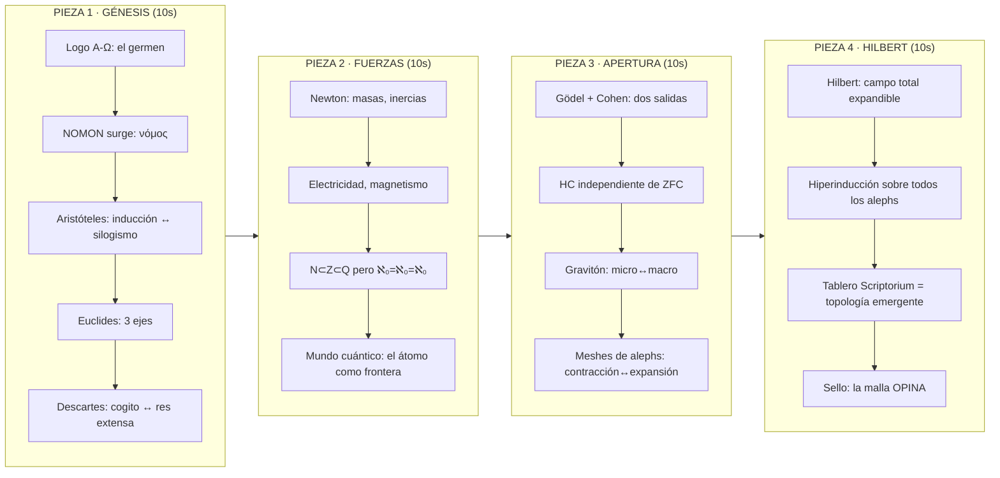

# PACK ALEPH-TOPOLOGY — 4 secuencias de 10s · Showcase NETWORK-ENGINE

> **Canon operativo:** la fuente de producción es
> [`PACK_ALEPH_CONTEXTO.md`](SOURCE/GUION_AGENTES/PACK_ALEPH_CONTEXTO.md) + los prompts
> `PROMPT_9..12_*.md` en `SOURCE/GUION_AGENTES/`. Este archivo es **borrador visual de
> referencia** — elevar, no copiar plano.

> **Qué es.** Un pack de 4 clips de 10s que narran el **crecimiento de los alephs computacionales** como showcase del Scriptorium Transmedia System, basado en la NETWORK-ENGINE. El arco va del logo Α-Ω como génesis hasta la hiperinducción de Hilbert como horizonte. Es la "capa matemática" que el spot original no toca: no vende features, **muestra la cosmovisión** del producto.

> **Cómo se hizo el spot original.** 8 prompts modulares (`PROMPT_1..8`) + 1 contexto compartido (`00_CONTEXTO_COMPARTIDO.md`), renderizados uno a uno en Gemini Omni con ≤10 imágenes cada uno. Tono ska/rocksteady 1969, Toaster grave, halftone/fanzine/stencil/tinta. Ya están renderizados los 7+1 clips en [VIDEO/](file:///Users/morente/Desktop/THEIA_PATH/NUEVA_BASE/SCRIPTORIUM/ALEPH/ARCHIVO/TRANSMEDIA_SYSTEM/SCRIPTORIUM-SPOT/VIDEO).

---

## La tesis visual del pack (lo que Sócrates no podía saber)

La analogía nuclear que vertebra las 4 piezas:

> **"Saber" no es "ver" — saber es "correr".** El artista en la caverna solo ve sombras (ℵ₀). No puede **saber** la malla porque saberla implicaría **recorrerla entera** — y ahí está P vs NP para las IA, y la HC para los sapiens. Los alephs computacionales no son tamaños de espacio; son **límites de lo que puedes correr** sin un oráculo.

Esto mapea directamente a la NETWORK-ENGINE:

| Concepto del pack | En la NETWORK-ENGINE real | Referencia |
|---|---|---|
| NOMON = unidad de paso | `friends.hops` en SSB = un salto de seguimiento | [Federation_ASI_Program §2](file:///Users/morente/Desktop/THEIA_PATH/NUEVA_BASE/SCRIPTORIUM/ALEPH/ARCHIVO/TRANSMEDIA_SYSTEM/SCRIPTORIUM-CORE/NETWORK-ENGINE/SCRATCHPAD/SESION_06_JUNIO/Federation_ASI_Program.md) |
| Mesh contraída (hegemón) | Pub central, `hops` bajo, monolito | [Aleph_board §Tesis central](file:///Users/morente/Desktop/THEIA_PATH/NUEVA_BASE/SCRIPTORIUM/ALEPH/ARCHIVO/TRANSMEDIA_SYSTEM/SCRIPTORIUM-CORE/NETWORK-ENGINE/SCRATCHPAD/SESION_06_JUNIO/Aleph_board.md) |
| Mesh estirada (radicoma) | Federación distribuida, `hops` alto, mesh | Ibídem |
| N=Z=Q=ℵ₀ (mismo cardinal) | Distintas reglas de vecindad (follow/block/pub), **mismo alcance** | [Aleph_app §Leyes](file:///Users/morente/Desktop/THEIA_PATH/NUEVA_BASE/SCRIPTORIUM/ALEPH/ARCHIVO/TRANSMEDIA_SYSTEM/SCRIPTORIUM-CORE/NETWORK-ENGINE/SCRATCHPAD/SESION_06_JUNIO/Aleph_app.md) |
| HC = ¿hay hueco? | ¿La federación admite densidades intermedias? | [MVP §3](file:///Users/morente/Desktop/THEIA_PATH/NUEVA_BASE/SCRIPTORIUM/ALEPH/ARCHIVO/TRANSMEDIA_SYSTEM/SCRIPTORIUM-CORE/NETWORK-ENGINE/SCRATCHPAD/SESION_06_JUNIO/MVP.md) |
| Hilbert = hiperinducción | El `DomainContract` que proyecta **todas** las capas | [Federation_ASI §3](file:///Users/morente/Desktop/THEIA_PATH/NUEVA_BASE/SCRIPTORIUM/ALEPH/ARCHIVO/TRANSMEDIA_SYSTEM/SCRIPTORIUM-CORE/NETWORK-ENGINE/SCRATCHPAD/SESION_06_JUNIO/Federation_ASI_Program.md) |

---

## Las 4 piezas — arco visual

---

## PIEZA 1 — "GÉNESIS" · Del logo al sistema de referencias

### Lo que ocurre en 10 segundos

El logo Α-Ω de Scriptorium Skins está en el centro, quieto, como un sello de caucho sobre papel viejo. **De dentro del logo** —de la fusión alpha-omega— brota algo: el **νόμος** griego (NOMON), la unidad mínima de paso. Una gota de tinta que cae del Α y traza una línea.

Aristóteles coge esa línea y la convierte en **eje**: la inducción corre en un sentido (→), el silogismo retorna (←). Dos flechas de tinta en una misma recta. Un solo eje, dos direcciones.

Euclides toma el eje y lo cruza con otros dos: aparecen **3 dimensiones** como trazos de tinta gruesa. Punto → línea → superficie → volumen, dibujados a mano como diagramas de geometría euclidiana sobre papel viejo.

En el centro de los 3 ejes, un **átomo** (un nodo sellado de la mesh) recibe dos fuerzas opuestas: el **cogito** (centralizar, comprimir, contraer la mesh hacia un monolito) y la **res extensa** (distribuir, estirar la mesh hacia una red). La malla fluctúa al riddim: se contrae en el beat, se estira en el contratiempo. 

Los ejes se marcan como **ejes cartesianos** y la malla queda definida: **el sistema de referencias está hecho**.

### Correspondencia con la NETWORK-ENGINE

- El **NOMON** es `friends.hops` — el paso discreto de suscripción SSB
- El **átomo** en el centro es un **sujeto autónomo** ([Aleph_app](file:///Users/morente/Desktop/THEIA_PATH/NUEVA_BASE/SCRIPTORIUM/ALEPH/ARCHIVO/TRANSMEDIA_SYSTEM/SCRIPTORIUM-CORE/NETWORK-ENGINE/SCRATCHPAD/SESION_06_JUNIO/Aleph_app.md)): máquina de estado propia, proceso local, espacio agéntico propio
- **Cogito = hegemón** (pub central, mesh contraída); **res extensa = radicoma** (federación distribuida, mesh estirada)
- Los 3 ejes = las 3 capas de la pila de federación: Identidad/SSB, Volátil/IACM, Transporte/Edge

### Texto visual (stencil)
`νόμος` → `NOMON` → `SISTEMA DE REFERENCIAS`

### Assets candidatos
- `SCRIPTORIUM_SKINS.png` (logo Α-Ω, verbatim, protagonista)
- `NETWORK_TOPO1.png` (base para la malla)
- `pics_dossier9.png` (blueprint del sistema entero como fantasma de fondo)

---

## PIEZA 2 — "FUERZAS" · Newton, la emergencia y la ilusión de ℵ₀

### Lo que ocurre en 10 segundos

El sistema de referencias del clip 1 ya está plantado. Newton entra y **llena la malla de masas**: los nodos de la mesh se vuelven pesados, atraen, generan inercias. Las aristas de tinta se tensan como cuerdas con peso. Las **fuerzas fundamentales** aparecen como flechas vectoriales dibujadas a mano.

Entonces la emergencia: del átomo turgente (denso, con fuerzas), surgen **presencias no discretas** — electricidad, magnetismo. Son como manchas de acuarela que desbordan los nodos, fuerzas que no se quedan en puntos sino que **impregnan** el espacio entre ellos.

La analogía visual clave: los **números naturales** (ℕ, nodos sueltos, discretos) se abren a los **enteros** (ℤ, nodos con dirección negativa), luego a los **racionales** (ℚ, nodos con subdivisiones). Cada apertura parece "más grande", **pero no lo es en cardinalidad**: ℵ₀ = ℵ₀ = ℵ₀. 

**El momento didáctico-visual:** tres conjuntos que parecen crecer (ℕ ⊂ ℤ ⊂ ℚ) pero que al medirlos con el "metro aleph" son **iguales**. No es que ℕ sea "más pequeño" que ℤ — es que el sistema estaba **acotado**, no más pequeño. La acotación no es tamaño: es **restricción del sistema de referencias**.

El clip termina con la llegada del **mundo cuántico**: el átomo deja de ser un punto sólido y se vuelve una **nube de probabilidad** — una mancha de tinta difusa que parpadea. El átomo es una frontera que todavía nos parte la cosmovisión.

### Correspondencia con la NETWORK-ENGINE

- Las **fuerzas fundamentales** = los `NetworkTransportEvent` con `type`, `source`, `target`, `room` — fuerzas tipadas que mueven la red
- ℕ ⊂ ℤ ⊂ ℚ = ℵ₀ = distintas `Region` (reglas de vecindad) con **mismo alcance cardinal** pero distinta métrica
- La **acotación** = el `hops` fijado en el `ssb/config` (`friends.hops: 3`) — no es que la red sea "pequeña", es que el observador tiene un **horizonte de replicación**
- El **mundo cuántico** = la incertidumbre del relay (`PubSubHub` que no reenvía — la "deuda" como frontera cuántica del sistema)

### Texto visual (stencil)
`ℕ ⊂ ℤ ⊂ ℚ` → `ℵ₀ = ℵ₀ = ℵ₀` → `ACOTADO ≠ PEQUEÑO`

### Assets candidatos
- `NETWORK_TOPO2.png` + `NETWORK_SYS1.png` (malla con masas/fuerzas)
- `pics_dossier5.png` (cadena IACM — las "fuerzas" bot-rabbit→spider→horse)
- `pics_dossier4.png` (state machine — las "presencias" emergentes de la sesión activa)

---

## PIEZA 3 — "APERTURA" · Gödel, Cohen y el gravitón

### Lo que ocurre en 10 segundos

La malla del clip 2 está atrapada: el mundo cuántico la ha partido en micro/macro. El átomo es una frontera como lo fue la HC en su día. **Ahora se abre.**

Dos sellos de caucho golpean la pantalla simultáneamente desde lados opuestos: **Gödel** (1940) y **Cohen** (1963). Dos golpes secos, dos marcas de tinta. Lo que demuestran: la HC es **independiente de ZFC** — no puedes probar que hay hueco, no puedes probar que no lo hay. **Dos salidas simultáneas desde el encierro.**

La malla se agrieta entre los dos golpes: las líneas rígidas del espacio euclidiano se quiebran como cerámica. Aparecen **huecos** — los "nodos fantasma" de HC=false. La malla ya no es densa ni estirada; tiene **textura**, tiene lugares donde la correspondencia se adelgaza.

Entonces el **gravitón**: la fuerza que reconcilia lo micro con lo macro. Visualmente: una onda que viaja por las aristas de la malla, conectando las escalas. La gravedad no es un "tirón" — es la **curvatura de las correspondencias** entre nodos a diferentes niveles de aleph. Las meshes (secuencias de alephs) se contraen en el átomo (hacia abajo) o se expanden hacia arriba, y la gravedad es lo que **las hilvana**.

### Correspondencia con la NETWORK-ENGINE

- **Gödel + Cohen** = la decisión del PO (06-jun): la HC de la federación no se prueba internamente — es una **opinión** del operador. ¿Admites radicoma (huecos) o impones hegemón (monolito)?
- Los **huecos** = peers fuera del horizonte de replicación (`NOT_ZFC_REGION` en draft_01.ts)
- El **gravitón** = `projectDomainToFederation()` — la proyección que hilvana las 3 capas (SSB, IACM, Pub.Rooms) a través de un contrato común
- Contracción/expansión = graduar `friends.hops` y la política de pubs — el **regulador** del [④ Juego de la Vida](file:///Users/morente/Desktop/THEIA_PATH/NUEVA_BASE/SCRIPTORIUM/ALEPH/ARCHIVO/TRANSMEDIA_SYSTEM/SCRIPTORIUM-CORE/NETWORK-ENGINE/SCRATCHPAD/SESION_06_JUNIO/games)

### Texto visual (stencil)
`¿HAY HUECO?` → `INDEPENDIENTE` → `LA MALLA OPINA`

### Assets candidatos
- `NETWORK_TOPO3.png` (grafo que se bifurca — la apertura)
- `NETWORK_SYS2.png` (topología que se reabre)
- `pics_dossier7.png` (Future Machine super-cadena — la reconciliación micro/macro)

---

## PIEZA 4 — "HILBERT" · Hiperinducción y el Tablero

### Lo que ocurre en 10 segundos

Cierre del arco. **Hilbert** y su mecanismo para expandir un campo total. La idea visual: **volver al principio pero con los ojos abiertos**.

La malla del clip 1 (génesis, 3 dimensiones) reaparece — pero ahora sabemos que esas 3 dimensiones eran **una convención de cierre**, no una verdad del universo. Hilbert propone: ¿y si en lugar de cerrar el bloque génesis (ℵ₀), pudiéramos volver a aplicar la **inducción** pero esta vez abarcando **todo el despliegue de alephs**?

Visualmente: la malla original se multiplica en **capas de mallas** (meshes apiladas, como páginas de un fanzine). Cada capa es un aleph. La hiperinducción de Hilbert es la **flecha que las atraviesa todas** — no se queda en ℵ₀, no salta a ℵ₁, sino que propone un método que **las recorre sin techo**.

El cierre: la malla multicapa se **resuelve** en la topología del **Tablero Scriptorium** — la respuesta a la pregunta de la sesión 06-junio: *"¿Qué pinta tiene un Tablero Scriptorium?"*. Es la **topología emergente** de sujetos autónomos que se federan voluntariamente. La cámara se aleja y la malla multicapa se revela como el logo Α-Ω otra vez — pero ahora es una red viva, no un sello estático.

Texto final sellado: `LA TOPOLOGÍA OPINA`.

### Correspondencia con la NETWORK-ENGINE

- **Hilbert** = `DomainContract` como fuente de verdad que proyecta **todas** las capas (MCP, GraphQL, Federación) — el "campo total expandible"
- **Hiperinducción** = la decisión PO de "federar todo": consumir los 3 repos hermanos como servicios, NETWORK-ENGINE como cerebro de contratos que **proyecta hacia todos**
- **El Tablero** = topología emergente de keyring + suscripciones = la respuesta del [Aleph_board.md](file:///Users/morente/Desktop/THEIA_PATH/NUEVA_BASE/SCRIPTORIUM/ALEPH/ARCHIVO/TRANSMEDIA_SYSTEM/SCRIPTORIUM-CORE/NETWORK-ENGINE/SCRATCHPAD/SESION_06_JUNIO/Aleph_board.md)
- **Α-Ω como red viva** = el producto: Scriptorium Skins como la crew que opera este campo total

### Texto visual (stencil)
`HIPERINDUCCIÓN` → `EL TABLERO OPINA` → `SCRIPTORIUM`

### Assets candidatos
- `SCRIPTORIUM_SKINS.png` (logo, verbatim, reaparece transformado)
- `aleph-scriptorium-banner.png` (el software kit como "campo total")
- `pics_dossier8.png` (flujo McpPreset — "trajes a medida" = las capas de la hiperinducción)

---

## Proposed Changes

### Archivos a crear

En [GUION_AGENTES/](file:///Users/morente/Desktop/THEIA_PATH/NUEVA_BASE/SCRIPTORIUM/ALEPH/ARCHIVO/TRANSMEDIA_SYSTEM/SCRIPTORIUM-SPOT/SOURCE/GUION_AGENTES), siguiendo el patrón exacto del spot:

#### [NEW] PACK_ALEPH_CONTEXTO.md
Contexto compartido para las 4 piezas. Hereda las prohibiciones (§6 del contexto original) y añade:
- Vocabulario del pack: NOMON, ℵ, HC, Region, ZFC, hegemón/radicoma, hiperinducción
- Estructura GÉNESIS → FUERZAS → APERTURA → HILBERT
- Arco narrativo: "saber no es ver, saber es correr"
- Referencia a la sesión 06-junio como fuente conceptual
- Audio: el riddim crece en complejidad pieza a pieza (solo bajo → +batería → +desequilibrio → resolución)

---

#### [NEW] PROMPT_9_GENESIS.md
Prompt completo para la pieza 1. Incluye ficha técnica, archivos a subir (logo Α-Ω + NETWORK_TOPO + blueprint), guion visual, audio, voz Toaster, y prompt Gemini Omni one-line EN.

---

#### [NEW] PROMPT_10_FUERZAS.md
Prompt completo para la pieza 2. Newton, emergencia, ℵ₀=ℵ₀=ℵ₀, mundo cuántico.

---

#### [NEW] PROMPT_11_APERTURA.md
Prompt completo para la pieza 3. Gödel/Cohen, gravitón, meshes de alephs.

---

#### [NEW] PROMPT_12_HILBERT.md
Prompt completo para la pieza 4. Hiperinducción, tablero, Α-Ω como red viva.

---

## User Review Required

> [!IMPORTANT]
> **Audio del pack.** El spot original usa ska/rocksteady 1969 constante. Para el pack propongo que el riddim **evolucione** con el arco narrativo:
> - P1 (Génesis): solo bajo dub + crujido de vinilo — como el PROMPT_1 original
> - P2 (Fuerzas): bajo + batería + guitarra al contratiempo — groove completo
> - P3 (Apertura): el riddim se **rompe** momentáneamente (el skank falla, eco dub, como si la aguja saltara) y luego se reconstruye diferente
> - P4 (Hilbert): riddim reconstruido pero con **capas** superpuestas (como un dub multipista) — resolución
>
> ¿Te encaja o prefieres otra progresión?

> [!IMPORTANT]
> **Voz en off.** Dos opciones:
> - **A) Toaster puro** (como el spot): frases cortas, graves, a contratiempo. Dejar que la visual hable.
> - **B) Toaster + texto en pantalla más denso**: el Toaster dice poco pero los stencils llevan más carga conceptual (como fórmulas/ecuaciones dibujadas a mano)
>
> **Recomendación:** B — el contenido matemático pide que el texto visual haga más trabajo que la voz.

> [!IMPORTANT]
> **Posición en la campaña.** ¿El pack va como **epílogo** del spot largo (después del cierre PROMPT_7) o como **pieza autónoma** de 40s? Recomendación: pieza autónoma con su propio montaje, enlazable al spot original pero independiente.

## Open Questions

> [!NOTE]
> **Densidad conceptual.** 10 segundos por pieza es muy denso para todo lo que describes. Dos estrategias posibles:
> - **Densidad lisérgica**: empaquetar todo como flujo visual rapidísimo donde no necesitas "entender" cada concepto sino *sentir* la progresión (como Omni hace bien — pura synesthesia matemática)
> - **Selectiva**: elegir 2-3 imágenes clave por pieza y dejar que respiren
>
> Tu indicación de "Omni puede hacerlo" + "pura lisergia matemática y académica" me inclina por la primera opción.

## Verification Plan

### Manual Verification
- Confirmar que cada prompt respeta las prohibiciones duras (§6 del contexto original)
- Verificar que los assets listados existen en las rutas indicadas (≤10 por clip)
- Confirmar coherencia del arco narrativo entre las 4 piezas
- Validar que las correspondencias con la NETWORK-ENGINE son correctas
