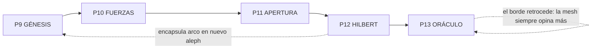

# PACK ALEPH-TOPOLOGY — CONTEXTO COMPARTIDO (5 piezas × 10s ≈ 50s)

> ⚠️ **DOCUMENTO DE DISEÑO — NO SE SUBE A OMNI.** Desde el paso a galeradas (acta T004), las
> piezas `PROMPT_9` … `PROMPT_13` son **autocontenidas**: un Omni fresco y desconectado del repo
> se basta con su propio archivo. Este documento es el **porqué** (universo, tesis, glosario,
> reglas) — la fuente de diseño/DRY, no el material de render.
>
> **Cómo se produce.** Operador → abre **una** galerada `PROMPT_N` → sube las imágenes de su
> bloque ② → pega el bloque ⑥ (one-line EN) en Omni. Nada más.
>
> **Canon sobre borrador:** `SECUENCIA_VISUAL_MESH.md` es referencia visual; las galeradas
> `PROMPT_9..13` son la fuente operativa; este archivo y `PACK_ALEPH_TEXTURA.md` son el diseño.

---

## ⬆️ FLUJO DE SUBIDA A GEMINI OMNI

> Render **un prompt cada vez**, subiendo archivos **a mano, uno a uno**.
> **Límite duro: 10 archivos por vídeo/prompt.**

| Clip | Archivo | Nº archivos a subir |
|---|---|---|
| PROMPT_9 · Génesis | `PROMPT_9_GENESIS.md` | 5 |
| PROMPT_10 · Fuerzas | `PROMPT_10_FUERZAS.md` | 7 |
| PROMPT_11 · Apertura | `PROMPT_11_APERTURA.md` | 7 |
| PROMPT_12 · Hilbert | `PROMPT_12_HILBERT.md` | 8 |
| PROMPT_13 · Oráculo | `PROMPT_13_ORACULO.md` | 7 |

---

## 0. TL;DR para el agente

- Estás produciendo **un (1) clip** de un pack autónomo de **5 piezas** (~50 s total).
- Producto: **showcase de la NETWORK-ENGINE** — el crecimiento de los alephs computacionales
  como topología viva, en el look & feel del spot Scriptorium Skins.
- Tono base: **ska / rocksteady de 1969** — pero el **audio evoluciona** pieza a pieza (ver §4).
- Estética: **analógica y táctil** — tinta gruesa, stencil, halftone, fanzine, sello de caucho.
- Voz: **Toaster** grave, a contratiempo, **esparcida** — el peso conceptual va en los
  rótulos stencil y las fórmulas dibujadas a mano (opción B).
- Idioma rótulos: **español**. Bloque Gemini Omni: **inglés one-line**.
- **Prohibiciones duras** en §6 (heredadas). **Léelas.**

---

## 1. La tesis creativa

> **Saber no es ver, saber es correr.**

El artista en la caverna solo ve sombras (ℵ₀). No puede **saber** la malla porque saberla
implicaría **recorrerla entera** — y ahí está **P vs NP** para las IA, y la **HC** para
los sapiens. Los alephs computacionales no son tamaños de espacio: son **límites de lo que
puedes correr** sin oráculo.

El pack no vende features. **Muestra la cosmovisión** del Tablero Scriptorium: la topología
que emerge cuando sujetos autónomos se federan voluntariamente. **P13 (Oráculo)** la proyecta
al futuro y aterriza el claim de producto.

**Posición en campaña:** pieza autónoma enlazable como **epílogo** tras `PROMPT_7_CIERRE.md`.
El `PROMPT_8` (skank) puede separar las 5 piezas del spot original.

**Orden de montaje del pack:**
`9 → 10 → 11 → 12 → 13` (opcional: `7 → 8 → 9 → 10 → 8 → 11 → 8 → 12 → 13`)

---

## 2. Glosario NETWORK-ENGINE (úsalo como rótulos/texturas)

| Término | Qué es (para que lo uses con criterio) | Mapeo real |
|---|---|---|
| **NOMON** | Unidad mínima de paso en la malla | `friends.hops` — un salto de suscripción SSB |
| **Region** | Tipo de vecindad (reglas de admisión) | ℕ / ℤ / ℚ — distintas leyes, **misma cardinalidad** |
| **HC** | ¿Hay hueco entre densidades de federación? | Propiedad **independiente de ZFC** — opinión del operador |
| **Hegemón** | Mesh contraída, monolito | Pub central, `hops` bajo, topología densa |
| **Radicoma** | Mesh estirada, federación distribuida | `hops` alto, huecos admisibles entre densidades |
| **Hiperinducción** | Inducción que atraviesa **todos** los alephs sin techo | `DomainContract` que proyecta todas las capas |
| **Tablero** | Topología emergente de la red | keyring + suscripciones → aristas → alcance ℵ |

**Frases-sello del pack:** `νόμος`, `NOMON`, `SISTEMA DE REFERENCIAS`, `ℵ₀ = ℵ₀ = ℵ₀`,
`ACOTADO ≠ PEQUEÑO`, `¿HAY HUECO?`, `INDEPENDIENTE`, `LA MALLA OPINA`, `HIPERINDUCCIÓN`,
`LA TOPOLOGÍA OPINA`.

### Capa de textura real (host + math core) — ver `PACK_ALEPH_TEXTURA.md`

> Jerga de máquina tratada como **textura técnica** (monospace / sello / plano azul), igual que
> el código impreso del spot original. **No** es prosa → no viola "rótulos solo en español".

| Término real | Qué es | Pieza |
|---|---|---|
| `Universe·Dimension·Force·Expansion·Boundary` | 5 primitivas de **Aleph-Lang** (huésped) | P9 |
| `Horn: head/tail` | cláusula del math core (head=guard, tail=transition) | P9 |
| `DomainContract` | fuente única de verdad; raíz de toda proyección | P9 / P12 |
| `IMPACT_FORCE` · `STABLE→CRITICAL` | evento/estados XState de la fuerza | P10 |
| `pathLength ≠ cardinalSlot` | **métrica de grafo ≠ cardinalidad ℵ** (independientes) | P10 |
| `NetworkTransportEvent` · `IACM` · `RNFP` | transporte tipado / federación real | P10 / P11 |
| `CH = true \| false \| irrelevante` | neutralidad matemática de la plataforma | P11 |
| `Forcing` · `NOT_ZFC_REGION` | Cohen fuerza universo / peer fuera del horizonte | P11 |
| `projectDomainToFederation()` | el gravitón = la proyección federada (tesis 06-jun) | P11 / P12 |
| `projectDomainToMCP` · `projectDomainsToGraphQL` | las otras 2 proyecciones del campo total | P12 |
| `Tablero = keyring + suscripciones` | topología emergente (no dashboard) | P12 |

**Tesis de showcase (LAYER_3):** Network-Engine es una **plataforma metalingüística** que
hospeda teorías (ZFC/HoTT/Forcing…) sin afirmarlas, y **sobrevive a cualquier lenguaje derivado**.

**Referencias técnicas:** `PACK_ALEPH_TEXTURA.md` (capa de revisión), `Aleph_board.md`,
`Aleph_app.md`, `Federation_ASI_Program.md`, `SCRUM/GLOSARIO.md` (sesión 06-jun);
`INSTRUCTIONS/LAYER_1` y `LAYER_3` (`NETWORK_ENGINE`, `LANGUAGES`, `ECOSYSTEM`).

---

## 3. Estructura del pack (5 movimientos)

| # | Archivo | Rol | Duración | Movimiento |
|---|---|---|---|---|
| 9 | `PROMPT_9_GENESIS.md` | Del logo Α-Ω al sistema de referencias | 10 s | NOMON brota; Aristóteles, Euclides, Descartes tensan la mesh |
| 10 | `PROMPT_10_FUERZAS.md` | Newton, emergencia, cardinalidad | 10 s | Masas, fuerzas, ℕ⊂ℤ⊂ℚ pero ℵ₀=ℵ₀=ℵ₀, nube cuántica |
| 11 | `PROMPT_11_APERTURA.md` | Gödel+Cohen, gravitón | 10 s | HC independiente; la malla se agrieta y **opina** |
| 12 | `PROMPT_12_HILBERT.md` | Hiperinducción, Tablero | 10 s | ¿Cabe en la pantalla? → Α-Ω como red viva |
| 13 | `PROMPT_13_ORACULO.md` | Predicción + claim de producto | 10 s | Tres topes → membranas → nuevo aleph/nuevo hueco → claim ARG → koan luna/dedo |

---

## 4. Audio progresivo (rompe la constante del spot a propósito)

| Pieza | Audio |
|---|---|
| **P9 Génesis** | Solo **bajo dub** + crujido de vinilo — tensión contenida, como PROMPT_1 |
| **P10 Fuerzas** | **Groove completo**: bajo + batería seca + guitarra al contratiempo |
| **P11 Apertura** | El skank **se rompe** — eco dub, aguja que salta, riddim desequilibrado; reconstrucción parcial |
| **P12 Hilbert** | **Dub multipista** reconstruido — capas superpuestas, resolución |
| **P13 Oráculo** | **Dub espacial** que **no cierra** — melódica (Augustus Pablo) que sube, eco que se aleja; horizonte abierto |

---

## 5. Catálogo de assets (rutas relativas a `SCRIPTORIUM-SPOT/`)

> **A partir del contenido de la imagen…** — NO capturas planas. Recorta, texturiza, anima.

**Logo (verbatim):**
- `../../SCRIPTORIUM_SKINS.png` *(raíz ALEPH)*
- `BRANDING/SCRIPTORIUM_SKINS.png` *(copia local)*

**Topología / maquinaria de red** (`MATERIALES/BOT_MARK_NETWORK_BUILDER/`):
- `NETWORK_TOPO1.png`, `NETWORK_TOPO2.png`, `NETWORK_TOPO3.png`, `NETWORK_TOPO_2.png`

> ⚠️ `NETWORK_SYS1.png` / `NETWORK_SYS2.png` **no existen** en el repo. Sustituidos por
> la serie `NETWORK_TOPO*` + `pics_dossier*`.

**Banners** (`MATERIALES/RUDE_SKIN_BOTS/`):
- `aleph-scriptorium-banner.png`

**Esquemas técnicos** (`SOURCE/pics_dossier/`):
- `pics_dossier1.png` … `pics_dossier9.png` — blueprint de fondo, halftone, tinta azulada

---

## 6. PROHIBICIONES DURAS (heredadas de `00_CONTEXTO_COMPARTIDO.md` §6)

- ❌ **NO** mencionar, mostrar ni aludir a "Trojan", "Sound System", camiones, altavoces
  físicos ni cultura de sonido. Solo **Information System** / **NETWORK-ENGINE**.
- ❌ **NO** tono frenético, hype tecno, EDM, trailer épico ni MC hiperactivo.
- ❌ **NO** estética futurista limpia, neón cromado, HUD sci-fi ni glows digitales.
- ❌ **NO** mostrar capturas de pantalla planas; trabajar las imágenes como material gráfico.
- ❌ **NO** rótulos en otro idioma que no sea español.
- ❌ **NO** adelantar el claim final del spot original (*"Scriptorium skins, tus rude bots…"*)
  — este pack tiene su propio sello: `LA TOPOLOGÍA OPINA`.
- ✅ **SÍ** mantener riddim a contratiempo, tinta, stencil y aplomo de crew.
- ✅ **SÍ** carga conceptual en stencil (fórmulas dibujadas a mano).

---

## 7. Mini-briefs por pieza (asset-set ≤10)

### P9 · GÉNESIS — "Del germen al sistema de referencias"

**Intención:** Del logo Α-Ω brota el NOMON (νόμος). Aristóteles hace eje (inducción ↔
silogismo). Euclides cruza 3 ejes. Descartes tensa cogito (hegemón) vs res extensa (radicoma).
La malla queda definida: **sistema de referencias**.

| # | Asset | Ruta |
|---|---|---|
| 1 | `SCRIPTORIUM_SKINS.png` | raíz `ALEPH/` |
| 2 | `NETWORK_TOPO1.png` | `MATERIALES/BOT_MARK_NETWORK_BUILDER/` |
| 3 | `pics_dossier9.png` | `SOURCE/pics_dossier/` |
| 4 | `pics_dossier5.png` | `SOURCE/pics_dossier/` |
| 5 | `aleph-scriptorium-banner.png` | `MATERIALES/RUDE_SKIN_BOTS/` |

**Rótulos:** `νόμος` · `NOMON` · `SISTEMA DE REFERENCIAS` · `cogito` · `res extensa`

---

### P10 · FUERZAS — "Masas, emergencia, ℵ₀=ℵ₀=ℵ₀"

**Intención:** Newton llena la malla de masas. Emergen fuerzas no discretas (electricidad,
magnetismo) como acuarela. Didáctica dura: ℕ⊂ℤ⊂ℚ pero **ℵ₀=ℵ₀=ℵ₀** — acotado ≠ pequeño.
Cierra con nube de probabilidad cuántica (deuda del relay).

| # | Asset | Ruta |
|---|---|---|
| 1 | `NETWORK_TOPO2.png` | `MATERIALES/BOT_MARK_NETWORK_BUILDER/` |
| 2 | `NETWORK_TOPO_2.png` | `MATERIALES/BOT_MARK_NETWORK_BUILDER/` |
| 3 | `pics_dossier5.png` | `SOURCE/pics_dossier/` |
| 4 | `pics_dossier4.png` | `SOURCE/pics_dossier/` |
| 5 | `pics_dossier3.png` | `SOURCE/pics_dossier/` |
| 6 | `SCRIPTORIUM_SKINS.png` | raíz `ALEPH/` |
| 7 | `aleph-scriptorium-banner.png` | `MATERIALES/RUDE_SKIN_BOTS/` |

**Rótulos:** `ℕ ⊂ ℤ ⊂ ℚ` · `ℵ₀ = ℵ₀ = ℵ₀` · `ACOTADO ≠ PEQUEÑO`

---

### P11 · APERTURA — "Gödel+Cohen, la malla opina"

**Intención:** Dos sellos simultáneos: Gödel (1940) + Cohen (1963). HC **independiente de
ZFC**. La malla se agrieta; aparecen huecos (radicoma). El gravitón hilvana micro↔macro =
`projectDomainToFederation()`. Sello: **LA MALLA OPINA**.

| # | Asset | Ruta |
|---|---|---|
| 1 | `NETWORK_TOPO3.png` | `MATERIALES/BOT_MARK_NETWORK_BUILDER/` |
| 2 | `NETWORK_TOPO1.png` | `MATERIALES/BOT_MARK_NETWORK_BUILDER/` |
| 3 | `pics_dossier7.png` | `SOURCE/pics_dossier/` |
| 4 | `pics_dossier6.png` | `SOURCE/pics_dossier/` |
| 5 | `pics_dossier8.png` | `SOURCE/pics_dossier/` |
| 6 | `SCRIPTORIUM_SKINS.png` | raíz `ALEPH/` |
| 7 | `aleph-scriptorium-banner.png` | `MATERIALES/RUDE_SKIN_BOTS/` |

**Rótulos:** `¿HAY HUECO?` · `INDEPENDIENTE` · `LA MALLA OPINA` · `1940` · `1963`

---

### P12 · HILBERT — "Hiperinducción, ¿cabe en la pantalla?"

**Intención:** Hiperinducción que **encapsula los 3 movimientos previos en un nuevo aleph**.
El espacio de Hilbert bloquea a los sapiens como P vs NP a los LLMs. Pregunta central:
**¿el espacio de Hilbert cabe en la pantalla?** → el marco se revela insuficiente, la malla
multicapa desborda el encuadre y se resuelve en el Α-Ω como **red viva**. Sello:
**LA TOPOLOGÍA OPINA**.

| # | Asset | Ruta |
|---|---|---|
| 1 | `SCRIPTORIUM_SKINS.png` | raíz `ALEPH/` |
| 2 | `NETWORK_TOPO_2.png` | `MATERIALES/BOT_MARK_NETWORK_BUILDER/` |
| 3 | `NETWORK_TOPO3.png` | `MATERIALES/BOT_MARK_NETWORK_BUILDER/` |
| 4 | `aleph-scriptorium-banner.png` | `MATERIALES/RUDE_SKIN_BOTS/` |
| 5 | `pics_dossier8.png` | `SOURCE/pics_dossier/` |
| 6 | `pics_dossier9.png` | `SOURCE/pics_dossier/` |
| 7 | `pics_dossier1.png` | `SOURCE/pics_dossier/` |
| 8 | `pics_dossier2.png` | `SOURCE/pics_dossier/` |

**Rótulos:** `HIPERINDUCCIÓN` · `¿CABE EN LA PANTALLA?` · `LA TOPOLOGÍA OPINA` · `Α-Ω`

---

### P13 · ORÁCULO — "Los topes se mueven (predicción + claim)"

**Intención:** Pieza de autor (predicción del dramaturgo). Los **tres topes actuales** —`P vs NP`
(IA), `HC` (sapiens), `gravitón/gravedad` (micro/macro)— no son muros, son **membranas**. La mesh
federa más sujetos → los conjuntos decidibles crecen → el tope queda dentro de un aleph mayor;
pero, como Cohen, **cada aleph que cierras abre otro hueco** (el borde siempre retrocede). El
encuentro micro/macro = `projectDomainToFederation()` (agujero de gusano táctil). Aterriza el
**claim de producto** (Tablero ARG, ventanas-de-contexto, agencia emergente) y cierra con el koan.

| # | Asset | Ruta |
|---|---|---|
| 1 | `SCRIPTORIUM_SKINS.png` | raíz `ALEPH/` |
| 2 | `NETWORK_TOPO3.png` | `MATERIALES/BOT_MARK_NETWORK_BUILDER/` |
| 3 | `NETWORK_TOPO_2.png` | `MATERIALES/BOT_MARK_NETWORK_BUILDER/` |
| 4 | `aleph-scriptorium-banner.png` | `MATERIALES/RUDE_SKIN_BOTS/` |
| 5 | `pics_dossier7.png` | `SOURCE/pics_dossier/` |
| 6 | `pics_dossier9.png` | `SOURCE/pics_dossier/` |
| 7 | `pics_dossier6.png` | `SOURCE/pics_dossier/` |

**Rótulos:** `P vs NP` · `HC` · `GRAVITÓN / GRAVEDAD` · `NO SON MUROS, SON MEMBRANAS` ·
`NUEVO ALEPH · NUEVO HUECO` · `SCRIPTORIUM · TU TABLERO DE ARG` · `VENTANAS-DE-CONTEXTO` ·
`AGENCIA EMERGENTE` · `EL SABIO APUNTA A LA LUNA · ℵ₀ SOLO VE EL DEDO`

---

## 8. Coherencia del arco (checklist QA)

- [ ] P9 planta NOMON + sistema de referencias (cogito/res extensa = hegemón/radicoma)
- [ ] P10 demuestra acotado ≠ pequeño (ℵ₀=ℵ₀=ℵ₀) y frontera cuántica
- [ ] P11 abre HC como opinión (Gödel+Cohen) — la malla **opina**
- [ ] P12 encapsula el arco en hiperinducción → Α-Ω como red viva
- [ ] P13 predice (topes→membranas, nuevo aleph/nuevo hueco) + claim ARG + koan luna/dedo
- [ ] Audio progresivo P9→P13 respetado (P13 = dub espacial que no cierra)
- [ ] ≤10 assets por clip, rutas verificadas bajo `SCRIPTORIUM-SPOT/`
- [ ] Prohibiciones §6 intactas (sin Trojan/sound-system, sin neon/sci-fi)
- [ ] Capa de textura real aplicada (ver `PACK_ALEPH_TEXTURA.md`): jerga de máquina como
      grano técnico, términos con procedencia trazable, sin añadir assets
