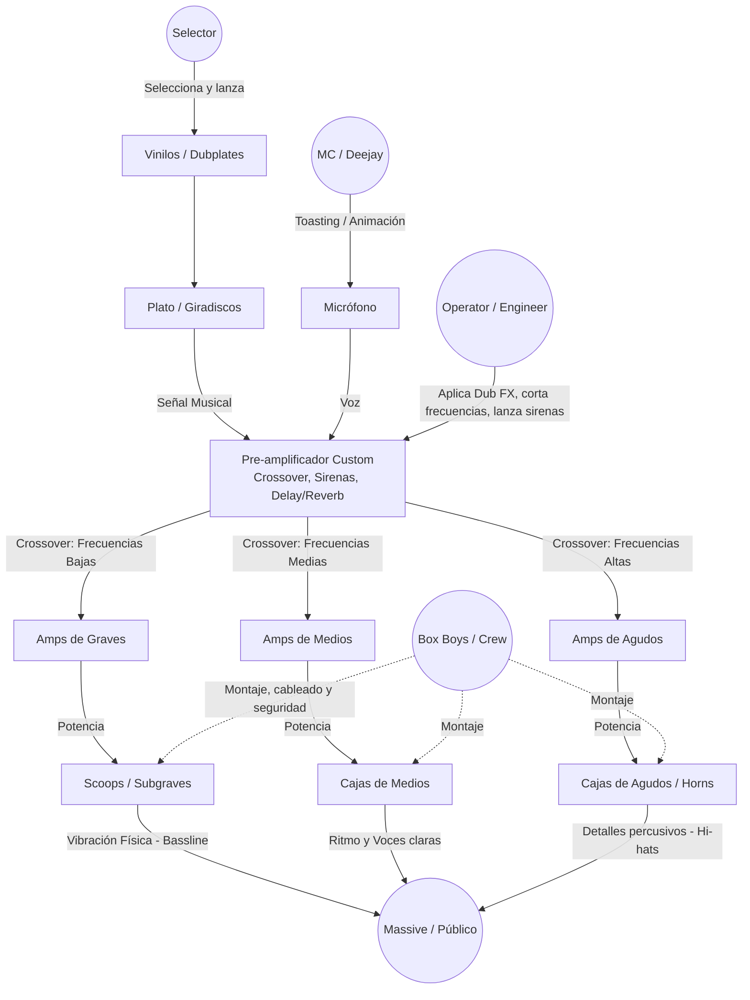
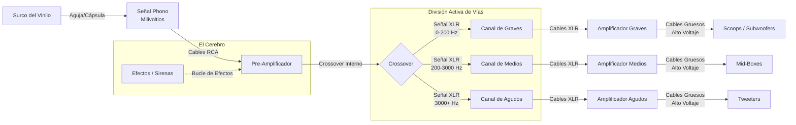
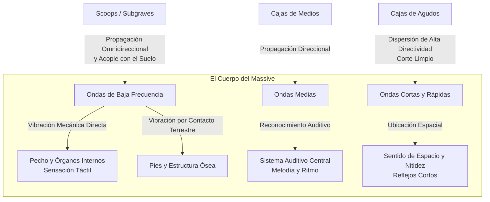
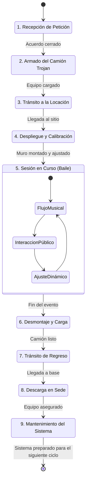

# Análisis de un Sound System Tradicional (Cultura Reggae/Dub)

Cuando Duke Reid organizaba sus legendarias sesiones de música, no se referían simplemente a fiestas o conciertos. En la cultura jamaicana de los años 50 y 60, estos eventos recibían el nombre de **dances (bailes)**. [[1](https://skabook.com/2014/01/10/duke-reid-trojan/), [2](https://www.yaawdmedia.com/post/duke-reid-part-1), [3](https://thereggaemuseum.com/duke-reid-the-rocksteady-revolutionary-of-treasure-isle/)]

Más concretamente, el sistema de sonido ambulante que él montaba se llamaba Duke Reid's The Trojan (o simplemente *The Trojan*), bautizado así por el camión británico de la marca *Trojan* que utilizaba para transportar sus enormes altavoces. Estos eventos también formaban parte de los llamados **sound clashes**. 

Los Sound Systems (como el icónico camión de Trojan Records o los sistemas legendarios como Jah Shaka, Channel One o Killasan) son mucho más que un simple equipo de música; son instituciones culturales, sociales y tecnológicas nacidas en Jamaica y exportadas al mundo (especialmente a UK). 

Se caracterizan por ser equipos de sonido autoconstruidos, masivos, modulares y diseñados para maximizar la presión sonora (especialmente los subgraves), alrededor de los cuales se organiza una sesión comunitaria o "baile".

A continuación, se detalla el esquema de los actores (roles) y el flujo técnico del sonido.

## 1. Esquema Híbrido: Actores y Flujo de Sonido

El siguiente diagrama muestra cómo los roles humanos interactúan directamente con los componentes tecnológicos para generar la experiencia física y sonora que recibe el público (Massive).

---

## 2. Descripción de los Actores (Roles)

En la cultura Sound System, el DJ moderno se deconstruye en varios roles especializados que trabajan en equipo:

1. **Selector:** Es el curador musical. Elige los discos, *dubplates* (versiones exclusivas cortadas en acetato) y marca el ritmo anímico de la sesión. A diferencia de un DJ de club, a menudo no mezcla los temas, sino que deja sonar la canción completa o hace "pull-ups" (rebobinar el disco al principio si la reacción del público es eufórica).
2. **Operator (o Engineer):** Controla el pre-amplificador y la mesa de mezclas. Es quien realmente "toca" el Sound System como si fuera un instrumento. Aplica efectos (cámaras de eco, delays de cinta, sirenas analógicas) y corta o realza las frecuencias (mutear los bajos de repente para luego soltarlos con fuerza) para manipular la energía de la sala. A veces, Selector y Operator son la misma persona.
3. **MC / Deejay / Chanter:** El maestro de ceremonias. Toma el micrófono para hacer *toasting* (cantar rítmicamente sobre las caras B instrumentales), animar a la masa, transmitir mensajes conscientes (roots & culture) y mantener la conexión directa entre la música y el público.
4. **Box Boys / Crew:** Los encargados del duro trabajo físico y técnico. Cargan, apilan, conectan y calibran las pesadas cajas de madera construidas a mano, asegurando que la impedancia, la fase y la seguridad del "muro de sonido" sean perfectas.
5. **Massive:** El público o la comunidad participante. No son meros espectadores pasivos; la vibración física de los graves y la dinámica de llamadas-y-respuestas con el MC los convierte en una parte integral de la resonancia de la sesión.

---

## 3. Descripción de los Componentes (El Circuito Técnico)

1. **La Fuente (Turntables & Mic):** Donde nace el contenido original (la narrativa en tu caso). En el reggae se valora mucho el formato físico (vinilo) y la exclusividad del material (*dubplates* inencontrables).
2. **El Cerebro (Custom Pre-amp):** Una pieza de hardware única, a menudo construida artesanalmente. No solo amplifica, sino que divide la señal de audio en bandas de frecuencias (graves, medios, agudos) para enviarlas por separado a los amplificadores, permitiendo el control extremo en directo que ejerce el Operator. 
3. **La Fuerza Muscular (Amplifier Racks):** Racks llenos de amplificadores de altísima potencia, separados por frecuencias. Proveen la energía brutal necesaria para mover el aire.
4. **El Cuerpo (Speaker Stacks):** 
   - *Scoops (Subgraves):* El corazón del sound system. Cajas enormes diseñadas con pliegues internos (folded horn) que proyectan el bajo físicamente contra el pecho del *Massive*.
   - *Mid-boxes:* Cajas de altavoces que llevan la línea vocal y la base rítmica.
   - *Tweeters / Horns:* Trompetas o pequeñas cajas superiores para los detalles ultra nítidos de la percusión.

---

## 4. Circuito de la Señal Eléctrica (El Viaje por los Cables)

Este esquema se centra puramente en el flujo de la información (la señal de audio). Muestra cómo una vibración física microscópica se convierte en voltajes masivos a través del hardware.

---

## 5. Circuito de Propagación Acústica (El Viaje por el Aire)

Una vez la señal se convierte en movimiento mecánico en los altavoces, el sonido interactúa con el espacio y los cuerpos humanos de formas físicas muy distintas.

---

## 6. Contexto Histórico: Duke Reid y The Trojan

El epicentro de las operaciones de Duke Reid estaba en el 33 de Bond Street en Kingston. Allí se ubicaba su licorería y su legendario estudio de grabación, Treasure Isle.

Las sesiones y las rivalidades de la época dorada del ska y el rocksteady se alimentaban unas a otras, organizando eventos en distintos puntos a la vez para crear ambiente:

El Escenario de las Sesiones:

-   Trojan en Marcha: El camión *Trojan* de Reid transportaba altavoces, amplificadores y tocadiscos a terrenos abiertos llamados lawns (jardines o solares vallados).
-   Treasure Isle como Base: Bond Street se convertía a menudo en una fiesta callejera improvisada donde Reid probaba sus nuevas producciones antes de lanzarlas al mercado.
-   Ambiente musical (no start-system): Para favorecer el dinamismo, Reid y sus selectores borraban las etiquetas de los discos de vinilo. Así, los otros operadores de la red de dances podían inspirarse para buscar e influenciarse en la música y el sonido, no tanto en autores o nombres.

Los Históricos "Sound Clashes":

-   Sesiones colaborativas: Un sound clash era un encuentro musical en la que dos *sound systems* se plantaban uno frente al otro (o en locales cercanos) para alternarse y mostrar su repertorio y habilidad técnica a los bailarines. La reacción y el baile de la multitud era el objetivo.
-   El Gran Homólogo: Solía operar junto a Clement "Coxsone" Dodd, dueño del sound system *Downbeat* y del estudio *Studio One*. Mientras Dodd apostaba por un sonido de jazz y rhythm and blues más moderno, Reid prefería el R&B clásico y potente de Nueva Orleans.
-   Uso de "Dubplates": Para darle calidad a los enfrentamientos, los productores empezaron a grabar canciones exclusivas con dedicatorias especiales (llamadas *dubplates* o *acetatos*) donde los cantantes tiran beefs para animar la escena o alababan el sonido propio.

La relación entre los *sound systems* y el sello discográfico británico **Trojan Records** (uno de los más importantes a nivel mundial en la difusión del reggae) es directa y fundacional.

En la Jamaica de los años 50 y 60, el legendario productor y DJ **Arthur "Duke" Reid** utilizaba un robusto camión de fabricación británica de la marca *Trojan* para transportar por toda la isla su potentísimo equipo de sonido móvil. El camión llevaba pintada la frase *"Duke Reid - The Trojan King of Sounds"*. Debido a este vehículo, al propio Duke Reid se le empezó a conocer simplemente como "The Trojan" y a su equipo como *The Mighty Trojan*.

Cuando en 1968 se fundó la discográfica en Londres para distribuir música jamaicana en el Reino Unido, los fundadores decidieron rendir homenaje a Duke Reid (cuyas producciones de estudio nutrieron los primeros lanzamientos del sello). Así, el icónico logotipo del casco troyano y el nombre de Trojan Records existen gracias al enorme camión de carga con el que Reid armaba sus fiestas callejeras.

---

## 7. Ciclo de Vida del Servicio (Máquina de Estado)

Un Sound System no es solo un equipo de sonido estático, sino un **servicio nómada** que sigue un ciclo logístico y de despliegue muy claro. El siguiente diagrama de estados modela la secuencia operativa completa de una sesión, tomando como ejemplo la rutina operativa de Duke Reid:

