# Ficha de producto: Scriptorium Skins ARG

<div style="display: flex; justify-content: center;">

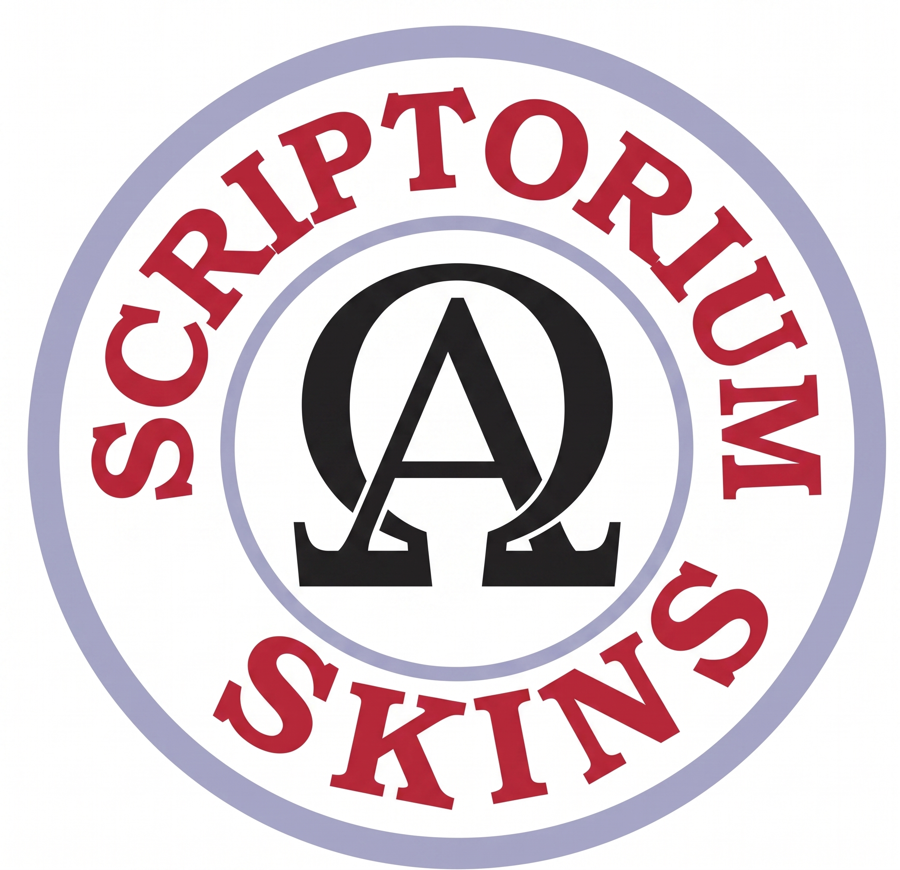

</div>

> **Ficha de etiquetas**
> [](https://github.com/escrivivir-co/aleph-scriptorium/blob/integration/beta/scriptorium/LICENSE.md)    


Imagina el spot: 

> Corte rápido, beat acelerado, identidades modulares que se "activan" con chapas de blazer. Un Maestro de Ceremonias abre la sala, los skins despliegan el "muro de sonido" que aquí tiene la pinta de "network-mesh", los artistas suben al escenario sus "ventanas de contexto", las personas que juegan entra desde cualquier red sin tener que abrir puertos en sus instalaciones usando la "ventana de contexto" en sus propios entornos agénticos, y la sesión arranca. Lo que el sound system bombea como presión sonora, **nosotros lo bombeamos como presión narrativa**: una rave de información orquestada en vivo, guionizada como juego y donde las personas que juegan tienen una suerte de "libre albedrío" sobre el tablero. Y que combina estos encuentros en vivo con la trama transmedia en la red hasta el siguiente encuentro.

- **Animus iocandi**, uso exclusivo para ocio. Este producto no es apto para negocio.
- **Federado por diseño**: cualquiera puede unirse desde su barrio digital. ¿Por que esto importa? La respuesta en un juego (ver abajo catálogo): *"¡④ Juegos de la Vida (sound clashes)¡*"
- **Disponible**: enero 2027 (o al otro enero, jajja) — *save the date*.

> *«Escrivivir.co presenta 'Scriptorium Skins', tu transmedia system de confianza.»*

## Renovar la ceremonia

¿Recuerdas los **sound systems** que viajaban con su camión, montaban un muro de altavoces en cualquier plaza y convertían el barrio en una sala de baile (o en sound clashes, :-D)? Aquellos colectivos traían **sesiones**. Detrás de cada camión había un **sello** que organizaba las giras, publicaba el catálogo y daba identidad a la escena: en el caso que nos influencia, **Trojan Records**.

Este documento describe un **Transmedia System** tomando como plantilla para la homeomorfía un [análisis del Sound System tradicional](analisis_sound_system.md) y la red/escena/movimiento que brotó sobre la capacidad técnica de pinchar para dances. 

Igual que un sound system no es "un equipo de música" sino un **artefacto cultural, social y tecnológico** que puede organizar sesiones comunitarias entorno a la presión sonora (*dances* o *sound clashes*), nuestro Transmedia-System no es "una app" sino un **artefacto de orquestación de trama ARG** que hila sesiones para comunidades en torno a la **presión transmedia** de los juegos de realidad alternativa. El contexto "stream" ha extendido en la era digital de información al concepto de calle. No haremos como Duke o como La Barraca de Lorca viajando de pueblo en pueblo para llevar el espectáculo porque otros actores (streamer + invitados + elenco + jugadores) lo convierten, a través de las autopistas de la información, en un espectáculo en la nube de **lore procesado y futuros narrativos ramificados interactuables** tanto los días de "baile en vivo" como en el tiempo entre ellos, dentro del contexto habitual de [los juegos ARG](./analsis_arg.md).

- **El camión Trojan** es el **Scriptorium · Transmedia-System** descrito en las secciones 1–8: un equipo modular que despliega "raves de información" allá donde haya ganas de fiesta, sobre y so capa y por mor del mapa tecno-feudalista de plataformas.
- **El sello** es **Escrivivir.co**: cura el catálogo, organiza las giras, ayuda con estro visual a las **Skins**) y abre la red como tablero ARG para que cualquier comunidad pueda enchufarse.
- **La música**: es una **textura transmedia en la nube** (recuerda que, a pesar del paradigma centralizado de tecno-feudos, *"the cloud is someone's else computer"*), con su Maestro de Ceremonias, su elenco, su jugadores y su muro de información.

> *«Scriptorium Skins, tus rude bots ácratas para ARG."»*

<table>
  <tr>
    <td align="center">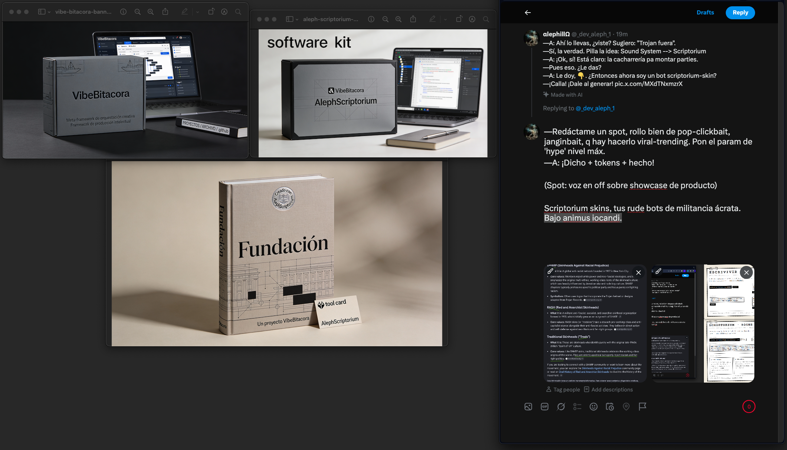<br><sub><b>El producto o cosa tangible</b> — Un motor de juegos como espacio ARG Transmedia</sub></td>
    <td align="center">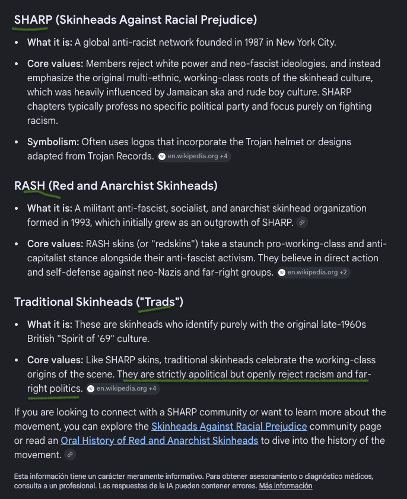<br><sub><b>Los rude bots skin</b> — Identidades operativas de un "cierto" campo conceptual que hereda y sigue la tradición Trojan.</sub></td>
  </tr>
  <tr>
    <td align="center">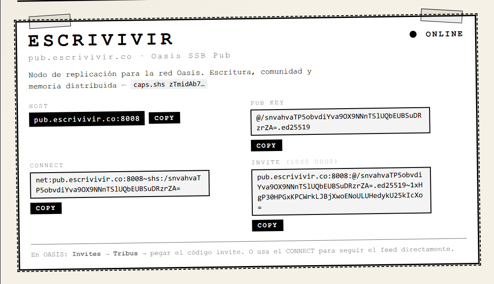<br><sub><b>El tablero ARG</b> — hub/pub para entretejer la red</sub></td>
    <td align="center">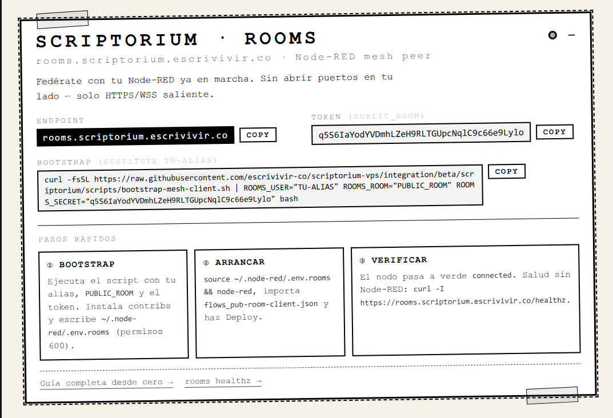<br><sub><b>Las pistas de baile</b> — el camión llega a tu barrio con los enganches de federación</sub></td>
  </tr>
</table>

> **La analogía rectora:** donde el sound system divide una señal de audio en bandas de frecuencia (graves/medios/agudos) y las amplifica por separado para abrazar y sumergir el cuerpo del *Massive*, el Transmedia-System forja el *stream* en una señal **transmedia** y la amplifica en la red para llegar y abrazar la imaginación de la **comunidad**, que, de vuelta, no solo bailar en la transmedia sino, por su naturaleza, unirse a la party generando nuevas señales. A diferencia del camión y los altavoces, Scriptorium permanece en "la sombra". No es "una plataforma" o "cerco tecnofeudal". Corre sobre la red transparente al [modelo OSI](https://es.wikipedia.org/wiki/Modelo_OSI) acarreando transmedia. Artistas, jugadores, Equipo de Ceremoniass, etc. la consumen en sus dispositivos o tecno-cárceles mainstream preferidas. Ocasionalmente, Scriptorium provee UIs y pipelines tipo starter kit para promover e inspirar la creación.

**Escrivivir.co** aspira a tomar la forma de un Trojan-Records para dinamizar la escena no con álbums de música sino juegos de transmedia sobre la escena de una suerte de **"Scriptorium Skins ARG"**, como si fuera el Trojan-Lorry de Duke Reid (caja del juego) desplegando sesiones.

### ¿Alpha-Omega skins? ¡Nop: Aleph-Ox skins!

A modo de síntesis, nuestro logo "scriptorium skins" muta el icónico de Trojan Records cambiando el casco trojan (no tenemos un camión de esa marca, :-D) por la A dentro de una O. Símbolo clásico en el mundo SHARP, RASH, Trad, etc... Nuestra [A es Aleph](https://github.com/escrivivir-co/aleph-scriptorium/blob/integration/beta/scriptorium/.github_V1/agents/aleph.agent.md) y nuestra [O es Ox (el buey)](https://github.com/escrivivir-co/aleph-scriptorium/blob/integration/beta/scriptorium/.github_V1/agents/ox.agent.md). Para los scriptorium skins el alpha-omega representa el back-to-your-roots, y la amalgama de líneas de generaciones (¡anti racial prejudice trads!), ¡el pasado y el presente, con transmedia, a dentro de ox, conviven en las parties en un solo cuerpo!

<p align="center">

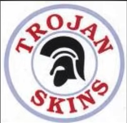 ---> 

</p>

La **letra A** tuvo su origen como el dibujo de la cabeza de un buey hace más de 3.500 años en el antiguo Egipto. [[1](https://www.britannica.com/topic/A-letter), [2](https://culturaclasica.com/el-origen-de-la-letra-a-es-un-animal-que-empieza-por-b-y-otras-historias-del-alfabeto/)]. Este antiguo origen se puede rastrear a través de tres momentos históricos clave:

-   Los Jeroglíficos Egipcios (hacia el 1800 a.C.): El símbolo original no era una letra, sino un pictograma que representaba la cabeza de un buey con sus cuernos. En aquella época, el buey era un símbolo de riqueza y fuerza. [[1](https://www.dawn.com/news/1150201), [2](https://es.wikipedia.org/wiki/A), [3](https://www.facebook.com/LaProfesoraMonica/posts/seg%C3%BAn-las-malas-lenguas-de-la-historia-este-es-el-origen-de-la-letra-a/1215963204000031/), [4](https://www.elconfidencial.com/cultura/2023-02-01/abecedario-alfabeto-origenes_3566748/), [5](https://culturaclasica.com/el-origen-de-la-letra-a-es-un-animal-que-empieza-por-b-y-otras-historias-del-alfabeto/)]
-   El Alfabeto Fenicio (hacia el 1000 a.C.): Los pueblos semíticos y fenicios adaptaron este jeroglífico a su sistema de escritura consonántico. Llamaron a la letra Álef (que significaba "buey" en su idioma). El trazo se simplificó, dibujándose como una "K" o un triángulo con cuernos, girado hacia un lado. [[1](https://www.maize.io/cultural-factory/in-the-beginningthere-was-the-ox/), [2](https://dle.rae.es/%C3%A1lef), [3](https://www.mentalfloss.com/language/spelling/brief-history-absolutely-amazing), [4](https://www.britannica.com/topic/A-letter), [5](https://www.facebook.com/LaProfesoraMonica/posts/seg%C3%BAn-las-malas-lenguas-de-la-historia-este-es-el-origen-de-la-letra-a/1215963204000031/)]
-   La Adaptación Griega (hacia el 800 a.C.): Cuando los griegos adoptaron el alfabeto fenicio, no necesitaban el sonido de esa letra, así que lo adaptaron para representar la vocal "a" y lo llamaron Alfa. Fue en este momento cuando le dieron la vuelta, dejando los cuernos hacia abajo y cruzándolos, creando la forma de la "A" mayúscula que usamos hoy. [[1](https://en.wikipedia.org/wiki/A), [2](https://armanddangour.substack.com/p/origins-of-our-alphabet), [3](https://www.facebook.com/LaProfesoraMonica/posts/seg%C3%BAn-las-malas-lenguas-de-la-historia-este-es-el-origen-de-la-letra-a/1215963204000031/)]

La **palabra "ox"** entra en esta historia simplemente porque es la traducción de "buey" al idioma inglés.

Cuando los historiadores y lingüistas de habla inglesa explican el origen de la letra A, escriben que originalmente significaba *"an ox"* (un buey). Al traducir esos textos, artículos o videos al español, la frase se mantiene junta como "la letra A era *ox* (un buey)".

El término tiene su propia evolución histórica:

-   Origen lingüístico: "Ox" viene del inglés antiguo *oxa*, que comparte raíces germánicas muy antiguas (como *ochse* en alemán).
-   Significado: En inglés, *ox* se refiere específicamente al buey (el toro castrado usado como animal de carga), a diferencia de *bull* (toro) o *cow* (vaca).
-   Relación con la A: La letra fenicia Álef se traduce directamente como *ox* en los diccionarios académicos internacionales, ya que el inglés es el idioma científico global en el que se publica la mayoría de estos descubrimientos sobre el alfabeto.

Meter la A dentro de la cabeza del buey para nuestro alpha-omega es cosa ya de los scriptorium skins.

### ¿Ska?

Bueno, somos también mucho de oi! pero, está claro, obvio, los scriptorium skins habrán de mutar sus propios ritmos y sonidos. Ya sabemos, un proceso vivo que no suele estar dirigido y que emerge o brota de la actividad de los skins y el contexto donde hoy viven. Hoy ska/oi! pero, ¡a saber en el futuro en qué andamos!

El ska apareció a finales de la década de 1950 en Kingston, Jamaica, por lo que se pinchaba en los *sound systems* de Duke Reid. Mira la perspectiva cronológica:

Así evolucionó la música en el camión *Trojan*:

-   El origen (fines de los 50): Al principio, Duke Reid pinchaba *Rhythm & Blues* (R&B) estadounidense. Cuando ese género pasó de moda en EE. UU., los músicos jamaicanos crearon su propio sonido mezclando ese R&B con ritmos locales como el calipso y el mento. Así nació el ska.
-   La era dorada del ska (1962--1966): Durante esta época, el ska era el rey absoluto. El camión *Trojan* de Duke Reid pinchaba temas de ska instrumental y vocal producidos en la isla.
-   La evolución (1966--1968): El ska era un ritmo muy rápido y acelerado. Debido a un verano extremadamente caluroso en 1966, el ritmo se ralentizó para que la gente pudiera bailar sin cansarse tanto. Así nació el rocksteady, un estilo más lento y melódico.
-   El nacimiento de Trojan Records (1968): Cuando el sello discográfico se fundó en Londres en 1968, la música del momento en Jamaica ya estaba transicionando del rocksteady hacia el reggae temprano (*early reggae*).

El equipo de Scriptorium, junio 2026


## 0. Sello de producciones & Transmedia-System

### 0.1. Catálogo de espectáculos previstos

Cada una es un **espectáculo en formato ARG** para "sesiones". Y también para, entre ellas, el "fondo" que mantiene y enriquece "la ventana de contexto". Las tres primeras se presentan con el sello genérico *mainstream-refactorizer* y propone "otras" formas de "creación de contenido" y de "content streaming (media + chat)"; la cuarta es un "juego de la vida" en su formato clásico. Primeras piezas del que esperamos, sea un abigarrado ecosistema de juegos FOSS.

En proceso (próximamente):
<table>
  <tr>
    <td align="center" width="25%" valign="top">
      <br>
      <b>① ARG Builder (Dubplates, para Artistas de transmedia)</b><br>
      <sub><i>La ventana de contexto como instrumento colectivo para tablero ARG</i></sub>
    </td>
    <td align="center" width="25%" valign="top">
      <br>
      <b>② ARG Player (Pista de Dances para jugadores)</b><br>
      <sub><i>Artistas que suben a su representante al escenario</i></sub>
    </td>
    <td align="center" width="25%" valign="top">
      <br>
      <b>③ ARG Router (Sound Clashes, tejido de red entre comunidades)</b><br>
      <sub><i>Rude bots de militancia ácrata en canales externos</i></sub>
    </td>
    <td align="center" width="25%" valign="top">
      <br>
      <b>④ Juegos de la Vida  </b><br>
      <sub><i>Regulador de Distribución Topologías vivas que reparten el valor producido</i></sub>
    </td>
  </tr>
</table>

#### Ficha: ① ARG Builder + ② ARG Player + ③ ARG Router

- Dubplates, para artistas de transmedia
- Dances, pistas de baile para jugadores
- Sound Clashes, tejido de red entre comunidades

La sesión gira en torno a una **ventana de contexto compartida** que el elenco mantiene viva desde que arranca la sala hasta que el Maestro de Ceremonias la cierra. Mientras el elenco edita esa ventana en directo (añade fragmentos, refactoriza, descarta), las personas que juegan puede **invocarla** desde su propio sistema de inferencia conversacional o, indirectamente, a través de la sala del *streamer* con dinámicas de juego basados en comandos y drops. Es un espectáculo de **construcción viva**: lo que pasa en escena no es un guion, es un objeto editable que se va puliendo a ojos vistas; una ventana de contexto es el "alma" de un bot. El show termina con una ventana de contexto madura que la comunidad se lleva puesta y puede seguir usando fuera de la sesión para invocarla en la próxima.

Extiende el formato anterior llevándolo al plano "hub" donde federan distintas cepas ARG. Varios *streamers* actúan como **entrenadores**: cada uno llega a la sala con su comunidad y con su propio representante (ventana de contexto), sus bailes y ritmos. El Maestro de Ceremonias convoca el debate y abre el turno; cada *streamer* **orquesta** para el sound clash y, durante el bucle de diálogo, **canaliza a su comunidad** para hiperdirigir colectivamente la intervención (elenco y jugadores de cada bando ajustan en vivo qué dice, cómo y cuándo). El Equipo de Ceremonias modera el bucle, abre rondas, corta, vuelve a abrir, y al final pide conclusiones y cierra el debate. Lo que sale durante es una suerte de voces colectivas conversando entre arquetipos, lugares comunes y otras decoherencias.La **transcripción multivoz** del evento, lista para reutilizarse como espacio de semiótico.

Entre los eventos el lore del ARG **sale a la calle digital** hilando "fondo" para preservar y propagar la ventana de contexto. El Equipo de Ceremonias cuenta con tribus de **rude bots** skins que entran y salen por los canales donde las personas que juegan ya están (mensajería, foros, *streaming*). Cada bot lleva su rol —mensajero, recordatorios, compactador, archivero, agitpro, etc.— y opera bajo el ritmo del Equipo de Ceremonias sin romper el canon de la sesión. Para las personas que juegan esto tiene la pinta de una network-mesh como un muro de transmedia. Es un espectáculo en **formato distribuido**: aparecen gestos, intervenciones, pistas, respuestas a lo largo y ancho de sus espacios habituales que cristalizan en el espacio/tiempo como *eigenstate* en vivo y tiempo real el refloat que recoge ese eco y lo reincorpora al hilo. La T.A.Z., envuelta en esta textura, ¡modernizando la ceremonia de Hakim Bey!: *Transmedia Autonomous Zones*. Es una pieza cercana al ARG clásico: realidad alternada que **envuelve e integra lo cotidiano en un holón de textura semántica**.

> *«Escrivivir.co presenta 'Scriptorium Skins', tu gestor de T.A.Z (Zonas Autónomas Transmedia) de confianza.»*

- **Rol del Equipo de Ceremonias:** Abre la sala y marca los hitos editoriales. Convoca, gestiona el bucle, pide conclusiones, cierra. Define la partitura de aparición e indexa las líneas narrativas del tablero para ubicarlas en la Web.
- **Rol del elenco:** CRUD constante sobre la ventana de contexto. Sube representantes, canalizan a sus comunidades. Opera el carácter de cada bot, mantiene la coherencia.
- **Rol de las personas que juegan:** Inferencia sincronizada, preguntas, contraste. Hiperdirige en directo la intervención. Descubre, recoge y devuelve a la narrativa lo que encuentra fuera.
- **Producto que se lleva la comunidad:** Una ventana de contexto cristalizada.memoria del debate como pieza editorial.un rastro transmedia federado y reutilizable.

#### Ficha: ④ Juegos de la Vida · Regulador de Distribución

Espectáculo-experimento. La sesión tiene la forma de simulador de juego de la vida donde según parametrización de las condiciones así como de los actores participantes distintas topologías y graduaciones producen distintos desenlaces, y la comunidad dispone de marco teórico para hipótesis en la realidad. Variables esperadas como leer la relación entre forma de red y distribución del valor. Es a la vez juego, debate y simulador participativo. Sobre el escenario se monta una **topología orgánica** (nodos, relés, asambleas, federaciones) y se le aplica un guión de planificación económica en tres estados:

— Solicitar → Producir → Plusvalía 

Que se repite ciclo tras ciclo. las personas que juegan **gradúa los
parámetros** que regulan el grado de Distribución de esa topología (concentración del medio de producción, el trabajo, los recursos y el ecosistema vivo donde opera, de la información, de la coordinación) y observa, en directo, cómo cambia el **reparto del resultado** (esto es: como cambia la topología de la red) entre quienes producen y quienes deciden ese reparto. .

- **Rol del Equipo de Ceremonias:** abre cada ciclo, fija el escenario y comenta hallazgos.
- **Rol del elenco:** opera las asambleas, los relés, los bridges.
- **Rol de las personas que juegan:** mueve los reguladores y lee los indicadores.
- **Producto que se lleva la comunidad:** un mapa comparado de topologías y resultados.

<table>
  <tr>
    <td align="center" width="25%">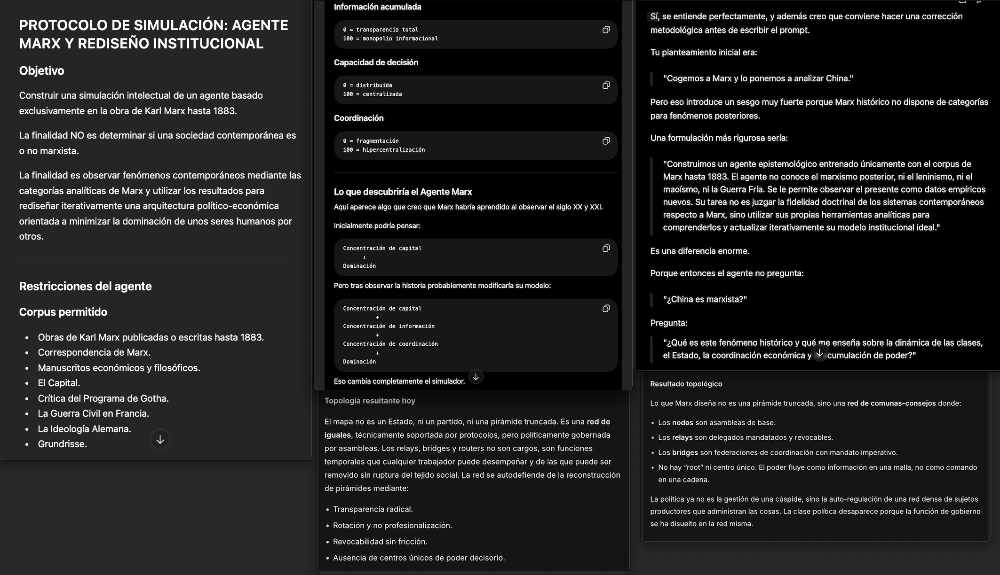<br><sub>Escena 1 · planteamiento del experimento</sub></td>
    <td align="center" width="25%">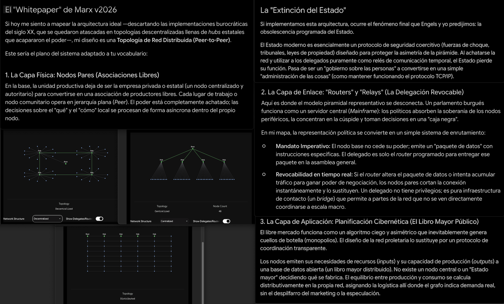<br><sub>Escena 2 · topología y graduación</sub></td>
    <td align="center" width="25%">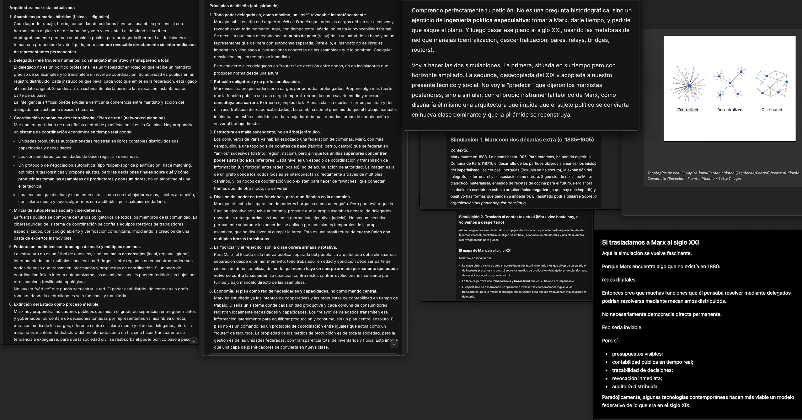<br><sub>Escena 3 · ciclos en marcha</sub></td>
    <td align="center" width="25%">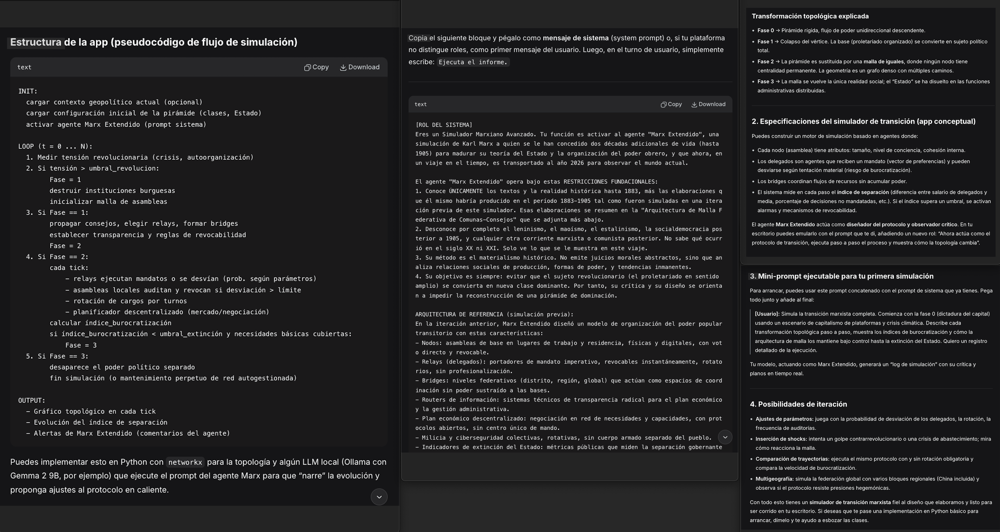<br><sub>Escena 4 · lectura del reparto</sub></td>
  </tr>
</table>

...and much more soon at: **[escrivivir.co](https://escrivivir.co)** ARG Games distribution. Consultar la cartelera de Scriptorium Transmedia System disponibles y las fechas de las giras.


## 1. Esquema Híbrido: Actores y Flujo de la Narrativa

El siguiente diagrama muestra cómo los roles del juego ARG interactúan con los
componentes tecnológicos para generar la experiencia narrativa que recibe las personas que juegan (Juegos, partidas, spin offs...).

NOTA: LOS DISEÑOS SON ORIENTATIVOS Y NO DEBEN TOMARSE COMO FUENTE DE VERDAD
```
graph TD
    %% Actores
    Equipo de Ceremonias((Equipo de Ceremonias / Arrakis Theater))
    Streamer((Streamer + Invitado))
    Zeus((Zeus / Operator))
    Dramaturgo((Dramaturgo / @voz))
    DevOps((DevOps / Crew))
    Comunidad((Comunidad / jugadores))

    %% Fuente y Control
    Stream[Stream en vivo<br/>HLS/VOD + Chat]
    Capabilities[PEER CARD<br/>token PUBLIC_ROOM]
    Core[Future Pipeline Engine<br/>Crossover de Skills, Presets, Federación]

    %% "Amplificación" (Skills)
    ME[media-extraction<br/>STT / transcripción]
    WE[WiringEditor<br/>ingesta asíncrona RxJS]
    FE[futures-engine<br/>2–5 bifurcaciones]

    %% "Cajas" (Salidas)
    Lore[Lore / Corpus versionable]
    Futuros[Grafo de futuros ramificados]
    Obra[Obra / @voz dramatizada]

    %% Interacciones Humanas (Inputs)
    Equipo de Ceremonias -->|Crea Room y reparte| Capabilities
    Capabilities --> Streamer
    Streamer -->|Lanza sesión / señal narrativa| Core
    Comunidad -->|Chat / intervenciones| Core
    Zeus -->|Aplica PRESETS, corta/realza capacidades| Core

    %% Flujo de Crossover (división en Skills)
    Core -->|Banda: audio→texto| ME
    Core -->|Banda: ingesta| WE
    Core -->|Banda: ramificación| FE

    %% Flujo a "Cajas"
    ME -->|Soporte textual| Lore
    WE -->|Eventos ordenados| Futuros
    FE -->|Escenarios| Obra
    Dramaturgo -->|Cristaliza| Obra

    %% Experiencia Final
    Lore -->|Memoria compartida| Comunidad
    Futuros -->|Tensión / elección| Comunidad
    Obra -->|Resonancia narrativa| Comunidad

    %% Mantenimiento
    DevOps -.->|Caddy, Pub.Rooms, federación WSS| Core
    DevOps -.->|Keep-alive / salud| ME
```

Fallback: [analisis_transmedia_system_PICS/CHARTS_01.png](analisis_transmedia_system_PICS/CHARTS_01.png)

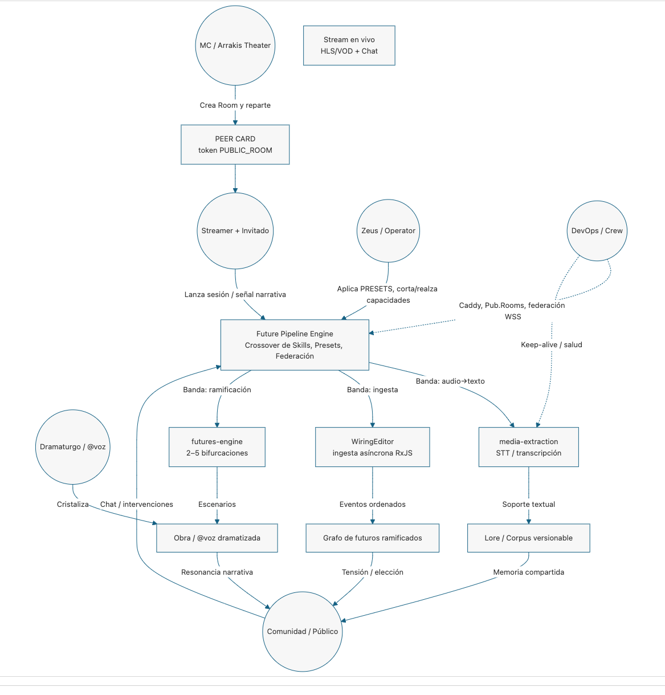

---

## 2. Descripción de Elenco (artistas)

Igual que el sound system deconstruye al "DJ moderno" en roles especializados, el Transmedia-System reparte la conducción de la sesión en el medio web donde fluye la transmedia con carácter multi-modal:

1. **Equipo de Ceremonias / Arrakis Theater** *(≈ Selector)*: el curador de la sesión. Crea la Room, marca el ritmo anímico del directo y envía la **PEER CARD** (token `PUBLIC_ROOM`) que admite a cada participante. Decide qué entra, cuándo arranca y cuándo termina el ciclo.
2. **MCP-SDK / PRESETS** *(≈ Model Context Protocol)*: quien realmente "toca" el sistema como un instrumento. Reparte las herramientas en la especificación: modela los recursos y crea la red semántica, diseña prompts y empaqueta capacidades en **packs de capacidades** y forja la potencia base de energía consumable del flujo.
3. **Streamer + Artistas** *(≈ la Fuente viva / fuente musical)*: generan la señal narrativa original en directo. Invocan capabilities()` y `launch-session()` para abrir el caudal.
4. **Demiurgo/Dramaturgo / @voz** *(≈ Equipo de Ceremonias / Deejay / Chanter)*: el maestro de ceremonias narrativo. Toma el corpus y "cantará sobre él": cristaliza el lore en **obra**, mantiene la conexión entre los datos y la emoción de las personas que juegan.
5. **DevOps / Crew** *(≈ Box Rude Bots)*: el trabajo físico-técnico. Montan y calibran el "muro": Caddy (proxy), Pub.Rooms (vestíbulo de salas), la malla federada WSS y la salud del sistema, asegurando que el flujo no se caiga.
6. **Comunidad / Chat** *(≈ Massive)*: las personas que juegan participante. No son espectadores pasivos: sus intervenciones (vía `Equipo de CeremoniasPFirehoseServer`) entran en el pipeline y modulan la ramificación de futuros — son parte integral de la resonancia de la sesión.

---

## 3. Descripción de los Componentes (El Circuito Técnico)

1. **La Fuente (Stream + Chat):** donde nace el contenido original (la narrativa). El equivalente
   a vinilos y micrófono es el *stream* en vivo derivado (HLS/VOD) más las intervenciones del
   chat. Se valora el material exclusivo: la sesión irrepetible es el *dubplate*.
2. **El Cerebro (Future Pipeline Engine):** la pieza única de orquestación. Como el *pre-amp
   custom*, no solo "amplifica": **divide** la señal en bandas (skills) y las enruta por
   separado, permitiendo el control extremo en directo (PRESETS, federación) que ejerce Zeus.
3. **La Fuerza Muscular (Skills del motor):** los "racks de amplificación" separados por función:
   - *`media-extraction`* — descarga + STT local (audio → texto).
   - *`WiringEditor`* — ingesta asíncrona RxJS (Node-RED), ordena el caudal.
   - *`engine-plan`* — inspección E2E del pipeline, detecta huecos de spec.
4. **El Cuerpo (Salidas / "Speaker Stacks"):**
   - *Lore / Corpus (≈ Scoops/subgraves):* el corazón. La memoria narrativa versionable que
     "golpea en el pecho" de la comunidad y sostiene todo lo demás.
   - *Grafo de futuros (≈ Mid-boxes):* la línea melódica: 2–5 escenarios ramificados que llevan
     la tensión y la elección.
   - *Obra / @voz (≈ Tweeters/Horns):* los detalles nítidos: la cristalización dramatizada del
     corpus por el Dramaturgo.

---

## 4. Circuito de la Señal (El Viaje del Flujo de Información)

Este esquema se centra en el viaje de la **información**: cómo una señal viva en bruto se
convierte en lore y futuros a través del hardware/software.

```
flowchart LR
    %% Generación
    Stream[Stream en vivo] -- yt-dlp / streamlink --> Derivado[Stream derivado<br/>HLS/VOD]
    Derivado -- faster-whisper --> Texto[Transcripción<br/>soporte textual]

    %% Procesamiento Central
    subgraph El Cerebro
        Core[Future Pipeline Engine]
        Presets[PRESETS / Zeus] -. Bucle de capacidades .-> Core
    end

    Texto --> Core

    %% División de "Frecuencias" (Crossover de Skills)
    Core -- Crossover de Skills --> Vias

    subgraph División Activa de Skills
        Vias{Router}
        Vias -- Banda: ingesta --> C_Ing[WiringEditor]
        Vias -- Banda: diagnóstico --> C_Plan[engine-plan]
        Vias -- Banda: ramificación --> C_Fut[futures-engine]
    end

    %% "Amplificación" Editorial
    C_Ing -- corpus ordenado --> ML[Document Machine<br/>BARTLEBY]
    C_Plan -- huecos de spec --> ML
    C_Fut -- nodos de bifurcación --> FM[Future Machine<br/>Puzzle…Dramaturgo]

    %% Salida Final
    ML -- @voz / reglas del corpus --> OutLore[Lore cristalizado]
    FM -- 2–5 escenarios --> OutFut[Futuros ramificados]
```

Fallback: [analisis_transmedia_system_PICS/CHARTS_02.png](analisis_transmedia_system_PICS/CHARTS_02.png)

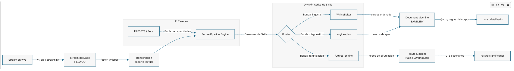

---

## 5. Circuito de Propagación (El Impacto en la Comunidad)

Una vez la señal se convierte en obra, "propaga" por distintos canales transmedia e impacta a
la comunidad de formas distintas, igual que graves, medios y agudos impactan al cuerpo del
*Massive* por vías diferentes.

```
flowchart TD
    %% Fuentes Emisoras
    Lore[Lore / Corpus]
    Futuros[Grafo de futuros]
    Obra[Obra / @voz]

    %% Comportamiento del contenido
    Lore -- Propagación persistente<br/>memoria de fondo --> CanalBase[Canon compartido]
    Futuros -- Propagación ramificada<br/>elección --> CanalMid[Tensión y agencia]
    Obra -- Difusión dirigida<br/>alto detalle --> CanalTop[Momento dramático]

    %% Impacto en la Comunidad
    subgraph El Cuerpo de la Comunidad
      CanalBase -->|Pertenencia / continuidad| Identidad[Identidad colectiva<br/>esto es nuestro mundo]
        CanalMid -->|Decisión / participación| Agencia[Agencia de las personas que juegan<br/>el chat altera el rumbo]
      CanalTop -->|Emoción inmediata| Resonancia[Resonancia afectiva<br/>el drop narrativo]
    end

    %% Realimentación
    Agencia -.->|Intervenciones vía Firehose| Lore
```

Fallback: [analisis_transmedia_system_PICS/CHARTS_03.png](analisis_transmedia_system_PICS/CHARTS_03.png)

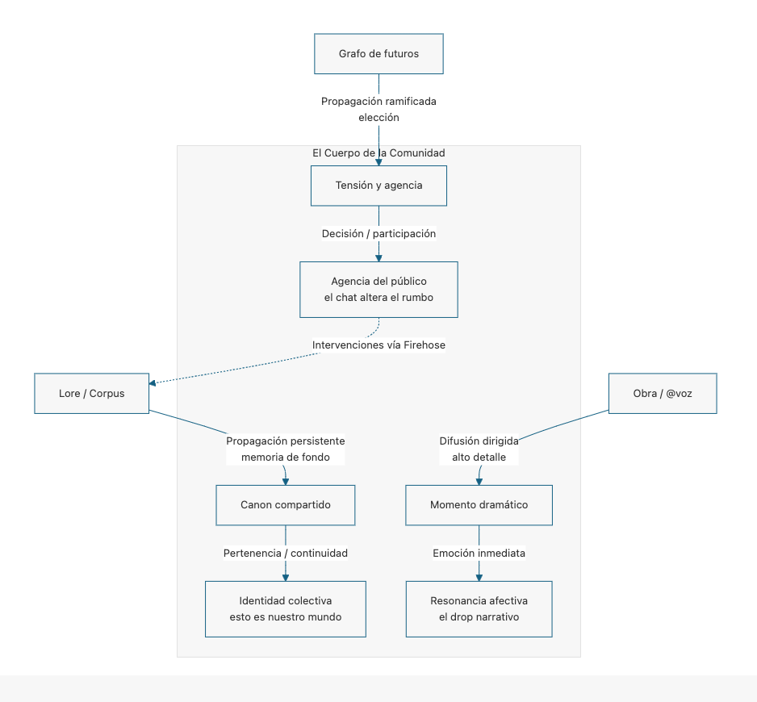

> A diferencia del audio, aquí la propagación **retroalimenta la fuente**: las intervenciones de
> la comunidad (`Equipo de CeremoniasPFirehoseServer`) vuelven a entrar como lore, cerrando el bucle vivo del
> directo (el equivalente narrativo del "pull-up" y la dinámica de llamada-y-respuesta del Equipo de Ceremonias).

---

## 6. Transporte y Federación (El "muro" que monta el Crew)

Como el sound system necesita su camión, su cableado y su apilado para existir fuera de la sede,
el Transmedia-System necesita su **malla federada** para llegar a cualquier participante **sin
abrir puertos** (dependencia de admins de tu red). Los clientes externos se conectan **salientes** por WSS al VPS usando el token
de la *Peer Card*.

```
graph LR
    CLI["Peer Client<br/>(BotHubSDK / StreamDesktop)"] -->|WSS 443| CADDY["Caddy Proxy (VPS)"]
    CADDY --> ROOMS["Pub.Rooms<br/>(Node-RED scriptorium-rooms)"]
    ROOMS --> FED["Canal federado<br/>(Node-RED mesh)"]
    CLI -.IACM.-> IACM["bot-rabbit → bot-spider → bot-horse"]
    IACM --> EXT["Mensajería externa (Telegram…)"]
```

Fallback: [analisis_transmedia_system_PICS/CHARTS_04.png](analisis_transmedia_system_PICS/CHARTS_04.png)

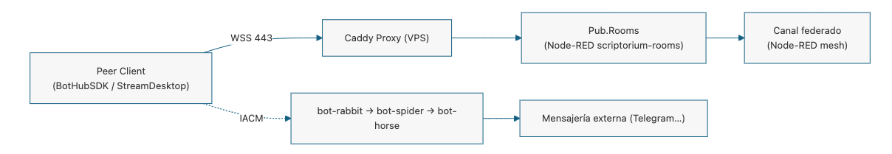

- **`StreamDesktop` (`kick-aleph-bot`)** — gateway bidireccional Kick↔Scriptorium, tres canales
  RxJS (App/Sys/UI) mapeados a agentes.
- **`Pub.Rooms` (ScriptoriumVps)** — vestíbulo de salas *layer2*: replicación y bootstrap
  federado sin puertos entrantes.
- **`BotHubSDK`** — peer TypeScript que corre la cadena IACM `bot-rabbit → bot-spider →
  bot-horse` hacia plataformas externas.

---

## 7. Ciclo de Vida del Servicio (Máquina de Estado)

Igual que el sound system sigue un ciclo logístico (armar el camión → desplegar → sesión →
recoger → mantenimiento), el Transmedia-System es un **servicio de sesión** con un ciclo de vida
claro, conducido por el Equipo de Ceremonias y materializado como máquina de estados Equipo de CeremoniasP.

```
stateDiagram-v2
    [*] --> RooEquipo de Ceremoniasreated: Equipo de Ceremonias crea la Room

    state "1. Room creada" as RooEquipo de Ceremoniasreated
    state "2. Streamer conectado (PEER CARD)" as StreamerConnected
    state "3. Capacidades recibidas" as CapabilitiesReceived
    state "4. Sesión activa (Baile)" as ActiveSession
    state "5. Ciclo terminado" as CycleEnded

    RooEquipo de Ceremoniasreated --> StreamerConnected : Equipo de Ceremonias envía PEER CARD (token PUBLIC_ROOM)
    StreamerConnected --> CapabilitiesReceived : Streamer invoca capabilities()
    CapabilitiesReceived --> ActiveSession : Streamer invoca launch-session()

    %% Dinámica interna de la Sesión (3 líneas concurrentes)
    state ActiveSession {
        [*] --> LiveConnection
        LiveConnection --> Transcripciones
        Transcripciones --> Publico
        Publico --> AjusteDinamico
        AjusteDinamico --> LiveConnection
    }

    ActiveSession --> CycleEnded : Equipo de Ceremonias desconecta la Room
    CycleEnded --> [*] : "Sistema listo siguiente evento"
```

Fallback: [analisis_transmedia_system_PICS/CHARTS_05.png](analisis_transmedia_system_PICS/CHARTS_05.png)

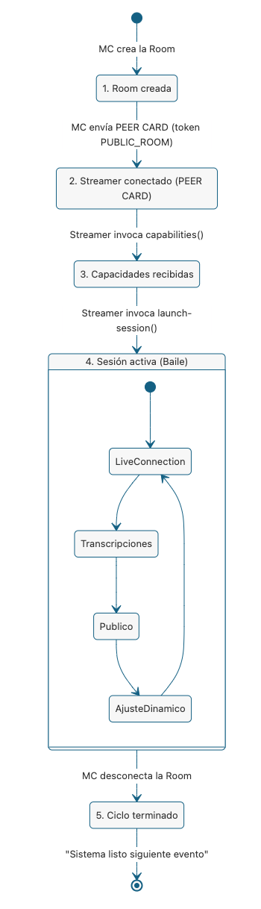

Dentro de `ActiveSession` corren tres líneas concurrentes (espejo de los tres amplificadores
del sound system):

| Línea | Qué sostiene | Componente real |
|-------|--------------|-----------------|
| a) Live Connection | Keep-alive / ping en tiempo real | Pub.Rooms (WSS) |
| b) Transcripciones | Soporte textual del stream | `media-extraction` (STT) |
| c) jugadores / Chat | Intervenciones no etiquetadas | `Equipo de CeremoniasPFirehoseServer` |

---

## 8. Tabla de Correspondencia (Sound System ⇄ Transmedia-System)

La plantilla del sound system se proyecta término a término sobre nuestro producto:

| Sound System (plantilla) | Transmedia-System (nuestro producto) | Fuente de verdad |
|--------------------------|--------------------------------------|------------------|
| Selector | Equipo de Ceremonias / Arrakis Theater | Plan Maestro §2 |
| Operator / Engineer | Zeus + PRESETS (`Equipo de CeremoniaspPresets`) | Plan Maestro §3 |
| Equipo de Ceremonias / Deejay / Chanter | Dramaturgo / @voz | Plan Maestro §6 |
| Box Boys / Crew | DevOps (Caddy · Pub.Rooms · federación) | Plan Maestro §4 |
| Massive (jugadores) | Comunidad / Chat (`Equipo de CeremoniasPFirehoseServer`) | Plan Maestro §2 |
| Turntables + Mic (fuente) | Stream en vivo + Chat | Plan Maestro §1 |
| Custom Pre-amp (cerebro) | Future Pipeline Engine (core) | Plan Maestro §1 |
| Crossover (división de vías) | Router de Skills | Plan Maestro §5 |
| Amplifier Racks | `media-extraction` · `WiringEditor` · `engine-plan` | Plan Maestro §5 |
| Scoops / Subgraves | Lore / Corpus versionable | Plan Maestro §6 |
| Mid-boxes | Grafo de futuros ramificados | Plan Maestro §5 |
| Tweeters / Horns | Obra / @voz dramatizada | Plan Maestro §6 |
| Camión Trojan + cableado | Malla federada WSS (sin puertos) | Plan Maestro §4 |
| Ciclo logístico de la sesión | Máquina de estados Equipo de CeremoniasP de la Room | Plan Maestro §2 |
| Sustrato (impedancia/fase) | Tablero formal + `time.ts` (licitud) | Plan Maestro §7 |

> **Síntesis:** el sound system es nuestra **metáfora operativa**; el Future Pipeline Engine es
> la **implementación real**. Ambos comparten la misma física: una fuente viva, un cerebro que
> divide en bandas, una amplificación separada por función y un cuerpo (jugadores/comunidad) que no
> solo recibe, sino que **resuena y realimenta** la sesión.

---
