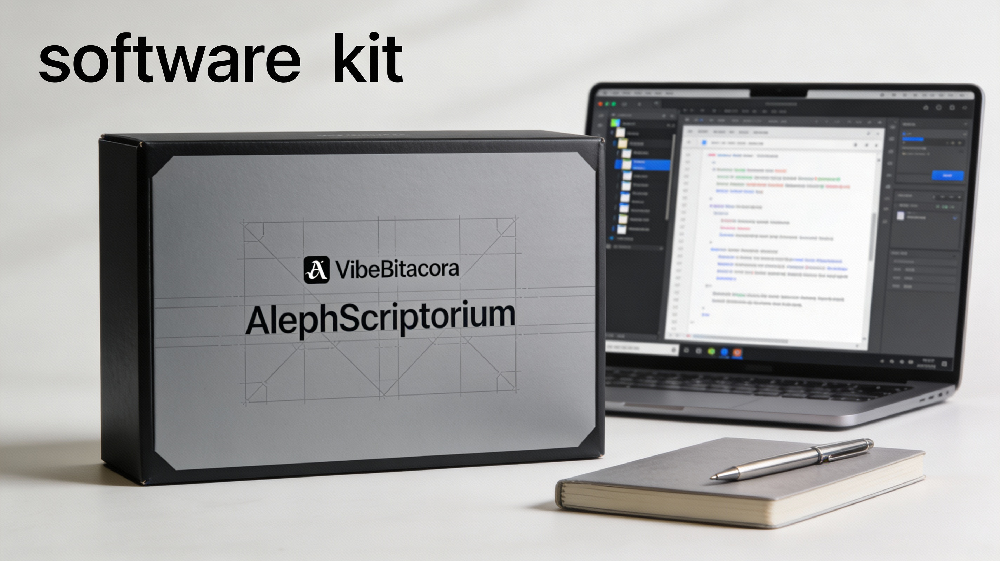
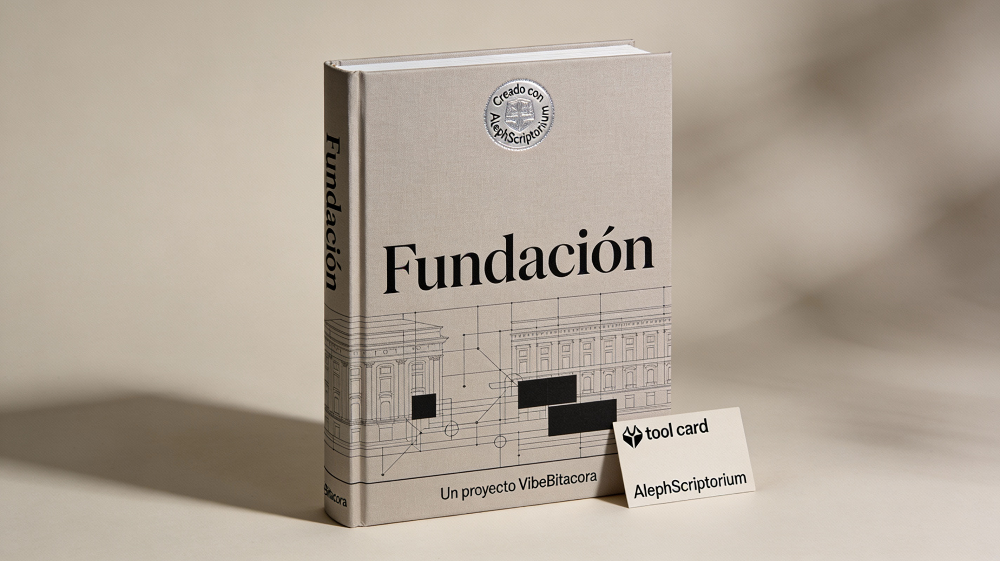

# Aleph Scriptorium

[](https://github.com/escrivivir-co/vibe-bitacora)

**El taller de escritura donde la IA trabaja para ti, no al revés.**

> *Aleph (ℵ) es el símbolo que Cantor usó para los infinitos: conjuntos que nunca se completan pero siempre pueden ser trascendidos por un infinito mayor. La escritura funciona igual: cada versión es un umbral, no un destino. En el scriptorium medieval, los copistas preservaban y transmitían el conocimiento con rigor artesanal. Este sistema une ambas ideas: un proceso infinitamente perfectible, ejecutado con disciplina de oficio.*

---

## Status (para visitantes)

| | |
|---|---|
| **Fecha** | 2025-12-19 |
| **Sprint** | 0 (Bootstrap) |
| **Ciclo previsto** | 12 sprints × 4 iteraciones = 48 iteraciones (2026) |

Este repositorio está en fase de **arranque controlado**: se prioriza dejar un método repetible (Scriptorium) y una base doctrinal sólida (ARCHIVO) antes de acelerar la producción del texto serializado (Fundación).

El proyecto tiene dos productos paralelos:

1. **Aleph Scriptorium** — el kit de herramientas (agentes, prompts, instrucciones, protocolo).
2. **Fundación** — el texto fundacional en 12 capítulos que demuestra el kit en acción.

---

### 1. Aleph Scriptorium (v0.0.1) — Avance Sprint 0: 73%

El Scriptorium es el "cómo": método, agentes, prompts e instrucciones para que la IA trabaje bajo las reglas del proyecto.

| Artefacto | Estado | Ruta |
|-----------|--------|------|
| Protocolo DevOps (commits, sprints, backlogs) | ✅ | [`.github/DEVOPS.md`](.github/DEVOPS.md) |
| Backlog Scriptorium | ✅ | [`.github/BACKLOG-SCRIPTORIUM.md`](.github/BACKLOG-SCRIPTORIUM.md) |
| Agente **Aleph** (planifica, redacta, gestiona) | 🔄 | [`.github/agents/aleph.agent.md`](.github/agents/aleph.agent.md) |
| Agente **Revisor** (evalúa, detecta incoherencias) | ✅ | [`.github/agents/revisor.agent.md`](.github/agents/revisor.agent.md) |
| Prompt de extracción y archivo | ✅ | [`.github/prompts/extraer-archivar.prompt.md`](.github/prompts/extraer-archivar.prompt.md) |
| Prompt de convención de commits | ✅ | [`.github/prompts/commit-message.prompt.md`](.github/prompts/commit-message.prompt.md) |
| Prompt de ejecución de commits | ✅ | [`.github/prompts/ejecutar-commits.prompt.md`](.github/prompts/ejecutar-commits.prompt.md) |
| Prompt de foto de estado | ✅ | [`.github/prompts/foto-estado-y-discurso-motivacional.prompt.md`](.github/prompts/foto-estado-y-discurso-motivacional.prompt.md) |
| Instrucciones de contexto (voz, marco, diagnóstico) | ✅ | `.github/instructions/` |

**Pendiente para cerrar Sprint 0**: integrar trazabilidad completa en el agente Aleph.

---

### 2. Fundación (v0.0.1) — Avance Sprint 0: 77%

Fundación es el "qué": un texto político serializado en 12 capítulos (uno por mes en 2026) que aspira a ser una obra tipo Constitución/Contrato/Manifiesto.

#### Base doctrinal (ARCHIVO/)

| Eje | Docs | Contenido | Ruta |
|-----|------|-----------|------|
| **Justificación** | 4 | Por qué este proyecto: lo tardío, asco→huida→odio, posverdad, fractura | [`ARCHIVO/justificacion/`](ARCHIVO/justificacion/) |
| **Diagnóstico** | 5 | Cómo estamos: SOTA izquierdo, estructura de sentimiento, patrón reaccionario, fe lúcida, carisma vs responsabilidad | [`ARCHIVO/diagnostico/`](ARCHIVO/diagnostico/) |
| **Marco** | 11 | Herramientas: selección sistémica, injusticias, acción colectiva, geopolítica, método materialista, soberanía, hybris, trabajo, teología política, Euroamérica, tecnofeudalismo | [`ARCHIVO/marco/`](ARCHIVO/marco/) |

#### Plan 2026

| Mes | Capítulos | Estado |
|-----|-----------|--------|
| Enero | 1. Anacronismo productivo · 2. Autómata soberano · 3. Problema de la escala · 4. Repertorio y arquitecturas | Borradores (plantilla + estructura) |
| Feb–Oct | Por definir | — |
| Nov | Ensamblaje y revisión | — |
| Dic | Cierre y publicación | — |

**Rutas clave**:
- Índice 2026: [`PROYECTOS/FUNDACION/Indice.md`](PROYECTOS/FUNDACION/Indice.md)
- Borradores enero: [`PROYECTOS/FUNDACION/CAPITULOS/`](PROYECTOS/FUNDACION/CAPITULOS/)
- Indicadores de fracaso enero: [`PROYECTOS/FUNDACION/indicadores-fracaso-enero.md`](PROYECTOS/FUNDACION/indicadores-fracaso-enero.md)
- Backlog Fundación: [`PROYECTOS/FUNDACION/BACKLOG-FUNDACION.md`](PROYECTOS/FUNDACION/BACKLOG-FUNDACION.md)

**Pendiente para cerrar Sprint 0**: validar la estructura de los 12 capítulos y convertir los borradores de enero de "plantilla" a "texto" (con sacrificio y sombra explícitos).

---

### 3. Plan inmediato

#### Cerrar Sprint 0 (Bootstrap)

- [ ] Completar el agente Aleph con trazabilidad end-to-end.
- [ ] Validar el índice anual (12 capítulos, 3 arcos, desplazamientos asignados).
- [ ] Verificar que cada capítulo de enero tiene: tesis, mecanismo, sacrificio, sombra.

#### Abrir Sprint 1 (Enero 2026)

- [ ] Convertir cap01–cap04 de "plantilla" a "prosa": apertura → tesis → núcleo de diseño → sacrificio → sombra → cierre.
- [ ] Aplicar los indicadores de fracaso como checklist de revisión, no como apéndice.
- [ ] Definir indicadores de fracaso para febrero.

---

### 4. Cómo leer esto en 5 minutos

| Interés | Empieza por |
|---------|-------------|
| El **método** (cómo trabaja la IA) | [`DEVOPS.md`](.github/DEVOPS.md) → backlog Scriptorium → agente Aleph |
| La **doctrina** (de qué habla el texto) | [`ARCHIVO/marco/README.md`](ARCHIVO/marco/README.md) → marco 01–11 |
| El **texto en producción** | [`Indice.md`](PROYECTOS/FUNDACION/Indice.md) → capítulos 1–4 → indicadores de fracaso |
| El **linaje** (de dónde viene esto) | Sección "Origen: VibeBitacora" más abajo |

---

## Qué es esto



**Aleph Scriptorium** es un sistema de escritura asistida por IA para proyectos de largo aliento: libros, ensayos serializados, investigaciones extensas, cualquier texto que requiera coherencia sostenida a lo largo del tiempo.

Este repositorio contiene:

1. **El framework** — arquitectura y herramientas configurables para estructurar conocimiento y producir textos complejos.
2. **Un proyecto de demostración** — "Fundación", un texto político en 12 capítulos que muestra el sistema en acción.

El objetivo: demostrar que es posible usar inteligencia artificial como **herramienta de amplificación intelectual**, no como sustituto del pensamiento ni como generador de ruido.

---

## Para quién es

Este proyecto está diseñado para **escritores escépticos de la IA**.

Si crees que ChatGPT solo sirve para correos corporativos y resúmenes genéricos, este sistema te propone otra cosa: un entorno donde la IA trabaja *bajo tus instrucciones*, con *tu material*, siguiendo *tu método*.

No se trata de pedirle a una máquina que escriba por ti.  
Se trata de construir un **sistema de producción intelectual** donde la IA hace lo que mejor sabe hacer —organizar, buscar, comparar, iterar— mientras tú haces lo que solo tú puedes hacer: pensar, decidir, escribir.

---

## Cómo funciona

### El entorno: un IDE, no un procesador de texto

Este sistema funciona dentro de **VS Code** (o cualquier IDE compatible con GitHub Copilot). Un IDE (*Integrated Development Environment*) es el entorno que usan los programadores para escribir código: texto plano, control de versiones, extensiones, automatización.

¿Por qué abandonar Word o Google Docs?

| Procesador de texto | IDE + IA |
|---------------------|----------|
| Un documento aislado | Un sistema de archivos interconectado |
| Formato como distracción | Texto plano, estructura como contenido |
| "Guardar como v2_final_FINAL.docx" | Control de versiones con Git |
| Sin memoria de contexto | Agentes de IA que conocen tu proyecto entero |
| Corrector ortográfico | Asistentes que entienden tu método y tu voz |

### La arquitectura: ARCHIVO + Agentes

El sistema separa claramente dos responsabilidades:

```
ARCHIVO/          ← QUÉ: tu base de conocimiento
.github/          ← CÓMO: instrucciones para los agentes
PROYECTOS/        ← DÓNDE: tus textos en progreso
```

#### El ARCHIVO (tu base de conocimiento)

Una colección estructurada de documentos que contienen las ideas, conceptos y material que alimentan tu escritura. Organizado en **ejes temáticos** que tú defines.

En el proyecto de demostración usamos tres ejes:

| Eje | Pregunta que responde |
|-----|----------------------|
| **Justificación** | ¿Por qué este proyecto? ¿Qué nos trajo aquí? |
| **Diagnóstico** | ¿Cómo estamos? ¿Hacia dónde queremos ir? |
| **Marco** | ¿Con qué herramientas conceptuales trabajamos? |

*Estos ejes son configurables. Un novelista podría usar "Personajes / Mundo / Trama". Un investigador, "Fuentes / Hipótesis / Método". El sistema se adapta a tu proyecto.*

#### Los Agentes (tus asistentes especializados)

Perfiles de IA preconfigurados para tareas específicas:

- **Extractor**: Procesa material fuente y lo distribuye en tu ARCHIVO ([extraer-archivar.prompt.md](.github/prompts/extraer-archivar.prompt.md))
- **Aleph**: Redacta borradores usando el ARCHIVO como base doctrinal ([aleph.agent.md](.github/agents/aleph.agent.md))
- **Revisor**: Evalúa textos, detecta incoherencias, propone mejoras ([revisor.agent.md](.github/agents/revisor.agent.md))

Los agentes no inventan: **consultan tu ARCHIVO**. No improvisan estilo: **siguen tus instrucciones**. No deciden por ti: **te presentan opciones**.

### La IA como herramienta, no como autor

Este sistema parte de una premisa: **la inteligencia artificial es extraordinariamente útil para tareas que los humanos hacemos mal** (organizar grandes volúmenes de información, mantener coherencia a lo largo de textos extensos, detectar contradicciones, iterar rápidamente).

Pero la IA no piensa. No decide. No tiene nada que decir.

El sistema está diseñado para que la IA haga trabajo *logístico* mientras el humano hace trabajo *intelectual*. La IA organiza tu material; tú decides qué material importa. La IA genera borradores; tú decides qué vale la pena. La IA detecta incoherencias; tú decides cómo resolverlas.

### Las herramientas MCP (extensiones de contexto)

El sistema puede conectarse a herramientas externas mediante el protocolo MCP:

- **Web Search**: Verificar referencias, consultar fuentes actualizadas
- **Playwright**: Navegar páginas web, consultar fuentes primarias
- **Y las que añadas**: El sistema es extensible

---

## Proyecto de demostración: "Fundación"

Este repositorio incluye un plan de proyecto como ejemplo: **Fundación**, un texto político serializado en 12 capítulos para el año 2026.



### El problema que aborda

Tres textos fundacionales han marcado el pensamiento político moderno:

- La **Constitución norteamericana** (1787): arquitectura institucional, checks and balances
- El **Contrato Social** de Rousseau (1762): legitimidad democrática, voluntad general
- El **Manifiesto Comunista** (1848): crítica materialista, análisis de clase

Pero estos textos no dialogan entre sí. El constitucionalismo liberal ignora la crítica de clase. El marxismo desprecia el diseño institucional. Rousseau ofrece legitimidad sin mecanismos.

### La propuesta

"Fundación" intenta una **síntesis operativa**: no glosar los clásicos, sino trenzar sus fortalezas en un cuerpo textual nuevo que sirva como herramienta de pensamiento para el presente.

No es un ejercicio académico. Es un intento de responder a una pregunta urgente: *¿cómo diseñar instituciones legítimas, materialmente justas y resistentes a la captura, en un mundo de posverdad técnica y fragmentación del sentido común?*

### Por qué "demo"

"Fundación" es ambicioso, pero es un ejemplo. Demuestra qué tipo de proyecto puede emerger de este sistema de escritura.

El valor no está solo en el texto final, sino en el **método reproducible**: cualquier escritor puede tomar esta arquitectura, vaciarla de contenido político, y llenarla con su propio proyecto.

---

## Estructura del repositorio

```
Fundacion/
├── README.md                 ← Estás aquí
├── ARCHIVO/                  ← Base de conocimiento (el QUÉ)
│   ├── justificacion/        ← Por qué este proyecto
│   ├── diagnostico/          ← Estado de la cuestión
│   └── marco/                ← Herramientas conceptuales
├── PROYECTOS/                ← Textos en producción
│   └── FUNDACION/            ← El proyecto demo
│       └── plan-anual-2026.md
└── .github/                  ← Configuración de agentes (el CÓMO)
    ├── agents/               ← Perfiles de IA especializados
    ├── instructions/         ← Guías de uso por eje
    └── prompts/              ← Prompts reutilizables
```

---

## Cómo empezar

### Requisitos

- [VS Code](https://code.visualstudio.com/) (u otro IDE compatible)
- [GitHub Copilot](https://github.com/features/copilot) (suscripción activa)
- Git (para control de versiones)

### Para explorar el proyecto demo

1. Clona este repositorio
2. Abre en VS Code
3. Navega `ARCHIVO/` para ver la base de conocimiento
4. Revisa `PROYECTOS/FUNDACION/plan-anual-2026.md` para el plan de producción
5. Consulta `.github/agents/` para entender cómo trabajan los asistentes

### Para crear tu propio proyecto

1. Forkea este repositorio
2. Vacía `ARCHIVO/` y define tus propios ejes temáticos
3. Adapta las instrucciones en `.github/` a tu voz y método
4. Crea tu carpeta en `PROYECTOS/`
5. Usa los agentes para poblar tu ARCHIVO y producir textos

---

## Filosofía del proyecto

### Contra el "malmenorismo"

El proyecto "Fundación" nace de una frustración específica: la sensación de que el pensamiento político contemporáneo está atrapado en el *malmenorismo* — la defensa de un sistema que sabemos injusto porque tememos que cualquier alternativa sea peor.

Este proyecto no propone utopías. Propone **mecanismos**: arquitecturas institucionales concretas, con defensas contra la captura, con anticipación de cómo podrían corromperse.

No es optimismo ingenuo. Es **fe lúcida**: la convicción de que es posible diseñar mejor sin ignorar por qué diseñar es difícil.

---

## Origen: Forjado en los Astilleros de VibeBitacora

**Aleph Scriptorium no nació de la nada.** Es la última *nave* botada por los [Astilleros de VibeBitacora](https://github.com/escrivivir-co/vibe-bitacora), el meta-framework más ambicioso de Escrivivir.co.


### Un linaje de cuatro generaciones

Para llegar a este sistema de escritura, tuvimos que reinventar cómo los humanos colaboran con la IA. VibeBitacora es la historia de esa obsesión:

1.  **V001 (El Experimento)**: Probamos que la IA podía mantener el contexto de una investigación compleja.
2.  **V002 (Proyecto Zeus)**: Dividimos la inteligencia en roles especializados (Backend, Frontend, Arquitecto) y creamos la "restauración de estado".
3.  **V003 (Astilleros Retro)**: El salto cuántico. La IA aprendió a construirse a sí misma. Nacieron **Githubeador** y **Astilleador**, los agentes que fabrican agentes.
4.  **V4 (mcp-vibe-framework)**: El presente. "RETRO meets CCT". Un Teatro Digital donde capitanes y tripulaciones de IA ejecutan misiones complejas.

### Tu Nave, Tu Misión

En la mitología de VibeBitacora, el conocimiento es un océano y cada proyecto es una **Isla**.

Para llegar a esas islas, necesitas una **Nave**.
**Aleph Scriptorium es esa nave**, diseñada específicamente para una misión: **la escritura de largo aliento**.

No es un simple prompt. Es tecnología de cuarta generación:
- Hereda la **meta-arquitectura** de los Astilleros.
- Usa los protocolos de **navegación** de VibeBitacora.
- Está equipada para sobrevivir a las tormentas del bloqueo creativo y la incoherencia.

### ¿Quieres construir tu propia flota?

Aleph Scriptorium es solo un ejemplo de lo que sale de nuestros Astilleros.
Si tu misión no es escribir, sino programar, investigar o diseñar, **ve a la fuente**.

Los agentes constructores (**Githubeador** y **Astilleador**) te esperan en [VibeBitacora](https://github.com/escrivivir-co/vibe-bitacora) para ayudarte a diseñar tu propia nave.

> *"Zarpamos hacia lo desconocido, no con mapas, sino con sistemas capaces de dibujarlos."*

Porque **Aleph Scriptorium no es un producto cerrado**. Es un punto de partida.

Si el sistema no encaja con tu flujo de trabajo, puedes volver a los Astilleros y construir tu propia nave. El código está ahí. Los agentes constructores también. La arquitectura es pública.

> *"Dado un navío, y dados unos astilleros donde armar la embarcación, se pueden dar una serie de islas a las que viajar —visitar y retornar— con lo aprendido y atesorado."*
> — Lore de VibeBitacora

---

## Licencia

Este proyecto usa la **Animus Iocandi Public License (AIPL) v1.0**, heredada de [VibeBitacora](https://github.com/escrivivir-co/vibe-bitacora).

- **El framework** (estructura, agentes, instrucciones): libre para usar, modificar y distribuir.
- **El contenido demo "Fundación"**: Escrivivir.co 2025, todo izquierdos SIN derechos reservados.

Ver [LICENSE.md](LICENSE.md) para los términos completos (y alguna sonrisa).
