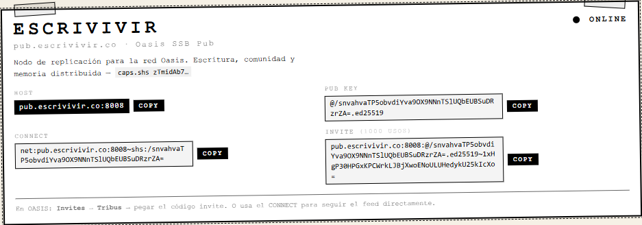
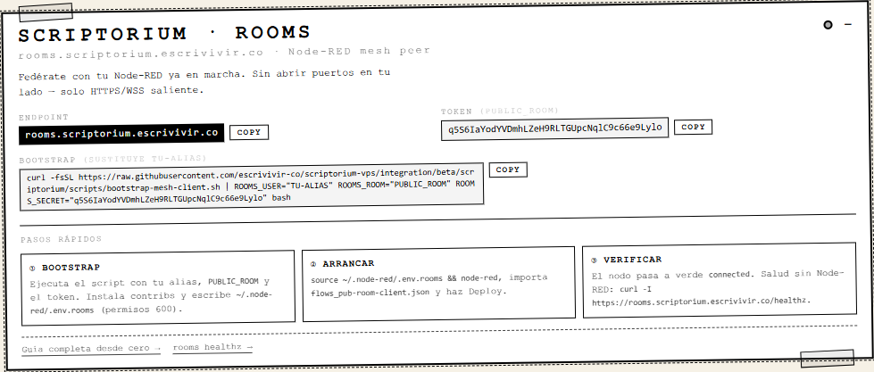

# Aleph Scriptorium

Stack agéntico sobre MCP + VS Code + GitHub Copilot Chat + Blockchain/RTC net, diseñado para producción de material transmedia.

> **Web**: [escrivivir-co.github.io/aleph-scriptorium](https://escrivivir-co.github.io/aleph-scriptorium/)  
> **Guía**: [/leeme](https://escrivivir-co.github.io/aleph-scriptorium/leeme/) · **Ecosistema**: [/ecosistema](https://escrivivir-co.github.io/aleph-scriptorium/ecosistema/) · **Backlog/Roadmap**: [/roadmap](https://escrivivir-co.github.io/aleph-scriptorium/roadmap/)
>
> | Subdominio | Servicio |
> |---|---|
> | **[pub.escrivivir.co](https://pub.escrivivir.co)** | **Oasis SSB Pub · invites, PUB KEY, CONNECT** |
> | &nbsp;&nbsp;└ [/scriptorium/](https://pub.escrivivir.co/scriptorium/) | Vestíbulo de salas layer2 |
> | &nbsp;&nbsp;└ [/admin/](https://pub.escrivivir.co/admin/) | Panel local del pub |
> | &nbsp;&nbsp;└ [/public/status](https://pub.escrivivir.co/public/status) | Estado JSON del pub |
> | **[scriptorium.escrivivir.co](https://scriptorium.escrivivir.co/red)** | **Node-RED público (read-only) + dashboards** |
> | &nbsp;&nbsp;└ [/red](https://scriptorium.escrivivir.co/red) | Editor Node-RED (read-only) |
> | &nbsp;&nbsp;└ [/ui](https://scriptorium.escrivivir.co/ui) | Dashboard clásico (v1) |
> | &nbsp;&nbsp;└ [/dashboard](https://scriptorium.escrivivir.co/dashboard) | Dashboard 2 (v2) |
> | **[admin.scriptorium.escrivivir.co](https://admin.scriptorium.escrivivir.co)** | **Node-RED admin (editor write + projects)** |
> | **[rooms.scriptorium.escrivivir.co](https://rooms.scriptorium.escrivivir.co)** | **Mesh peer Node-RED · Socket.IO** |
> | **[mcp.scriptorium.escrivivir.co](https://mcp.scriptorium.escrivivir.co)** | **MCP DevOps · Streamable HTTP** |
> | **[npm.scriptorium.escrivivir.co](https://npm.scriptorium.escrivivir.co)** | **Verdaccio · registry `@alephscript/*`** |

---

## Layers (1 y 2)

<table>
<tr>
<td width="50%">

**[pub.escrivivir.co](https://pub.escrivivir.co)** · Nodo de replicación Oasis/SSB. Invites, PUB KEY y CONNECT para unirte a la red.

</td>
<td width="50%">

**[rooms.scriptorium.escrivivir.co](https://rooms.scriptorium.escrivivir.co)** · Mesh peer Node-RED. Fedérate con un bootstrap de un comando.

Manuales: [Desde cero](WiringEditor/NOD-RED-FED-NOTES/NOTA-AMIGO-DESDE-CERO.md) · [Con Node-RED ya operativo](WiringEditor/NOD-RED-FED-NOTES/NOTA-AMIGO-PEER-NODE-RED.md) · [Owner / recordatorio](WiringEditor/NOD-RED-FED-NOTES/NOTA-OWNER-RECORDATORIO.md)

</td>
</tr>
</table>

---

  <strong>ℵ</strong> · <em>alephscript-stack</em> · Forjado en <a href="https://github.com/escrivivir-co/vibe-bitacora">VibeBitacora</a>

