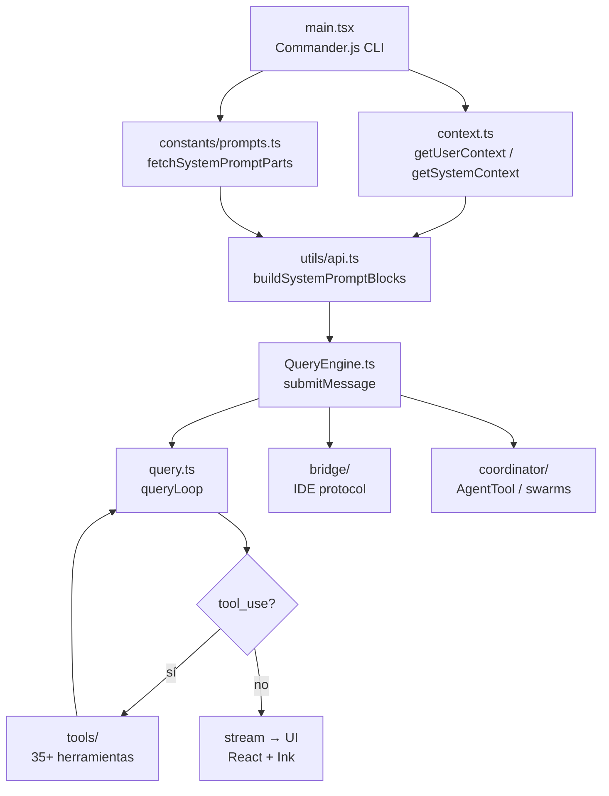

<!-- ── HERO ──────────────────────────────────────────────────────────────── -->

  <h1>⚡ ClaudeEngine</h1>
  
Motor de agencia autónoma de Anthropic — <em>Claude Code CLI, fuente filtrada 2026-03-31</em>. Referencia técnica para desarrolladores del Scriptorium que trabajen con, sobre o junto a este motor.

  

    Bun Runtime
    TypeScript Strict
    React + Ink
    ~512K LOC
    ~1.900 ficheros
    35+ tools · 100+ comandos
  

<!-- ── PIPELINE OVERVIEW ──────────────────────────────────────────────────── -->

  <h2>// Pipeline en 7 fases</h2>
  

    main.tsx
    →
    context()
    →
    fetchSystemPromptParts()
    →
    buildSystemPromptBlocks()
    →
    QueryEngine.submitMessage()
    →
    query() loop
    →
    tool loop / stream
  

  

    → Recorrido interactivo completo en la <a href="{{ site.baseurl }}/blueprint-claude-engine/">presentación Blueprint</a>
  

<!-- ── TECH STACK ──────────────────────────────────────────────────────────── -->

  <h2>// Ficha técnica</h2>
  <table class="ce-table">
    <thead>
      <tr><th>Categoría</th><th>Tecnología</th><th>Rol</th></tr>
    </thead>
    <tbody>
      <tr><td><strong>Runtime</strong></td><td><code>Bun</code></td><td>Ejecución ultrarrápida + bundle de un solo ejecutable</td></tr>
      <tr><td><strong>Lenguaje</strong></td><td><code>TypeScript</code> (strict)</td><td>Tipado compila-tiempo + Zod v4 para tipado en runtime</td></tr>
      <tr><td><strong>Terminal UI</strong></td><td><code>React + Ink</code></td><td>React renderer para CLI — 140+ componentes</td></tr>
      <tr><td><strong>CLI Parsing</strong></td><td><code>Commander.js</code></td><td>Registro y parsing de subcomandos (<code>main.tsx</code>)</td></tr>
      <tr><td><strong>API Client</strong></td><td><code>@anthropic-ai/sdk</code></td><td>Llamadas a la API de Claude, streaming</td></tr>
      <tr><td><strong>Protocolos</strong></td><td><code>MCP SDK</code> + <code>LSP</code></td><td>Model Context Protocol + Language Server Protocol</td></tr>
      <tr><td><strong>Validación</strong></td><td><code>Zod v4</code></td><td>Schemas de config, schemas de tools</td></tr>
      <tr><td><strong>Búsqueda</strong></td><td><code>ripgrep</code></td><td>GrepTool — búsqueda rápida en codebase</td></tr>
      <tr><td><strong>Autenticación</strong></td><td>OAuth 2.0 + JWT + Keychain</td><td>Auth de usuario, IDE bridge, sesiones remotas</td></tr>
      <tr><td><strong>Telemetría</strong></td><td>OpenTelemetry + gRPC</td><td>Cargado lazy (~1.1 MB total) vía <code>import()</code></td></tr>
      <tr><td><strong>Feature flags</strong></td><td>GrowthBook + <code>bun:bundle</code></td><td>Dead-code elimination en build</td></tr>
      <tr><td><strong>Build</strong></td><td>Bun bundler</td><td>Genera ejecutable único <code>claude</code></td></tr>
    </tbody>
  </table>

<!-- ── MODULE MAP ──────────────────────────────────────────────────────────── -->

  <h2>// Mapa de módulos</h2>
  

    

      <h4>⚡ Core</h4>
      
5 ficheros principales

      <ul>
        <li><code>QueryEngine.ts</code> — motor LLM (~46K)</li>
        <li><code>query.ts</code> — loop de consulta + streaming</li>
        <li><code>context.ts</code> — contexto de sistema y usuario</li>
        <li><code>Tool.ts</code> — tipos base de herramientas (~29K)</li>
        <li><code>commands.ts</code> — registro de comandos (~25K)</li>
      </ul>
    

    

      <h4>🔧 Tools</h4>
      
35+ herramientas

      <ul>
        <li><code>BashTool</code> · <code>FileReadTool</code> · <code>FileWriteTool</code></li>
        <li><code>FileEditTool</code> · <code>GlobTool</code> · <code>GrepTool</code></li>
        <li><code>AgentTool</code> · <code>MCPTool</code> · <code>LSPTool</code></li>
        <li><code>WebFetchTool</code> · <code>WebSearchTool</code></li>
        <li><code>TaskCreateTool</code> · <code>SendMessageTool</code></li>
        <li><code>SkillTool</code> · <code>NotebookEditTool</code> · <code>SleepTool</code></li>
      </ul>
    

    

      <h4>⚙️ Services</h4>
      
10+ integraciones

      <ul>
        <li><code>services/api/claude.ts</code> — API wrapper</li>
        <li><code>services/mcp/</code> — servidores MCP</li>
        <li><code>services/lsp/</code> — Language Server</li>
        <li><code>services/compact/</code> — compresión de contexto</li>
        <li><code>services/oauth/</code> — flujos OAuth 2.0</li>
        <li><code>services/extractMemories/</code> — auto-memoria</li>
        <li><code>services/analytics/</code> — telemetría</li>
      </ul>
    

    

      <h4>🖥️ UI</h4>
      
140+ componentes · 40+ hooks

      <ul>
        <li><code>components/App.tsx</code> — raíz React/Ink</li>
        <li><code>components/Messages.tsx</code> — renderizado de mensajes</li>
        <li><code>components/StructuredDiff/</code> — diffs visuales</li>
        <li><code>components/MCP/</code> — interfaz MCP</li>
        <li><code>screens/</code> — Doctor, REPL, ResumeConversation</li>
        <li><code>hooks/useCanUseTool.tsx</code> — permisos por tool</li>
      </ul>
    

    

      <h4>🔗 Integration</h4>
      
Bridge + Remote + Server

      <ul>
        <li><code>bridge/bridgeMain.ts</code> — protocolo IDE bidireccional</li>
        <li><code>bridge/jwtUtils.ts</code> — sesiones JWT</li>
        <li><code>remote/sdkMessageAdapter.ts</code> — conversión SDK</li>
        <li><code>coordinator/</code> — orquestación multi-agente</li>
        <li><code>server/</code> — modo headless</li>
      </ul>
    

    

      <h4>💾 Data</h4>
      
Memoria · Estado · Tareas

      <ul>
        <li><code>memdir/</code> — memoria persistente (CLAUDE.md)</li>
        <li><code>state/</code> — máquina de estado (AppState)</li>
        <li><code>tasks/</code> — gestión de tareas</li>
        <li><code>skills/</code> — workflows reutilizables</li>
        <li><code>plugins/</code> — sistema de plugins</li>
        <li><code>migrations/</code> — migraciones de config</li>
      </ul>
    

  

  

<!-- ── TOOLS CATALOG ──────────────────────────────────────────────────────── -->

  <h2>// Catálogo de herramientas</h2>
  <table class="ce-table">
    <thead>
      <tr><th>Tool</th><th>Categoría</th><th>Descripción</th><th>Schema</th></tr>
    </thead>
    <tbody>
      <tr>
        <td><code>BashTool</code></td>
        <td>exec</td>
        <td>Ejecución de comandos shell con timeout configurable</td>
        <td><code>command: string, timeout?: number</code></td>
      </tr>
      <tr>
        <td><code>FileReadTool</code></td>
        <td>file</td>
        <td>Lectura de ficheros (texto, imágenes, PDFs, notebooks)</td>
        <td><code>file_path: string, offset?: number, limit?: number</code></td>
      </tr>
      <tr>
        <td><code>FileWriteTool</code></td>
        <td>file</td>
        <td>Creación o sobreescritura completa de ficheros</td>
        <td><code>file_path: string, content: string</code></td>
      </tr>
      <tr>
        <td><code>FileEditTool</code></td>
        <td>file</td>
        <td>Edición parcial mediante reemplazo de cadenas</td>
        <td><code>file_path, old_string, new_string</code></td>
      </tr>
      <tr>
        <td><code>GlobTool</code></td>
        <td>search</td>
        <td>Búsqueda por patrón glob en el filesystem</td>
        <td><code>pattern: string, path?: string</code></td>
      </tr>
      <tr>
        <td><code>GrepTool</code></td>
        <td>search</td>
        <td>Búsqueda de texto con ripgrep (regex, case-insensitive)</td>
        <td><code>pattern: string, path?: string, include?: string</code></td>
      </tr>
      <tr>
        <td><code>WebFetchTool</code></td>
        <td>search</td>
        <td>Descarga y extracción de contenido de URLs</td>
        <td><code>url: string, prompt?: string</code></td>
      </tr>
      <tr>
        <td><code>WebSearchTool</code></td>
        <td>search</td>
        <td>Búsqueda web (Google/Brave) con resultados estructurados</td>
        <td><code>query: string</code></td>
      </tr>
      <tr>
        <td><code>AgentTool</code></td>
        <td>agent</td>
        <td>Lanza sub-agentes con contexto aislado para tareas paralelas</td>
        <td><code>prompt: string, tools?: string[]</code></td>
      </tr>
      <tr>
        <td><code>SendMessageTool</code></td>
        <td>agent</td>
        <td>Mensajería inter-agente (swarms / equipos)</td>
        <td><code>to: string, message: string</code></td>
      </tr>
      <tr>
        <td><code>TeamCreateTool</code></td>
        <td>agent</td>
        <td>Crea equipo persistente de agentes especializados</td>
        <td><code>name: string, members: TeamMember[]</code></td>
      </tr>
      <tr>
        <td><code>TeamDeleteTool</code></td>
        <td>agent</td>
        <td>Elimina un equipo de agentes</td>
        <td><code>name: string</code></td>
      </tr>
      <tr>
        <td><code>MCPTool</code></td>
        <td>mcp</td>
        <td>Invoca herramientas de cualquier servidor MCP conectado</td>
        <td>Dinámico según servidor MCP</td>
      </tr>
      <tr>
        <td><code>LSPTool</code></td>
        <td>mcp</td>
        <td>Integración con Language Server Protocol (completions, diagnostics)</td>
        <td><code>uri: string, method: string</code></td>
      </tr>
      <tr>
        <td><code>SkillTool</code></td>
        <td>task</td>
        <td>Ejecuta workflows reutilizables guardados en <code>skills/</code></td>
        <td><code>skill_name: string, args?: object</code></td>
      </tr>
      <tr>
        <td><code>TaskCreateTool</code></td>
        <td>task</td>
        <td>Crea una tarea en el kanban interno</td>
        <td><code>title: string, description?: string</code></td>
      </tr>
      <tr>
        <td><code>TaskUpdateTool</code></td>
        <td>task</td>
        <td>Actualiza estado, título o notas de una tarea</td>
        <td><code>id: string, status?: string</code></td>
      </tr>
      <tr>
        <td><code>NotebookEditTool</code></td>
        <td>file</td>
        <td>Edición de notebooks Jupyter (celdas, outputs, metadata)</td>
        <td><code>notebook_path, cell_number, new_source</code></td>
      </tr>
      <tr>
        <td><code>SleepTool</code></td>
        <td>meta</td>
        <td>Pausa proactiva (modo watch, espera de recursos externos)</td>
        <td><code>duration_ms: number</code></td>
      </tr>
      <tr>
        <td><code>REPLTool</code></td>
        <td>exec</td>
        <td>Acceso a REPL interactivo (Node.js, Python, etc.)</td>
        <td><code>language: string, code: string</code></td>
      </tr>
      <tr>
        <td><code>EnterPlanModeTool</code></td>
        <td>meta</td>
        <td>Activa modo planificación (sin ejecución de acciones)</td>
        <td><code>—</code></td>
      </tr>
      <tr>
        <td><code>ExitPlanModeTool</code></td>
        <td>meta</td>
        <td>Sale del modo planificación, ejecuta el plan</td>
        <td><code>—</code></td>
      </tr>
      <tr>
        <td><code>EnterWorktreeTool</code></td>
        <td>exec</td>
        <td>Aísla trabajo en git worktree separado</td>
        <td><code>branch_name: string</code></td>
      </tr>
      <tr>
        <td><code>ToolSearchTool</code></td>
        <td>meta</td>
        <td>Descubrimiento lazy de herramientas diferidas (MCP)</td>
        <td><code>pattern: string</code></td>
      </tr>
      <tr>
        <td><code>CronCreateTool</code></td>
        <td>meta</td>
        <td>Crea triggers programados para modo proactivo</td>
        <td><code>schedule: string, command: string</code></td>
      </tr>
      <tr>
        <td><code>SyntheticOutputTool</code></td>
        <td>meta</td>
        <td>Genera output estructurado (JSON, Markdown) como herramienta</td>
        <td><code>schema: ZodSchema, data: object</code></td>
      </tr>
    </tbody>
  </table>

<!-- ── DESIGN PATTERNS ─────────────────────────────────────────────────────── -->

  <h2>// Patrones de diseño</h2>
  

    

      
⚡

      

        <h4>Parallel Prefetch</h4>
        
En <code>main.tsx</code>, las lecturas MDM y Keychain se inician en paralelo antes de cargar cualquier módulo pesado. Ahorro ~65 ms en arranque.

      

    

    

      
💤

      

        <h4>Lazy Loading de módulos pesados</h4>
        
OpenTelemetry (~400 KB) y gRPC (~700 KB) se cargan bajo demanda vía <code>await import()</code>. Solo se instancian si el usuario tiene telemetría activa.

      

    

    

      
🏁

      

        <h4>Feature Flags + Dead-code Elimination</h4>
        
GrowthBook gestiona flags en runtime. En build, <code>bun:bundle</code> elimina el código de flags desactivados. Resultado: binario más pequeño y sin código muerto.

      

    

    

      
🗂️

      

        <h4>SystemPromptBlock Cache en 2 niveles</h4>
        
En <code>utils/api.ts</code>, <code>buildSystemPromptBlocks()</code> divide el system prompt por <code>SYSTEM_PROMPT_DYNAMIC_BOUNDARY</code>: la parte estática toma scope <code>global</code> (cache perpetua), la dinámica scope <code>org</code> (cache por sesión). Optimización de costes de tokenización.

      

    

    

      
📦

      

        <h4>Context Compaction automática</h4>
        
<code>services/compact/</code> monitoriza el tamaño de la conversación. Al superar el umbral configurable, genera un resumen y reemplaza los mensajes anteriores, manteniendo el contexto semántico dentro de la ventana de tokens.

      

    

    

      
🔐

      

        <h4>Modelo de permisos por herramienta</h4>
        
Cada invocación de tool pasa por <code>hooks/useCanUseTool.tsx</code>. El hook evalúa la política de la sesión (allow-list, deny-list, modo sandbox) antes de ejecutar. Si se deniega, el agente recibe un error de permiso y puede escalar al usuario.

      

    

    

      
🐝

      

        <h4>Agent Swarms</h4>
        
<code>tools/AgentTool/</code> lanza sub-agentes con contexto aislado. <code>coordinator/</code> orquesta equipos — permite al agente principal delegar trabajo en paralelo y recoger resultados. <code>SendMessageTool</code> permite mensajería asíncrona entre agentes del mismo swarm.

      

    

    

      
🧠

      

        <h4>Memoria persistente jerárquica</h4>
        
<code>memdir/</code> almacena ficheros CLAUDE.md por proyecto y de forma global. <code>services/extractMemories/</code> extrae automáticamente hechos importantes de la conversación. La memoria se inyecta en <code>getUserContext()</code> → <code>prependUserContext()</code> como recordatorio en el primer mensaje de usuario.

      

    

  

<!-- ── BENCHMARK ──────────────────────────────────────────────────────────── -->

  <h2>// Benchmark de escala</h2>
  

    

      
~512K

      
Líneas de código

    

    

      
~1.900

      
Ficheros TypeScript

    

    

      
35+

      
Herramientas (tools)

    

    

      
100+

      
Comandos slash

    

    

      
140+

      
Componentes UI

    

    

      
40+

      
Hooks React

    

    

      
10+

      
Servicios integrados

    

    

      
2

      
Niveles de cache

    

    

      
3

      
Fuentes de contexto

    

  

  

    Fuentes de contexto: CLAUDE.md / memdir · gitStatus · currentDate. Todos inyectados antes de cada llamada a la API.
  

<!-- ── NAVIGATION ─────────────────────────────────────────────────────────── -->

  <h2>// Continuar explorando</h2>
  

    <a href="{{ site.baseurl }}/blueprint-claude-engine/" class="ce-nav-card">
      <h4>⚡ ClaudeEngine Pipeline</h4>
      
Presentación interactiva 3D. 8 fases del pipeline, paso a paso, con referencias a código fuente.

    </a>
    <a href="{{ site.baseurl }}/blueprint-copilot/" class="ce-nav-card">
      <h4>🧠 CopilotEngine Blueprint</h4>
      
Arquitectura del motor conversacional de VS Code + Copilot Chat dentro del Scriptorium.

    </a>
    <a href="{{ site.baseurl }}/ecosistema/" class="ce-nav-card">
      <h4>🧬 Ecosistema</h4>
      
Vista completa: 18 submódulos → 21 plugins → 33+ agentes. Dónde encaja ClaudeEngine.

    </a>
    <a href="https://github.com/escrivivir-co/aleph-scriptorium/tree/main/ClaudeEngine" class="ce-nav-card" target="_blank">
      <h4>📁 Fuente en repositorio</h4>
      
Directorio <code>ClaudeEngine/</code> — README de la filtración + directorio <code>src/</code>.

    </a>
  

