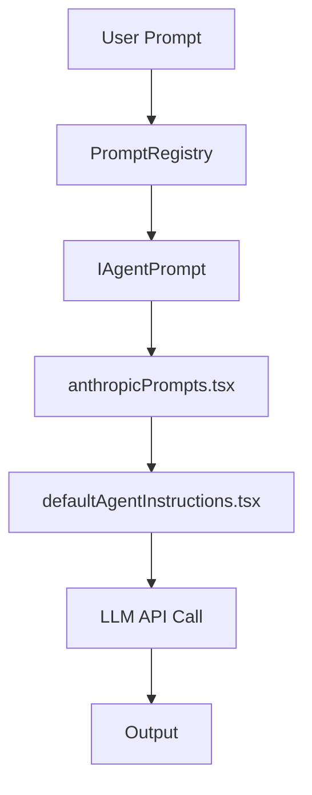

# Analyze Copilot Flow

Traces the complete execution path from user prompt to LLM output for a given agent and model, identifying TypeScript libraries and generating Mermaid diagrams.

## Quick Usage

```
/analyze-copilot-flow --agent @ox --model claude-sonnet
```

## What It Produces



Plus detailed breakdown of:
- Agent instruction files loaded
- Model-specific prompt transformations
- TypeScript libraries involved
- API call structure

---

<details>
<summary><strong>Full Documentation</strong> (click to expand)</summary>

## Invocation

```
/analyze-copilot-flow --agent @{agent} --model {model}
```

**Examples**:
- `/analyze-copilot-flow --agent @aleph --model claude-sonnet`
- `/analyze-copilot-flow --agent @ox --model gpt-4o`

## Input Parameters

| Parameter | Description | Example |
|-----------|-------------|---------|
| `agent` | Scriptorium agent name | `@aleph`, `@ox`, `@revisor` |
| `model` | Target LLM model | `claude-sonnet`, `gpt-4o`, `o1` |

## Data Sources (CopilotEngine)

The `CopilotEngine` submodule contains VS Code Copilot Chat source code. Key files:

| File | Purpose | Path |
|------|---------|------|
| `promptRegistry.ts` | System prompt registry | `src/extension/prompts/node/agent/promptRegistry.ts` |
| `defaultAgentInstructions.tsx` | Base agent instructions | `src/extension/prompts/node/agent/defaultAgentInstructions.tsx` |
| `anthropicPrompts.tsx` | Claude-specific prompts | `src/extension/prompts/node/agent/anthropicPrompts.tsx` |
| `openAIPrompts.tsx` | GPT-specific prompts | `src/extension/prompts/node/agent/openAIPrompts.tsx` |
| `prompts.md` | Prompt authoring guide | `docs/prompts.md` |
| `tools.md` | Tool creation guide | `docs/tools.md` |

## Procedure

### Step 1: Map Model → Prompt File

| Model | Primary File |
|-------|--------------|
| `claude-*`, `anthropic` | `anthropicPrompts.tsx` |
| `gpt-*`, `o1`, `openai` | `openAIPrompts.tsx` |
| `gemini`, `google` | `googlePrompts.tsx` (if exists) |

### Step 2: Map Agent → Instructions

1. Read `.github/agents/{agent}.agent.md` from Scriptorium
2. Identify corresponding `IAgentPrompt` in CopilotEngine
3. Trace how `PromptRegistry` loads instructions

### Step 3: Trace Complete Flow

```
User Prompt (chat input)
       │
       ▼
┌──────────────────┐
│ PromptRegistry   │ ← Load agent instructions
└────────┬─────────┘
         │
         ▼
┌──────────────────┐
│ IAgentPrompt     │ ← Structured prompt interface
└────────┬─────────┘
         │
         ▼
┌──────────────────┐
│ {model}Prompts   │ ← Model-specific formatting
└────────┬─────────┘
         │
         ▼
┌──────────────────┐
│ System Message   │ ← Default + custom instructions
└────────┬─────────┘
         │
         ▼
┌──────────────────┐
│ LLM API Call     │ ← @vscode/prompt-tsx serialization
└────────┬─────────┘
         │
         ▼
     Output (chat response)
```

### Step 4: Identify TypeScript Libraries

| Library | Usage |
|---------|-------|
| `@vscode/prompt-tsx` | JSX components for prompts |
| `vscode.lm` | Language Model API |
| `vscode.chat` | Chat Participant API |
| `ChatMessage` | Message types |
| `PromptRenderer` | Render prompts to API format |

### Step 5: Generate Output

#### Section 1: Agent Configuration

```markdown
## Agent: @ox

- **File**: `.github/agents/ox.agent.md`
- **Description**: Index and ontology manager
- **Instructions loaded**:
  - ox-ontologia.instructions.md
  - indice-dry.instructions.md
```

#### Section 2: Model Configuration

```markdown
## Model: claude-sonnet

- **Provider**: Anthropic
- **Prompt file**: `anthropicPrompts.tsx`
- **Serialization**: XML-style tags
- **Tool calling**: Native function calling
```

#### Section 3: Flow Diagram

```mermaid
graph LR
    A[User: "Update index"] --> B{PromptRegistry}
    B --> C[Load ox.agent.md]
    C --> D[Load ox-ontologia.instructions.md]
    D --> E[anthropicPrompts.tsx]
    E --> F[Serialize to XML]
    F --> G[Claude API]
    G --> H[Response]
```

#### Section 4: Libraries Used

```markdown
## TypeScript Libraries

1. **@vscode/prompt-tsx** (v0.2.8)
   - `<Prompt>`, `<System>`, `<User>` components
   - Serializes JSX to API-compatible format

2. **vscode.lm** (VS Code API)
   - `createLanguageModelRequest()`
   - `sendRequest()`

3. **vscode.chat** (VS Code API)
   - `registerChatParticipant()`
   - `ChatResult`, `ChatMessage`
```

## Use Cases

1. **Debugging**: Understand why an agent behaves unexpectedly
2. **Optimization**: Identify redundant instruction loading
3. **Documentation**: Generate architecture diagrams
4. **Training**: Onboard new contributors to Copilot internals

## Prerequisites

- `CopilotEngine` submodule cloned and up-to-date
- Access to `.github/agents/` and `.github/plugins/`

## Output Format

Generates a markdown report with:
- Agent metadata
- Model configuration
- Execution flow (text + Mermaid)
- Library inventory
- Raw prompt samples (if verbose flag)

## Related

- Submodule: `CopilotEngine/`
- Plugin: `scriptorium-pack`
- Docs: `CopilotEngine/docs/prompts.md`

</details>
